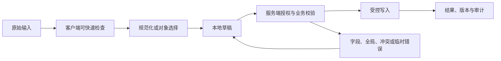

# Form 表单

Form 表单把一组相互关联的字段转换为一次可验证的业务提交。字段依赖、错误归属、提交原子性和草稿边界决定它是一张表单还是多个独立任务。

## 能力边界与前置知识

Form 表单负责把用户输入转换为可校验、可提交、可恢复的数据。它不能替代服务端授权、业务校验、唯一约束、恶意内容处理或并发控制。

前置知识：

- 能定义字段或文档的数据类型、必填、范围和业务不变量；
- 能区分原始输入、显示值、规范化值和稳定对象 ID；
- 了解表单标签、可访问名称、焦点顺序和状态消息；
- 能观察请求、响应、对象版本和权威写入结果。

## 组成部分

- 标签：可见、唯一并与控件程序化关联。
- 帮助：在输入前说明格式、单位和限制。
- 分组：fieldset/legend 表达一组相关选项。
- 校验：客户端即时反馈与服务端权威校验分层。
- 提交：明确主动作、等待、结果、错误摘要和输入保留。

标签、帮助、分组和错误都应指向同一个稳定字段 ID；提交合同还要说明跨字段规则、服务端错误路径和部分字段能否回显。这样错误摘要才能准确跳到控件，后端也能把拒绝原因映射回用户正在修改的字段。

## 输入数据生命周期



### 原始输入

每个字段分别保存用户输入值和最近一次已确认值。税号、地址、姓名等字段不能因为客户端习惯性 trim 或改写大小写而丢失可核对内容；只有字段合同声明等价规则时才转换。

### 规范化值

规范化按字段执行：枚举提交枚举码，实体选择提交对象 ID，金额提交币种与最小货币单位，日期提交约定日历和时区语义。跨字段校验使用规范化候选对象，但错误仍关联原始字段和值。

### 草稿

草稿策略按字段分类，而不是整表一刀切。普通说明可进入服务端草稿，密码、一次性验证码和完整支付凭据不得持久化；恢复草稿时要携带基础对象版本，避免旧草稿覆盖已更新资料。

### 权威结果

创建或更新成功后，以响应中的资源 ID、版本和服务端规范化值刷新查看态。若提交只启动审核或导入任务，表单进入“已接收、处理中”，使用任务 ID 跟踪，不能提前清空为已完成。

## 专属行为

- 不要用 placeholder 替代标签；占位文本会消失且不是稳定名称。
- 必填、格式和范围同时通过语义与文字表达。
- 错误摘要链接到字段，字段旁保留具体错误和原值。
- 浏览器自动填充使用正确 autocomplete token，不阻止粘贴。
- 提交响应返回字段错误、全局错误、版本冲突和未知结果的稳定结构。

## 设计决策

1. 单页分组还是多步骤，依据依赖和检查成本。
2. 何时校验，避免用户尚未完成输入就持续报错。
3. 默认值是否代表安全常见选择，还是会造成无意识同意。
4. 敏感字段是否允许草稿、本地持久化或分析采集。
5. 服务端拒绝后哪些字段可安全回显。

验收要逐项证明字段依赖、默认值、校验时机、敏感草稿和错误回显符合合同，并覆盖客户端通过而服务端按跨字段规则拒绝的路径。

## 状态模型

| 状态 | 进入条件 | 界面责任 | 退出条件 |
| --- | --- | --- | --- |
| Form 表单未触碰 | 还没有本次交互 | 显示标签、规则和合理默认值 | 用户输入或选择 |
| 编辑中 | 原始值正在变化 | 保持焦点和输入法行为 | 完成输入、取消或提交 |
| 本地无效 | 可确定格式或范围错误 | 就近说明修正方式 | 输入变为有效 |
| 可提交 | 本地条件满足 | 主操作可用，不承诺业务成功 | 提交、继续编辑 |
| 提交中 | 请求或上传进行 | 防重复意图，保留输入 | 成功、失败、超时、取消 |
| 服务端拒绝 | 字段或跨字段规则不满足 | 错误摘要链接到字段；无法归属的错误放在表单级 | 修正对应字段或返回 |
| 冲突 | 基础对象版本变化 | 比较、刷新或合并 | 新版本确认 |
| 提交结果未知 | 请求超时且可能已经创建对象 | 禁止盲目重复，按幂等键查询提交结果 | 找到资源、确认失败或人工处理 |
| 成功 | 权威结果完成 | 显示结果和下一步 | 后续操作 |

状态不能只存在于颜色。错误、等待、选中、进度和保存结果应有程序化表达。

## 工程状态示例

```json
{
  "rawValue": "user@example.com",
  "normalizedValue": "user@example.com",
  "errors": [],
  "dirty": true
}
```

示例字段不是通用接口标准。项目应按Form 表单的真实值类型定义 schema，并明确缺失值、无效值、服务端错误、版本和恢复语义。

## 校验顺序

1. Form 表单输入前说明格式、单位、范围和不可接受内容。
2. 输入期间只做不会打断输入法的安全检查。
3. 完成输入或离开字段后给出可修正反馈。
4. 提交时客户端汇总当前已知错误。
5. 服务端重新执行格式、授权、业务和并发校验。
6. 返回字段错误与全局错误的稳定代码和安全文案。
7. 界面保留合法输入，把焦点移到合理错误入口。
8. 修正后只清除已经解决的错误。
9. 成功后从权威响应更新对象和版本。

客户端限制可以减少错误，不能防止直接请求、旧客户端或恶意输入。

## 案例一：企业创建成员并分配角色

### 固定输入

- 使用合成账户与合成业务数据；
- 正常网络 80 ms，另注入 2 秒延迟和一次 503；
- 打开时对象版本为 17，提交前另一个会话更新为 18；
- 覆盖空值、无效值、长值、重复值和权限撤销；
- 记录可见结果、焦点、请求、响应和权威对象。

### 设计与实现

1. 不要用 placeholder 替代标签；占位文本会消失且不是稳定名称。
2. 必填、格式和范围同时通过语义与文字表达。
3. 错误摘要链接到字段，字段旁保留具体错误和原值。
4. 浏览器自动填充使用正确 autocomplete token，不阻止粘贴。
5. 提交响应返回字段错误、全局错误、版本冲突和未知结果的稳定结构。

服务端成功响应返回客户对象 ID、规范化后的税务地址和新版本；页面用这些值替换草稿，并把服务端未接受的显示差异明确呈现，不能直接回显提交对象冒充保存结果。

### 验证

- 鼠标、键盘、触屏和屏幕阅读器都能完成；
- 输入法组合期间不误提交；
- 本地错误与服务端错误均能修正；
- 请求失败和冲突不清空合法工作；
- 重复触发只产生一个逻辑副作用；
- 最终显示与权威数据对账一致。

### 失败分支

客户端通过但服务端拒绝后清空全部输入

修复后重复相同输入和时序，确认界面状态、服务端副作用和审计记录同时正确。

## 案例二：用户更新结算资料和税务地址

### 固定输入

- 360 CSS px 视口与 200% 文本缩放；
- 系统大字体、中文输入法和仅键盘操作；
- 网络先离线，恢复后响应超时；
- 会话在未提交工作存在时到期；
- 数据包含同名对象、过期引用和被删除目标。

### 设计过程

1. 将结算资料按公司身份、地址、税务和联系人分组。
2. 使用可见 label、fieldset 和 legend 建立语义关系。
3. 输入完成后执行本地格式检查，提交后接收服务端字段与全局错误。
4. 错误摘要链接到具体字段，字段保留原值和就近错误。
5. 服务端拒绝税号重复时保留其他合法字段并允许修正。
6. 成功后使用返回的客户版本更新页面。

结算资料在窄屏按公司身份、税务、地址、联系人依次排列，错误紧跟对应字段，错误摘要保持在提交按钮之前。离线期间只标记“本机未提交”，认证恢复后重新取得客户版本再开放保存。

### 验证

- 关闭和恢复网络后不重复写入；
- 刷新后按声明的草稿策略恢复；
- 会话到期不把敏感值写入不安全存储；
- 失效引用有替换、清除或返回路径；
- 读屏能获知结果而无需焦点被强制移动；
- 长文本不会遮挡唯一保存或取消动作。

### 失败分支

会话在Form 表单进行中到期。界面必须暂停后续写入，保留允许保留的非敏感工作，重新认证后再次校验权限与版本；不能直接重放旧请求。

会话到期后，税号和联系人草稿是否保留按字段分类执行；重新认证成功后重新读取客户版本，逐项标出仍可提交、因权限变为只读和需要重新输入的敏感字段。

## 无障碍实现

### 名称与说明

- Form 表单的可见标签进入可访问名称。
- 帮助文本与错误通过程序化关系关联。
- placeholder 不替代持久可见标签。
- 必填、单位、格式和限制不只靠颜色或图标。
- 复合输入使用与真实行为匹配的 APG 模式。

### 键盘与输入法

- Form 表单的 Tab 顺序跟随 DOM 与视觉阅读顺序。
- Enter、Space、方向键和 Escape 只按控件语义接管。
- 输入法 composition 期间不把中间文本当成完成值。
- 粘贴、语音输入和浏览器自动填充不被无理由阻止。
- 临时弹层关闭后焦点回到触发点或下一逻辑位置。
- 错误修正后焦点不被异步结果抢走。

### 重排

在 320 CSS px 等效宽度和 200% 缩放下，fieldset、legend、字段、帮助和错误保持 DOM 顺序；并排地址字段改为纵向排列，提交与错误摘要不能被固定页脚遮挡。

## 安全、性能与一致性

### 安全

- 所有输入均视为不可信；
- 服务端重新授权和校验；
- 富文本与文件按输出上下文净化或隔离；
- 错误不泄露内部异常、受限对象或敏感路径；
- 日志不默认记录正文、文件内容、密码或令牌。

### 性能

- 取消失效查询并丢弃乱序响应；
- 长列表、长文档和大文件使用适合的分页、分片或后台任务；
- 加载优化不改变可访问树的完整语义；
- 缓存键包含租户、角色、语言和会改变结果的筛选条件；
- 性能预算覆盖输入响应、候选出现、提交和恢复。

### 一致性

- 写请求带幂等或逻辑意图标识；
- 对现有对象修改带期望版本；
- 超时先查询结果而不是盲目重试；
- 部分成功返回逐项稳定 ID 与结果；
- 草稿与正式提交使用不同状态和权限；
- 客户端缓存不能静默覆盖服务端新版本。

## 调试与观测

1. 固定Form 表单的输入、角色、对象版本、网络、语言和视口。
2. 检查原始值、显示值、选择 ID、错误和焦点。
3. 检查请求参数、取消、响应顺序和业务错误码。
4. 检查服务端授权、规范化、版本和权威写入。
5. 注入超时、权限撤销、并发和页面刷新。
6. 用键盘、读屏、输入法和窄屏重复。

观测指标：

- 有效开始、提交、成功、失败、取消和恢复；
- 首次错误类型与最终修正率；
- 输入丢失和重复副作用；
- 候选或校验响应延迟；
- 键盘阻断、焦点丢失和错误未关联；
- 按平台、语言、角色和数据量分群的完成时间。

## 综合练习

为Form 表单完成可运行原型和服务端模拟。覆盖正常、无效、等待、失败、权限、过期、冲突、取消和未知结果。

验收：

- Form 表单的数据类型、显示值、提交值和稳定 ID 边界明确；
- 两个案例有固定输入、处理、结果、验证和失败；
- 客户端与服务端校验责任分开；
- 失败后保留允许保留的工作；
- 键盘、屏幕阅读器和输入法完成任务；
- 弱网、窄屏和长文本不隐藏恢复；
- 日志与分析不收集不必要敏感内容；
- 权威数据与界面结果可以对账。

## 来源

- [WHATWG — Forms](https://html.spec.whatwg.org/multipage/forms.html)（访问日期：2026-07-18）
- [GOV.UK Design System — Form validation](https://design-system.service.gov.uk/patterns/validation/)（访问日期：2026-07-18）
- [W3C — Web Content Accessibility Guidelines (WCAG) 2.2](https://www.w3.org/TR/WCAG22/)（访问日期：2026-07-18）
