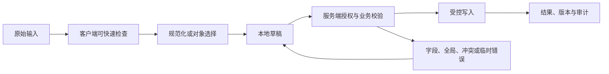

# Tag Input 标签输入

Tag Input 标签输入是创建、检索、选择和移除多个短值的复合输入。它属于输入模式，但模式名称不决定方案；任务、数据、权限、设备和失败恢复共同决定是否使用。

## 能力边界与前置知识

Tag Input 标签输入负责把用户输入转换为可校验、可提交、可恢复的数据。它不能替代服务端授权、业务校验、唯一约束、恶意内容处理或并发控制。

前置知识：

- 能定义字段或文档的数据类型、必填、范围和业务不变量；
- 能区分原始输入、显示值、规范化值和稳定对象 ID；
- 了解表单标签、可访问名称、焦点顺序和状态消息；
- 能观察请求、响应、对象版本和权威写入结果。

## 组成部分

- token：已选择值、稳定 ID、显示文本和移除动作。
- 编辑输入：创建或检索下一项。
- 候选列表：排除已选、表达禁用和无结果。
- 词表规则：自由标签、受控标签或混合模式。
- 集合约束：去重、上限、规范化和是否有顺序。

这些部分必须使用同一数据契约。只在视觉稿中排列控件，而不定义值、状态、错误与恢复，会把关键决定推迟到实现阶段。

## 输入数据生命周期



### 原始输入

保留用户实际输入有助于解释错误和恢复。不要在没有业务规则时擅自改变大小写、空格、标点、时区或富文本结构。

### 规范化值

规范化只处理确定且可解释的等价形式。显示名称与稳定 ID 分开；日期与时间点分开；文件传输完成与后台处理完成分开。

### 草稿

草稿可以只在内存、本地受保护存储或服务端。保存位置决定刷新、跨设备、会话过期和敏感信息边界。不要默认把密码、令牌、支付数据或隐私正文持久化到浏览器。

### 权威结果

客户端显示成功前必须取得适合任务的权威结果。HTTP 2xx 可能只表示任务已接受；长任务要继续使用任务 ID 查询处理状态。

## 专属行为

- Backspace 删除前一个 token 前要有可预测焦点与公告。
- 粘贴多个值时先解析预览，再明确无效、重复和超限项。
- 大小写与空格规范化不能改变有意义内容。
- 移除后播报标签名称和剩余数量。
- 自由创建需要权限、审核或同义词治理。

## 设计决策

1. 标签是否用于展示、检索、权限还是自动化规则。
2. 允许自由创建会产生多少同义词与垃圾值。
3. 数量上限是界面建议还是服务端不变量。
4. 排序是否影响语义和提交。
5. 批量粘贴是否需要确认和逐项错误。

每项决定进入需求、原型、接口和验收。团队约定不能覆盖平台语义或服务端不变量。

## 状态模型

| 状态 | 进入条件 | 界面责任 | 退出条件 |
| --- | --- | --- | --- |
| Tag Input 标签输入未触碰 | 还没有本次交互 | 显示标签、规则和合理默认值 | 用户输入或选择 |
| 编辑中 | 原始值正在变化 | 保持焦点和输入法行为 | 完成输入、取消或提交 |
| 本地无效 | 可确定格式或范围错误 | 就近说明修正方式 | 输入变为有效 |
| 可提交 | 本地条件满足 | 主操作可用，不承诺业务成功 | 提交、继续编辑 |
| 提交中 | 请求或上传进行 | 防重复意图，保留输入 | 成功、失败、超时、取消 |
| 服务端拒绝 | 权限、业务或字段规则不满足 | 关联错误并保留合法值 | 修正或返回 |
| 冲突 | 基础对象版本变化 | 比较、刷新或合并 | 新版本确认 |
| 未知结果 | 客户端未取得确定响应 | 按意图或任务 ID 查询 | 确认成功或失败 |
| 成功 | 权威结果完成 | 显示结果和下一步 | 后续操作 |

状态不能只存在于颜色。错误、等待、选中、进度和保存结果应有程序化表达。

## 工程状态示例

```json
{
  "query": "access",
  "selectedIds": [
    "tag-a11y"
  ],
  "maxItems": 8,
  "allowCreate": false
}
```

示例字段不是通用接口标准。项目应按Tag Input 标签输入的真实值类型定义 schema，并明确缺失值、无效值、服务端错误、版本和恢复语义。

## 校验顺序

1. Tag Input 标签输入输入前说明格式、单位、范围和不可接受内容。
2. 输入期间只做不会打断输入法的安全检查。
3. 完成输入或离开字段后给出可修正反馈。
4. 提交时客户端汇总当前已知错误。
5. 服务端重新执行格式、授权、业务和并发校验。
6. 返回字段错误与全局错误的稳定代码和安全文案。
7. 界面保留合法输入，把焦点移到合理错误入口。
8. 修正后只清除已经解决的错误。
9. 成功后从权威响应更新对象和版本。

客户端限制可以减少错误，不能防止直接请求、旧客户端或恶意输入。

## 案例一：Issue 从受控词表选择标签

### 固定输入

- 使用合成账户与合成业务数据；
- 正常网络 80 ms，另注入 2 秒延迟和一次 503；
- 打开时对象版本为 17，提交前另一个会话更新为 18；
- 覆盖空值、无效值、长值、重复值和权限撤销；
- 记录可见结果、焦点、请求、响应和权威对象。

### 设计与实现

1. Backspace 删除前一个 token 前要有可预测焦点与公告。
2. 粘贴多个值时先解析预览，再明确无效、重复和超限项。
3. 大小写与空格规范化不能改变有意义内容。
4. 移除后播报标签名称和剩余数量。
5. 自由创建需要权限、审核或同义词治理。

最后由服务端返回稳定对象 ID、结果状态和新版本。界面使用返回结果更新，不根据本地输入猜测写入后的权威值。

### 验证

- 鼠标、键盘、触屏和屏幕阅读器都能完成；
- 输入法组合期间不误提交；
- 本地错误与服务端错误均能修正；
- 请求失败和冲突不清空合法工作；
- 重复触发只产生一个逻辑副作用；
- 最终显示与权威数据对账一致。

### 失败分支

输入法组合阶段误把半成品拆成标签

修复后重复相同输入和时序，确认界面状态、服务端副作用和审计记录同时正确。

## 案例二：知识库为文章添加可创建主题词

### 固定输入

- 360 CSS px 视口与 200% 文本缩放；
- 系统大字体、中文输入法和仅键盘操作；
- 网络先离线，恢复后响应超时；
- 会话在未提交工作存在时到期；
- 数据包含同名对象、过期引用和被删除目标。

### 设计过程

1. Issue 标签只从受控词表选择，普通成员不能创建新标签。
2. 候选排除已选 ID，并显示禁用和无结果原因。
3. 粘贴多个标签时先解析预览，逐项显示重复与超限。
4. Backspace 先把焦点移到前一个 token，再确认删除行为。
5. 移除后播报标签名称与剩余数量。
6. 服务端按 ID 去重并执行数量上限。

窄屏下保留标签、当前值、错误和恢复操作的阅读顺序。离线暂存不显示为服务端成功；重新认证后重新校验权限和对象版本。

### 验证

- 关闭和恢复网络后不重复写入；
- 刷新后按声明的草稿策略恢复；
- 会话到期不把敏感值写入不安全存储；
- 失效引用有替换、清除或返回路径；
- 读屏能获知结果而无需焦点被强制移动；
- 长文本不会遮挡唯一保存或取消动作。

### 失败分支

会话在Tag Input 标签输入进行中到期。界面必须暂停后续写入，保留允许保留的非敏感工作，重新认证后再次校验权限与版本；不能直接重放旧请求。

失败恢复需要说明哪些内容仍在本地、哪些已经写入、哪些必须重新取得。不能只显示“发生错误”。

## 无障碍实现

### 名称与说明

- Tag Input 标签输入的可见标签进入可访问名称。
- 帮助文本与错误通过程序化关系关联。
- placeholder 不替代持久可见标签。
- 必填、单位、格式和限制不只靠颜色或图标。
- 复合输入使用与真实行为匹配的 APG 模式。

### 键盘与输入法

- Tag Input 标签输入的 Tab 顺序跟随 DOM 与视觉阅读顺序。
- Enter、Space、方向键和 Escape 只按控件语义接管。
- 输入法 composition 期间不把中间文本当成完成值。
- 粘贴、语音输入和浏览器自动填充不被无理由阻止。
- 临时弹层关闭后焦点回到触发点或下一逻辑位置。
- 错误修正后焦点不被异步结果抢走。

### 重排

在 320 CSS px 等效宽度和 200% 缩放下，标签、输入、错误和操作按逻辑顺序重排。二维数据可以局部横向滚动，普通输入任务不能依赖整页双向滚动。

## 安全、性能与一致性

### 安全

- 所有输入均视为不可信；
- 服务端重新授权和校验；
- 富文本与文件按输出上下文净化或隔离；
- 错误不泄露内部异常、受限对象或敏感路径；
- 日志不默认记录正文、文件内容、密码或令牌。

### 性能

- 取消失效查询并丢弃乱序响应；
- 长列表、长文档和大文件使用适合的分页、分片或后台任务；
- 加载优化不改变可访问树的完整语义；
- 缓存键包含租户、角色、语言和会改变结果的筛选条件；
- 性能预算覆盖输入响应、候选出现、提交和恢复。

### 一致性

- 写请求带幂等或逻辑意图标识；
- 对现有对象修改带期望版本；
- 超时先查询结果而不是盲目重试；
- 部分成功返回逐项稳定 ID 与结果；
- 草稿与正式提交使用不同状态和权限；
- 客户端缓存不能静默覆盖服务端新版本。

## 调试与观测

1. 固定Tag Input 标签输入的输入、角色、对象版本、网络、语言和视口。
2. 检查原始值、显示值、选择 ID、错误和焦点。
3. 检查请求参数、取消、响应顺序和业务错误码。
4. 检查服务端授权、规范化、版本和权威写入。
5. 注入超时、权限撤销、并发和页面刷新。
6. 用键盘、读屏、输入法和窄屏重复。

观测指标：

- 有效开始、提交、成功、失败、取消和恢复；
- 首次错误类型与最终修正率；
- 输入丢失和重复副作用；
- 候选或校验响应延迟；
- 键盘阻断、焦点丢失和错误未关联；
- 按平台、语言、角色和数据量分群的完成时间。

## 综合练习

为Tag Input 标签输入完成可运行原型和服务端模拟。覆盖正常、无效、等待、失败、权限、过期、冲突、取消和未知结果。

验收：

- Tag Input 标签输入的数据类型、显示值、提交值和稳定 ID 边界明确；
- 两个案例有固定输入、处理、结果、验证和失败；
- 客户端与服务端校验责任分开；
- 失败后保留允许保留的工作；
- 键盘、屏幕阅读器和输入法完成任务；
- 弱网、窄屏和长文本不隐藏恢复；
- 日志与分析不收集不必要敏感内容；
- 权威数据与界面结果可以对账。

## 来源

- [W3C WAI — Combobox Pattern](https://www.w3.org/WAI/ARIA/apg/patterns/combobox/)（访问日期：2026-07-18）
- [W3C WAI — Listbox Pattern](https://www.w3.org/WAI/ARIA/apg/patterns/listbox/)（访问日期：2026-07-18）
- [W3C — Web Content Accessibility Guidelines (WCAG) 2.2](https://www.w3.org/TR/WCAG22/)（访问日期：2026-07-18）
