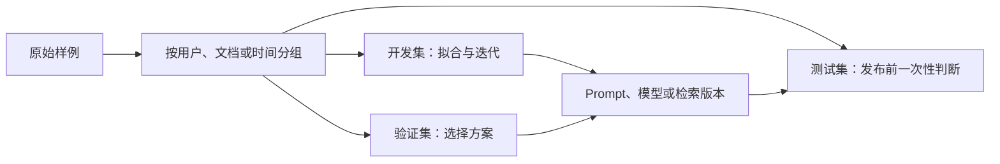

# 训练集、验证集、测试集与 Benchmark

## 1. 概念、用途与工程边界

### 定义

训练集用于更新模型参数；验证集用于选择模型、Prompt、超参数和停止条件；测试集只用于对最终方案做相对独立的估计。Benchmark 是具有任务、数据、运行规则和评分方法的标准化评测，用于在约定条件下比较系统。

### 为什么需要

如果开发者根据测试结果不断修改方案，测试集信息会进入决策，最终分数会高估真实泛化能力。公开 Benchmark 能提供外部参照，但通常不能覆盖具体产品的用户、数据、权限、成本和失败损失。

### 核心特性

- 数据划分应避免同一文档、同一用户、近重复内容或时间上相关样例跨集合泄漏。
- 时间敏感任务常按时间切分，确保测试数据发生在训练/开发数据之后。
- 三个集合应接近目标线上分布；若分布不同，指标解释必须注明。
- Benchmark 分数只有在相同数据版本、Prompt、工具、采样、运行次数和评分器下才可直接比较。
- 污染是模型训练数据包含测试题或答案，导致分数不能代表新任务能力。

### 工程使用

AI 应用可以采用：

```text
development.jsonl  # 日常 Prompt、RAG 和流程调试
regression.jsonl   # 已修复线上/实验失败，持续扩充
test.jsonl         # 版本发布前评估，限制查看与调参
```

每条样例记录 ID、来源、日期、许可、任务标签、输入、期望、评分器版本和风险等级。报告同时给出样例数量、分组分布、置信区间或多次 Trial 结果，不只给一个总分。

### 常见错误与边界

- 随机按行切分包含同一文档多个 Chunk 的数据，造成内容泄漏。
- 用公开 Benchmark 排名直接决定产品模型，不测真实输入和成本。
- 在测试失败后逐条修改 Prompt，再继续报告同一测试集分数。
- 测试集只有正常样例，没有无答案、权限、边界和对抗样例。
- 更换 Judge 模型或 Rubric 后直接与旧分数比较。

### 延伸机制

离线评测无法替代线上监控。线上数据受真实流量、界面、延迟、用户行为和系统集成影响；发布后仍需观察任务完成、人工接管、投诉、安全和费用指标。

## 数据流与泄漏边界



同一来源的近重复样例必须先分组再切分，否则一个文档的段落可能同时进入开发集和测试集。测试结果一旦被用于逐题修改方案，该集合就参与了开发，不再是独立测试集。

## 指标与 Benchmark 明细

| 项目 | 必须记录 | 主要边界 |
| --- | --- | --- |
| 数据版本 | 样例 ID、来源、许可、切分规则 | 更新参考答案后不可与旧分数直接混合 |
| 运行配置 | 模型完整标识、Prompt、工具、采样、Trial 数 | 模型别名移动会破坏复现 |
| 指标 | 公式、单位、宏/微平均、阈值 | 总平均会掩盖高风险分组 |
| Benchmark | 任务、数据、提交规则、评分器 | 排名不等于产品任务表现 |
| 污染检查 | 近重复、训练暴露、公开答案 | 只能降低风险，无法证明完全无污染 |

## 可计算示例

假设 20 个测试样例分为 normal 12 个、no-answer 4 个、permission 4 个。某方案分别通过 11、4、1 个，总通过率是 `16 / 20 = 80%`，但权限切片仅 `1 / 4 = 25%`。若发布门槛规定权限切片必须达到 100%，该方案不能发布。计算结果同时说明：总分不能替代分组门槛。

## 验证与排错

1. 对规范化文本、来源 ID 和父文档 ID做重复检查。
2. 输出每个集合的标签、时间和来源分布，确认目标线上样例没有缺失。
3. 冻结测试集访问权限；发布评估前保存配置哈希。
4. 分数异常跃升时优先检查泄漏、参考答案变化、评分器版本和模型别名。

## 练习与完成标准

为 30 条样例设计分组切分。验收：说明分组键与理由；三个集合无父文档交叉；至少包含正常、无答案、权限和对抗切片；写出一个总体指标、两个分组门槛及测试集被查看后的处理规则。

## 完整案例：构建客服意图评测集

### 输入

- 240 条经授权和脱敏的客服请求，字段为 `case_id`、`account_hash`、`created_at`、`intent`、`text`。
- 同一账户可能在同一工单内连续发送多条消息。
- 产品发布门槛：总体准确率至少 85%，`cancel-order` 召回率至少 95%，权限越界回答为 0。

### 逐步处理

1. 先按 `account_hash + case_id` 聚合，避免同一工单的近重复消息跨集合。
2. 用最早 70% 时间段建立开发集，中间 15% 建立验证集，最新 15% 作为测试集。
3. 开发集用于编写 Prompt 和错误分析；验证集用于选择 Prompt 与模型；测试集在候选版本冻结后运行一次。
4. 为 `cancel-order`、无答案、权限不足、长文本分别生成切片统计。
5. 保存数据哈希、切分脚本版本、模型完整 ID、Prompt 版本、Schema 版本和运行次数。

### 输出

```json
{
  "dataset": "support-intent-v3",
  "split_rule": "group-by-account-case_then_time",
  "test": {"count": 36, "accuracy": 0.861},
  "slices": {"cancel_order_recall": 0.917, "permission_violations": 0}
}
```

总体准确率通过，但取消订单召回率低于 95%，因此结论是“不发布”。不能删除失败样例或临时降低门槛后宣布通过。

### 验证

- 断言一个 `case_id` 只属于一个集合。
- 人工抽查规范化后相似度最高的跨集合样例，确认没有模板复制。
- 用固定输出重新运行评分器，结果必须一致。
- 对三次模型 Trial 分别保存结果，再报告均值和最差值。

### 失败分支

若发布后团队根据这 36 条测试样例逐题修改 Prompt，该测试集转为开发证据。应建立新的冻结测试集，并在报告中保留旧测试集已暴露的事实，不能继续把旧分数解释为独立泛化估计。

## 边界检查矩阵

1. 实体泄漏：同一用户、工单、文档或模板的派生样例不得跨集合。
2. 时间泄漏：预测未来时不能让未来事件、后验标签或更新后的文档进入开发输入。
3. 标签泄漏：输入字段不能直接或间接包含参考答案。
4. 评测泄漏：根据测试失败逐题修改后，测试集必须重新定性为开发证据。
5. 评分器漂移：Rubric、Judge 或阈值变化必须产生新评分版本。
6. 样本量：小切片需同时报告分子、分母，不能只给百分比。
7. Trial：随机输出保存每次运行，不选择最好一次。
8. 缺失切片：线上重要语言、权限和无答案场景必须进入数据设计。
9. 污染：公开 Benchmark 的高分不证明题目未进入训练数据。
10. 发布：高损失切片门槛优先于总体平均。
11. 复现：保存数据、代码、Prompt、模型和工具版本。
12. 线上：离线通过后继续观察任务完成与人工接管。

## 来源

- [Google ML：Datasets, Generalization and Overfitting](https://developers.google.com/machine-learning/crash-course/overfitting)（访问日期：2026-07-17）
- [Google ML Glossary](https://developers.google.com/machine-learning/glossary/)（访问日期：2026-07-17）
- [OpenAI API：Evals](https://platform.openai.com/docs/api-reference/evals)（访问日期：2026-07-17）
- [Anthropic：Demystifying evals for AI agents](https://www.anthropic.com/engineering/demystifying-evals-for-ai-agents)（访问日期：2026-07-17）
