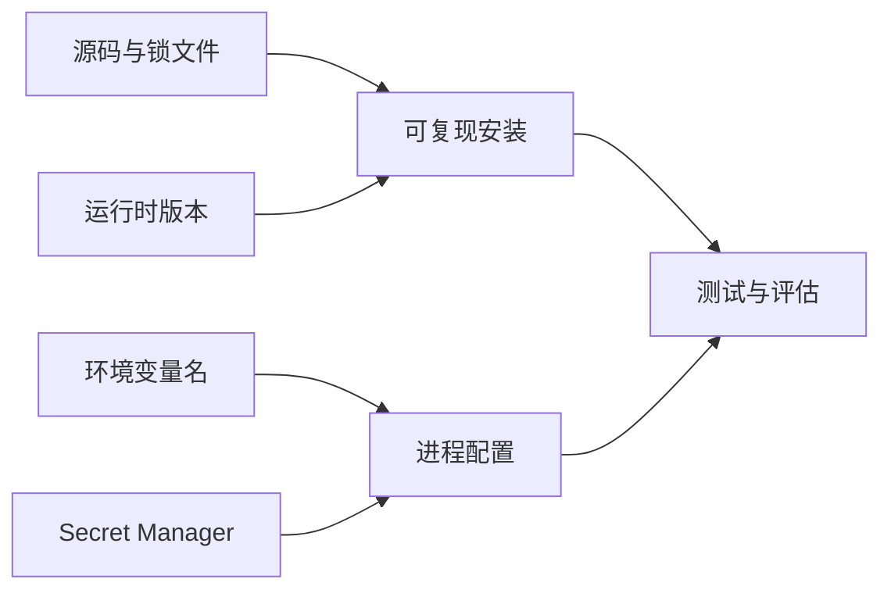

# 命令行、Git、包管理、虚拟环境与环境变量

## 1. 概念、用途与工程边界

### 定义

命令行用于执行程序、安装依赖、运行测试和自动化任务。Git 保存文件快照和历史。包管理器安装并锁定第三方依赖。虚拟环境隔离 Python 项目的包。环境变量向进程传入配置，常用于 API 地址、模型名和 Secret 引用。

### 为什么需要

AI 项目依赖 SDK、Schema、数据处理和评估工具。没有版本和环境管理，同一代码可能因依赖差异无法复现；把密钥写入代码又会造成泄露。

### 核心特性

### 命令行

程序从当前工作目录运行，路径可以是绝对路径或相对路径。命令的退出码 `0` 通常表示成功，非零表示失败，CI 会据此判断步骤结果。标准输出用于正常结果，标准错误用于诊断。

### Git

工作区是正在编辑的文件；暂存区选择下一次提交的内容；提交保存一个可追踪快照。分支是指向提交的可移动引用，远端是另一个 Git 仓库的命名地址。数据集、模型结果或 Secret 是否进入 Git 必须单独判断。

### 包与版本

JavaScript 项目使用 `package.json` 描述依赖和脚本，锁文件固定实际解析版本。Python 使用项目元数据或 requirements 文件记录依赖，`venv` 为项目创建隔离环境。锁文件应提交，虚拟环境目录和 Secret 文件不提交。

### 环境变量

环境变量属于进程环境。它解决配置注入，不等于完整的 Secret 管理系统；环境变量可能出现在进程检查、崩溃报告或错误日志中。

### 工程使用

TypeScript 项目：

```bash
npm init -y
MODEL_SDK_PACKAGE="在供应商官方文档中确认的软件包名"
npm install "$MODEL_SDK_PACKAGE"
git init
git add package.json package-lock.json
git commit -m "chore: initialize ai experiment"
```

Python 项目：

```bash
python3 -m venv .venv
source .venv/bin/activate
MODEL_SDK_PACKAGE="在供应商官方文档中确认的软件包名"
python -m pip install "$MODEL_SDK_PACKAGE"
python -m pip freeze > requirements.txt
```

环境变量只在运行时读取，并在启动阶段检查：

```ts
const apiKey = process.env.MODEL_API_KEY;
if (!apiKey) throw new Error("MODEL_API_KEY is required");
```

`.gitignore` 至少排除 `.env`、`.venv/`、本地缓存和包含敏感输入的实验产物。提供 `.env.example` 时只写变量名和非敏感示例。

### 常见错误与边界

- 只提交依赖清单但不提交锁文件，导致安装结果漂移。
- 把 `.env`、API Key、真实用户输入或完整模型 Trace 提交到 Git。
- 认为从 Git 历史删除当前文件即可撤销 Secret；已泄露 Secret 必须立即吊销和轮换。
- 使用系统全局 Python 环境安装所有包，项目间版本互相影响。
- 未记录运行时版本、依赖版本和模型标识，实验无法复现。

### 延伸机制

生产环境优先使用云平台或组织的 Secret Manager，将短期凭据和最小权限结合。依赖升级要运行测试与评估，因为 SDK 结构变化和默认参数变化都可能影响行为。

## 环境之间的责任边界



锁文件固定依赖解析结果，虚拟环境隔离本机安装，环境变量把配置传给进程，Secret Manager 管理敏感值生命周期。这四者不能互相替代。

## 命令和文件明细

| 对象 | 作用 | 应提交 Git | 常见验证 |
| --- | --- | --- | --- |
| `package.json` / `pyproject.toml` | 声明项目和直接依赖 | 是 | 安装、测试 |
| 锁文件 | 固定解析后的依赖图 | 是 | CI 清洁安装 |
| `.venv/` / `node_modules/` | 本机安装产物 | 否 | 删除后可重建 |
| `.env.example` | 记录变量名与非敏感示例 | 是 | 启动配置检查 |
| `.env` / API Key | 本地敏感配置 | 否 | Secret 扫描 |

## 可运行示例

以下命令不调用模型，只验证 Node.js 进程能读取配置并返回明确退出码：

```bash
MODEL_NAME=test-model node -e '
const name = process.env.MODEL_NAME;
if (!name) { console.error("MODEL_NAME is required"); process.exit(2); }
console.log(JSON.stringify({ model: name }));
'
```

可观察结果是标准输出 `{"model":"test-model"}` 和退出码 `0`。删除命令前的环境变量后，应在标准错误看到缺失提示并得到退出码 `2`。

## 验证与排错

1. 在全新目录或 CI 中按锁文件安装，确认没有依赖本机全局包。
2. 记录 `node --version`、`python --version` 和包管理器版本。
3. 用 Secret 扫描检查暂存内容；泄露时立即吊销凭据。
4. 导入失败时检查当前解释器、工作目录、锁文件差异和包的实际安装位置。

## 练习与完成标准

初始化一个不调用真实 API 的 TypeScript 或 Python 项目。验收：有依赖清单和锁定方案；有 `.gitignore` 与无 Secret 的示例配置；缺少必需变量时非零退出；清空安装目录后能按文档重建并运行测试。

## 完整案例：可复现的本地模型实验

### 输入

- Node.js 项目，入口为 `src/run.mjs`。
- 必需配置只有 `MODEL_ID`；真实 API Key 由部署环境注入，本地测试使用 Stub。
- `package.json` 指定测试脚本，锁文件固定依赖解析结果。

### 逐步处理

1. 在项目根目录执行清洁安装，不复用全局依赖。
2. 启动函数先读取并校验 `MODEL_ID`，再创建 Client；导入模块本身不产生网络调用。
3. 单元测试注入固定 Client，返回包含 `status`、`output` 和 `usage` 的受控对象。
4. CI 使用受限身份运行测试，不授予生产模型和生产数据权限。
5. 构建记录 Node.js、包管理器、锁文件哈希和 Git 提交。

### 输出

```text
runtime=node-22
model=test-model
client=stub
tests=12 passed
network_calls=0
```

该输出证明测试环境可运行，不证明真实供应商可用；真实 API 的契约测试应单独标记、限额并在受控环境执行。

### 验证

- 删除 `node_modules` 后按锁文件重建，测试结果不变。
- 在缺少 `MODEL_ID` 时进程以非零退出码失败，日志不含其他环境变量。
- `git ls-files` 不包含 `.env`、私钥、真实输入或响应 Trace。
- 依赖升级在独立分支运行单元测试、契约测试和固定评测集。

### 失败分支

若 CI 成功而开发机导入失败，依次检查当前工作目录、实际 Node.js 版本、锁文件是否被忽略、包管理器是否混用、模块格式是 ESM 还是 CommonJS。不得通过提交 `node_modules` 解决环境差异。

## 边界检查矩阵

1. 路径：从错误日志确认当前工作目录和目标文件真实位置。
2. 运行时：锁定并记录 Node.js 或 Python 主版本，避免语法与标准库差异。
3. 解释器：Python 用 `which python` 和 `python -m pip` 确认安装目标一致。
4. 依赖：清洁安装验证锁文件，而不是依赖残留缓存。
5. 模块：明确 ESM/CommonJS 或 Python 包入口，不靠偶然导入路径。
6. 配置：启动时逐项校验必需变量，只打印变量名不打印 Secret。
7. 权限：开发、CI、生产身份和资源范围分离。
8. 网络：单元测试默认禁止真实模型调用。
9. 版本：SDK、API 与模型标识分别记录，不能用一个版本号代替。
10. 数据：真实输入和 Trace 进入受控存储而非普通仓库。
11. 升级：依赖变更运行测试、契约检查和模型评测。
12. 恢复：泄露凭据先吊销轮换，再处理历史。

## 来源

- [Git User Manual](https://git-scm.com/docs/user-manual)（访问日期：2026-07-17）
- [Git Reference](https://git-scm.com/docs)（访问日期：2026-07-17）
- [Python Packaging：pip 与 venv](https://packaging.python.org/en/latest/guides/installing-using-pip-and-virtual-environments/)（访问日期：2026-07-17）
- [Node.js：Environment Variables](https://nodejs.org/api/environment_variables.html)（访问日期：2026-07-17）
