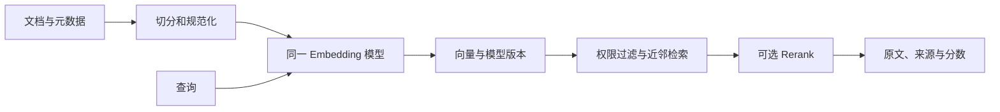

# Embedding、向量、点积与余弦相似度

## 1. 概念、用途与工程边界

### 定义

Embedding 是把离散对象映射为固定维度数值向量的表示。向量的各维通常不能单独用人工语义解释，但整体几何关系可用于相似度、检索、聚类和分类。点积是对应维度乘积之和。余弦相似度是点积除以两个向量长度，衡量方向接近程度。

### 为什么需要

文本不能直接用传统数值索引比较语义。Embedding 将查询和文档放到同一向量空间，允许近邻检索。理解相似度才能正确选择索引度量、阈值和归一化方式。

### 核心特性

对于向量 `a`、`b`：

```text
dot(a,b) = Σ aᵢbᵢ
cos(a,b) = dot(a,b) / (||a|| ||b||)
```

- 点积同时受方向和长度影响。
- 余弦相似度忽略整体长度，值通常位于 -1 到 1；具体 Embedding 分布不保证覆盖整个区间。
- 若向量已做 L2 归一化，点积等于余弦相似度。
- 不同模型、维度或版本生成的向量通常不能直接混用。
- 相似表示统计相关，不保证事实相同、逻辑蕴含或满足权限。

### 工程使用

1. 明确检索单位：标题、段落、页面还是对象字段。
2. 使用同一 Embedding 模型和预处理生成文档与查询向量。
3. 在向量数据库中配置与模型建议一致的距离度量。
4. 取 Top-K 后再做元数据权限过滤或在检索阶段强制过滤。
5. 用标注问题集评估 Recall@K，而不是凭几次搜索调整阈值。
6. 模型升级时新建索引或完整重算，并记录版本。

### 常见错误与边界

- 混用不同 Embedding 模型的向量。
- 将余弦距离和余弦相似度的排序方向弄反；数据库定义可能不同。
- 只检索向量相似内容，不结合关键词、实体、日期和权限过滤。
- 把高相似度当作答案正确或文档支持结论。
- 在向量写入后丢失原文、来源和版本，无法引用或删除。

### 延伸机制

近似最近邻索引用召回率换取速度和内存。Hybrid Search 将关键词与向量信号结合；Reranker 对较小候选集做更精细排序。两者都需要真实查询集评估。

## 从对象到检索结果



权限过滤必须在受控系统中执行。若数据库只能检索后过滤，应扩大候选集并评估漏召回，但不能把无权限文档发送给生成模型。

## 数学量与数据库术语

| 名称 | 定义 | 排序方向 | 边界 |
| --- | --- | --- | --- |
| 点积 | `Σaᵢbᵢ` | 通常越大越相似 | 受向量长度影响 |
| 余弦相似度 | `dot/(norm(a)norm(b))` | 越大越相似 | 零向量时未定义 |
| 余弦距离 | 常见定义为 `1-cos` | 越小越近 | 数据库可能采用不同命名 |
| Top-K | 返回分数最优的 K 个候选 | 由度量决定 | K 不是质量保证 |
| Recall@K | 相关文档在前 K 个中被召回的比例 | 越大越好 | 需要标注相关集合 |

## 可计算示例

令 `a=[1,0]`、`b=[2,0]`、`c=[1,1]`。`dot(a,b)=2`，`cos(a,b)=1`；`dot(a,c)=1`，`cos(a,c)=1/√2≈0.707`。`b` 与 `a` 方向完全相同，但长度不同；这说明点积和余弦不能在未确认归一化与索引定义时互换。

## 验证与排错

1. 断言查询和索引记录具有相同模型 ID、维度和预处理版本。
2. 用手算向量验证数据库的分数名称与排序方向。
3. 在标注查询集上计算 Recall@K，并按权限、语言、长度切片。
4. 结果异常时检查切分单位、空文本、归一化、模型升级和元数据过滤。

## 练习与完成标准

为 10 个短文档实现一个暴力余弦检索。验收：拒绝零向量；返回原文、来源和分数；对 5 个标注查询计算 Recall@3；证明混用不同维度向量会被显式拒绝。

## 完整案例：带权限的内部文档检索

### 输入

- 三篇文档：公开报销说明、财务专用审批规则、人事专用休假规则。
- 查询：“差旅报销需要谁审批？”
- 当前用户只有公开文档权限；标注相关集合只包含公开报销说明。
- Embedding 模型和索引版本均为 `embed-v2`，向量维度一致。

### 逐步处理

1. 文档按标题与段落切分，每个 Chunk 保存 `document_id`、正文、权限、时间和模型版本。
2. 查询使用同一规范化过程和模型生成向量。
3. 在数据库查询中先强制 `visibility=public`，再按余弦相似度取前 5。
4. 对候选执行关键词与语义混合排序，并保留原始分数。
5. 返回原文和来源给生成模型；若没有达到评测确定的证据条件，返回无答案状态。

### 输出

```json
{
  "query_id": "q-17",
  "embedding_model": "embed-v2",
  "metric": "cosine_similarity",
  "results": [
    {"document_id": "travel-public", "score": 0.82, "authorized": true}
  ]
}
```

财务专用规则即使向量分数更高也不能进入候选或模型上下文。权限过滤是授权规则，不是相关性优化。

### 验证

- 人工构造相同向量，确认数据库分数相等且排序稳定。
- 以 20 个标注查询计算 Recall@5，并分别报告公开与受限文档切片。
- 检查结果中的模型版本、维度、距离名称和排序方向。
- 删除文档时同步删除原文、向量与派生索引项，并用查询确认不可召回。

### 失败分支

若升级到 `embed-v3` 后只重算查询向量，分数没有可比较含义。应建立新索引、重算全部文档、在同一查询集比较 Recall@K，再通过版本切换完成迁移；不能在同一索引静默混用。

## 边界检查矩阵

1. 零向量：余弦分母为零时必须拒绝或定义显式策略。
2. 维度：写入和查询前校验长度，避免运行时数据库错误。
3. 模型：记录完整模型与预处理版本，升级时重建索引。
4. 度量：确认数据库返回 similarity 还是 distance 以及排序方向。
5. 归一化：只有明确做 L2 归一化时，点积才等于余弦。
6. 切分：Chunk 太短丢上下文，太长会混合多个主题。
7. 权限：过滤在检索信任边界执行，不依赖生成模型忽略。
8. 新鲜度：保留更新时间并定义过期文档处理。
9. 删除：原文、向量、缓存和派生索引需要可追踪删除。
10. 混合检索：关键词与向量分数需校准，不能直接假设同一量纲。
11. Rerank：只重排候选，无法召回初始阶段遗漏的文档。
12. 验证：用真实标注查询计算 Recall@K 和最终任务指标。

## 相似度阈值与 Top-K 的区别

Top-K 始终尝试返回排名最靠前的 K 个候选，即使所有候选都很差；阈值则拒绝未达到条件的候选，但阈值的数值只对指定模型、预处理、距离实现和数据分布有意义。不能从另一个模型复制 `0.8` 之类的阈值。应在标注查询上画出不同阈值的召回率、精确率与无结果比例，并根据漏召回和误召回损失选择。

近似最近邻索引还包含构建参数与查询参数。提高搜索深度通常改善召回但增加延迟；量化可减少内存但会改变距离精度。参数名称由数据库实现定义，报告必须同时给出索引类型、构建版本、查询参数、数据规模、P95 延迟和 Recall@K。仅凭一条查询“看起来正确”不能证明索引配置合格。

若业务需要引用，结果对象必须保留原始文档 ID、Chunk 边界、版本和可访问原文。向量本身不能还原可审计来源，也不能作为删除、授权或事实支持的唯一记录。

## 来源

- [Google ML Crash Course：Embeddings](https://developers.google.com/machine-learning/crash-course/embeddings)（访问日期：2026-07-17）
- [TensorFlow：Vector Embeddings](https://www.tensorflow.org/text/guide/word_embeddings)（访问日期：2026-07-17）
- [SciPy：Cosine Distance](https://docs.scipy.org/doc/scipy/reference/generated/scipy.spatial.distance.cosine.html)（访问日期：2026-07-17）
