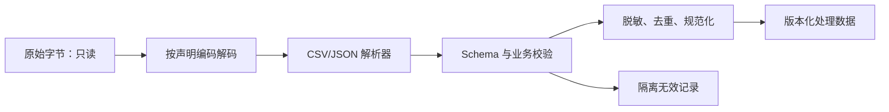

# 文件、文本编码、CSV、JSONL 与数据清洗

## 1. 概念、用途与工程边界

### 定义

文件是持久化字节序列；文本文件需要字符编码把字节解释为字符。UTF-8 是 AI 文本数据常用编码。CSV 用分隔字段表达表格，JSONL/NDJSON 每行保存一个独立 JSON 值，适合流式处理样例、模型输入输出和评估记录。数据清洗是把原始数据转换为可验证、可追踪的输入数据。

### 为什么需要

Prompt、文档、评测集、模型响应和 Trace 经常以文件保存。编码错误会破坏字符；格式解析错误会错位字段；不受控清洗会丢失证据或把测试集信息泄漏进训练/开发过程。

### 核心特性

### 文本编码

读写时显式指定 UTF-8，避免依赖操作系统默认编码。解码错误不应默认静默忽略，否则原文会在不知情时损坏。换行符在不同系统可能不同，比较和切分前应明确规范化策略。

### CSV

CSV 适合二维表格，但分隔符、引号、换行、空值和字符编码需要由解析器处理，不能简单使用字符串 `split(',')`。复杂嵌套数据不适合 CSV。

### JSONL

每行独立解析，便于追加、流式读取、错误定位和并行处理。一行必须是完整合法 JSON；缩进后的多行 JSON 不符合 JSONL 的逐行约定。文件结尾通常保留换行。

### 数据清洗

清洗包括去除确定性噪声、规范化编码和字段、去重、脱敏、验证 Schema、标记来源和隔离无效记录。原始数据应只读保留，清洗代码和产出版本可追踪。

### 工程使用

```python
import json

with open("evals.jsonl", encoding="utf-8") as source:
    for line_number, line in enumerate(source, start=1):
        if not line.strip():
            continue
        try:
            record = json.loads(line)
        except json.JSONDecodeError as error:
            raise ValueError(f"invalid JSON at line {line_number}") from error

        if "input" not in record or "expected" not in record:
            raise ValueError(f"missing fields at line {line_number}")
```

建议数据目录：

```text
data/raw/          # 原始、只读、权限严格
data/processed/    # 清洗后的版本化数据
data/evals/        # 开发/回归评测集
schemas/           # 字段和约束
scripts/           # 可重复执行的处理代码
```

每条记录至少保留 `id`、来源、采集/生成时间、许可或权限、Schema 版本和处理版本。

### 常见错误与边界

- 使用默认编码，代码在另一操作系统读取失败。
- 用字符串分割 CSV，遇到被引号包围的逗号或换行时字段错位。
- 清洗后覆盖原始数据，无法审计删除和转换过程。
- 用同一批样例反复调整 Prompt 又称其为独立测试集，造成评估泄漏。
- 把真实用户敏感数据直接提交仓库或发送给未经批准的模型服务。

### 延伸机制

大文件应使用流式读取，避免一次载入内存。数据版本变化可能导致评估分数变化，因此报告必须同时记录数据集版本和处理代码版本。

## 字节到有效记录的处理链



解码、语法解析、结构校验和业务校验是不同失败层。使用 `errors="ignore"` 会静默删除无法解码的字节，不适合作为默认清洗策略。

## 格式边界明细

| 格式 | 记录边界 | 空值 | 嵌套结构 | 主要风险 |
| --- | --- | --- | --- | --- |
| CSV | 解析器识别的行与引号 | 空字段语义由业务定义 | 不自然 | 引号内逗号、换行、方言差异 |
| JSON | 单个完整 JSON 值 | `null` 与字段缺失不同 | 支持 | 整体大文件需一次解析或流式解析器 |
| JSONL | 每个非空行一个 JSON 值 | 同 JSON | 支持 | 多行格式化对象会破坏记录边界 |

## 可运行示例

```python
import io, json

raw = '{"id":1,"text":"中文"}\n{"id":2,"text":null}\n'.encode("utf-8")
rows = [json.loads(line) for line in io.TextIOWrapper(io.BytesIO(raw), encoding="utf-8")]
assert rows[0]["text"] == "中文"
assert rows[1]["text"] is None
assert all(set(row) == {"id", "text"} for row in rows)
print(len(rows))
```

输出为 `2`。把第二行改成尾随逗号后，`json.loads` 应抛出解析错误，而不是产生部分成功数据。

## 验证与排错

1. 对原始文件记录哈希、大小、来源和权限，不覆盖原件。
2. 显式指定编码；解析错误记录行号和不可逆转换。
3. 用 Schema 区分缺字段、`null`、空字符串和空数组。
4. 清洗前后记录行数、去重数、隔离数和字段分布。

## 练习与完成标准

编写 CSV 到 JSONL 的转换器。验收：正确处理引号内逗号和换行；显式使用 UTF-8；无效行进入带原因的隔离文件；原文件不变；输出逐行可解析并通过字段校验。

## 完整案例：评测记录清洗

### 输入

原始 CSV 含字段 `id,input,expected,tags`。其中一条输入包含逗号和换行，一条 `expected` 为空，一条 ID 重复；文件声明为 UTF-8。清洗目标是生成逐行合法的 JSONL，同时保留所有拒绝原因。

### 逐步处理

1. 以二进制读取并计算原文件 SHA-256，不修改原件。
2. 使用 UTF-8 严格解码；解码失败时整个文件进入人工检查，不静默忽略字节。
3. 使用标准 CSV 解析器处理引号、逗号和嵌入换行，不使用字符串分割。
4. 运行字段 Schema：`id` 和 `input` 为非空字符串，`expected` 允许 `null`，`tags` 解析为字符串数组。
5. 重复 ID 进入隔离记录，并保存首次出现行号；有效记录逐行序列化为 JSON。
6. 输出处理版本、输入哈希、有效数、隔离数和错误类别计数。

### 输出

```jsonl
{"id":"e-001","input":"含逗号,以及换行\n的内容","expected":"ok","tags":["edge"]}
{"id":"e-002","input":"资料不足","expected":null,"tags":["no-answer"]}
```

隔离文件单独保存 `source_line`、原始记录的受控引用和 `duplicate_id` 原因。JSONL 文件每个物理行都是完整 JSON 值，字符串内换行编码为 `\n`。

### 验证

- 逐行 `json.loads`，并断言输出 ID 唯一。
- 比较 `有效数 + 隔离数` 与解析后的输入记录数。
- 随机抽样反序列化后比较输入文本，确认逗号和换行未丢失。
- 第二次对同一输入运行，输出哈希必须一致。

### 失败分支

若文件实际为其他编码却被错误声明为 UTF-8，严格解码会失败。应由数据所有者确认编码或提供可审计的转换，不用自动尝试多个编码后选择“看起来正常”的结果，因为这种策略可能产生不可见字符替换。

## 边界检查矩阵

1. BOM：确认 UTF-8 BOM 是否由解析器处理，避免首字段名带不可见字符。
2. 换行：支持 LF 与 CRLF，但不要改变字符串字段内的合法换行。
3. CSV 方言：分隔符、引号和转义规则必须由数据契约声明。
4. 空值：缺失字段、空字符串、`null` 和空数组分别定义。
5. 数值：JSON 数字进入语言运行时时检查精度和允许范围。
6. 日期：保存时区或偏移，不把本地时间当绝对时间。
7. JSONL：一条业务记录只能占一个物理行。
8. 大文件：逐条处理并限制单条大小，避免内存耗尽。
9. 隔离：无效记录保存原因和来源，不混入有效输出。
10. 脱敏：在授权边界内处理，保留可审计但不可逆的标识。
11. 幂等：相同输入与处理版本应产生相同输出。
12. 统计：处理前后数量、哈希和错误分布必须可核对。

## 来源

- [Python `io`：Text Encoding](https://docs.python.org/3/library/io.html#text-encoding)（访问日期：2026-07-17）
- [Python `csv`](https://docs.python.org/3/library/csv.html)（访问日期：2026-07-17）
- [Python `json`](https://docs.python.org/3/library/json.html)（访问日期：2026-07-17）
- [JSON Lines](https://jsonlines.org/)（访问日期：2026-07-17）
