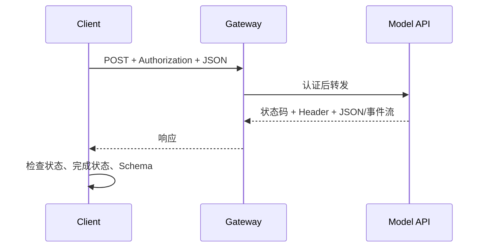

# HTTP、JSON、REST API、状态码、认证与流式响应

## 1. 概念、用途与工程边界

### 定义

HTTP 是无状态的应用层请求/响应协议。客户端向资源发送包含方法、目标、Header 和可选内容的请求，服务器返回状态码、Header 和可选内容。JSON 是常见的数据交换格式。REST 是一组网络系统架构约束，实际模型 API 通常使用基于 HTTP 和 JSON 的接口，但不应把所有 HTTP API 都等同于严格 REST。

### 为什么需要

官方 SDK 最终仍通过网络协议访问模型服务。理解 HTTP 能直接定位认证、限流、超时、代理、流中断和响应解析问题，也能在 SDK 缺少新能力时阅读原始 API 文档。

### 核心特性

### 请求与响应

- 方法表达意图；模型生成通常使用 `POST`，因为需要发送较大的请求体并产生计算。
- Header 携带媒体类型、认证、追踪和内容协商信息。
- `Content-Type: application/json` 表示内容按 JSON 解释。
- HTTP 无状态意味着每个请求语义可独立理解；会话历史通常由客户端在请求中显式传入或由应用服务保存。

### 状态码

- `2xx`：请求被成功处理，但业务结果仍需验证。
- `4xx`：请求、认证、权限、配额或速率限制问题；不是所有 `4xx` 都可重试。
- `5xx`：服务端失败，可能适合有限重试。
- 必须读取服务提供方的错误结构和 `Retry-After` 等 Header，不能只看状态码文本。

### 认证

API Key 或短期 Token 通常放在 `Authorization` 等 Header。认证回答调用者是谁，授权决定调用者能做什么。密钥不得进入 URL、前端代码和日志。

### Streaming

流式响应让客户端在完整结果生成前逐块处理数据。HTTP 连接成功不代表流一定完整；客户端必须处理分片边界、解码、取消、网络中断、重复事件和结束标记。

### 工程使用

```bash
curl --fail-with-body \
  --request POST \
  --header "Authorization: Bearer $MODEL_API_KEY" \
  --header "Content-Type: application/json" \
  --data '{"model":"MODEL_ID","input":"Return one JSON object"}' \
  https://provider.example/v1/generate
```

程序处理顺序：

1. 设置连接和总超时。
2. 发送认证、内容类型、请求 ID 和请求体。
3. 检查 HTTP 状态并解析厂商错误结构。
4. 非流式响应解析 JSON，再做 Schema 校验。
5. 流式响应逐块解码，按协议组装事件；完成后检查结束原因和 Usage。
6. 日志记录请求 ID、模型、延迟和错误类别，不记录 Secret 和敏感原文。

### 常见错误与边界

- `fetch` 获得 `404` 或 `500` 时仍可能正常返回 Response，必须检查 `response.ok`。
- 把网络超时、服务端错误、模型拒绝和 Schema 错误归为同一种失败。
- 对 `401`、`403` 或无效参数自动重试，既无效又增加请求量。
- 假设一个网络 Chunk 就是一条完整 JSON 事件；传输分块和应用事件边界不同。
- 只保存最后文本，丢失结束原因、工具调用、引用、Usage 和服务端请求 ID。

### 延伸机制

HTTP/1.1、HTTP/2 和 HTTP/3 使用不同传输方式，但共享 RFC 9110 定义的核心语义。代理、网关和负载均衡可能增加超时和缓冲，流式接口部署时需要单独验证链路。

## 一次模型请求的协议链路



HTTP 成功只表示协议请求被处理。模型响应仍可能是拒绝、不完整、工具请求或结构不合格；应用必须继续检查响应对象。

## 方法、Header 与状态码

| 项目 | 作用 | 处理边界 |
| --- | --- | --- |
| `POST` | 提交带请求体的生成任务 | 重试可能重复计算或副作用 |
| `Authorization` | 携带调用凭据 | 不写入 URL、浏览器包或普通日志 |
| `Content-Type` | 声明请求体媒体类型 | JSON 不代表字段契约正确 |
| `2xx` | HTTP 层成功 | 继续检查业务和模型状态 |
| `400/401/403` | 请求、认证或权限问题 | 通常先修正，不盲目重试 |
| `429/5xx` | 限流或服务失败 | 仅按厂商语义有限重试 |

## 可验证的 Responses API 请求

下面是 OpenAI 原始 REST 请求字段；`output_text` 是官方 SDK 的聚合便利属性，不是创建请求字段，也不是原始响应对象的顶层 REST 字段。

```bash
curl --fail-with-body https://api.openai.com/v1/responses \
  -H "Authorization: Bearer $OPENAI_API_KEY" \
  -H "Content-Type: application/json" \
  -d '{"model":"MODEL_ID","instructions":"Answer in one sentence.","input":"What does HTTP status 429 indicate?","max_output_tokens":100}'
```

原始响应正文应检查 `status`、`error`、`incomplete_details`、`output` 和 `usage`。文本位于 `output` 数组内的消息内容项；SDK 可额外提供聚合后的 `response.output_text`。

## 验证与排错

1. 用 `curl -v` 或安全代理确认方法、URL、Header 名和请求体，不输出 Secret。
2. 记录服务端请求 ID与客户端 trace ID。
3. 将 HTTP 错误、网络错误、模型状态和 Schema 错误分开统计。
4. Streaming 时按事件协议解析，不能假设传输 Chunk 等于一条事件。

## 练习与完成标准

实现一个最小 HTTP Client。验收：有连接与总超时；检查非 `2xx` 错误体；成功后检查模型完成状态；日志不含 Key；用本地 Mock 分别验证 200 完成、400、429、500 和连接中断。

## 完整案例：区分 HTTP 成功与模型完成

### 输入

应用向 OpenAI Responses API 发送 `POST /v1/responses`。请求包含 `model`、`instructions`、`input` 和 `max_output_tokens`，Header 包含 Bearer 凭据、JSON 媒体类型和客户端请求 ID。

### 逐步处理

1. 在服务端从 Secret Manager 读取凭据，浏览器只调用自己的后端。
2. 设置连接超时与总超时，发送 JSON 请求。
3. 若 HTTP 非 `2xx`，解析错误对象并按认证、权限、限流、无效参数或服务失败分类。
4. 若 HTTP 成功，继续读取响应 `status`。`completed` 才进入内容解析；`incomplete` 读取 `incomplete_details`；`failed` 读取 `error`。
5. 遍历原始 `output` 项识别消息、工具调用和其他类型。只有 SDK 使用者才可依赖 SDK 文档声明的 `output_text` 聚合便利属性。
6. 完成后保存 `usage` 和服务端请求 ID，再做 Schema 与业务校验。

### 输出

```json
{
  "status": "incomplete",
  "incomplete_details": {"reason": "max_output_tokens"},
  "output": [],
  "usage": {"input_tokens": 120, "output_tokens": 100, "total_tokens": 220}
}
```

该响应即使由成功 HTTP 状态返回，也不能被业务标记为成功。应用应显示“输出达到长度限制”，允许用户缩小任务或在业务允许时重试。

### 验证

- Mock 传输错误、401、403、429、500、`completed`、`incomplete` 和 `failed`。
- 断言只有 `completed` 且内容校验通过才产生业务成功。
- 日志记录状态、错误类别、请求 ID 和 Usage，不保存 Authorization Header。
- 用原始 JSON Fixture 测试解析器，避免把 SDK convenience 字段当 REST 契约。

### 失败分支

若 429 响应带重试信息，只在请求具备幂等语义且总尝试预算未耗尽时等待并重试。401、403 和无效请求不通过重试修复。若模型调用之后还有写 Tool，Tool 还必须使用独立幂等键。

## 来源

- [RFC 9110：HTTP Semantics](https://www.rfc-editor.org/rfc/rfc9110.html)（访问日期：2026-07-17）
- [MDN：Using Fetch](https://developer.mozilla.org/en-US/docs/Web/API/Fetch_API/Using_Fetch)（访问日期：2026-07-17）
- [MDN：Streams API](https://developer.mozilla.org/en-US/docs/Web/API/Streams_API)（访问日期：2026-07-17）
- [OpenAI API Reference：Responses](https://platform.openai.com/docs/api-reference/responses)（访问日期：2026-07-17）
