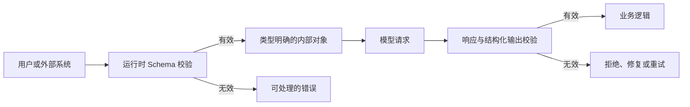
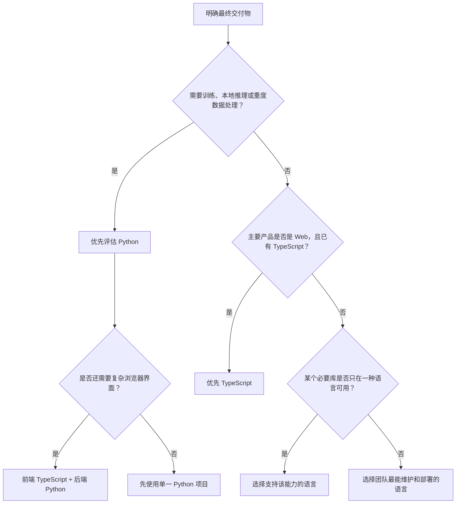
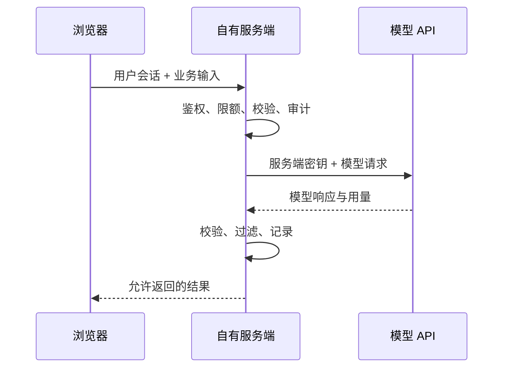

# JavaScript、TypeScript 与 Python 的选择

## 1. 语言在 AI 应用中负责什么

使用托管模型 API 时，模型运行在服务提供方的服务器上。应用代码负责：

1. 从界面、文件、数据库或其他服务取得输入；
2. 把输入整理成 API 要求的 JSON 请求；
3. 通过 HTTPS 发送请求；
4. 检查状态码、解析响应、统计用量；
5. 校验模型输出并执行后续业务逻辑；
6. 记录日志，处理超时、限流、取消和重试；
7. 向用户展示结果或把结果交给其他系统。

JavaScript、TypeScript 和 Python 都能完成这些工作。请求中的模型、输入、工具、输出格式与生成参数相同时，客户端语言不会自然提高模型质量。

训练模型或在本机运行模型时，语言还需要连接张量计算、数据处理、GPU 加速和分布式训练库。Python 在这些领域拥有更完整的工具链，但这不等于所有 AI 产品都必须使用 Python。

## 2. 语言、类型系统与运行时

这三个概念不能混为一谈。

| 概念 | 作用 | 例子 |
| --- | --- | --- |
| 编程语言 | 规定语法、值、表达式和程序结构 | JavaScript、TypeScript、Python |
| 类型系统 | 检查值可以参与哪些操作 | TypeScript 的静态类型、Python 的类型提示 |
| 运行时 | 真正加载并执行程序 | 浏览器、Node.js、Python 解释器 |

### 2.1 JavaScript

JavaScript 是动态类型语言。变量本身没有固定类型，运行时的值有类型：

```js
let result = "ready";
result = 3; // 合法，变量现在保存 number 值

console.log(typeof result); // "number"
```

同一份语言可以运行在不同环境中，但环境提供的 API 不完全相同：

- 浏览器提供 DOM、页面事件、`localStorage` 等 Web API；
- Node.js 提供服务端文件系统、进程、网络服务等能力；
- `fetch`、`URL`、Streams 等一部分 Web API 同时存在于现代浏览器和 Node.js 中；
- 浏览器中的代码交付给用户，不能保存长期服务端密钥；
- Node.js 代码可以读取服务器环境变量，但不能直接操作用户页面的 DOM。

### 2.2 TypeScript

TypeScript 是 JavaScript 的带类型语法。TypeScript 编译器在开发阶段检查类型，然后移除类型语法，输出 JavaScript：

```ts
type Usage = {
  inputTokens: number;
  outputTokens: number;
};

function total(usage: Usage): number {
  return usage.inputTokens + usage.outputTokens;
}
```

编译后的 JavaScript 不保留 `Usage` 类型。下面的写法只能表达开发者的预期，不能验证网络响应：

```ts
const data = (await response.json()) as Usage;
```

`as Usage` 是类型断言。它不会检查 `data` 是否真的包含两个数字字段。外部数据需要运行时校验：

```ts
function isUsage(value: unknown): value is Usage {
  if (typeof value !== "object" || value === null) return false;

  const record = value as Record<string, unknown>;
  return (
    typeof record.inputTokens === "number" &&
    typeof record.outputTokens === "number"
  );
}
```

TypeScript 适合约束以下结构：

- API 请求参数；
- 结构化输出；
- 工具调用参数和结果；
- 前端组件属性；
- 工作流状态；
- 领域对象和错误类型。

建议在 `tsconfig.json` 中启用 `strict`。它会开启一组更严格的类型检查，包括更严格的空值、函数参数和属性初始化检查。`strict` 仍然不验证运行时输入。

### 2.3 Python

Python 也是动态类型语言：

```python
result = "ready"
result = 3
print(type(result).__name__)  # int
```

Python 类型提示用于编辑器、静态检查器、文档和框架集成：

```python
from typing import TypedDict

class Usage(TypedDict):
    input_tokens: int
    output_tokens: int

def total(usage: Usage) -> int:
    return usage["input_tokens"] + usage["output_tokens"]
```

标准 Python 运行时不会因为函数收到错误类型而自动拒绝调用。JSON、模型输出和数据库记录仍需显式校验，或交给具有运行时校验能力的库处理。

Python 适合：

- 数据清洗和批处理；
- Notebook 实验；
- 离线评估；
- 传统机器学习与深度学习；
- 本地模型推理和训练；
- 后台任务、CLI 与数据服务。

## 3. 决策所需的六个维度

### 3.1 产品运行在哪里

| 主要运行位置 | 通常优先选择 | 原因 |
| --- | --- | --- |
| 浏览器界面 | TypeScript | DOM、组件框架和浏览器工具链直接可用 |
| Node.js Web 服务 | TypeScript | 可与前端共享类型、Schema 和业务模型 |
| 数据脚本或 Notebook | Python | 数据、科学计算与实验工具成熟 |
| 模型训练或本地推理 | Python | 主流训练和张量计算生态优先支持 Python |
| CLI 与定时任务 | 两者都可 | 由现有仓库、依赖和部署平台决定 |
| 全栈 Web 产品 | TypeScript，或 TypeScript + Python | 单语言更简单；有独立数据/模型服务时再拆分 |

### 3.2 团队和现有代码

已有前端、Node.js 服务和 TypeScript 类型时，继续使用 TypeScript 通常能减少重复模型和部署单元。已有 Python 数据管道、评估集和模型代码时，Python 能直接复用数据处理逻辑。

不能只用“某语言更流行”作决定。应盘点：

- 已有领域模型和校验 Schema；
- 团队能审查和排错的语言；
- CI、日志、监控和部署设施；
- 必须使用的库是否支持目标语言；
- 最终维护者是否能独立运行项目。

### 3.3 类型与 Schema 边界

AI 应用存在大量不可信输入：用户文本、模型输出、HTTP 响应、工具参数和外部文件。无论选择哪种语言，都应在系统边界执行运行时校验。



TypeScript 类型和 Python 类型提示约束的是内部开发过程；JSON Schema 或运行时校验器约束的是实际数据。

### 3.4 并发和流式响应

模型请求主要等待网络 I/O。两种语言都可以并发发送请求和消费流式响应：

- JavaScript 使用 Promise、`async`/`await`、Streams 和事件；
- Python 使用 `asyncio`、异步迭代器和异步 HTTP 客户端；
- CPU 密集型预处理、模型推理与网络 I/O 的并发策略不同；
- 同时发出大量请求仍会受到 API 限流、连接数和预算约束。

不能用“JavaScript 异步，所以一定更快”或“Python 有机器学习库，所以 API 调用更快”作为判断。应使用目标工作负载测量吞吐、延迟、内存和失败率。

### 3.5 依赖与可复现环境

TypeScript/Node.js 项目通常记录：

- `package.json`：依赖和脚本；
- lockfile：解析后的准确依赖版本；
- `tsconfig.json`：类型检查和编译选项；
- Node.js 版本文件或部署配置：运行时版本。

Python 项目通常记录：

- `pyproject.toml`：项目元数据、依赖和工具配置；
- lockfile 或带哈希的依赖锁定结果；
- `.venv`：本机隔离环境，不提交 Git；
- Python 版本：避免只写模糊的“Python 3”。

`.env` 文件常用于本地配置，但包含真实密钥的文件不应提交。仓库可提供只含变量名和假值的 `.env.example`。

### 3.6 部署和运维

选择语言时必须确认目标环境：

- 是否支持所需运行时版本；
- 冷启动、内存和执行时长限制；
- 是否允许长连接或流式响应；
- 原生依赖是否能在目标 CPU 和操作系统运行；
- 日志、追踪、密钥管理和健康检查如何接入；
- 安全更新由谁负责。

## 4. 决策流程



推荐顺序：

1. 初学者先用一种语言完成端到端项目；
2. 只有出现明确能力边界时才引入第二种语言；
3. 拆分后使用 HTTP、队列或版本化文件格式连接两个服务；
4. 用共享 JSON Schema 或 OpenAPI 描述跨语言数据；
5. 为边界增加契约测试，防止两边独立修改后不兼容。

## 5. 同一 API 任务的 TypeScript 实现

下面的示例运行在 Node.js 服务端，直接使用标准 `fetch` 展示 HTTP 边界。需要 Node.js 提供 `fetch` 和 TypeScript 执行/编译环境。

### 5.1 项目结构

```text
ai-request-ts/
├── package.json
├── tsconfig.json
└── src/
    └── main.ts
```

`package.json`：

```json
{
  "name": "ai-request-ts",
  "private": true,
  "type": "module",
  "scripts": {
    "check": "tsc --noEmit",
    "build": "tsc",
    "start": "node dist/main.js"
  },
  "devDependencies": {
    "@types/node": "^24.0.0",
    "typescript": "^5.0.0"
  }
}
```

`tsconfig.json`：

```json
{
  "compilerOptions": {
    "target": "ES2022",
    "module": "NodeNext",
    "moduleResolution": "NodeNext",
    "outDir": "dist",
    "types": ["node"],
    "strict": true,
    "noUncheckedIndexedAccess": true
  },
  "include": ["src"]
}
```

### 5.2 请求、错误和响应解析

`src/main.ts`：

```ts
type ApiErrorBody = {
  error?: {
    message?: string;
    type?: string;
    code?: string | null;
  };
};

type ResponseBody = {
  output?: Array<{
    type?: string;
    content?: Array<{
      type?: string;
      text?: string;
    }>;
  }>;
  usage?: {
    input_tokens?: number;
    output_tokens?: number;
    total_tokens?: number;
  };
};

const apiKey = process.env.OPENAI_API_KEY;
if (!apiKey) {
  throw new Error("缺少 OPENAI_API_KEY 环境变量");
}

const model = process.env.OPENAI_MODEL;
if (!model) {
  throw new Error("缺少 OPENAI_MODEL 环境变量");
}

function readOutputText(body: ResponseBody): string {
  const texts = (body.output ?? []).flatMap((item) =>
    (item.content ?? [])
      .filter((content) => content.type === "output_text")
      .map((content) => content.text)
      .filter((text): text is string => typeof text === "string")
  );

  if (texts.length === 0) throw new Error("响应中没有 output_text 内容项");
  return texts.join("");
}

const controller = new AbortController();
const timeout = setTimeout(() => controller.abort(), 30_000);

try {
  const response = await fetch("https://api.openai.com/v1/responses", {
    method: "POST",
    headers: {
      Authorization: `Bearer ${apiKey}`,
      "Content-Type": "application/json"
    },
    body: JSON.stringify({
      model,
      input: "只返回数字：17 与 25 的和是多少？"
    }),
    signal: controller.signal
  });

  const requestId = response.headers.get("x-request-id");
  const body: unknown = await response.json();

  if (!response.ok) {
    const errorBody = body as ApiErrorBody;
    throw new Error(
      `API ${response.status}：${errorBody.error?.message ?? "未知错误"}`
    );
  }

  const result = body as ResponseBody;
  console.log(readOutputText(result));
  console.log({ requestId, usage: result.usage });
} finally {
  clearTimeout(timeout);
}
```

运行：

```bash
npm install
npm run check
npm run build
OPENAI_API_KEY="你的密钥" OPENAI_MODEL="你的模型标识" npm start
```

这个示例中的类型断言只用于缩小演示范围。生产代码应使用运行时 Schema 校验响应；输出是数字字符串也不代表语义必然正确，仍应按业务规则验证。

## 6. 同一 API 任务的 Python 实现

下面使用 Python 标准库展示相同的 HTTP 请求，不依赖厂商 SDK。

### 6.1 创建隔离环境

```bash
python3 -m venv .venv
source .venv/bin/activate
python --version
```

Windows PowerShell 激活命令：

```powershell
.venv\Scripts\Activate.ps1
```

虚拟环境隔离第三方包，不隔离操作系统环境变量，也不是密钥仓库。

### 6.2 请求、错误和响应解析

`main.py`：

```python
import json
import os
import urllib.error
import urllib.request
from typing import Any


api_key = os.environ.get("OPENAI_API_KEY")
if not api_key:
    raise RuntimeError("缺少 OPENAI_API_KEY 环境变量")

model = os.environ.get("OPENAI_MODEL")
if not model:
    raise RuntimeError("缺少 OPENAI_MODEL 环境变量")

payload = {
    "model": model,
    "input": "只返回数字：17 与 25 的和是多少？",
}

request = urllib.request.Request(
    "https://api.openai.com/v1/responses",
    data=json.dumps(payload).encode("utf-8"),
    headers={
        "Authorization": f"Bearer {api_key}",
        "Content-Type": "application/json",
    },
    method="POST",
)

try:
    with urllib.request.urlopen(request, timeout=30) as response:
        request_id = response.headers.get("x-request-id")
        body: Any = json.loads(response.read().decode("utf-8"))
except urllib.error.HTTPError as error:
    error_text = error.read().decode("utf-8", errors="replace")
    raise RuntimeError(f"API {error.code}：{error_text}") from error
except urllib.error.URLError as error:
    raise RuntimeError(f"网络请求失败：{error.reason}") from error

if not isinstance(body, dict):
    raise RuntimeError("响应顶层不是 JSON 对象")

texts: list[str] = []
for item in body.get("output", []):
    if not isinstance(item, dict):
        continue
    for content in item.get("content", []):
        if not isinstance(content, dict):
            continue
        if content.get("type") == "output_text" and isinstance(content.get("text"), str):
            texts.append(content["text"])

if not texts:
    raise RuntimeError("响应中没有 output_text 内容项")

print("".join(texts))
print({"request_id": request_id, "usage": body.get("usage")})
```

运行：

```bash
OPENAI_API_KEY="你的密钥" OPENAI_MODEL="你的模型标识" python main.py
```

`dict` 检查和 `output_text` 检查只验证了本例使用的最小字段。更复杂的数据结构应使用完整的运行时 Schema。

## 7. SDK 与直接 HTTP 的区别

官方 SDK 通常提供：

- 请求和响应类型；
- 身份验证配置；
- 流式事件迭代；
- 超时、重试和错误对象；
- 文件上传等便利方法；
- 对最新 API 能力的语言封装。

直接 HTTP 的价值是明确协议边界，并能在没有目标语言 SDK 时调用 API。使用直接 HTTP 时，需要自行正确处理：

- URL、方法、请求头和 JSON 编码；
- 非 2xx 状态码；
- 请求超时和取消；
- 流式 SSE 事件；
- 重试等待、幂等性和限流；
- API 版本变化。

学习时应理解一次直接 HTTP 请求；项目实现通常优先使用维护良好的官方 SDK，再在业务边界增加自己的校验、日志和错误分类。

## 8. 浏览器与服务端的密钥边界

下面的做法不安全：

```js
// 浏览器代码中的密钥会交付给访问页面的用户
const apiKey = "sk-...";
```

构建工具中的“环境变量”如果被注入浏览器 bundle，也会出现在最终 JavaScript 中。变量名包含 `PUBLIC`、`VITE_` 或类似前缀时，通常明确表示可暴露给浏览器，不能存放服务端秘密。

正确结构是：



服务端代理不只是隐藏密钥，还负责用户鉴权、预算控制、输入限制、内容策略、日志脱敏和滥用防护。

## 9. 何时拆成 TypeScript 与 Python 两个服务

满足以下条件之一时可以拆分：

- Python 服务必须加载只能在 Python 生态使用的模型或数据库；
- 数据计算需要独立扩缩容；
- 前端/业务 API 与模型服务由不同团队维护；
- 任务需要队列、GPU 或长时间后台执行；
- 两部分有清晰、稳定且可测试的接口。

拆分会增加：

- 两套依赖和安全更新；
- 网络调用、序列化和超时；
- 部署、日志、追踪和告警单元；
- 接口版本与兼容性管理；
- 本地开发和端到端测试成本。

如果一个 TypeScript 服务调用托管模型 API 就能完成产品，不应仅为了“AI 使用 Python”而增加 Python 服务。

## 10. 常见错误

### 10.1 把类型当作数据校验

TypeScript 类型断言和 Python 类型提示都不能证明网络响应有效。边界处需要运行时校验，关键业务结果还需要语义校验。

### 10.2 同时学习两套 SDK

初学者同时实现两套完全相同的客户端，会把时间用在语法和依赖差异上。先完成一个端到端流程，再用第二种语言解决第一种语言不适合的问题。

### 10.3 在浏览器直接调用带长期密钥的 API

用户可以检查 bundle、运行时内存和网络请求。长期服务端密钥必须保存在受控服务端或密钥管理系统中。

### 10.4 认为异步等于无限并发

并发请求仍消耗连接、内存、令牌预算和 API 配额。必须设置并发上限、超时、取消和针对可重试错误的退避策略。

### 10.5 只记录语言，不记录版本和依赖

“使用 Python”或“使用 TypeScript”不足以复现实验。还要记录运行时版本、SDK 版本、模型完整标识、请求参数、输入数据版本和 Schema 版本。

### 10.6 让语言边界复制业务规则

两种语言各自维护一份枚举、字段约束和错误码，容易产生不兼容。应从一份版本化 Schema 生成类型或通过契约测试保持一致。

## 11. 项目决策记录

在项目中保存以下内容：

```markdown
# AI 应用语言决策

- 主要交付物：
- 主要运行环境：浏览器 / Node.js / Python / 其他
- 选择的语言与版本：
- 已有代码和团队能力：
- 必需的 SDK 或库：
- 运行时 Schema 方案：
- 密钥保存位置：
- 部署目标与限制：
- 第二语言的引入条件：
- 跨语言协议与版本策略：
- 放弃方案及原因：
```

决策发生变化时，新增变更记录并写清触发条件，不直接覆盖原来的判断依据。

## 12. 练习

### 练习一：完成最小客户端

选择 TypeScript 或 Python，实现：

1. 从环境变量读取密钥和模型标识；
2. 设置 30 秒超时；
3. 发送一个模型请求；
4. 区分 HTTP 错误、网络错误和响应结构错误；
5. 输出请求 ID、输入令牌、输出令牌和总令牌；
6. 确认日志中没有密钥和完整敏感输入。

### 练习二：验证外部数据

定义如下业务结果：

```json
{
  "category": "billing",
  "confidence": 0.86,
  "reason": "用户询问重复扣款"
}
```

实现运行时校验，要求：

- `category` 只能是预定义枚举；
- `confidence` 是 0 到 1 的有限数字；
- `reason` 是 1 到 200 个字符的非空字符串；
- 多余字段按项目策略拒绝或明确忽略；
- 校验失败时不进入后续自动化。

### 完成标准

- 能解释语言、类型系统、运行时和 SDK 的区别；
- 能说明静态类型为什么不能替代运行时校验；
- 能画出浏览器、自有服务端和模型 API 的密钥边界；
- 能基于交付物、生态、团队和部署约束选择语言；
- 能运行一个带超时、错误处理和用量记录的最小客户端。

## 来源

- [TypeScript Handbook](https://www.typescriptlang.org/docs/handbook/intro.html)（访问日期：2026-07-17）
- [Node.js：Using the Fetch API](https://nodejs.org/en/learn/getting-started/fetch)（访问日期：2026-07-17）
- [Python Tutorial](https://docs.python.org/3/tutorial/)（访问日期：2026-07-17）
- [Python Packaging User Guide：Virtual Environments](https://packaging.python.org/en/latest/guides/installing-using-pip-and-virtual-environments/)（访问日期：2026-07-17）
- [OpenAI API：Developer quickstart](https://platform.openai.com/docs/quickstart)（访问日期：2026-07-17）
