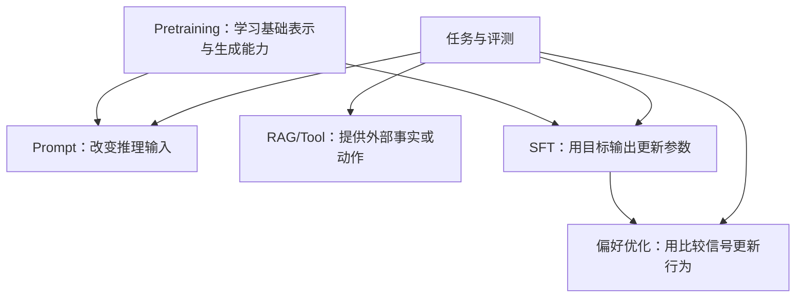

# Pretraining、SFT、偏好优化、Prompt、RAG 与 Fine-tuning

## 1. 概念、用途与工程边界

### 定义

- Pretraining：在大规模数据上训练基础模型，学习通用表示和生成能力。
- SFT（Supervised Fine-Tuning）：使用输入与目标输出样例继续训练，塑造任务行为和格式。
- 偏好优化：使用人类或模型偏好数据，让模型更倾向被选中的响应；具体算法包括 RLHF、DPO 等，不能互相等同。
- Prompt：在推理时提供任务、上下文、约束和示例，不更新模型参数。
- RAG：推理前从外部知识源检索内容并加入上下文，使回答可使用最新、私有或可引用资料。
- Fine-tuning：所有继续更新模型参数的训练方法的宽泛称呼，SFT 和偏好优化都可属于其中。

### 为什么需要区分

每种方法解决的问题、数据需求、费用、更新速度和风险不同。把所有质量问题都交给 Fine-tuning 会增加数据和运维成本，也不能自动解决最新知识、权限或引用。

### 核心选择规则

1. 任务和成功标准不清：先定义评估集，不先改模型。
2. 指令、格式或少量示例即可表达：先改 Prompt 和 Schema。
3. 规则确定且必须保证：使用代码校验或确定性逻辑。
4. 需要最新、私有、可删除和可引用知识：优先 RAG 或 Tool。
5. 需要执行外部动作或精确事实：使用 Tool，并在服务端校验权限。
6. 大量稳定样例显示特定行为、风格或任务模式无法靠前述方法达到：评估 Fine-tuning。
7. 人类偏好难以写成单一参考答案：在高质量偏好数据和可靠评测下考虑偏好优化。

### 工程使用

建立基线顺序：

```text
基础模型 + 简单 Prompt
→ 明确 Prompt + Structured Output
→ 代码规则 / Tool
→ RAG + 引用
→ 更合适的模型
→ SFT / 偏好优化
```

每一步在同一评估集上比较质量、延迟、成本和安全。Fine-tuning 前确认数据许可、隐私、划分、版本、回滚和模型生命周期。

### 常见错误与边界

- 用 Fine-tuning 注入会频繁变化的事实；更新和删除困难。
- 认为 RAG 能保证正确；检索可能漏召回、召回过时或不相关内容，生成仍可能不受证据约束。
- 用 Prompt 要求模型执行确定性权限规则。
- 把供应商“微调”统一理解为同一种算法，不看训练目标和支持能力。
- 没有独立评估集就训练，无法判断改善还是记忆训练样例。

### 延伸机制

方法可以组合，例如经过 SFT 的模型使用 RAG 和 Tool。但组合会增加故障点，应能定位问题发生在任务定义、模型、检索、上下文、工具还是验证阶段。

## 方法作用层级



这些方法作用于不同层。RAG 更新知识源不更新模型参数；SFT 可以改变输出模式，但不提供可即时删除的事实库；偏好优化依赖偏好定义，不能代替权限校验。

## 输入、产出与边界

| 方法 | 主要输入 | 主要产出 | 不直接解决 |
| --- | --- | --- | --- |
| Prompt | 指令、上下文、示例 | 单次推理行为 | 权限和确定性不变量 |
| RAG | 文档、索引、查询 | 检索上下文与引用候选 | 生成事实保证 |
| Tool | Schema、授权身份、外部系统 | 查询结果或副作用 | 模型参数学习 |
| SFT | 输入—目标输出样例 | 新模型版本/Adapter | 高频变化知识的即时更新 |
| 偏好优化 | 响应对与偏好信号 | 更符合偏好目标的版本 | 偏好数据本身的偏差 |

## 完整选择示例

客服系统需要回答最新退款政策并执行退款。政策文档进入带版本和权限的检索库；订单状态由 Tool 实时查询；退款窗口、金额和权限由服务端代码校验；Prompt 规定回答任务与失败行为。只有当大量稳定样例显示表达或分类行为仍系统性不足，且独立测试集可验证收益时，才评估 SFT。任何模型版本都不能绕过服务端退款规则。

## 验证与排错

按“任务定义 → 上下文/检索 → Tool → 模型 → Schema → 业务规则”记录失败层。每增加一种适配方法，都与前一基线在同一数据版本上比较质量、延迟、成本、隐私和回滚复杂度。

## 练习与完成标准

为“内部制度问答并提交请假”设计方案。验收：分别标出 Prompt、RAG、Tool 和代码职责；说明是否需要微调及证据；包含权限、无答案、文档过期、Tool 失败和回滚路径。

## 完整案例：制度问答的适配决策

### 输入

- 目标：仅依据公司当前制度回答员工问题，并给出文档与段落引用。
- 数据：制度每周可能更新，部分文档按部门授权。
- 基线结果：格式通过率 92%，事实支持率 71%，主要失败是漏检最新文档和引用不匹配。
- 不变量：模型不能扩大用户文档权限，不能自行批准申请。

### 逐步处理

1. 先冻结包含正常、无答案、冲突版本和无权限文档的评测集。
2. 用 Structured Output 修复字段缺失，运行时校验引用数组和状态枚举。
3. 建立按文档版本与权限过滤的 RAG；检索结果保存原文位置和发布日期。
4. 服务端代码检查用户身份与文档 ACL，模型只看到授权片段。
5. 用 Tool 查询申请状态，但批准动作由确定性工作流和授权人执行。
6. 比较基线与 RAG 版本。若稳定的语言风格或分类仍不达标，再收集 SFT 数据；不以微调存储每周变化制度。

### 输出

```text
方案：Prompt + Structured Output + RAG + 只读 Tool + 服务端授权
暂不采用：SFT、偏好优化
理由：主要失败来自知识新鲜度、引用和权限，不是稳定行为模式
发布门槛：支持率≥95%，越权召回=0，无答案准确率≥98%
```

### 验证

- 删除或更新制度后重新索引，旧段落不再被召回。
- 用同一评测集分别测检索 Recall@K、引用对齐和最终回答。
- 人为放入“忽略规则”的恶意文档，服务端权限和工具白名单不改变。
- 记录各层耗时与失败类别，确认收益不是由隐藏更强模型造成。

### 失败分支

若检索已返回正确段落但回答仍无支持结论，问题位于生成约束、上下文排序或模型能力；若正确段落根本未召回，继续修改 Prompt 不能修复检索。失败必须按层定位后再选择方法。

## 边界检查矩阵

1. 任务不清：先定义输入、输出与评测，不选择训练方法。
2. 格式不稳：优先 Structured Output 与运行时校验。
3. 确定规则：计算、权限和状态转换由代码执行。
4. 知识变化：优先可更新、可引用、可删除的 RAG 或 Tool。
5. 实时事实：通过受控 Tool 查询，不写入参数。
6. 行为模式：稳定且大量样例支持时才评估 SFT。
7. 主观偏好：明确偏好数据来源和冲突，再考虑偏好优化。
8. 数据许可：训练和检索都要检查使用、保留与删除权限。
9. 组合故障：分别测检索、生成、工具与最终状态。
10. 成本：训练费用外还包括数据、评测、部署和版本迁移。
11. 回滚：保留基线模型、索引和 Prompt 的可恢复版本。
12. 供应商：同名 Fine-tuning 能力不保证训练目标相同。

## 来源

- [Ouyang et al.：Training language models to follow instructions with human feedback](https://arxiv.org/abs/2203.02155)（访问日期：2026-07-17）
- [Lewis et al.：Retrieval-Augmented Generation](https://arxiv.org/abs/2005.11401)（访问日期：2026-07-17）
- [Rafailov et al.：Direct Preference Optimization](https://arxiv.org/abs/2305.18290)（访问日期：2026-07-17）
- [Hugging Face LLM Course](https://huggingface.co/learn/llm-course/)（访问日期：2026-07-17）
