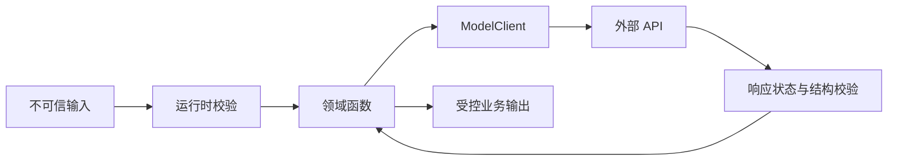

# AI 应用需要的编程基础

## 1. 概念、用途与工程边界

### 定义

AI 应用的编程基础包括值与变量、函数、集合、模块、异常和异步。模型调用本质上是带有不确定结果、网络延迟和费用的远程操作；这些语言能力用于构造请求、验证响应、组合步骤和处理失败。

### 为什么需要

- 变量保存配置、请求参数、模型响应和中间状态。
- 函数隔离模型调用、校验、重试、检索和工具执行。
- 对象/字典表达 JSON 结构；数组/列表表达消息、文档和评测样例。
- 模块隔离厂商 SDK、业务规则和基础设施，降低替换成本。
- 异常处理网络失败、认证失败、限流、超时、格式错误和业务失败。
- 异步让程序在等待网络、文件和数据库时继续处理其他工作。

### 核心特性

### 数据与函数

外部输入不可信。即使语言具有静态类型，请求体、环境变量、文件和模型结果仍需运行时验证。函数应有明确输入、输出和失败方式，避免直接读取大量全局状态。

### 模块

建议至少分为：`model-client`、`schemas`、`prompts`、`domain`、`evals` 和入口层。业务代码不要散落厂商字段名，模型 Client 负责转换统一结构。

### 异常

语法错误发生在代码无法被解析时；异常发生在代码运行期间。应用应区分可重试错误和不可重试错误。认证失败、Schema 不合法通常不应自动重试；临时网络错误可能有限重试。

### 异步

JavaScript 的异步 API 通常返回 Promise；`async` 函数也总是返回 Promise。`await` 只等待当前异步流程，不等于阻塞整个运行时。相互独立的请求可受控并发，存在依赖的步骤必须按顺序执行。

### 工程使用

```ts
type Extracted = { title: string; tags: string[] };

async function extract(text: string): Promise<Extracted> {
  if (!text.trim()) throw new Error("input is empty");

  const raw = await modelClient.generate({
    task: "extract_metadata",
    input: text,
  });

  return extractedSchema.parse(raw);
}
```

这段代码体现：输入检查、函数边界、异步模型调用、统一 Client 和运行时 Schema 校验。生产代码还要增加超时、取消、Usage、日志和错误分类。

### 常见错误与边界

- 捕获异常后返回空对象，导致调用方无法区分真实空结果与系统失败。
- 对所有失败无限重试，造成费用增加和重试风暴。
- 在模块导入时立即调用模型，导致测试、工具脚本和构建过程产生副作用。
- 对一批请求直接 `Promise.all` 而不限制并发，触发速率限制。
- 把 Prompt 字符串、Schema、业务判断和网络调用写在一个函数中，无法单独测试。

### 延伸机制

初级阶段应同时学习日志、单元测试和依赖注入。模型是外部依赖，测试时应使用固定响应或受控测试服务；评估模型质量时再调用真实模型。

## AI 调用的程序边界



静态类型只能检查编译时已知代码，不能证明网络返回、环境变量或文件内容符合类型。外部边界需要运行时校验，领域层只接收已经校验的值。

## 语言概念明细

| 概念 | 在 AI 应用中的职责 | 常见失败 |
| --- | --- | --- |
| 值与集合 | 表达消息、工具参数、评测样例 | 混淆缺失、`null` 和空值 |
| 函数 | 固定输入、输出、副作用与错误 | 读取隐式全局配置 |
| 模块 | 隔离厂商、Schema、业务与评测 | 循环依赖、导入时调用 API |
| 异常 | 传播无法按契约返回的失败 | 捕获后返回假成功 |
| Promise/异步 | 等待网络而不阻塞其他任务 | 无界并发与未处理拒绝 |

## 可运行示例

```js
async function mapLimit(items, limit, worker) {
  const results = new Array(items.length);
  let next = 0;
  async function run() {
    while (next < items.length) {
      const index = next++;
      results[index] = await worker(items[index]);
    }
  }
  await Promise.all(Array.from({ length: Math.min(limit, items.length) }, run));
  return results;
}

const result = await mapLimit([1, 2, 3], 2, async n => n * 2);
console.log(JSON.stringify(result));
```

保存为 `.mjs` 后用 Node.js 运行，输出应为 `[2,4,6]`。真实模型调用还需加入取消、超时、重试预算和错误分类。

## 验证与排错

1. 用固定 ModelClient Stub 测试业务函数，不产生真实费用。
2. 分别测试空输入、超时、拒绝、不完整和无效结构。
3. 检查每个 Promise 都被等待或显式处理。
4. 批处理记录并发上限、成功数、失败数和重试次数。

## 练习与完成标准

实现一个并发上限为 3 的批量抽取器。验收：输入和输出均运行时校验；单条失败不会伪装为空结果；支持取消；测试使用 Stub；汇总结果能区分成功、不可重试失败和已耗尽重试。

## 完整案例：批量元数据抽取

### 输入

- 100 条文本记录，每条有稳定 ID。
- ModelClient 返回 `completed`、`incomplete` 或抛出已分类错误。
- 输出契约为 `{title: string, tags: string[]}`。
- 并发上限 4，每条最多 2 次总尝试，认证与 Schema 错误不重试。

### 逐步处理

1. 入口解析文件并运行输入 Schema，空文本直接形成可解释失败。
2. 调度器最多同时启动 4 个任务，并为每条创建取消信号和总超时。
3. 领域函数调用 ModelClient，不读取供应商字段；Adapter 将供应商响应映射为统一状态。
4. 只有暂时网络错误和允许重试的限流进入第二次尝试，并使用抖动退避。
5. `completed` 响应运行输出 Schema；失败记录原 ID、类别、尝试数和请求 ID。
6. 所有记录结束后输出成功、失败和 Usage 汇总，不用空对象填补失败。

### 输出

```json
{
  "total": 100,
  "succeeded": 96,
  "failed": 4,
  "failures": {"empty_input": 1, "schema": 2, "timeout": 1},
  "attempts": 103
}
```

`attempts=103` 表示三条记录各重试一次。汇总必须能与逐条结果核对，不能只返回 96 个成功对象而丢失失败身份。

### 验证

- Stub 记录当前并发数，断言从不超过 4。
- 注入认证错误，断言只有一次调用；注入一次临时错误，断言最多两次。
- 取消批任务后，未开始记录不调用，进行中调用收到取消信号。
- 输出 Schema 失败不会进入成功数组，也不会写数据库。

### 失败分支

若使用无界 `Promise.all` 同时发出 100 个请求，可能触发限流并造成集中重试。修复位置是调度与容量控制，不是把超时调大。若 SDK 自带重试，Adapter 必须将其计入总尝试预算。

## 边界检查矩阵

1. 输入：文件、网络和环境变量始终运行时校验。
2. 输出：模型完成状态与结构分别检查。
3. 异常：保留 cause 和错误类别，不返回伪造的空成功。
4. 重试：只重试临时且幂等失败，并设总尝试数。
5. 并发：设置上限并监测队列等待。
6. 取消：从入口传播至模型、Tool 和数据库。
7. 超时：区分连接、单步和总任务。
8. 模块：Adapter 不承载领域权限规则。
9. 测试：业务测试使用 Stub，契约测试才访问服务。
10. 副作用：写操作使用幂等键并确认执行结果。
11. 日志：记录请求 ID，不记录 Key 和敏感原文。
12. 计量：成功、失败和取消均进入任务汇总。

## 来源

- [MDN JavaScript Guide](https://developer.mozilla.org/en-US/docs/Web/JavaScript/Guide)（访问日期：2026-07-17）
- [MDN：使用 Promise](https://developer.mozilla.org/en-US/docs/Learn_web_development/Extensions/Async_JS/Promises)（访问日期：2026-07-17）
- [MDN：JavaScript Modules](https://developer.mozilla.org/en-US/docs/Web/JavaScript/Guide/Modules)（访问日期：2026-07-17）
- [Python：Errors and Exceptions](https://docs.python.org/3/tutorial/errors.html)（访问日期：2026-07-17）
