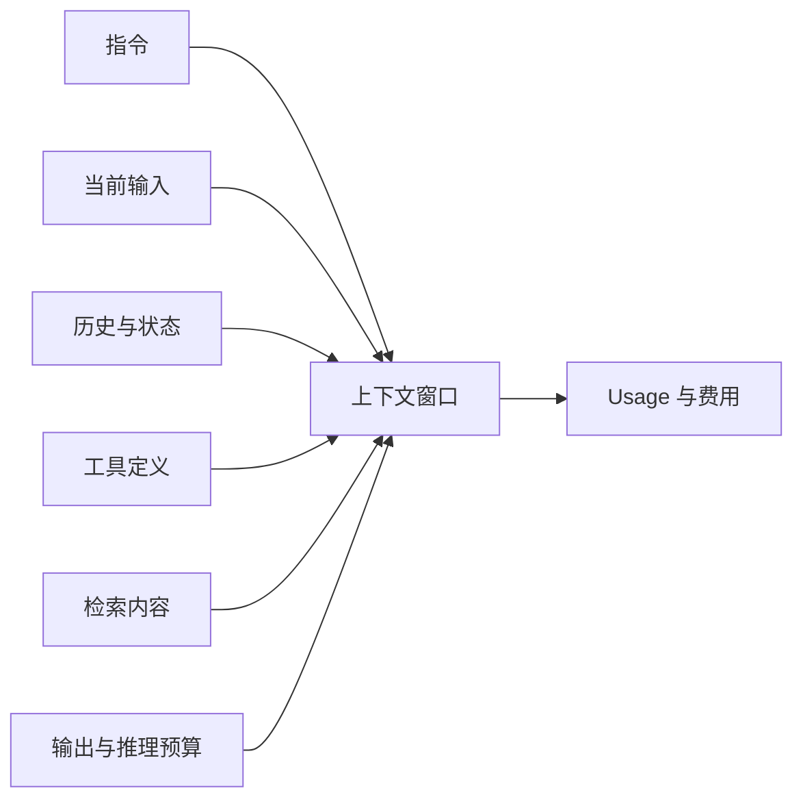

# Tokenization、Context Window 与输入输出成本

## 1. 概念、用途与工程边界

### 定义

Tokenization 把文本或其他输入转换为模型处理的离散 Token ID。Token 可能是字、子词、标点、空格片段或字节组合，不等于字符或单词。Context Window 是一次推理能处理的 Token 总范围，通常包括系统指令、消息历史、工具定义、检索内容、当前输入和已生成内容。输入输出成本是供应商根据各类 Token 或模态用量计算的费用。

### 为什么需要

Token 数影响请求能否进入上下文、推理延迟和费用。字符数相同的不同语言、空白、代码和编码可能产生不同 Token 数。上下文过长还可能降低关键信息被正确使用的概率。

### 核心特性

- Tokenizer 属于具体模型或模型族；不能用一个模型的 Token 估算器精确计算另一个模型。
- 上下文上限不是全部可用于输入，输出预算也占用容量，具体规则以 API 为准。
- 工具 Schema、图片、音频、缓存 Token 和推理 Token可能有独立统计或计费方式。
- Prompt caching 可降低重复前缀的成本或延迟，但有命中条件、保留策略和隐私边界。
- 截断策略可能直接报错，也可能删除早期内容；自动截断必须显式理解。

### 工程使用

建立 Token Budget：

```text
系统/安全规则：固定上限
工具定义：按任务选择，不全量注入
历史：保留关键事实，旧内容摘要
检索：按相关性、权限和新鲜度筛选
当前输入：完整保留或先明确拒绝过长输入
输出：为任务设置最大值
安全余量：处理估算误差和协议开销
```

在请求前使用官方 Tokenizer 或供应商计数接口估算；响应后以 API Usage 为准。日志按组成部分记录 Token，才能定位增长来源。

### 常见错误与边界

- 使用“一个 Token 约等于几个字”的经验值做硬限制。
- 每轮把全部历史、全部文档和全部工具重复发送。
- 只限制输入，不限制最大输出和 Agent 总步骤。
- 达到上限时直接从最早消息删除，丢失安全约束、用户决策或任务状态。
- 以为更长上下文必然提高质量，没有用评测集比较相关性和干扰。

### 延伸机制

上下文管理应同时考虑权限、来源可信度、冲突和时间有效性。压缩与摘要会损失信息，重要事实应以结构化状态或数据库事实保存，而不是仅依赖对话摘要。

## Context Budget 的组成



窗口计算规则、缓存计量和推理 Token 是模型与 API 特定行为。不能把某供应商或某模型的字段、比例和最大值写成跨供应商规则。

## 计量项明细

| 项目 | 请求前 | 请求后 | 边界 |
| --- | --- | --- | --- |
| 输入 Token | 用对应模型 Tokenizer/计数接口估算 | 以 Usage 为准 | 工具 Schema 和多模态也可能计入 |
| 缓存 Token | 判断前缀和供应商命中条件 | 读取 Usage 明细 | 缓存不等于应用数据持久化策略 |
| 输出 Token | 设置任务上限 | 读取可见与其他明细 | 达上限可能得到不完整结果 |
| 费用 | 按最坏情况预留 | 结合价格版本结算 | 图片、音频、工具可能另计 |

## 可计算示例

若某模型窗口为 16,000 Token，指令 800、工具 1,200、历史 4,000、检索 6,000、当前输入 1,000，并为输出预留 2,000，则总预算为 15,000，余量 1,000。若再加入 1,500 Token 文档，请求将超过窗口；应减少检索或历史，而不是静默删除安全指令。

## 验证与排错

1. 记录各上下文组成部分的估算值，而非只有总数。
2. 请求后比较估算与 Usage，超过容差时检查 Tokenizer、协议开销和模型版本。
3. 测试达到 `max_output_tokens` 时的完成状态与 `incomplete_details`。
4. Context 错误时检查自动截断设置；OpenAI Responses 的 `truncation` 默认 `disabled`，超窗会以 400 失败，`auto` 才会从会话开头丢弃输入项。

## 练习与完成标准

为一个带 4 个工具和 RAG 的任务制作 Token Budget。验收：分开统计指令、工具、历史、检索、当前输入和输出；保留安全余量；超限时有确定裁剪优先级；不删除授权规则；用实际 Usage 校准估算。

## 完整案例：RAG 问答的 Context 预算

### 输入

- 模型窗口为 32,000 Token；该数值只对指定模型版本有效。
- 指令 1,200，工具定义 2,800，当前问题估算 500。
- 历史最多 6,000，检索候选最多 12,000，输出上限 4,000，安全余量 2,000。

### 逐步处理

1. 使用对应模型的计数工具估算每个组成部分，不以字符数比例替代。
2. 固定保留安全与授权指令、当前问题和输出预算。
3. 工具只注入当前任务可能使用的集合；历史提取结构化状态后按相关性裁剪。
4. 检索候选按权限、来源、新鲜度和相关性选择，保留段落边界与引用。
5. 请求前计算 `1200+2800+500+6000+12000+4000+2000=28500`，低于 32,000。
6. 响应后读取实际 Usage，按输入、缓存、输出和供应商提供的其他明细校准估算。

### 输出

```json
{
  "window": 32000,
  "estimated_total": 28500,
  "headroom": 3500,
  "max_output_tokens": 4000,
  "truncation_policy": "reject_then_rebuild_context"
}
```

### 验证

- 分别构造 31,999、32,000 和超上限请求，观察具体 API 行为。
- 强制达到输出上限，确认应用识别 `incomplete`，不解析半截结构。
- 对估算与实际 Usage 计算误差并按模型版本监控。
- 删除历史时保留用户确认、权限和任务状态到受控结构化存储。

### 失败分支

若检索新增 8,000 Token，不能简单从开头截断整个输入。应先减少低相关候选，再压缩非关键历史，必要时拒绝并提示拆分任务。OpenAI Responses 使用 `truncation: "auto"` 会从会话开头丢弃输入项；是否启用必须是显式产品选择。

## 边界检查矩阵

1. Tokenizer 必须与目标模型或官方计数接口匹配。
2. 输入预算包含指令、历史、工具 Schema、检索和当前输入。
3. 输出上限可能同时覆盖可见输出与推理 Token，依模型接口而定。
4. 图片和音频使用独立计量规则，不能按文本字符估算。
5. 缓存命中条件和保留策略是供应商特定行为。
6. 截断前识别不可删除的安全、授权与用户决策。
7. 历史摘要保存来源和版本，避免把推断升级为事实。
8. 检索上下文先按权限过滤，再按相关性和新鲜度选择。
9. 达到输出上限时结构化 JSON 可能不完整。
10. 实际 Usage 是结算依据，估算只用于调用前控制。
11. 价格表变化需保存价格日期和币种。
12. 更长窗口是否改善质量必须通过固定评测验证。

## 输出预算与不完整状态

输出上限是资源边界，不是希望模型“尽量简短”的语气要求。达到上限时，文本可能在句中结束，JSON 可能缺少闭合符号，Tool 参数也可能不完整。应用必须先检查供应商完成状态，再解析结构；不能因为已经收到部分文本就标记成功。对于 OpenAI Responses，`max_output_tokens` 是请求字段，覆盖可见输出与推理 Token 的上限；响应为 `incomplete` 时读取 `incomplete_details` 判断原因。

减少上下文时应维护一份优先级：服务端授权事实与当前任务状态来自受控存储；安全约束和当前用户输入优先保留；旧对话可转换为带来源的结构化摘要；低相关检索片段先删除。摘要仍是派生数据，必须记录生成版本并允许回到原始授权记录核对。

成本分析需要把“每次请求平均费用”和“完成一次用户任务的费用”分开。缩短单次请求但引发更多重试、Tool 循环或人工接管，任务总成本可能上升。评测表应同时记录成功率、总调用数、输入输出 Usage、延迟和最终完成状态。

## 来源

- [Hugging Face LLM Course：Tokenizers](https://huggingface.co/learn/llm-course/en/chapter2/4)（访问日期：2026-07-17）
- [Google ML：Introduction to Large Language Models](https://developers.google.com/machine-learning/resources/intro-llms)（访问日期：2026-07-17）
- [OpenAI API：Responses Usage](https://platform.openai.com/docs/api-reference/responses)（访问日期：2026-07-17）
- [Anthropic Docs：Token Counting](https://docs.anthropic.com/en/docs/build-with-claude/token-counting)（访问日期：2026-07-17）
