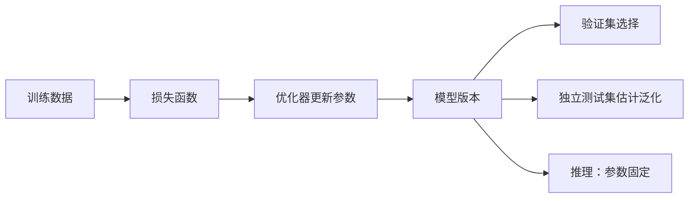

# 训练、推理、参数、损失、泛化与过拟合

## 1. 概念、用途与工程边界

### 定义

训练是使用数据和优化算法调整模型参数，使目标损失下降的过程。参数是模型从数据中学到的数值。损失函数把预测与训练目标的差异转换为可优化数值。推理是在参数固定后，给模型输入并计算输出。泛化是模型在未见过但来自目标分布的数据上仍能完成任务。过拟合是训练数据表现改善而新数据表现不再改善或变差。

### 为什么需要

AI 应用开发者通常不训练基础模型，但这些概念决定如何解释模型版本、评测结果和微调风险。训练损失低不等于产品任务成功；推理输出也不是从数据库检索的固定答案。

### 核心特性

- 参数由训练更新，Prompt 不会永久修改基础模型参数。
- 损失是训练优化信号，不一定等于业务指标。不同损失会强调不同错误。
- 推理受输入、参数、解码策略和运行实现影响，可能具有随机性。
- 泛化只能相对于目标数据分布和任务定义讨论。
- 过拟合常见信号是训练损失继续下降，验证损失开始上升。
- 数据不代表真实场景、模型复杂度过高、重复调参和数据泄漏都会破坏泛化。

### 工程使用

应用开发中应把供应商模型视为固定版本的外部依赖：

1. 使用独立评测集验证目标任务，不用公开 Benchmark 分数替代产品评测。
2. Prompt 或微调迭代只查看训练/开发集，保留最终测试集。
3. 同时记录总体指标和失败分组，例如语言、长度、权限、无答案与对抗输入。
4. 发现训练/开发分数提高而测试或线上变差时，检查过拟合和数据分布变化。
5. 基础模型更新后重新运行回归集，不假设新版本所有任务都更好。

### 常见错误与边界

- 把参数数量当作质量的充分条件；数据、架构、训练方法和任务适配同样重要。
- 用训练损失直接比较采用不同目标函数的模型。
- 把温度调低称为消除随机性；推理服务和模型仍可能存在非确定因素。
- 在同一测试集上反复改 Prompt，测试集实际上已经变成开发集。
- 认为过拟合只发生在模型训练；Prompt 也可能被过度针对少量样例优化。

### 延伸机制

欠拟合表示模型连训练数据中的规律也没有充分学到。正则化、更多代表性数据、降低复杂度和早停可缓解过拟合，但选择应由验证曲线和真实任务决定。

## 训练与验证闭环



训练损失是优化器使用的信号，产品指标是系统是否完成任务的度量。二者对象和量纲不同，不能直接互换。

## 概念与观察信号

| 概念 | 改变什么 | 如何观察 | 边界 |
| --- | --- | --- | --- |
| 参数 | 模型计算中的学习数值 | 检查点或模型版本 | Prompt 不永久修改参数 |
| 损失 | 单批训练误差的可优化标量 | 训练/验证曲线 | 不必等于业务效用 |
| 推理 | 固定参数下计算输出 | 延迟、输出、Usage | 仍受输入和解码影响 |
| 泛化 | 未见目标样例上的能力 | 独立测试与线上分组 | 必须说明目标分布 |
| 过拟合 | 开发表现提高而新数据退化 | 训练—验证差距 | Prompt 也会对样例过拟合 |

## 可计算示例

某版本训练损失从 0.8 降至 0.2，验证损失先从 0.9 降至 0.45，后升至 0.6；同时产品测试准确率从 78% 降至 73%。继续降低训练损失不是发布依据，验证曲线提示过拟合，应回到验证损失最低附近的检查点并在独立测试集确认。

## 验证与排错

1. 确认训练、验证、测试按实体或时间隔离。
2. 同时画训练与验证曲线并标注检查点。
3. 对产品指标按语言、长度、风险和时间切片。
4. 新模型退化时区分数据漂移、目标函数、Prompt、解码和服务实现变化。

## 练习与完成标准

解释一组训练/验证曲线并选择检查点。验收：准确区分参数、损失、推理与业务指标；指出欠拟合或过拟合证据；提出独立测试与至少两个切片；不使用训练损失单独宣布产品成功。

## 完整案例：分类模型的训练曲线与发布判断

### 输入

- 训练集 8,000 条、验证集 1,000 条、冻结测试集 1,000 条，按客户分组切分。
- 每个 Epoch 保存训练损失、验证损失和检查点。
- 产品门槛为测试宏平均 F1 至少 0.82，高风险类别召回率至少 0.95。

### 逐步处理

1. Epoch 1–4 的训练损失持续下降，验证损失也从 0.90 降到 0.44。
2. Epoch 5–8 训练损失继续降到 0.18，但验证损失升到 0.61，出现泛化退化信号。
3. 选择验证损失最低的 Epoch 4 检查点，而不是训练损失最低的 Epoch 8。
4. 冻结配置后只在测试集运行一次，并按高风险类别切片。
5. 推理记录模型检查点、预处理版本、解码规则和硬件/服务实现。

### 输出

```text
checkpoint=epoch-4
test_macro_f1=0.84
high_risk_recall=0.93
decision=reject
```

总体 F1 达标但高风险召回率未达 0.95，因此不能发布。训练损失、验证损失和产品门槛分别承担不同角色。

### 验证

- 确认同一客户和近重复文本没有跨集合。
- 从保存的检查点复跑推理，输出指标在预期容差内。
- 检查 Epoch 4 的选择发生在查看测试集之前。
- 在线灰度仍监测分布漂移、人工接管和高风险失败。

### 失败分支

若团队查看测试切片后回到训练阶段专门调整高风险类别，该测试集已经影响开发决策。应把它降级为开发证据，建立新的独立测试集；不能反复运行直到达到门槛。

## 边界检查矩阵

1. 训练更新参数，推理通常在参数固定时计算输出。
2. 损失函数是优化目标，不自动等于准确率、收入或安全。
3. 训练曲线与验证曲线需使用相同记录粒度。
4. 早停检查点依据预先定义的验证规则选择。
5. 测试集只用于冻结方案后的独立判断。
6. 泛化结论必须注明目标人群、时间和输入分布。
7. 分布漂移会让历史测试结果失去代表性。
8. 欠拟合表现为训练数据也无法充分拟合。
9. 过拟合可来自模型训练、Prompt 调参或检索规则。
10. 数据泄漏会制造虚假的泛化表现。
11. 随机推理用多次 Trial 与分布描述。
12. 新模型版本需重新运行回归，不假设全面提升。

## 分布、指标与因果边界

目标分布包括用户、语言、输入长度、时间、设备、政策版本和错误成本。测试集若只来自历史活跃用户，就不能直接代表新用户；离线样例若没有真实权限和工具状态，也不能估计完整系统成功率。报告应明确采样范围和排除条件，而不是只写“未见数据”。

训练与验证曲线只能显示相关信号。验证损失上升可能来自过拟合，也可能来自数据管道、标签版本或评估实现变化；排查时先固定代码和数据哈希，再比较检查点。早停、正则化和增加数据都是候选手段，不保证在所有任务改善，必须由验证与独立测试支持。

生成模型的产品评估还包含 Prompt、检索、工具、解码和服务实现。即使基础参数不变，上述任一层变化都可能改变结果。模型卡或 Benchmark 描述的是给定条件下的能力证据，不能替代当前系统在当前数据分布上的评测。

## 来源

- [Google ML Crash Course](https://developers.google.com/machine-learning/crash-course/)（访问日期：2026-07-17）
- [Google ML：Loss](https://developers.google.com/machine-learning/crash-course/linear-regression/loss)（访问日期：2026-07-17）
- [Google ML：Overfitting](https://developers.google.com/machine-learning/crash-course/overfitting/overfitting)（访问日期：2026-07-17）
- [Google ML Glossary](https://developers.google.com/machine-learning/glossary/)（访问日期：2026-07-17）
