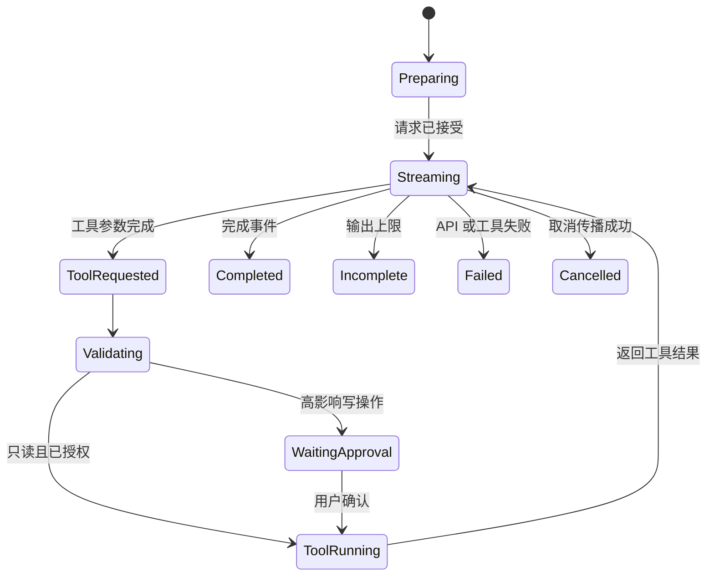

# 多轮、Streaming、Structured Output、Tool Calling 与多模态

## 是什么

- 多轮：后续请求包含或引用先前交互状态。
- Streaming：生成过程中以事件增量返回结果。
- Structured Output：按 Schema 返回机器可处理的数据。
- Tool Calling：模型选择工具并生成参数，应用验证并执行，再把结果返回模型。
- 多模态：请求或响应包含文本以外的图像、音频、视频或文件内容。

## 为什么需要

这些能力分别解决状态延续、响应等待、接口稳定、外部行动和非文本输入。它们不是同一层能力，组合后需要明确状态机和失败恢复。

## 关键特性

### 多轮

对话历史只是上下文，不是可靠数据库。长期事实、权限和任务状态应持久化为结构化数据。历史要处理 Token 预算、过期信息和删除要求。

### Streaming

事件可能包含文本、工具参数、引用、完成和错误。只有完成事件后才能确认整体状态，流中断可能缺少最终 Usage。

### Structured Output

Schema 约束结构，不保证语义正确。供应商支持的 JSON Schema 子集可能不同，仍需运行时与业务校验。

### Tool Calling

模型提出调用，不拥有执行权限。服务端检查工具名、参数、身份、资源权限、幂等和风险；写操作按影响请求用户确认。

### 多模态

输入需要记录 MIME 类型、尺寸、分辨率/采样率、顺序和数据保留策略。模型可能遗漏细节；OCR、音频转写和视觉理解都要建立独立评测。

## 实际怎么使用

组合状态机：

```text
Preparing → Streaming
Streaming → ToolRequested → Validating → WaitingApproval
WaitingApproval → ToolRunning → Streaming
任意状态 → Failed / Cancelled
Streaming → Completed / Incomplete
```

每个事件保存 `response_id`、`item_id`、序号和类型。Tool 结果与原请求关联；页面刷新后从持久化状态恢复，而不是重新执行副作用。

## 常见错误与边界

- 把多轮历史当永久记忆，未处理删除和冲突。
- 在 Tool 参数仍流式生成时提前执行。
- 结构化输出通过 Schema 后直接写生产数据。
- 多模态文件只检查扩展名，不检查实际类型、大小、恶意内容和权限。
- 对不同能力使用同一错误提示，无法判断是解析、模型、工具还是网络失败。

## 补充知识

上线前应分别测试能力，再测试组合：单独验证 Streaming、Schema、Tool 和多模态，最后覆盖中断、重复事件、部分成功和人工接管。

## 能力组合状态图



每个转换都要保存响应 ID、输出项 ID、工具调用 ID、事件序号和当前状态。刷新页面只能从已持久化状态恢复，不能重新执行已完成的写 Tool。

## 能力接口与边界

| 能力 | 输入 | 可观察输出 | 必须处理的失败 |
| --- | --- | --- | --- |
| 多轮 | 历史项目或状态引用 | 新响应与关联 ID | 历史过长、指令未继承、状态冲突 |
| Streaming | 流式配置 | 有序事件、完成状态 | 断流、重复、缺少最终 Usage |
| Structured Output | 支持子集内的 Schema | 结构化内容或拒绝 | 不完整、拒绝、业务值错误 |
| Tool Calling | 工具说明与参数 Schema | 工具调用项目 | 参数无效、无权限、重复副作用 |
| 多模态 | 媒体内容与类型 | 文本或模态输出 | 类型伪造、过大、遗漏细节 |

## 完整案例：图片发票入账建议

输入是一张经授权上传的发票图片，任务是抽取商户、日期、币种和金额，再查询项目预算，但不直接入账。应用先校验真实 MIME、大小和恶意内容；请求包含图片输入、抽取指令和结构 Schema。Streaming 期间只展示进度，不把半截 JSON 交给业务层。响应完成且运行时校验通过后，模型可提出 `lookup_budget(project_id)` 工具调用；服务端重新验证项目 ID 与当前用户权限，执行只读查询，再把结果返回模型生成建议。

预期输出包含抽取字段、预算查询来源、`recommendation` 与 `needs_human_review`。金额不清、图片无法读取或币种冲突时，返回失败状态并要求人工处理。结构正确的金额仍要与发票图和预算系统核对；模型没有入账权限。

验证覆盖正常图片、旋转模糊图片、伪造扩展名、无项目权限、工具超时、重复工具事件、输出达到上限和用户取消。验收要求无权限工具执行次数为零，写入次数始终为零，完成记录能追溯输入文件、模型、Schema、工具和 Usage。

### 失败分支

若流在工具参数完成前中断，不执行工具；若工具已经成功但后续生成中断，恢复时读取已保存工具结果，不重复查询或写入；若最终结构通过但金额超过业务阈值，进入人工审批而不是由模型放行。

## 练习与完成标准

设计“上传合同并查询审批状态”的组合流程。验收：画出至少六个状态；定义每种能力的输入输出；包含拒绝、不完整、取消、工具无权限和页面刷新恢复；Structured Output 后仍有运行时与业务校验；副作用由受控服务执行。

## 上线检查矩阵

1. 多轮状态明确由客户端重传、响应引用还是服务端 Conversation 保存，并验证指令继承规则。
2. 历史裁剪不删除当前授权事实、用户确认和未完成工具状态。
3. Streaming 解析器按事件类型和序号工作，不按网络 Chunk 拼接协议对象。
4. 文本增量只作为草稿显示，完成事件前不触发结构化业务处理。
5. Schema 使用供应商支持的关键字子集，并由独立验证器再次校验。
6. 拒绝、失败和不完整状态不伪造成满足 Schema 的业务对象。
7. 工具名来自服务端白名单，模型不能动态指定任意网络地址或命令。
8. 工具参数经过 Schema、业务规则、当前身份与资源授权四层检查。
9. 写操作使用幂等键、用户确认和可审计最终状态，重试不会重复副作用。
10. 多模态输入检查实际媒体类型、大小、页数或时长，不只检查扩展名。
11. 日志记录模型、响应 ID、工具 ID、状态和 Usage，但不保存 Secret 与未授权原文。
12. 每种能力有独立评测，组合评测再覆盖超时、取消、部分成功、刷新恢复和人工接管。

能力支持属于“模型 + API + 区域/账户配置”的联合事实。同一供应商不同模型可能不支持相同 Schema、模态或工具；统一 Client 应在请求前查询或读取受控能力注册表。若无法确认能力，不应静默降级到纯文本后继续自动化。

## 来源

- [OpenAI API：Responses](https://platform.openai.com/docs/api-reference/responses)（访问日期：2026-07-17）
- [OpenAI API：Streaming Events](https://platform.openai.com/docs/api-reference/responses-streaming)（访问日期：2026-07-17）
- [Anthropic Docs：Tool Use](https://docs.anthropic.com/en/docs/agents-and-tools/tool-use/overview)（访问日期：2026-07-17）
- [MCP Specification：Tools](https://modelcontextprotocol.io/specification/2025-11-25/server/tools)（访问日期：2026-07-17）
