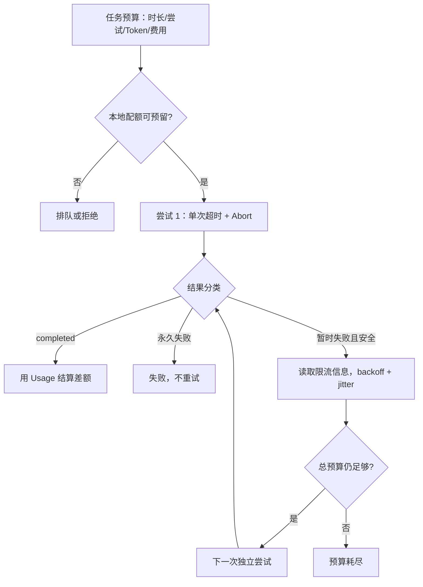

# 取消、超时、有限重试、限流与 Usage

这篇文章把可靠性控制实现为一个有总预算的闭环：请求前预留容量，单次尝试受超时约束，只重试暂时且安全的失败，遵守服务端限流信息，最终用 Responses Usage 结算并保留未知用量。

## 能力边界与前置知识

取消表示调用方不再需要结果；超时表示某个等待阶段超过应用预算；重试是创建新的尝试；限流保护供应商与自己的容量；Usage 是服务端返回的实际计量。五者相互约束，不能由 SDK、网关和业务层各自独立配置。

先读 [Streaming、取消、超时与错误展示](streaming-cancellation-timeout-errors.md) 与 [模型标识、Usage 与费用记录](request-metadata-usage.md)。本文的 OpenAI 示例只调用 Responses API。



总预算跨所有尝试递减；不能在每次重试时重新获得 60 秒和完整费用额度。

## 取消与超时

| 控制项 | 进入条件 | 传播范围 | 不能保证 |
| --- | --- | --- | --- |
| 用户取消 | 用户明确停止或上游连接关闭 | HTTP/SDK、工具、队列、可取消数据库查询 | 供应商瞬间停止、已发生副作用回滚、Usage 必然返回。 |
| 首事件超时 | 请求后指定时间无有效事件 | 当前尝试 | 服务端没有接收请求。 |
| 空闲超时 | 流开始后长时间无进展 | 当前流与相关工具 | 长任务一定失败；阈值要结合正常事件间隔。 |
| 单次尝试超时 | 一次供应商调用超过预算 | 当前 HTTP/SDK 调用 | 总任务终止；仍可能允许下一尝试。 |
| 总任务超时 | 含排队、退避、重试与工具的总时间耗尽 | 整个任务树 | 已完成的外部写操作回滚。 |

取消和超时在应用分类上不同：用户取消通常不自动重试；暂时连接超时可能有限重试。两者都应使用 `AbortSignal` 传播，并在 `finally` 清理 timer。

## 哪些失败可以重试

| 信号 | 默认判断 | 原因与例外 |
| --- | --- | --- |
| 400 无效参数/Schema | 不重试 | 同一请求不会自行变合法。 |
| 401 认证 | 不重试 | 修复密钥或配置；重复发送只增加噪声。 |
| 403 权限/区域 | 不重试 | 需要权限或部署变更。 |
| 404 资源/模型 | 不重试 | 检查资源 ID、项目和模型可用性。 |
| 409 冲突 | 按接口语义判断 | 先查询操作状态；不能统一视为暂时错误。 |
| 429 速率限制 | 可有限重试 | 遵守 reset/官方建议；“额度耗尽”类 429 不会靠短退避恢复。 |
| 5xx | 通常可有限重试 | 仅在请求可安全重放、总预算允许时。 |
| 连接重置/网络失败 | 可有限重试 | 无法确定服务端是否处理；有副作用时先查状态。 |
| `response.incomplete` | 按原因处理 | 输出上限应调整任务/预算，不是原样立即重试。 |
| 内容拒绝/业务拒绝 | 不自动重试 | 修改合法请求或交给用户，而非撞概率。 |

“模型生成”本身通常没有外部业务副作用，但 Responses 请求可调用工具、后台任务或接续写操作。可靠性判断必须覆盖整条链，而不只看 HTTP 方法。

## 退避、抖动与 Retry-After

指数退避让连续失败之间逐步增加等待；jitter 打散大量客户端同时重试。一个 full-jitter 形式为：

```text
cap = min(max_delay, base × 2^retry_index)
delay = random(0, cap)
```

`retry_index=0` 表示第一次重试，不含首次尝试。若服务端给出明确可解析的等待或限流 reset，应至少遵守服务端窗口，再与本地总截止时间比较。等待超过剩余预算时直接失败或排队，不能睡到截止时间之后再发送。

OpenAI 当前速率限制 Header 可包含：

| Header | 含义 |
| --- | --- |
| `x-ratelimit-limit-requests` | 当前窗口允许的请求上限。 |
| `x-ratelimit-remaining-requests` | 窗口内剩余请求数。 |
| `x-ratelimit-reset-requests` | 请求额度恢复所需时间。 |
| `x-ratelimit-limit-tokens` | Token 速率上限。 |
| `x-ratelimit-remaining-tokens` | Token 维度剩余额度。 |
| `x-ratelimit-reset-tokens` | Token 额度恢复时间。 |

还可能存在项目级 Token Header。字段是观测信号，不应硬编码成所有账户永恒相同的窗口；实际限制取决于模型、项目和 usage tier。失败请求也会消耗每分钟限制，所以无界立即重发会恶化拥塞。

## 请求前预留与完成后结算

只按请求数限流会让一个超长输入与一个短分类请求占相同配额。生产系统通常组合：并发、请求/分钟、预估输入 Token、允许最大输出 Token、工具调用、租户预算和费用上限。

请求前预留可使用：

```text
reserved_tokens = estimated_input_tokens + max_output_tokens
```

完成后以 `usage.total_tokens` 结算差额；若 Usage 未知，不能立即把全部预留释放为零消耗，可标记待核对或使用保守上界。预估用于准入，Usage 用于结算，两者不得覆盖同一字段。

## 可验证的有限重试实现

下面代码使用 JavaScript SDK 调用 Responses API。关闭 SDK 自动重试，由这一层统一控制总尝试数；每次尝试有独立 `AbortController`，总截止时间跨尝试共享。

```js
// reliable-response.mjs
import OpenAI from "openai";

const client = new OpenAI({ maxRetries: 0, timeout: 25_000 });
const sleep = (ms, signal) => new Promise((resolve, reject) => {
  const timer = setTimeout(resolve, ms);
  signal.addEventListener("abort", () => {
    clearTimeout(timer);
    reject(signal.reason ?? new Error("aborted"));
  }, { once: true });
});

function retryable(error) {
  return error?.status === 429 ||
    (error?.status >= 500 && error?.status <= 599) ||
    error?.name === "APIConnectionError";
}

async function createWithBudget(body, outerSignal) {
  const deadline = performance.now() + 45_000;
  const maxAttempts = 3; // 首次 + 最多两次重试

  for (let attempt = 1; attempt <= maxAttempts; attempt += 1) {
    if (outerSignal.aborted) throw outerSignal.reason;
    const remaining = deadline - performance.now();
    if (remaining <= 0) throw new Error("total_timeout");

    const controller = new AbortController();
    const forwardAbort = () => controller.abort(outerSignal.reason);
    outerSignal.addEventListener("abort", forwardAbort, { once: true });
    const timer = setTimeout(
      () => controller.abort(new Error("attempt_timeout")),
      Math.min(20_000, remaining),
    );

    try {
      return await client.responses.create(body, { signal: controller.signal });
    } catch (error) {
      const canRetry = attempt < maxAttempts && retryable(error) && !outerSignal.aborted;
      if (!canRetry) throw error;

      const capMs = Math.min(8_000, 500 * (2 ** (attempt - 1)));
      const delayMs = Math.floor(Math.random() * capMs);
      if (performance.now() + delayMs >= deadline) throw new Error("retry_budget_exhausted");
      await sleep(delayMs, outerSignal);
    } finally {
      clearTimeout(timer);
      outerSignal.removeEventListener("abort", forwardAbort);
    }
  }
  throw new Error("unreachable");
}

const outer = new AbortController();
const response = await createWithBudget({
  model: "gpt-5-mini",
  input: "用一句话解释指数退避。",
  max_output_tokens: 80,
  store: false,
}, outer.signal);

if (response.status !== "completed") throw new Error(response.status);
console.log(response.output_text); // SDK convenience
console.error(JSON.stringify(response.usage)); // REST Response 的 Usage
```

这段教学代码故意把重试控制集中在一层。生产实现还应解析官方限流等待信息、对错误类做更严格映射、记录每个 attempt，并让随机源可注入以便确定性测试。

## 完整案例：租户批量摘要突发流量

### 输入与预算

租户 A 同时提交 100 个摘要，每个预估输入 8,000 Token，最大输出 500 Token。系统限制该租户 4 个并发、每分钟预留 200,000 Token；单次 20 秒，总任务 45 秒，最多 3 次尝试。

### 逐步处理

1. 准入层计算单任务预留 `8,500` Token；超过并发或 Token 桶的任务进入有界队列。
2. Worker 取得配额后发送 attempt 1，并记录独立 ID、开始时间与剩余预算。
3. 若返回 429，读取 Header 和错误类别；额度耗尽则直接失败，速率窗口则按 reset 与 full jitter 选择等待。
4. 退避时间计入 45 秒总预算；剩余时间不足一次有意义尝试时不再调用。
5. 成功后读取 `usage.input_tokens`、缓存明细与 `output_tokens`，结算预留差额。
6. Usage 缺失时标记 unknown 并保守保留额度，等待账单/后台对账。
7. 业务结果按任务幂等键写入；重试不能创建重复摘要记录。

### 输出与验证

每个任务输出一条 attempt 列表与一个任务终态。验收指标：并发从不超过 4；任一分钟预留不超过 200,000；每任务 attempts ≤ 3；所有退避包含 jitter；成功任务有 Usage；unknown 不按零结算；队列满时明确拒绝而非无限占内存。

### 失败分支

若 attempt 1 在服务端完成但响应返回前连接断开，attempt 2 可能产生第二次模型用量。对纯摘要可用业务幂等键只保存一份结果，但不能假称只计费一次。若链中含写工具，必须先查询工具执行账本，再决定是否允许重放。

## 可靠性方案取舍

| 方案 | 适用条件 | 成本与风险 |
| --- | --- | --- |
| 立即拒绝 | 交互请求、队列已满、低优先级 | 用户需重试，但保护尾延迟和系统稳定。 |
| 有界排队 | 短暂突发、任务仍有截止时间 | 增加等待；需取消、优先级和队列长度指标。 |
| 有限重试 | 暂时错误、请求安全可重放 | 增加延迟与费用；多层叠加会放大。 |
| 降级模型/缩短上下文 | 业务允许质量下降且已评估 | 必须记录实际模型并告知质量边界，不能静默破坏 Schema/工具能力。 |
| Fallback 供应商 | 契约、数据政策和能力兼容 | 复杂度高；错误语义、Usage 与价格不可假定一致。 |

## 失败注入与排查

1. 固定返回 429 两次再成功：验证总 attempts 为 3、等待递增且有 jitter、每次失败都记录。
2. 返回“quota exhausted”类 429：验证不做短周期自动重试。
3. SDK `maxRetries=2` 且外层也重试：契约测试应检测潜在乘法调用，并强制一层为零。
4. 用户在 backoff 中取消：sleep 必须立即中止，不能等计时完成后再检查。
5. Usage 缺失：预算系统进入 unknown/待对账，不释放为零消耗。
6. Header 剩余请求充足但 Token 为零：按更紧维度限流，不能只看 requests。
7. 时钟跳变：持续时间使用单调时钟；墙上时间只作日志时间戳。

## 生产观测信号

- 按模型、项目、租户统计准入拒绝、排队时长、attempt 数与最终成功率。
- 同时看请求与 Token 剩余/重置 Header，不把供应商限制硬编码成常量。
- 区分用户取消、应用超时、供应商 429、quota、5xx、连接错误和业务拒绝。
- 记录首次尝试成功率与重试后成功率；后者上升可能掩盖供应商或网络退化。
- 统计 Usage unknown 数量和保守预留金额，避免成本看板系统性偏低。

## 练习与验收

1. 为代码注入可控随机数与假时钟。验收：精确断言三次尝试、delay 上界、总截止时间与取消行为。
2. 设计 requests + tokens + concurrency 三维限流。验收：长请求不能靠低请求数绕过 Token 预算，租户之间隔离。
3. 模拟连接断开后的写工具。验收：先查幂等账本再恢复，不出现重复副作用。
4. 关闭 SDK 重试并记录原始 attempt 数。验收：网关、SDK、业务只存在一个重试所有者。
5. 制作可靠性看板。验收：至少显示排队 P95、首次成功率、重试放大倍数、429 分类、取消传播时长和 Usage unknown。

## 来源

- [OpenAI API：Rate limits](https://developers.openai.com/api/docs/guides/rate-limits)（访问日期：2026-07-17）
- [OpenAI API：Error codes](https://developers.openai.com/api/docs/guides/error-codes)（访问日期：2026-07-17）
- [OpenAI API Reference：Create a model response](https://developers.openai.com/api/reference/resources/responses/methods/create)（访问日期：2026-07-17）
- [AWS Architecture Blog：Exponential Backoff and Jitter](https://aws.amazon.com/blogs/architecture/exponential-backoff-and-jitter/)（访问日期：2026-07-17）
- [MDN：AbortController](https://developer.mozilla.org/en-US/docs/Web/API/AbortController)（访问日期：2026-07-17）
