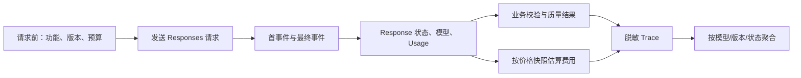

# 模型标识、输入输出、Token、延迟与费用记录

这篇文章设计一条可复现实验记录：知道哪段代码、哪个模型、哪份输入在何时产生了什么状态、质量、延迟、用量与费用，同时避免把 Secret 和完整敏感内容复制到日志。

## 学习边界与前置知识

一次 Response 的 JSON 只说明模型服务返回了什么；完整观测还需要应用在请求前后采样时间、记录配置版本、关联 HTTP 请求 ID，并按一份有日期的价格快照计算估算费用。本文不提供会迅速失效的具体单价，而是提供可验证计算方法。

前置阅读：[Tokenization、Context Window 与成本](../00-foundations/tokenization-context-cost.md) 和 [Secret、权限与费用上限](../00-foundations/secrets-permissions-cost.md)。

## 一条记录要回答哪些问题



这条链区分“请求了什么”“实际返回什么”“业务是否接受”和“估算花费多少”。只存最终文本会让回归无法归因。

## 字段组逐项展开

### 身份与时间

| 字段 | 定义与单位 | 缺失/边界 |
| --- | --- | --- |
| `trace_id` | 应用生成的整条业务链 ID | 不能使用邮箱等个人数据；一次链可含多次模型尝试。 |
| `attempt_id` | 单次供应商尝试 ID | 重试必须新建 attempt，不能覆盖第一次失败。 |
| `response_id` | Responses body 的 `id` | 标识模型 Response，不等于 HTTP 请求 ID。 |
| `request_id` | HTTP 响应 Header 的供应商请求 ID | 用于支持排障；SDK 可能以 `_request_id` 等便利属性暴露，需按版本核对。 |
| `started_at` | UTC 墙上时间，ISO 8601 | 用于跨系统排序；系统时钟调整会影响持续时间，所以不用于精确相减。 |
| `duration_ms` | 单调时钟测得总持续时间 | 从发送尝试前到完整终态/失败；单位必须写入字段名。 |
| `time_to_first_event_ms` | 从尝试开始到首个有效流事件 | 非流式请求通常记 `null`，不能伪装为总延迟。 |
| `time_to_first_text_ms` | 到首个用户可见文本 delta | 可能晚于首事件；工具优先的请求甚至没有文本。 |

### 版本与输入身份

| 字段 | 作用 | 记录规则 |
| --- | --- | --- |
| `provider`/`endpoint` | 区分供应商和 API 类别 | OpenAI 示例写 `openai` 与 `responses`，不要只写“GPT”。 |
| `sdk_name`/`sdk_version` | 标识本地便利层 | 与 API、模型版本是不同维度；从 lockfile/包元数据采集。 |
| `model_requested` | 请求 JSON 的 `model` | 保留别名或快照原值。 |
| `model_returned` | Response body 的 `model` | 与请求值同时记录；缺失时不得猜测。 |
| `prompt_version` | 受控指令模板版本 | 内容哈希可发现同名漂移；版本不应包含用户数据。 |
| `schema_version` | 结构化输出契约版本 | 非结构任务记 `null`，不要用空字符串混淆。 |
| `dataset_version` | 固定评估样例集版本 | 线上单次请求可记 `null`；实验比较必须固定。 |
| `input_hash` | 规范化输入的不可逆摘要 | 用于查重复，不允许把低熵敏感值直接哈希后当匿名。可加受控 HMAC。 |
| `input_bytes` | UTF-8 请求载荷或业务输入字节数 | 与 Token 不等价；必须说明测量范围。 |

### 状态、输出与错误

| 字段 | 合法语义 | 边界 |
| --- | --- | --- |
| `http_status` | HTTP 层状态码 | 网络未建立响应时为 `null`，不是 `0`。 |
| `response_status` | Responses 的 `completed`、`incomplete`、`failed` 等 | 只有明确收到才记录；本地 Abort 用应用状态另记。 |
| `incomplete_reason` | `incomplete_details.reason` | 仅在不完整时有值；不可把它当异常堆栈。 |
| `error_category` | 应用稳定分类 | 例如 auth、rate_limit、timeout、invalid_request、provider、validation、business。 |
| `output_hash` | 规范化最终输出摘要 | 未完成草稿与完整输出分开标识。 |
| `accepted` | 是否通过结构、业务和权限校验 | `response_status=completed` 也可能为 `false`。 |
| `quality_result` | 固定评估器的分数/标签与版本 | 需要记录评估器版本，不能只写“效果好”。 |

### Responses Usage 原始字段

OpenAI Response 的 `usage` 包含：

| 字段 | 定义 | 怎样使用 |
| --- | --- | --- |
| `input_tokens` | 本次计量的输入 Token 总量 | 结算与容量观察；不能用字符数替代。 |
| `input_tokens_details.cached_tokens` | 输入中按缓存口径计量的 Token | 费用计算按当前价格表的缓存输入档；它通常是输入 Token 的组成明细。 |
| `output_tokens` | 输出 Token 总量 | 可能包括不可见推理明细，按 API 返回定义记录。 |
| `output_tokens_details.reasoning_tokens` | 输出用量中的推理 Token 明细 | 不能与可见字数直接比较；保留原始值。 |
| `total_tokens` | 输入与输出总量 | 校验时可检查与顶层分项关系，但未来新增明细不应被丢弃。 |

Usage 是服务端计量事实，Tokenizer 预估用于请求前预算；二者字段要分开，如 `estimated_input_tokens` 与 `usage.input_tokens`。流中断且未收到最终 Usage 时记录 `usage_status: "unknown"`，绝不能写零。

## REST 字段与 SDK convenience 的区别

原始 REST Response body 包含 `id`、`model`、`status`、`output[]`、`usage` 等。JavaScript SDK 的 `response.output_text` 是汇总文本的便利属性；部分 SDK 响应对象提供 `_request_id` 读取 HTTP Header。这些便利属性不是可以期待在原始 JSON 中出现的顶层 REST 字段。

应用记录层应显式映射：

```js
function mapResponse(response) {
  return {
    response_id: response.id,
    request_id: response._request_id ?? null, // SDK convenience；按当前版本核对
    model_returned: response.model,
    response_status: response.status,
    usage: response.usage ?? null,
    output_text_hash: sha256(response.output_text), // SDK convenience；不保存明文
  };
}
```

如果 SDK 没暴露 Header，就从它的 raw response 能力或网关采集；不能拿 `response.id` 填充 `request_id`。

## 可运行的本地记录示例

以下示例假定已安装 `openai`，使用单调时钟测量持续时间，使用 SHA-256 保存输出摘要。它会实际调用 Responses API并产生费用，运行前需设置密钥和项目预算。

```js
// observe-response.mjs
import { createHash, randomUUID } from "node:crypto";
import OpenAI from "openai";

const hash = (value) => createHash("sha256").update(value).digest("hex");
const client = new OpenAI({ maxRetries: 0, timeout: 30_000 });
const traceId = randomUUID();
const startedAt = new Date().toISOString();
const started = performance.now();

try {
  const response = await client.responses.create({
    model: "gpt-5-mini",
    instructions: "只回答 yes 或 no。",
    input: "JSON 数组可以同时包含数字和字符串吗？",
    max_output_tokens: 20,
    store: false,
  });

  const record = {
    trace_id: traceId,
    started_at: startedAt,
    duration_ms: Math.round(performance.now() - started),
    provider: "openai",
    endpoint: "responses",
    model_requested: "gpt-5-mini",
    model_returned: response.model,
    response_id: response.id,
    request_id: response._request_id ?? null,
    response_status: response.status,
    usage_status: response.usage ? "reported" : "unknown",
    usage: response.usage ?? null,
    output_hash: hash(response.output_text),
    prompt_version: "yes-no-1",
  };
  console.log(JSON.stringify(record));
} catch (error) {
  console.error(JSON.stringify({
    trace_id: traceId,
    started_at: startedAt,
    duration_ms: Math.round(performance.now() - started),
    error_category: error?.status === 429 ? "rate_limit" : "request_failed",
    http_status: error?.status ?? null,
    request_id: error?.request_id ?? null,
  }));
  process.exitCode = 1;
}
```

验证输出而不暴露内容：

```bash
node observe-response.mjs > trace.jsonl
jq -e '
  .trace_id and
  (.duration_ms | type == "number" and . >= 0) and
  (.model_requested | type == "string") and
  (.usage_status == "reported") and
  (.usage.total_tokens | type == "number" and . >= 0)
' trace.jsonl
```

## 完整案例：比较 Prompt v3 与 v4

### 输入

固定数据集 `refund-cases-7` 有 20 条脱敏请求；模型固定为账户可用的同一快照或明确别名；每版本运行一次预热和三次正式重复。质量判定规则版本为 `refund-grader-2`。

### 逐步处理

1. 每个样例生成一个 `trace_id`，每次尝试生成独立 `attempt_id`。
2. 请求前记录 prompt、schema、dataset、代码 commit 与 SDK 版本。
3. 使用 `performance.now()` 测总时长；Streaming 额外测首事件、首文本。
4. 保存请求与响应模型、Response ID、请求 ID、终态和完整 Usage 明细。
5. 独立校验器产出 `accepted` 与质量标签，不能用 HTTP 200 代替。
6. 价格计算器按 `pricing_version=2026-07-17` 的受控快照，把非缓存输入、缓存输入、输出和工具费用分别相乘。
7. 聚合每版本的成功率、质量率、P50/P95 延迟、总 Token 和估算费用；不只比较平均值。

### 费用计算

若价格表单位是“每百万 Token”，文本费用的一般形式是：

```text
non_cached_input = input_tokens - cached_tokens
input_cost = non_cached_input / 1_000_000 × input_price
cached_cost = cached_tokens / 1_000_000 × cached_input_price
output_cost = output_tokens / 1_000_000 × output_price
estimated_total = input_cost + cached_cost + output_cost + tool_cost
```

所有货币计算使用十进制定点或最小货币单位，保存币种和价格快照。不能把示例公式中的分类扩展成所有模型永恒计费规则；图像、音频、长上下文、优先处理和工具可能有额外口径。

### 输出与验证

结果表至少含 `prompt_version`、样本数、完成率、业务接受率、P50/P95、总输入/缓存/输出 Token、Usage 缺失数、估算费用。验收：同一 `attempt_id` 不重复计费；总 Token 可追溯到原始记录；价格版本固定；敏感正文不可由普通看板读取。

### 失败分支

若流中断导致 Usage 缺失，该尝试保留在失败率和延迟统计中，费用标记 `unknown`，不以零拉低均值。若模型返回完成但业务校验失败，它计入供应商成功、业务失败和实际 Usage 三个维度。

## 聚合指标与误读

| 指标 | 正确定义 | 常见误读 |
| --- | --- | --- |
| 完成率 | `completed / 所有已开始尝试` | 排除超时和取消后得出虚高值。 |
| 业务接受率 | `accepted / 有资格评估的任务` | 把 Schema 通过当内容正确。 |
| P95 总延迟 | 同一窗口内总时长的 95 分位 | 用平均值掩盖尾延迟；混合流式/非流式。 |
| TTFT/TTFE | 首文本/首事件延迟 | 两者混用；工具请求可能没有首文本。 |
| 缓存率 | `cached_tokens / input_tokens` | 跨不同模型、功能或时间窗口直接比较。 |
| 单成功任务成本 | 总估算费用 / 业务成功任务数 | 忽略 Usage unknown 和人工/工具成本。 |

聚合必须带时间窗口、功能、模型、02-prompt/schema 版本和状态过滤。租户/用户维度使用受控伪标识，并限制小样本查询，避免重新识别。

## 数据最小化与保留

- Secret、Authorization Header、Cookie 和工具凭据永不进入 Trace。
- 默认记录结构、长度、类别、哈希和版本；需要正文调试时进入权限更严、保留更短的受控存储。
- 对邮箱、订单号等低熵标识使用带密钥 HMAC 或令牌化，普通 SHA-256 可能被字典反推。
- 建立访问审计、保留期、删除流程与租户隔离；从原文生成的摘要同样可能含个人信息。
- 日志导出与错误追踪平台也是数据副本，删除范围要覆盖它们。

## 排查清单

1. Token 总数异常：比较请求体、历史上下文、工具定义、缓存明细与是否发生重试。
2. 费用对不上：检查价格日期、单位、缓存与输出分类、工具费用、长上下文规则和 Usage 缺失。
3. 延迟为负：是否用墙上时钟相减；改用单调时钟，墙上时间只用于排序。
4. 请求无法向供应商排障：是否只存 Response ID；补采 HTTP 请求 ID。
5. 看板质量提高但线上投诉增加：检查数据集版本、失败是否被过滤、不同租户/语言是否被平均掩盖。
6. 同一请求被计费多次：按 attempt 观察 SDK、网关和业务层是否叠加重试。

## 练习与验收

1. 为 10 条固定样例生成 JSONL Trace。验收：每行可被 `jq` 解析，ID/版本/状态/Usage/延迟齐全，无密钥和明文输入。
2. 人工注入一次流中断。验收：`usage_status=unknown`，费用为未知，仍计入失败率。
3. 写价格快照计算器。验收：用手算 fixture 验证缓存与非缓存拆分，金额不使用二进制浮点直接结算。
4. 生成按 prompt 版本的 P50/P95 与业务接受率。验收：能下钻到脱敏 attempt，重复 attempt 不被覆盖。
5. 执行一条删除请求。验收：主日志、调试正文、导出与派生索引均有明确删除或不可逆匿名化结果。

## 来源

- [OpenAI API Reference：Create a model response](https://developers.openai.com/api/reference/resources/responses/methods/create)（访问日期：2026-07-17）
- [OpenAI API：Production best practices](https://developers.openai.com/api/docs/guides/production-best-practices)（访问日期：2026-07-17）
- [OpenAI API：Pricing](https://developers.openai.com/api/docs/pricing)（访问日期：2026-07-17）
- [OpenTelemetry：Generative AI semantic conventions](https://opentelemetry.io/docs/specs/semconv/gen-ai/)（访问日期：2026-07-17）
