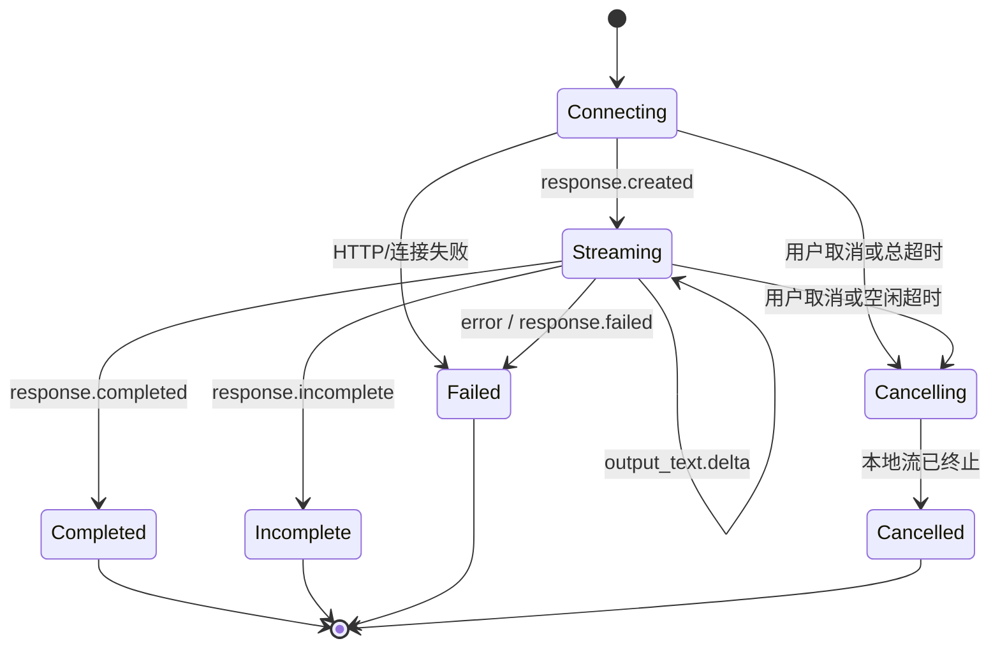

# Streaming、取消、超时与错误展示

这篇文章把一次流式模型请求实现为可验证状态机：按 Responses API 事件增量更新草稿，传播取消与超时，并把 HTTP、流事件和模型终态映射成不同的用户恢复路径。

## 学习边界与前置知识

Streaming 只缩短首个可见内容的等待，不缩短模型完成所需计算，也不保证费用更低。本文讨论 OpenAI Responses API 的 HTTP 流；Realtime API 是另一套协议，不用于示例。

需要理解 `AbortController`、异步迭代器和事件类型。结构化输出不能对半截 JSON 直接解析，参见 [Structured Output、Schema 与运行时校验](structured-output-validation.md)。

## 为什么不能只拼字符串

流中既有只出现一次的生命周期事件，也有多次出现的增量事件。OpenAI 文本流常见事件包括 `response.created`、`response.output_text.delta`、`response.completed` 和 `error`。工具、拒绝、引用和其他内容还会产生各自事件。



网络 EOF 不是 `Completed`。只有收到明确终态并通过最终检查，应用才能把草稿标为完整。

## 状态逐项解释

| 应用状态 | 进入条件 | 可观察输出 | 退出与恢复 |
| --- | --- | --- | --- |
| `connecting` | 请求已发出、尚无服务端事件 | 骨架屏、开始时间 | 首事件、连接错误、用户取消、连接/首事件超时。 |
| `streaming` | 收到创建或内容事件 | 不完整草稿、最后事件时间 | 完成、不完整、错误、取消、空闲/总超时。 |
| `cancelling` | 已触发 Abort | 停止按钮禁用，显示“正在停止” | 本地迭代结束后进入 `cancelled`；不承诺远端立即停计费。 |
| `completed` | 收到完成事件且最终响应有效 | 可保存完整结果与 Usage | 终态；后续重试是新请求。 |
| `incomplete` | API 明确报告未完整生成 | 可选保留只读草稿和原因 | 用户缩小任务或显式继续，不自动当成功。 |
| `failed` | HTTP、协议、服务端或处理器失败 | 错误类别、可重试性、请求 ID | 仅符合策略时有限重试。 |
| `cancelled` | 应用确认本地工作停止 | 标记草稿未完成 | 用户可重新提交；写操作不能盲目重放。 |

草稿、结构化结果和副作用采用不同保存策略：文本草稿可标记未完成；JSON 只有完整并校验后入库；写工具必须有确认、幂等键和执行账本。

## 四类超时

| 超时 | 计时起点与重置 | 解决的问题 | 边界 |
| --- | --- | --- | --- |
| 连接/首事件超时 | 发请求起，不重置 | DNS、TLS、代理或排队迟迟无响应 | 不能用来限制完整长输出。 |
| 流空闲超时 | 每个有效事件后重置 | 已开始后长时间没有进展 | 心跳是否算进展须由协议定义；不要用任意网络字节重置业务计时。 |
| 单工具超时 | 每次工具执行开始 | 外部依赖卡住 | 工具取消与模型流取消要分别传播。 |
| 总任务超时 | 整个用户任务开始，不重置 | 给资源占用设置硬上限 | 包含重试与退避，不能每次尝试重新获得全额预算。 |

JavaScript `setTimeout` 的时间单位是毫秒。超时表示应用不再愿意等待，不证明服务端从未处理请求。

## 可运行的 SDK 流式示例

安装 `openai` 后运行以下 ES module。代码只使用 Responses API；`event.delta` 是对应增量事件的 SDK 字段，最终 `event.response` 是完成事件携带的 Response 对象。

```js
// stream-example.mjs
import OpenAI from "openai";

const client = new OpenAI({ maxRetries: 0, timeout: 35_000 });
const controller = new AbortController();
let state = "connecting";
let draft = "";
let finalResponse = null;
let lastEventAt = performance.now();

const totalTimer = setTimeout(() => {
  state = "cancelling";
  controller.abort(new Error("total_timeout"));
}, 30_000);

try {
  const stream = await client.responses.create({
    model: "gpt-5-mini",
    input: "用三点说明 JSON Schema 的 required 与 nullable 的区别。",
    stream: true,
    store: false,
  }, { signal: controller.signal });

  for await (const event of stream) {
    lastEventAt = performance.now();
    switch (event.type) {
      case "response.created":
        state = "streaming";
        break;
      case "response.output_text.delta":
        state = "streaming";
        draft += event.delta;
        process.stdout.write(event.delta);
        break;
      case "response.completed":
        finalResponse = event.response;
        state = "completed";
        break;
      case "response.incomplete":
        finalResponse = event.response;
        state = "incomplete";
        break;
      case "response.failed":
        finalResponse = event.response;
        state = "failed";
        break;
      case "error":
        state = "failed";
        throw new Error(event.message ?? "stream_error");
      default:
        break; // 未消费事件仍应计入可观测日志，不应误拼进文本
    }
  }

  if (state !== "completed" || finalResponse?.status !== "completed") {
    throw new Error(`terminal_state=${state}`);
  }
} catch (error) {
  if (controller.signal.aborted) state = "cancelled";
  else state = "failed";
  console.error("\n", { state, message: String(error) });
} finally {
  clearTimeout(totalTimer);
  console.error("\n", {
    state,
    draftLength: draft.length,
    lastEventAgeMs: Math.round(performance.now() - lastEventAt),
    responseId: finalResponse?.id ?? null,
    usage: finalResponse?.usage ?? null,
  });
}
```

原始 REST 请求字段是 `stream: true`；事件的 `type` 与数据属于流协议。SDK 提供异步迭代、类型对象和错误类。不要把 SDK 的收集辅助方法误写成 REST 响应字段。

## 完整案例：用户中途停止长回答

### 输入

用户要求生成 20 条检查项；应用总超时 30 秒、首事件超时 8 秒、空闲超时 10 秒。收到第 6 条时用户按“停止”。

### 逐步处理

1. UI 创建本地任务 ID，状态为 `connecting`，后端创建 `AbortController`。
2. 收到 `response.created` 后保存 Response ID，状态转 `streaming`。
3. 每个 `response.output_text.delta` 按到达顺序追加草稿，同时更新最后进展时间。
4. 用户按停止，UI 防抖后只发送一次取消意图；后端触发同一个 signal。
5. 异步迭代抛出取消相关异常或结束；应用进入 `cancelled`，草稿标记“未完成”。
6. 不将草稿作为 20 条完整结果写入业务表；若用户重试，创建新任务并显示会产生新的用量。

### 输出与验证

界面应保留前 6 条只读草稿，显示“已停止，内容可能不完整”，提供“重新生成”而非自动重试。日志至少包含任务 ID、已知 Response ID、取消发起时间、取消完成时间、最后事件时间、已接收字符数以及最终可得 Usage。

验收：停止后 UI 不再追加；本地请求已 Abort；数据库没有完整结果；重复点击停止不会创建多个取消任务；日志不声称远端已零计费。

### 失败分支

若取消与 `response.completed` 几乎同时到达，以持久化的首次合法终态为准，并保证状态转换 compare-and-set。若已经执行写工具，取消不能回滚外部现实；查询幂等账本并向用户展示“回答已停止，但操作已完成/状态未知”。

## 错误分类与用户展示

| 类别 | 内部信号 | 用户信息 | 自动重试 |
| --- | --- | --- | --- |
| 认证/权限 | 401/403 | 服务暂不可用，请联系管理员 | 否；修配置或权限。 |
| 速率限制 | 429 与限流信息 | 请求较多，请稍后再试 | 可有限退避；额度耗尽不能靠重试。 |
| 无效请求 | 400、Schema/字段错误 | 请求配置有误 | 否；开发者修复。 |
| 连接失败 | DNS/TLS/连接重置 | 网络连接失败，可重试 | 仅幂等且预算允许。 |
| 首事件/空闲/总超时 | 对应计时器触发 | 等待超时，草稿是否保留要说明 | 显式或有限；写操作先查状态。 |
| 响应不完整 | `response.incomplete` | 内容未生成完整 | 依据原因调整，不直接拼接重试结果。 |
| 内容拒绝 | 输出内容项的 refusal/安全状态 | 无法完成该请求 | 通常否；可修改合法请求。 |
| 协议处理错误 | 未知事件、序号/JSON 错误 | 响应处理失败 | 先修客户端；保留脱敏事件轨迹。 |

用户信息说明发生了什么、草稿是否保留、能否重试以及写操作状态。内部日志才保存错误类、堆栈和请求 ID；两者都不能泄露 API Key。

## 原始 SSE 的边界

HTTP Streaming 常用 Server-Sent Events 表达，但网络分块不等于事件边界：一个事件可能跨多个 TCP chunk，多个事件也可能同批到达。若不使用 SDK，必须按 SSE 规范处理字段、空行分隔与 UTF-8 增量解码，不能对每个 `ReadableStream` chunk 直接 `JSON.parse`。

代理可能缓冲响应或设置更短空闲超时。部署验证应跨本地、反向代理和生产入口，观察首事件时间、事件间隔、是否压缩/缓冲、移动网络断开以及客户端断开后后端是否收到信号。

## 排查路径

1. 没有任何事件：检查 DNS/TLS、认证、代理缓冲、首事件超时和服务端请求 ID。
2. 有增量但永不完成：检查是否消费终态、空闲计时器、未知事件处理和模型输出上限。
3. 文本重复：检查客户端是否对同一事件重复应用、重连是否从头开始、UI 是否同时渲染快照与 delta。
4. 停止按钮无效：沿 UI → 后端 → SDK/HTTP → 工具逐层检查同一取消信号是否传播。
5. Usage 缺失：确认是否收到最终完成事件；流中断时标记 `usage_unknown`，不要以零代替。
6. 半截 JSON 报错：把解析推迟到完整终态，再运行 Schema 验证。

## 失败注入与验证

- 首事件延迟 9 秒，验证 8 秒计时器触发 `cancelled/timeout`。
- 每 9 秒发送事件，验证 10 秒空闲超时不会误杀；停 11 秒则触发。
- 在多个 delta 后直接断流，验证状态不是 `completed`，草稿带未完成标签。
- 重放同一 delta fixture，验证事件去重策略不会重复副作用；纯文本是否去重须依协议身份设计。
- 让取消与完成并发，验证数据库只接受一个终态。
- 注入工具已成功但模型流失败，验证 UI 展示部分成功，而不是再次执行工具。

## 练习与验收

1. 实现六状态 reducer。验收：非法转换抛错，EOF 不能把 `streaming` 变为 `completed`。
2. 加入首事件、空闲和总超时。验收：三者使用不同错误码，所有 timer 在终态清理。
3. 模拟 401、429、断流、不完整与拒绝。验收：用户文案和自动重试策略各不相同。
4. 用生产同款代理运行流。验收：记录 TTFE、事件间隔、总时长和取消传播，控制台无未处理 Promise rejection。
5. 对结构化流生成半截 fixture。验收：应用只展示未完成预览，不调用业务写入。

## 来源

- [OpenAI API：Streaming API responses](https://developers.openai.com/api/docs/guides/streaming-responses)（访问日期：2026-07-17）
- [OpenAI API Reference：Responses streaming events](https://platform.openai.com/docs/api-reference/responses-streaming)（访问日期：2026-07-17）
- [OpenAI API：Error codes](https://developers.openai.com/api/docs/guides/error-codes)（访问日期：2026-07-17）
- [MDN：AbortController](https://developer.mozilla.org/en-US/docs/Web/API/AbortController)（访问日期：2026-07-17）
- [WHATWG HTML：Server-sent events](https://html.spec.whatwg.org/multipage/server-sent-events.html)（访问日期：2026-07-17）
