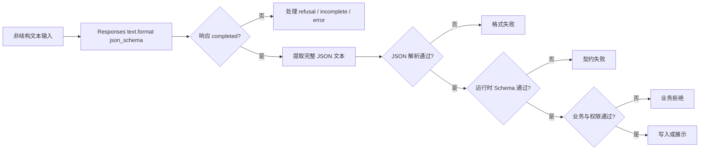

# Structured Output、Schema 与运行时校验

这篇文章把“让模型返回 JSON”拆成四道独立关卡：Responses API 的结构约束、JSON 解析、运行时 Schema 校验、业务与权限校验。只有四道都通过，数据才可进入业务系统。

## 学习边界与前置知识

先掌握 JSON 对象、数组、字符串、数字、布尔值与 `null`。本文只用 OpenAI Responses API 的 `text.format`，不使用旧接口的 `response_format`；Schema 示例采用 JSON Schema 2020-12 的通用写法，但发送给模型的 Schema 必须再满足 OpenAI 当前支持的子集。

Structured Outputs 约束输出形状，不保证事实、计算、权限或业务正确。TypeScript 类型只在编译期存在；网络数据仍需运行时验证。



每个菱形都保留独立错误类别；把它们统一成“模型出错”会失去可恢复性。

## JSON Schema 关键字逐项展开

以下 Schema 描述工单提取结果：

```json
{
  "$schema": "https://json-schema.org/draft/2020-12/schema",
  "type": "object",
  "properties": {
    "title": { "type": "string", "minLength": 1, "maxLength": 80 },
    "priority": { "type": "string", "enum": ["low", "medium", "high"] },
    "order_id": { "type": ["string", "null"], "pattern": "^O-[0-9]{3,10}$" },
    "evidence": {
      "type": "array",
      "items": { "type": "string", "minLength": 1 },
      "minItems": 1,
      "maxItems": 5
    }
  },
  "required": ["title", "priority", "order_id", "evidence"],
  "additionalProperties": false
}
```

| 关键字 | 精确作用 | 边界与常见误读 |
| --- | --- | --- |
| `$schema` | 声明解释 Schema 的方言 | 它帮助通用验证器选择语义；API 支持子集仍以供应商文档为准。 |
| `type: object` | 实例必须是对象 | 数组、字符串与 `null` 都不通过；不能用 TypeScript 断言替代。 |
| `properties` | 为命名属性定义子 Schema | 只声明属性不代表必填，必填由 `required` 决定。 |
| `required` | 列出必须出现的属性名 | 值允许 `null` 与否由该属性的 `type` 决定；“缺失”和“值为 null”不同。 |
| `additionalProperties: false` | 拒绝未声明字段 | 可防拼写漂移；Schema 演进时新增字段会使旧消费者失败。 |
| `enum` | 值必须等于列出的候选之一 | 大小写敏感；新增枚举值可能破坏穷举分支。 |
| `type: [string, null]` | 显式允许字符串或 `null` | 仍可被 `required` 要求出现；适合“已知没有”，不代表“未处理”。 |
| `minLength`/`maxLength` | 约束字符串长度 | JSON Schema 长度按 Unicode 字符计，不应拿 JavaScript UTF-16 `length` 想当然。 |
| `pattern` | 字符串需匹配正则 | 默认不是自动加首尾锚点；示例显式使用 `^` 与 `$`。 |
| `items` | 每个数组元素必须符合的 Schema | 不限制数组数量；数量由 `minItems`/`maxItems` 控制。 |
| `description` | 给人和模型的注解 | 不产生新的确定性业务约束；“必须真实”写在描述里仍需代码验证。 |
| `format` | 语义格式注解，如日期或邮箱 | 具体验证器是否断言取决于实现/配置，不能当跨实现必然失败。 |

OpenAI Structured Outputs 支持大量 JSON Schema 能力，但不是整个规范。发送前检查当前支持列表；不要把通用验证器能接受的关键字直接等同为模型 API 能接受。

## 原始 REST 与 SDK 便利层

### 原始 Responses REST 字段

结构化输出配置位于请求的 `text.format`：

```json
{
  "model": "gpt-5-mini",
  "input": "客户说：订单 O-104 一直未发货，请尽快处理。",
  "text": {
    "format": {
      "type": "json_schema",
      "name": "support_ticket",
      "description": "从客户消息提取待分流的工单字段",
      "strict": true,
      "schema": {
        "type": "object",
        "properties": {
          "title": { "type": "string" },
          "priority": { "type": "string", "enum": ["low", "medium", "high"] },
          "order_id": { "type": ["string", "null"] },
          "evidence": { "type": "array", "items": { "type": "string" } }
        },
        "required": ["title", "priority", "order_id", "evidence"],
        "additionalProperties": false
      }
    }
  },
  "store": false
}
```

`type` 选择 JSON Schema 格式；`name` 给格式稳定命名；`description` 解释用途但不是验证规则；`schema` 是实际结构；`strict: true` 要求模型遵循支持的 Schema。原始响应仍是 `output[]`，应用要检查终态并从消息内容项中取得完整文本。

### JavaScript SDK 便利属性

官方 SDK 可用 `responses.parse()` 与 `zodTextFormat()` 从 Zod 定义生成格式，并在成功时提供 `response.output_parsed`。这些不是 REST body 字段。

```js
import OpenAI from "openai";
import { zodTextFormat } from "openai/helpers/zod";
import { z } from "zod";

const Ticket = z.object({
  title: z.string().min(1).max(80),
  priority: z.enum(["low", "medium", "high"]),
  order_id: z.string().regex(/^O-[0-9]{3,10}$/).nullable(),
  evidence: z.array(z.string().min(1)).min(1).max(5),
});

const client = new OpenAI({ maxRetries: 0 });
const response = await client.responses.parse({
  model: "gpt-5-mini",
  input: "客户说：订单 O-104 一直未发货，请尽快处理。",
  text: { format: zodTextFormat(Ticket, "support_ticket") },
  store: false,
});

if (response.status !== "completed") throw new Error(response.status);
const ticket = response.output_parsed; // SDK convenience property
const checked = Ticket.parse(ticket);  // 应用自己的运行时校验
console.log(JSON.stringify(checked));
```

`output_parsed` 方便读取，但跨 SDK 的稳定契约仍应是你的领域类型。独立执行 `Ticket.parse` 可以保护缓存、fixture、消息队列或非模型来源的数据。

## 完整案例：工单提取到安全入队

### 输入

```text
客户消息：订单 O-104 一直未发货，请尽快处理。
受控订单表：O-104 存在，属于租户 tenant-a，状态 paid。
当前会话：tenant-a 的普通客服账号。
```

### 逐步处理

1. 应用保存原始消息哈希和 Schema 版本 `ticket-3`，不把 Secret 写入 Prompt。
2. Responses API 用 `text.format` 约束四个字段，等待完整终态。
3. 若 `status !== completed`，根据 `error`、`incomplete_details` 或拒绝内容进入失败状态。
4. 从完整输出取得 JSON；不对流式半截调用 `JSON.parse`。
5. Zod 校验字段类型、枚举、正则与数组数量。
6. 领域校验查询订单：`order_id` 必须存在且属于当前租户。
7. 业务规则根据数据库状态计算允许的队列；模型给出的 `priority` 只是分流建议。
8. 只有通过权限和业务规则后，才在事务内创建工单并记录幂等键。

### 输出与验证

一种合格结构可能是：

```json
{
  "title": "订单 O-104 未发货",
  "priority": "medium",
  "order_id": "O-104",
  "evidence": ["订单 O-104 一直未发货"]
}
```

这只是可接受示例，不保证模型每次同文。验证包括：Schema 通过；证据是输入的原文片段；订单查询返回 `tenant-a`；创建结果的 `schema_version` 为 `ticket-3`；重复提交同一幂等键不会产生第二张工单。

### 失败分支

- 返回 `priority: "urgent"`：枚举校验失败，记录 `schema_validation`，不静默改成 `high`。
- `order_id: "O-999"` 但数据库不存在：结构通过、业务校验失败，转人工澄清。
- 输出达到 Token 上限：响应 `incomplete`，不解析半截 JSON；缩短输入或调整预算后有限重试。
- 模型拒绝处理：拒绝不是工单对象；展示可理解提示并保留原消息，不能用空对象顶替。
- 订单属于其他租户：立即按权限错误拒绝并审计；不能让 Prompt 决定跨租户访问。

## Schema 演进

| 变更 | 对旧消费者的影响 | 安全做法 |
| --- | --- | --- |
| 新增可选字段 | 在 `additionalProperties: false` 的旧 Schema 中仍会失败 | 新版本 Schema 与消费者同步发布。 |
| 新增必填字段 | 旧数据没有该字段 | 升级版本、迁移历史数据或提供显式默认。 |
| 新增枚举值 | 旧代码的穷举分支可能报错 | 先升级消费者处理 unknown，再生产新值。 |
| 收紧长度/正则 | 历史合法数据可能变非法 | 对真实数据 dry-run，记录拒绝率。 |
| 改字段含义 | 即使类型不变也属语义破坏 | 使用新字段名或主版本，不复用旧名。 |

Schema、Prompt、模型、SDK、验证器和评估集都要有版本。只记录 Schema 文本而不记录验证器配置，会漏掉 `format` 等实现差异。

## 常见错误与排查

### 只在 Prompt 里写“返回 JSON”

这不等于 Structured Outputs。使用 Responses 的 `text.format`；再做运行时与业务校验。

### 把 `as Ticket` 当校验

TypeScript 类型断言不检查网络值。用 Zod、Ajv 或等价运行时验证器解析 `unknown`，失败时保留字段路径与错误类别。

### Schema 被 API 拒绝

先用通用 Schema 验证器检查语法，再对照 OpenAI 支持子集。逐步删减组合关键字定位最小失败项，不要切到不受约束的 JSON 后继续生产写入。

### 结构正确、内容错误

为事实字段绑定证据与受控查询。例如 `order_id` 查数据库，日期按业务时区解析，金额使用最小货币单位，引用文本必须能定位输入。

### 过度复杂 Schema

大量深层联合、条件分支和可选字段会增加维护和评估成本。拆成阶段：先分类，再按类别调用更小的提取 Schema；但每阶段都要记录输入输出和失败。

## 验证命令

把 Schema 保存为 `ticket.schema.json`、示例保存为 `ticket.valid.json` 后，可用 Ajv CLI 验证：

```bash
npx --yes ajv-cli@5 validate \
  --spec=draft2020 \
  -s ticket.schema.json \
  -d ticket.valid.json
```

再准备 `ticket.invalid.json`，将 `priority` 改为 `urgent`。验收是命令返回非零并定位 `/priority`，而不是两个样例都通过。

## 练习与验收

1. 为会议提取设计 Schema。验收：明确必填与 nullable、关闭额外属性、限制参与者数组，并解释每个约束。
2. 用 Responses 原始 REST 调用一次，再用 SDK `responses.parse` 调用一次。验收：标出 `text.format` 是 REST 字段，`output_parsed` 是 SDK 便利属性。
3. 建立 12 个 fixture：合法、缺字段、额外字段、错误枚举、错误类型、空数组、超长文本、`null`、拒绝、不完整、越权 ID、证据不匹配。验收：每个进入预期错误类别。
4. 将 Schema 从 v1 升到 v2。验收：列出兼容性影响，旧数据验证结果可复现，消费者不会因新枚举静默走默认分支。

## 来源

- [OpenAI API：Structured model outputs](https://developers.openai.com/api/docs/guides/structured-outputs)（访问日期：2026-07-17）
- [OpenAI API Reference：Create a model response](https://developers.openai.com/api/reference/resources/responses/methods/create)（访问日期：2026-07-17）
- [JSON Schema Core 2020-12](https://json-schema.org/draft/2020-12/json-schema-core)（访问日期：2026-07-17）
- [JSON Schema Validation 2020-12](https://json-schema.org/draft/2020-12/json-schema-validation)（访问日期：2026-07-17）
