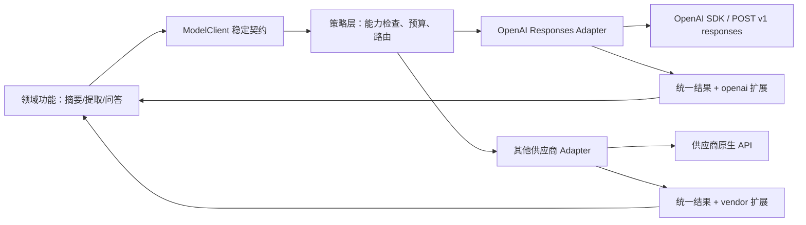

# 统一模型 Client 与厂商隔离

这篇文章从一个真实业务契约出发设计统一模型 Client：领域层只依赖稳定语义，OpenAI Adapter 只使用 Responses API 并保留原始状态、Usage、事件和供应商扩展，能力差异通过显式声明暴露。

## 能力边界与前置知识

统一 Client 不是把所有供应商字段做并集，也不是保证“随时一键切换”。它是应用内部的反腐层：把业务需要的生成语义、事件、错误与观测契约和厂商 SDK 对象分开。

本文假设已理解 [SDK 与原始 HTTP](sdk-vs-http.md)、[Structured Output](structured-output-validation.md) 和 [Streaming 状态](streaming-cancellation-timeout-errors.md)。示例用 TypeScript 接口表达，OpenAI Adapter 的实际调用只走 `client.responses.create()`。

## 责任边界



领域层不读取 `response.output_text`、厂商错误类或事件名；Adapter 读取这些原生对象并映射。权限、订单状态和业务不变量不属于 Adapter，仍由领域服务执行。

## 先定义最小业务类型

```ts
export type Role = "system" | "developer" | "user" | "assistant";

export interface TextMessage {
  role: Role;
  text: string;
}

export interface GenerateRequest {
  model: string;
  messages: TextMessage[];
  maxOutputTokens: number;
  responseSchema?: {
    name: string;
    schema: Record<string, unknown>;
  };
  signal?: AbortSignal;
  traceId: string;
}

export type FinishReason =
  | "completed"
  | "max_output_tokens"
  | "content_filter"
  | "cancelled"
  | "failed"
  | "unknown";

export interface Usage {
  inputTokens: number;
  cachedInputTokens: number;
  outputTokens: number;
  reasoningTokens: number;
  totalTokens: number;
}

export interface GenerateResult {
  text: string;
  modelRequested: string;
  modelReturned: string;
  provider: "openai" | "anthropic";
  responseId: string;
  requestId: string | null;
  finishReason: FinishReason;
  usage: Usage | null;
  providerExtensions: Readonly<Record<string, unknown>>;
}
```

### 字段逐项解释

| 字段 | 不变量 | 缺失与边界 |
| --- | --- | --- |
| `model` | 来自受控模型注册表，不接受任意用户字符串 | 业务别名与供应商模型 ID 分层；路由后仍记录实际值。 |
| `messages` | 有序且保留角色 | 只覆盖文本消息；多模态应新增显式联合类型，不塞进字符串。 |
| `maxOutputTokens` | 正整数并受功能预算上限约束 | 不是保证生成到该长度；达到上限映射为非完成原因。 |
| `responseSchema` | 可选且版本化 | Adapter 必须先检查模型/供应商支持；Schema 通过不代表业务正确。 |
| `signal` | 由调用方拥有，贯穿当前请求 | Adapter 监听但不自行复用已 Abort 的 signal。 |
| `traceId` | 应用链路 ID | 不直接发成敏感用户字段；用于日志关联。 |
| `text` | 统一后的人类可见文本 | 工具调用、引用和拒绝不能被偷偷丢进文本；需要时扩展结果联合类型。 |
| `modelRequested/Returned` | 分别保存路由值和响应值 | 不允许只留一个 `model` 掩盖 fallback。 |
| `finishReason` | 应用稳定枚举 | 未知原生状态映射 `unknown` 并保留原值，不能猜成 completed。 |
| `usage` | 服务端 Usage 映射 | 流中断或供应商未报告时为 `null`，不是全零。 |
| `providerExtensions` | 只读、命名明确的原生信息 | 领域层不应普遍依赖；防止统一接口迅速泄漏。 |

这个最小接口故意不统一 `temperature`。不同模型对采样、推理强度和默认值的支持可能不同；只有真实业务需要且能定义跨实现语义时才加入，否则放到受控供应商配置。

## 能力声明

运行时失败前应先判断模型是否支持任务：

```ts
export interface ModelCapabilities {
  streaming: boolean;
  structuredOutput: "none" | "json_schema";
  toolCalling: boolean;
  inputModalities: ReadonlyArray<"text" | "image" | "audio">;
  maxContextTokens: number | null;
  maxOutputTokens: number | null;
}

export interface ModelDescriptor {
  internalId: string;
  provider: "openai" | "anthropic";
  providerModel: string;
  lifecycle: "active" | "deprecated" | "blocked";
  capabilities: ModelCapabilities;
  dataRegion: string | null;
  pricingVersion: string;
}
```

`streaming` 只说明接口能力，不保证所有工具/模态组合可流；`structuredOutput` 指明确 Schema 约束，不把“提示返回 JSON”冒充支持；`maxContextTokens` 和 `maxOutputTokens` 随模型变化，未知时为 `null` 而非无限；`dataRegion` 用于合规筛选，不能在 fallback 时忽略。

注册表是带日期和来源的配置。模型下线、能力或价格变化时更新注册表并跑契约测试，不把动态事实散落在业务代码。

## 统一错误模型

```ts
export type ModelErrorCode =
  | "authentication"
  | "permission"
  | "rate_limit"
  | "quota"
  | "invalid_request"
  | "timeout"
  | "cancelled"
  | "connection"
  | "provider_unavailable"
  | "incomplete"
  | "content_refusal"
  | "schema_validation"
  | "unsupported_capability"
  | "unknown";

export class ModelError extends Error {
  constructor(
    readonly code: ModelErrorCode,
    message: string,
    readonly retryable: boolean,
    readonly status: number | null,
    readonly requestId: string | null,
    readonly providerCode: string | null,
    options?: ErrorOptions,
  ) {
    super(message, options);
  }
}
```

`retryable` 由错误类别、操作幂等性和剩余预算共同决定，不能只由 HTTP 状态码决定。保留 `providerCode` 便于排障，但领域分支应依赖稳定 `code`。未知错误必须可观测，并默认不执行高风险自动恢复。

## OpenAI Responses Adapter

以下实现展示非流式文本与可选 Schema 的关键映射。`response.output_text` 和 `_request_id` 是 SDK convenience；`status`、`model`、`id`、`usage`、`incomplete_details` 来自 Responses 语义。

```ts
import OpenAI from "openai";

export class OpenAIResponsesAdapter {
  constructor(private readonly client: OpenAI) {}

  async generate(request: GenerateRequest): Promise<GenerateResult> {
    const text = request.responseSchema
      ? {
          format: {
            type: "json_schema" as const,
            name: request.responseSchema.name,
            schema: request.responseSchema.schema,
            strict: true,
          },
        }
      : undefined;

    try {
      const response = await this.client.responses.create({
        model: request.model,
        input: request.messages.map((message) => ({
          role: message.role,
          content: message.text,
        })),
        max_output_tokens: request.maxOutputTokens,
        text,
        store: false,
      }, { signal: request.signal });

      if (response.status !== "completed") {
        throw this.mapTerminalResponse(response);
      }

      return {
        text: response.output_text,
        modelRequested: request.model,
        modelReturned: response.model,
        provider: "openai",
        responseId: response.id,
        requestId: response._request_id ?? null,
        finishReason: "completed",
        usage: response.usage ? {
          inputTokens: response.usage.input_tokens,
          cachedInputTokens: response.usage.input_tokens_details?.cached_tokens ?? 0,
          outputTokens: response.usage.output_tokens,
          reasoningTokens: response.usage.output_tokens_details?.reasoning_tokens ?? 0,
          totalTokens: response.usage.total_tokens,
        } : null,
        providerExtensions: Object.freeze({
          status: response.status,
          rawOutputTypes: response.output.map((item) => item.type),
        }),
      };
    } catch (error) {
      if (error instanceof ModelError) throw error;
      throw this.mapThrownError(error);
    }
  }

  private mapTerminalResponse(response: any): ModelError {
    const reason = response.incomplete_details?.reason ?? response.error?.code ?? response.status;
    if (response.status === "cancelled") {
      return new ModelError(
        "cancelled",
        "OpenAI response was cancelled",
        false,
        null,
        response._request_id ?? null,
        reason,
      );
    }
    if (response.status === "failed") {
      return new ModelError(
        "unknown",
        `OpenAI response failed as ${reason}`,
        false,
        null,
        response._request_id ?? null,
        reason,
      );
    }
    return new ModelError(
      "incomplete",
      `OpenAI response ended as ${reason}`,
      false,
      null,
      response._request_id ?? null,
      reason,
    );
  }

  private mapThrownError(error: any): ModelError {
    const status = typeof error?.status === "number" ? error.status : null;
    const requestId = error?.request_id ?? null;
    if (error?.name === "AbortError" || error?.name === "APIUserAbortError") {
      return new ModelError("cancelled", "request cancelled", false, status, requestId, null, { cause: error });
    }
    if (status === 401) {
      return new ModelError("authentication", "provider authentication failed", false, status, requestId, error?.code ?? null, { cause: error });
    }
    if (status === 429) {
      return new ModelError("rate_limit", "provider rate limit", true, status, requestId, error?.code ?? null, { cause: error });
    }
    if (status !== null && status >= 500) {
      return new ModelError("provider_unavailable", "provider unavailable", true, status, requestId, error?.code ?? null, { cause: error });
    }
    return new ModelError("unknown", "unclassified model error", false, status, requestId, error?.code ?? null, { cause: error });
  }
}
```

教学实现省略了拒绝内容、工具项和更细的 OpenAI 错误类映射，因此类型使用了局部 `any`。`incomplete`、`failed` 与 `cancelled` 在这里分别映射，不能全部伪装成“输出不完整”；原始 `error.code` 和状态保留在 `providerCode`。生产代码应针对锁定 SDK 版本使用具体类型和 fixture，未知输出项必须保留而不是静默消失。

## 流式事件契约

统一流不能只返回 `AsyncIterable<string>`，否则丢失生命周期、Usage、工具与错误：

```ts
export type ModelEvent =
  | { type: "started"; responseId: string | null }
  | { type: "text_delta"; delta: string; itemId: string | null }
  | { type: "tool_call"; callId: string; name: string; argumentsJson: string }
  | { type: "completed"; result: GenerateResult }
  | { type: "incomplete"; reason: FinishReason; partialText: string }
  | { type: "failed"; error: ModelError };

export interface ModelClient {
  capabilities(model: string): ModelCapabilities;
  generate(request: GenerateRequest): Promise<GenerateResult>;
  stream(request: GenerateRequest): AsyncIterable<ModelEvent>;
}
```

`text_delta` 只更新草稿；`completed` 携带最终 Usage；`tool_call` 只有参数完整后才能交给验证器；流 EOF 若没有终态要合成 `failed`，不能默认完成。若供应商事件存在 sequence/item ID，Adapter 应保留用于去重与关联。

## 完整案例：同一工单提取任务的能力路由

### 输入与约束

任务必须输出 `ticket-v3` JSON Schema，输入只有文本，最大输出 500 Token，数据必须留在允许区域；候选模型 A 支持 Structured Outputs，模型 B 只支持普通 JSON，模型 C 区域不允许。

### 逐步处理

1. 领域层创建 `GenerateRequest`，只表达工单 Schema 和预算，不指定任意供应商扩展。
2. 策略层从注册表筛掉生命周期非 active、区域不合规和 `structuredOutput !== json_schema` 的模型。
3. 模型 B 与 C 在调用前被排除；若没有候选，返回 `unsupported_capability`，而不是降级成 Prompt-only JSON。
4. 路由选择模型 A，Adapter 把 camelCase 映射到 Responses 的 snake_case：`maxOutputTokens → max_output_tokens`、`responseSchema → text.format`。
5. Adapter 检查 Response 终态，映射 Usage 和 ID；领域层再执行独立 Schema、订单归属和业务校验。
6. 记录请求模型、实际模型、路由原因、能力注册表版本和任何 fallback。

### 输出与验证

合格结果包含结构化文本、`finishReason=completed`、两个模型字段、两个 ID 和 Usage。契约测试断言 OpenAI 原始 `output[]` 即使包含其他项也不会导致错误完成；Schema 内容错误不会被 Adapter 当作业务成功。

### 失败分支

如果模型 A 返回 5xx，策略只有在另一个候选同时满足 Schema、区域和预算时才 fallback。没有兼容候选则返回暂时失败；禁止静默选择 B 并放弃强 Schema，也禁止选择 C 越过数据政策。

## 方案取舍

| 方案 | 何时适用 | 成本与边界 |
| --- | --- | --- |
| 业务直接调用单一 SDK | 原型、范围极小 | 最快，但错误、日志和升级会散落；仍建议封一个薄边界。 |
| 薄 Adapter | 单供应商、多个业务功能 | 集中 Responses 映射与观测，维护成本适中。 |
| 多供应商统一 Client | 有真实迁移、合规或可用性需求 | 需要能力注册表、契约测试与明确扩展，不能追求字段并集。 |
| 动态路由平台 | 流量和评估体系成熟 | 运维与决策复杂；路由必须可解释、可回放、受预算与合规约束。 |

从薄 Adapter 开始，等出现第二个经过评估的实现再增加路由。提前构建所有供应商的“万能参数”会产生虚假的可移植性。

## 契约测试

每个 Adapter 对同一套稳定语义运行测试：

1. 完成文本：保留请求/返回模型、ID 和 Usage。
2. `incomplete`：不能返回 `finishReason=completed`。
3. Usage 缺失：映射为 `null`，不构造零值。
4. Structured Output：确认原生请求使用真实 Schema 能力，结果再运行时验证。
5. Streaming：delta 顺序、明确终态、EOF 失败和取消传播。
6. 工具调用：名称、完整参数、call ID 与工具结果关联不丢失。
7. 401、403、429、5xx、连接和超时：映射稳定错误码、可重试性与请求 ID。
8. 未知状态/事件：保留原值并报 `unknown`，测试不会静默忽略。

单元测试使用原始供应商 fixture；小规模集成测试调用真实 API 并受费用上限控制。不要录制 Authorization Header 或敏感正文。

## 常见失败与排查

### 抽象只返回字符串

症状：无法计费、取消、处理工具或区分不完整。修正：结果保留状态、Usage、ID、实际模型；流使用判别联合事件。

### 所有参数都放进一个 `options`

症状：业务到处写供应商字段、类型无法解释。修正：稳定语义进入显式字段，真正独有能力进入命名扩展并限制使用位置。

### Fallback 后质量或合规改变

检查能力、区域、数据保留、Schema、工具与模型评估是否都满足。记录 fallback 原因和实际模型，禁止跨政策静默切换。

### SDK 升级后映射变化

锁定依赖，阅读变更记录，重跑原始 fixture 与真实契约测试。特别检查 SDK convenience：`output_text`、解析助手、错误类、默认重试和请求 ID 暴露方式。

### 错误被双重重试

统一重试所有权。Adapter 默认关闭 SDK 自动重试或明确把次数纳入总预算；领域层不能再次无界重试。

## 生产边界

- Client 负责协议映射、能力检查、统一错误和观测；领域层负责事实、权限、确认与业务事务。
- Adapter 日志脱敏，保留 Response ID 与 HTTP 请求 ID，正文按最小化策略保存。
- 模型注册表记录来源、核对日期、生命周期、能力、区域和价格版本；未知值不填乐观默认。
- Fallback 之前检查剩余总时长、Token 和费用预算；每次尝试单独记录。
- 统一接口变更按契约版本管理；新增必填字段需要迁移所有 Adapter 与消费者。

## 练习与验收

1. 实现 `FakeModelClient`。验收：可注入 completed、incomplete、429、取消和 Usage unknown，领域测试不依赖 SDK。
2. 为 OpenAI Adapter 写 8 类 fixture 契约测试。验收：原始 REST 字段与 SDK convenience 在断言中明确标注。
3. 加入第二个 Adapter。验收：无法等价的参数没有被硬映射，能力不足在调用前失败。
4. 实现能力路由。验收：区域、Schema、工具和预算任一不满足都不能候选；fallback 可审计。
5. 故意加入未知供应商事件。验收：系统记录并失败，不把事件丢弃后返回 completed。

## 来源

- [OpenAI API Reference：Create a model response](https://developers.openai.com/api/reference/resources/responses/methods/create)（访问日期：2026-07-17）
- [OpenAI API：Streaming API responses](https://developers.openai.com/api/docs/guides/streaming-responses)（访问日期：2026-07-17）
- [OpenAI API：Structured model outputs](https://developers.openai.com/api/docs/guides/structured-outputs)（访问日期：2026-07-17）
- [Anthropic API：Messages](https://docs.anthropic.com/en/api/messages)（访问日期：2026-07-17）
- [OpenAI JavaScript SDK](https://github.com/openai/openai-node)（访问日期：2026-07-17）
