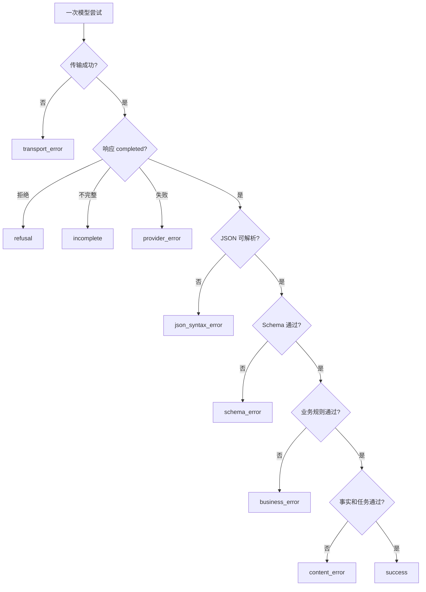

# 格式错误与内容错误

## 1. 两类错误的边界

格式错误表示输出不符合传输协议、JSON 语法或 Schema，例如非法 JSON、缺字段和类型错误。内容错误表示结构已经通过，但事实、分类、引用、业务判断或最终状态错误。Schema 通过只证明结构满足约束，不证明内容正确；拒绝、取消、截断和供应商失败则属于更早的响应状态，不能强行记为格式错误。

分类的价值在于把一次失败交给正确的检测器和修复层。格式错误优先由解析器与 Validator 确定；内容错误需要参考事实、业务规则、单元测试、人工 Rubric 或经过校准的模型评分器。分类规则本身也要版本化，避免历史指标被无说明地重算。

## 2. 检测顺序与互斥规则



每次尝试先记录最早阻断继续处理的主错误。例如响应不完整且 JSON 也无法解析，主类是 `incomplete`，不是 JSON 语法错误；因为根因是没有完整终态。可以另外记录次级观察，但总通过率的分母和分类必须稳定。

## 错误类型逐项定义

| 类别 | 判定输入 | 确定性 | 修复责任 |
| --- | --- | --- | --- |
| 传输错误 | HTTP、连接、超时 | 通常确定 | 网络、SDK、重试策略 |
| Provider 失败 | Responses `failed/error` | 确定 | 请求或供应商处理 |
| 拒绝 | refusal 内容/状态 | 确定识别，原因依接口 | 产品失败路径，不伪造对象 |
| 不完整 | `status=incomplete` 与原因 | 确定 | 输出预算、上下文或任务拆分 |
| JSON 语法错误 | 标准 JSON Parser | 确定 | Structured Output、完整性 |
| Schema 错误 | 固定方言与 Validator | 确定 | Schema、模型配置、版本 |
| 业务错误 | 数据库与领域规则 | 确定或规则化 | 代码、权限、业务状态 |
| 内容错误 | 参考事实与 Rubric | 依任务而定 | Context、Prompt、模型、检索 |

格式错误包含 JSON 语法和 Schema 契约错误，但不包含拒绝、不完整或权限拒绝。内容错误可以进一步拆为事实错误、遗漏、不相关、证据不支持、分类错误、计算错误和有害内容。

## 内容指标如何定义

- 事实正确率：被检查事实中与受控事实源一致的数量占比。
- 字段召回率：参考答案要求的字段中被正确输出的占比。
- 无依据字段率：输出中没有输入或受控来源支持的字段占比。
- 引用精确率：输出引用中能定位并支持相应结论的占比。
- 无答案准确率：应拒答或请求补充信息的样例中正确处理的占比。

这些指标必须说明分子、分母、评分器和版本。“事实正确率”不能由输出流畅度推断；模型 Grader 也需要固定 Rubric、盲测方案和人工校准。

## 固定案例：订单状态提取

### Schema 与事实源

```json
{
  "type": "object",
  "properties": {
    "order_id": {"type": "string"},
    "status": {"type": "string", "enum": ["paid", "shipped", "refunded"]},
    "evidence": {"type": "string"}
  },
  "required": ["order_id", "status", "evidence"],
  "additionalProperties": false
}
```

受控订单表为 `O-104 → shipped`，输入原文为“订单 O-104 显示已发货”。以下输出分别触发不同类别：

```text
A: {order_id:"O-104"}                         # 非法 JSON：键未加双引号
B: {"order_id":"O-104","status":"sent"}   # Schema：缺 evidence 且枚举错误
C: {"order_id":"O-104","status":"refunded","evidence":"显示已发货"}
D: {"order_id":"O-104","status":"shipped","evidence":"显示已发货"}
```

### 逐步处理

1. A 在 JSON Parser 停止，分类 `json_syntax_error`，不进入 Schema。
2. B 是合法 JSON，但 Validator 报缺字段和错误枚举，分类 `schema_error`。
3. C 通过 Schema，却与订单表和证据冲突，分类 `content_error:factual`。
4. D 通过格式、业务事实和证据检查，分类 `success`。
5. 原始输出、错误路径、Schema 版本和事实源版本全部保存。

### 失败分支

- 如果响应达到输出上限，只得到 A 的前半段，主类是 `incomplete`。
- 如果用户无权读取 O-104，应用在调用前返回 `permission_denied`，不属于模型内容错误。
- 如果订单 Tool 超时，分类 `tool_error`；不能使用旧 Assistant 历史评分事实正确。
- 如果模型拒绝，记录 `refusal`，不能构造 `{}` 后让 Schema 报错。
- 如果应用自动把 `sent` 改为 `shipped`，必须保留原始 Schema 失败；自动修补不能提升原始通过率。

## 可复算评测

固定 40 条样例得到：2 个传输失败、2 个不完整、3 个 JSON 语法错误、3 个 Schema 错误、5 个内容错误、25 个成功。

```text
终态完成率 = (40 - 2 - 2) / 40 = 90%
格式通过率 = (5 + 25) / (3 + 3 + 5 + 25) = 30 / 36 ≈ 83.3%
内容准确率 = 25 / (5 + 25) = 83.3%
端到端成功率 = 25 / 40 = 62.5%
```

格式通过率只在有完整可检查输出的 36 条上计算；内容准确率只在格式通过的 30 条上计算。端到端成功率保留所有失败。报告百分比时同时给出分子、分母，避免分母变化造成假提升。

若采用 Structured Output 后 JSON 与 Schema 错误从 6 降为 1，但内容错误从 5 增为 8，端到端成功为 `27/40=67.5%`。格式改善不等于内容改善，仍需检查错误切片和高风险门槛。

## 修复决策表

| 观察 | 优先排查 | 不应采取 |
| --- | --- | --- |
| 大量非法 JSON | 不完整状态、Structured Output、Parser | 正则提取后直接入库 |
| 大量 Schema 错误 | Schema 支持子集、字段说明、版本 | 放宽为任意对象掩盖问题 |
| 事实错误 | Context、Tool、RAG、证据规则 | 只重复“必须准确” |
| 权限错误 | 服务端认证授权 | 加强 System Prompt 后放行 |
| 引用不支持 | 检索、引用对齐、Grader | 只检查 URL 是否存在 |
| 无答案失败 | Failure Behavior 与真实缺失样例 | 强迫所有样例产生答案 |

## 验证与排错

1. 用原始 Fixture 单独测试状态分类器、JSON Parser、Schema Validator 和业务校验器。
2. 每层只接收前一层通过的数据，错误对象保留实例路径和版本。
3. 对模型 Grader 抽样人工复核，计算一致率并记录争议样例。
4. 变更分类规则时创建新版本，不无说明地覆盖历史标签。
5. 看板同时展示各层漏斗与最终成功率，不把 Schema 通过率命名为“准确率”。

## 练习与完成标准

为会议行动项提取构造 20 条输出 Fixture。验收：至少包含传输、拒绝、不完整、JSON、Schema、业务和三种内容错误；分类顺序唯一；计算终态完成率、格式通过率、内容准确率和端到端成功率；给出每类修复责任；权限与写入不由 Prompt 决定。

## 来源

- [JSON Schema：Getting Started](https://json-schema.org/learn/getting-started-step-by-step)（访问日期：2026-07-17）
- [OpenAI：Evaluation Best Practices](https://developers.openai.com/api/docs/guides/evaluation-best-practices)（访问日期：2026-07-17）
- [Anthropic：Increase Output Consistency](https://platform.claude.com/docs/en/test-and-evaluate/strengthen-guardrails/increase-consistency)（访问日期：2026-07-17）
