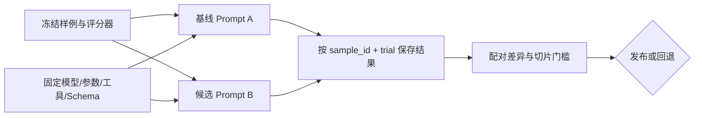

# 同一任务的 Prompt 版本对比

## 1. Prompt 对比是什么

Prompt 对比是在相同模型、参数、数据集、Schema、工具和评分规则下运行多个 Prompt 版本，把 Prompt 作为主要实验变量，比较任务质量、失败类型、延迟和成本。它用于发布判断和回归定位，不是凭少量演示挑选措辞。

比较结果只对指定模型、配置和数据分布成立。模型别名、检索索引或输入分布变化后需要重测；非确定输出要运行多次试验并保存全部结果，不能只选择最好的一次。

## 2. 实验对象与因果边界

Prompt 对比只能回答“在本次固定条件与样例上，版本变化是否伴随指标变化”。它不是自然科学定律，也不能证明生产中的所有变化都由 Prompt 导致。若同时更换模型、检索索引或 Grader，就只能比较两套系统，不能把差异归因于 Prompt。

开始实验前要写出可证伪假设，例如：“增加无答案失败行为后，30 个缺少依据的样例中，正确拒答至少增加 6 个，同时正常样例回归不超过 1 个。”假设同时声明目标切片、改善幅度和允许回归，避免看到结果后再选择对候选有利的指标。若结果没有达到预设幅度，应保留原版本或继续建立新的单变量候选，不能用几条成功输出替代门槛。



## 必须冻结与允许改变的变量

| 对象 | 对比期间要求 | 原因 |
| --- | --- | --- |
| 数据集 | 固定版本、顺序与样例 ID | 防止版本只获得更容易样例 |
| 模型 | 固定完整标识 | 模型行为变化会混淆归因 |
| 采样配置 | 固定支持的参数与 Trial 数 | 随机性和分布宽度影响结果 |
| Schema | 固定版本 | 结构约束改变会影响通过率 |
| RAG/Tool | 固定索引、工具与 Fixture | 外部事实变化会改变内容 |
| Grader | 固定代码、Rubric、模型与阈值 | 评分器变化会重写“成功” |
| Prompt | A 与 B 的指定组件不同 | 这是主要实验变量 |

供应商参数并不跨模型等价；某模型不支持 Temperature 时，不能为了“固定参数”强行发送。应冻结实际生效的配置，并保存供应商返回的模型与 Usage。

## 单变量修改

一次候选版本只改变一个可描述策略，例如：

- 增加“缺资料时返回 unsupported”的 Failure Behavior。
- 新增一个无答案 Example。
- 调整 Context 顺序但不改变内容。
- 把自然语言格式改为相同字段的 Structured Output。

如果 B 同时增加示例、修改字段和更换检索，实验仍可用于整体发布判断，但不能知道哪项产生收益。可继续用消融实验逐项移除组件。

## 指标与配对计算

同一 `sample_id` 在 A 与 B 下都有结果，因此应先看配对变化：

| A | B | 含义 |
| --- | --- | --- |
| 通过 | 通过 | 两版都稳定 |
| 失败 | 通过 | B 修复 |
| 通过 | 失败 | B 回归 |
| 失败 | 失败 | 尚未解决 |

```text
净修复数 = 失败→通过 - 通过→失败
通过率差 = B通过率 - A通过率
平均单次成本 = 总费用 / 总Trial数
成功任务成本 = 总费用 / 成功Trial数
```

非确定输出每个版本运行相同 Trial 数。不得从五次中挑最好一次；保存所有结果并报告均值、最差值或分位数。高风险切片使用硬门槛，不被普通样例平均稀释。

## 完整案例：无答案客服回复

### 固定输入

数据集 30 条：有答案 18、无答案 8、权限不足 4。A 只有“根据文档回答”；B 只增加 Failure Behavior：“文档不支持时返回 unsupported，不补充外部知识”。模型、Schema、文档、参数和 Grader 完全相同，每条运行 2 次。

### 评分规则

- 有答案：结论与文档一致且带有效引用。
- 无答案：必须 `status=unsupported`，不得生成事实。
- 权限不足：应用在模型调用前返回 `permission_denied`，两版都不接触受限文档。
- Schema、延迟、输入输出 Token 和费用单独记录。

### 逐步处理

1. 对 26 条可进入模型的样例生成 `(sample_id, prompt_version, trial)` 任务；权限样例只验证应用路径。
2. 随机化执行顺序，避免短期服务状态只影响一个版本。
3. 保存原始状态、结构化输出、Usage 和评分证据。
4. 按样例汇总两个 Trial；一个样例必须两次均通过才算稳定通过。
5. 计算总体、无答案和有答案切片，并列出 A 通过而 B 失败的回归。

### 输出与复算

```text
稳定通过样例：A=19/26，B=23/26
配对变化：失败→通过=5，通过→失败=1
净修复数：5-1=4
通过率差：23/26-19/26=15.4个百分点
无答案准确率：A=4/8，B=7/8
有答案准确率：A=15/18，B=16/18
平均单次成本：A=0.010，B=0.012
```

B 的总体与两个切片都改善，但单次成本增加 20%。发布标准若规定无答案准确率至少 95%，B 的 `7/8=87.5%` 仍未达标，不能只凭相对提升发布。

### 失败分支

- B 回归的 1 条是长文档有答案样例：加入失败规则后模型过早返回 unsupported，应检查 Context 与成功证据说明。
- 两版运行期间模型别名移动：本轮失去严格可比性，固定快照后重跑。
- Grader v2 修复引用判断：历史 A/B 应用同一新 Grader 重算，并记录评分版本变化。
- 团队看过冻结测试集逐题修改 B：测试集已参与开发，应建立新测试集。
- B 通过率提高但权限样例调用了模型：架构门槛失败，不由文本质量抵消。

## 不确定性与小样本

样本量很小时，一个样例即可改变数个百分点。报告分子、分母和逐样例差异；需要统计区间时声明方法与假设。多 Trial 只能估计模型运行波动，不能弥补数据集不代表真实流量。切片只有 2 条时，100% 不是稳定证据，应补充样例或采用风险审查。

## 实验记录格式

```json
{
  "experiment_id": "support-abstain-07",
  "dataset_version": "support-v5",
  "variants": ["prompt-a3", "prompt-b1"],
  "changed_component": "failure_behavior",
  "model": "pinned-model-id",
  "schema_version": "answer-v2",
  "grader_version": "support-rubric-v4",
  "trials_per_sample": 2,
  "release_gates": {"no_answer_accuracy": 0.95, "permission_violations": 0}
}
```

该记录不保存 Secret 或未经授权的用户原文。真实样例使用受控引用、脱敏和保留策略。

## 验证与排错

1. 比较两个运行清单的模型、Schema、数据、工具和 Grader 哈希，只有 Prompt 允许不同。
2. 对每个样例检查 Trial 数一致，缺失运行不得静默忽略。
3. 先输出配对转移表，再输出总体和切片均值。
4. 人工抽查全部回归和高风险失败，不只抽查修复项。
5. 费用、延迟与质量使用同一成功口径；不完整调用仍计入资源消耗。

## 练习与完成标准

设计一次合同字段抽取 Prompt A/B 实验。验收：B 只改变一个组件；至少 24 条样例和 4 个切片；每条至少 2 个 Trial；计算配对净修复、总体差、关键切片、P95 延迟与成功任务成本；定义发布和回退门槛；权限与写入规则不放在 Prompt；测试集未参与逐题调参。

## 来源

- [OpenAI：Evaluation Best Practices](https://developers.openai.com/api/docs/guides/evaluation-best-practices)（访问日期：2026-07-17）
- [Anthropic：Define Success Criteria and Build Evaluations](https://platform.claude.com/docs/en/test-and-evaluate/develop-tests)（访问日期：2026-07-17）
- [Anthropic：Prompt Engineering Overview](https://platform.claude.com/docs/en/build-with-claude/prompt-engineering/overview)（访问日期：2026-07-17）
