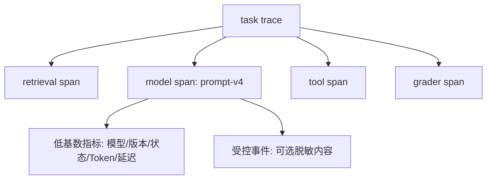

# Prompt 的模型、参数、Token、延迟与成本记录

## 1. Prompt 可观测性是什么

Prompt 可观测性把一次业务任务与模型、Prompt 版本、参数、上下文组成、Token Usage、延迟、费用、响应状态和质量反馈关联。它用于定位回归、容量、成本和故障，不能只保存最终文本，也不能默认采集完整用户内容。

一次任务需要稳定的 Trace 标识并关联检索、模型、Tool、评分器和最终状态。模型请求标识与响应实际标识分别保存；价格、语义约定和字段映射锁定版本。敏感内容只在用途明确、权限受控和保留期确定时采集。

## 2. Trace、Span、Metric 与受控内容



Trace 关联一次用户任务的多个步骤；Span 记录单次检索、模型或 Tool 操作的持续时间与状态；Metric 聚合大量请求；内容事件只在策略允许时保存 Prompt、输出和工具参数。OpenTelemetry 明确警告这些内容可能敏感，默认观测不应依赖采集明文。

## 字段逐项定义

| 字段 | 采样时刻 | 作用 | 边界 |
| --- | --- | --- | --- |
| `trace_id` | 任务开始 | 关联检索、模型、Tool、Grader | 高基数，只用于检索 Trace |
| `prompt_id/version` | 渲染前 | 还原模板配置 | 不等于渲染后的敏感内容 |
| `model_requested` | 请求前 | 记录路由目标 | 与返回模型分别保存 |
| `model_returned` | 响应时 | 识别实际模型 | 供应商是否提供完整快照依接口 |
| `schema/tool/retrieval_version` | 请求前 | 识别上下文依赖 | 任一变化都可能影响结果 |
| `input_tokens` | 最终 Usage | 输入计量 | 通常包含缓存输入子项 |
| `cached_tokens` | Usage 明细 | 缓存命中分析 | 不要再次加进 input total |
| `output_tokens` | 最终 Usage | 输出计量 | 推理 Token 可能是其子项 |
| `first_event_ms` | 首个有效事件 | 交互等待 | 非 Streaming 无此口径 |
| `total_ms` | 最终状态 | 调用持续时间 | 用单调时钟测量 |
| `status/error_category` | 结束时 | 可靠性漏斗 | 供应商状态与业务状态分开 |
| `quality_label` | Grader 后 | 任务效果 | 带 Rubric 与 Grader 版本 |

OpenAI Responses 当前 `usage.input_tokens_details.cached_tokens` 是输入 Token 的组成，`usage.output_tokens_details.reasoning_tokens` 是输出 Token 的组成。该字段路径属于 OpenAI；统一观测层映射到应用字段时仍保留原始 Usage，不能把跨供应商缺失字段填成零。

## Context 组成观测

只记录总输入 Token 无法定位 Prompt 膨胀。请求构造时另记估算组成：

```text
instructions_tokens / examples_tokens / user_input_tokens
history_tokens / tool_schema_tokens / retrieval_tokens
```

这些是应用估算，不冒充供应商结算 Usage。估算之和与最终 Usage 的差值可能来自 Tokenizer、协议表示、多模态和服务实现；按模型版本校准误差。

## 延迟口径

- 队列时间：任务入队到 Worker 开始。
- 请求构造：检索、模板渲染和 Schema 准备。
- 首事件时间 TTFE：发送到第一个可用于界面更新的事件。
- 模型总时长：发送到完成、失败或不完整终态。
- Tool 时长：每个外部工具单独记录。
- 任务总时长：用户提交到最终业务状态。

平均值会隐藏尾延迟，应报告 P50、P95、P99，并说明样本量与时间窗口。不同状态不能无说明混合：失败请求很快返回会让总体延迟“变好”。

## 成本口径

```text
调用费用 = 各计费项 Usage × 对应单价
平均调用成本 = 总调用费用 / 调用次数
成功任务成本 = 任务内全部调用费用 / 成功任务数
```

价格记录币种、生效日期和版本。历史费用不因当前价格改变。重试、不完整、Grader 与 Tool 也属于任务成本；只计算最终成功模型调用会低估。

## 完整案例：RAG 政策问答

### 输入

用户询问“差旅住宿上限是多少”。任务包含一次检索、一次 Responses 调用和一次引用 Grader。配置为 `prompt=travel-answer-v4`、`schema=answer-v2`、`index=policy-2026-07-01`，固定模型。普通日志不保存用户原文和文档正文。

### 逐步处理

1. 创建任务 Trace；记录功能、环境、租户不可逆标识和数据分类。
2. 检索 Span 记录查询哈希、索引版本、候选数、授权后数量和 80ms 延迟。
3. 模板构造记录各 Context 组成估算，不记录 Secret 或受限正文。
4. 模型 Span 保存 Prompt/Schema/模型版本、Response ID、request ID、状态和 Usage。
5. Streaming 首事件为 420ms，模型完成为 1300ms；单调时钟避免系统时间变化。
6. 引用 Grader 记录 `rubric=citation-v3`、通过/失败和证据 ID。
7. 价格表 `pricing-2026-07-17` 计算费用，任务最终状态结合 Schema 与 Grader。

### 单条观测输出

```json
{
  "trace_id": "trace-7f",
  "prompt_version": "travel-answer-v4",
  "model_requested": "model-snapshot",
  "model_returned": "model-snapshot",
  "retrieval_version": "policy-2026-07-01",
  "status": "completed",
  "business_status": "succeeded",
  "usage": {"input_tokens": 1800, "cached_tokens": 600, "output_tokens": 120},
  "latency_ms": {"retrieval": 80, "first_event": 420, "model_total": 1300},
  "quality": {"citation": true, "grader_version": "citation-v3"},
  "cost": {"amount": 0.0042, "currency": "USD", "pricing_version": "2026-07-17"}
}
```

数值为教学 Fixture，不代表供应商价格。`cached_tokens=600` 已包含在 `input_tokens=1800` 中。

### 聚合与复算

一天 100 个任务，90 个业务成功，总费用 0.50 美元，其中 10 个失败任务费用 0.08 美元：

```text
模型完成率 = 96 / 100 = 96%
业务成功率 = 90 / 100 = 90%
平均任务成本 = 0.50 / 100 = 0.005 美元
成功任务成本 = 0.50 / 90 ≈ 0.00556 美元
失败成本占比 = 0.08 / 0.50 = 16%
```

若只用成功调用费用除成功数，失败与重试成本会消失。看板同时显示完成漏斗、质量、Token、延迟和成本。

### 失败分支

- 流中断没有最终 Usage：写 `usage_status=unavailable`，不填零，并进入对账。
- 模型完成但引用 Grader 失败：供应商状态 completed，业务状态 quality_failed。
- Prompt v5 上线后 P95 降低但成功率下降：不能只宣布延迟优化。
- 日志意外包含完整政策正文：按数据事件处理，停止采集、清理访问并修复脱敏。
- OpenTelemetry 字段版本变化：保留内部稳定模型，升级 Adapter 与查询，不直接重写历史。

## 高基数与数据最小化

模型、Prompt 版本、状态、环境适合 Metric 标签；trace ID、request ID、用户和文档 ID 高基数，放在 Trace/日志查询而非所有时序标签。用户标识使用受控不可逆形式仍可能属于个人数据，访问与保留按政策执行。

内容采集必须是 opt-in：明确目的、权限、采样率、脱敏、加密、保留期与删除路径。哈希可用于一致性关联，但低熵输入可能被猜测，不能自动视为匿名。

## 排错顺序

1. 质量下降：按 Prompt、模型、索引、Schema 和 Grader 版本切片。
2. Token 上升：比较 Context 组成估算与最终 Usage。
3. 延迟上升：分解队列、检索、首事件、模型、Tool 与 Grader。
4. 成本上升：检查 Token、重试、不完整和价格版本。
5. 统计突变：确认埋点版本、采样率、分母和状态分类是否变化。

## 练习与完成标准

为一个带检索和 Tool 的客服任务设计观测 Schema。验收：Trace 至少含四个 Span；requested/returned model 分开；Token 子项不重复求和；定义 TTFE、总延迟和任务延迟；计算平均任务与成功任务成本；区分供应商完成和业务成功；内容默认不采集；所有字段有版本、单位和缺失策略。

## 来源

- [OpenTelemetry：Generative AI Semantic Conventions](https://github.com/open-telemetry/semantic-conventions-genai)（访问日期：2026-07-17）
- [OpenAI API：Responses Usage](https://platform.openai.com/docs/api-reference/responses)（访问日期：2026-07-17）
- [Anthropic API：Messages](https://platform.claude.com/docs/en/api/messages)（访问日期：2026-07-17）
