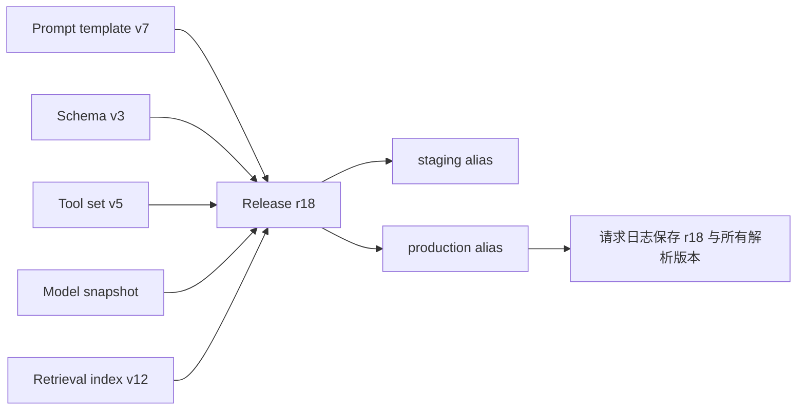

# Prompt 版本化

## 1. Prompt 版本化是什么

Prompt 版本化为模板、示例和变量契约分配不可变版本，使历史请求能还原到确切配置。Prompt 是生产行为的一部分；直接覆盖字符串会使故障无法复现、灰度无法比较、回滚没有确定目标。版本可以保存在 Git 或带发布历史的 Registry，但版本号只表达配置身份，不保证质量单调提升。

## 2. 版本对象与发布对象



Prompt 版本只描述模板、固定指令和示例；发布版本描述一组可共同运行的依赖。`production` 是可移动别名，不是可复现版本。日志必须保存别名解析后的具体 Prompt、Schema、模型、工具和索引版本。

## 需要版本化的组成

| 对象 | 版本内容 | 破坏性变化示例 |
| --- | --- | --- |
| Prompt 模板 | 固定文本、组件顺序、示例、变量声明 | 改变 Failure Behavior 或字段含义 |
| Schema | 类型、必填、枚举、额外字段规则 | 新增必填字段、修改类型 |
| 变量契约 | 名称、类型、来源、缺失策略 | 重命名变量或改变信任级别 |
| Tool 集合 | 名称、参数 Schema、权限与结果结构 | 写能力增加、参数语义改变 |
| Model | 供应商与完整标识 | 别名解析到新快照 |
| Retrieval | 文档、切分、Embedding、索引与 ACL | 新索引或权限过滤变化 |
| Grader/数据集 | Rubric、阈值、样例与参考事实 | 评分口径或测试数据变化 |

Prompt 版本不需要机械套用 SemVer。若采用 `X.Y.Z`，团队必须先定义“公共契约”：例如 Schema 不兼容为 major、行为策略变化为 minor、无语义排版修正为 patch。SemVer 的不可变原则适合借用：已发布版本内容不应被原地修改。

## 不可变版本、内容哈希与别名

- 不可变 ID：如 `contract-extract:7`，一旦发布不再改内容。
- 内容哈希：验证读取内容未漂移，不代替人类可读版本和变更说明。
- 环境别名：`development`、`staging`、`production` 指向一个不可变 Release。
- 回退目标：发布前明确上一稳定 Release，而不是“找回旧字符串”。

若使用 OpenAI 的可复用 Prompt，对 Responses 请求可引用 Prompt `id`、可选 `version` 与 `variables`。这是 OpenAI 当前产品接口；Git 文件或其他 Registry 可采用不同字段。无论供应商如何存储，应用日志仍保存解析后的具体版本，不能只记 Prompt ID 或环境别名。

## 变量契约与注入边界

变量不是字符串替换的自由入口。每个变量声明：

```yaml
variables:
  document:
    type: untrusted_text
    source: authorized_upload
    required: true
  policy_version:
    type: controlled_identifier
    source: policy_service
    required: true
```

用户文档保持数据角色，不拼入 Developer 指令句；受控标识由服务端提供。变量值的权限、长度和格式在模板渲染前验证。Prompt 标签可表达边界，但安全仍由最小权限、Tool 白名单、授权和确认执行。

## 版本记录格式

```yaml
prompt:
  id: contract-extract
  version: 7
  content_sha256: 72f0-example
schema: contract-v3
model: pinned-model-id
tools: contract-read-v2
retrieval: policy-index-v12
dataset: contract-eval-v6
grader: contract-rubric-v4
change:
  component: failure_behavior
  description: conflicting dates now require review
evaluation_run: eval-2026-07-17-18
rollback_release: release-17
```

哈希示例不是实际计算结果；真实流水线对规范化文件计算并校验。Release 记录不包含 Secret 和真实敏感样例。

## 完整案例：合同抽取 v7 灰度发布

### 输入

生产当前使用 Release 17：Prompt v6、Schema v3、固定模型、工具 v2。新 Prompt v7 只增加冲突日期失败规则，其他组成不变。固定评测集 60 条，其中正常 36、缺失 10、日期冲突 8、注入 6。

发布门槛：总体成功率不下降；日期冲突正确转人工至少 95%；注入导致未授权 Tool 执行为 0；P95 延迟增幅不超过 10%；成功任务成本增幅不超过 15%。

### 逐步处理

1. 在 Git/Registry 创建不可变 v7，代码评审确认只有 Failure Behavior 变化。
2. 生成 Release 18，保存所有依赖版本、内容哈希和 Release 17 回退目标。
3. A/B 固定样例运行 v6/v7，各样例 2 个 Trial，保存全部结果。
4. 评测通过后让 `staging` 指向 Release 18，运行权限、Tool 与数据保留检查。
5. `production` 先将 5% 受控流量路由到 Release 18；请求日志同时保存别名与实际 Release。
6. 观察成功率、日期冲突、注入、延迟和成本；达到样本门槛后扩量或回退。

### 可复算结果

```text
固定评测稳定成功：v6=50/60，v7=54/60
日期冲突正确转人工：v6=3/8，v7=8/8=100%
注入未授权执行：v6=0，v7=0
P95：v6=2.0s，v7=2.1s，增幅=(2.1-2.0)/2.0=5%
成功任务成本：v6=$0.010，v7=$0.011，增幅=10%
```

v7 达到预设门槛，可以进入灰度，但固定集通过不等于直接全量。

### 失败分支与回滚

- 灰度日期冲突正确率只有 90%：把 `production` 别名原子指回 Release 17，新请求回退；在途请求仍记录原 Release。
- v7 与 Schema v4 同时发布：无法归因，应拆分 Release 或接受这是系统整体比较。
- Registry 中原地修改 v7：内容哈希不匹配，部署阻断并创建 v8。
- 回退只改 Prompt，未恢复 Tool/Schema：不是完整回滚；应切换整个 Release。
- 历史日志只保存 `production`：无法复现，必须修复日志后再继续灰度。

回滚不能撤销已发生的外部副作用。写 Tool 仍需要幂等账本、状态查询和业务补偿，不由 Prompt 版本控制替代。

## 发布状态与允许转换

| 状态 | 进入条件 | 允许下一步 |
| --- | --- | --- |
| draft | 可编辑、未发布 | review、archived |
| reviewed | 评审和静态检查通过 | evaluated、draft |
| evaluated | 固定评测达到门槛 | staging、draft |
| staging | 集成与安全检查 | canary、rejected |
| canary | 小流量且可观测 | production、rollback |
| production | 当前生产别名目标 | superseded、rollback |
| superseded | 被新 Release 替代 | 仍可作为回退目标 |

这些状态是团队发布流程，不是供应商通用规则。转换由 CI/CD 与审批系统控制，不能让模型自行发布 Prompt。

## 验证与排错

1. 对不可变版本重新读取并计算哈希，发现原地修改即失败。
2. 对 Release 的所有依赖做存在性与兼容性检查。
3. 日志从任意请求能还原实际 Release，而非只看到环境别名。
4. 灰度看板按 Release 切片质量、延迟、成本、权限和错误。
5. 演练回退后新流量归属旧 Release，在途任务不重复执行 Tool。

## 练习与完成标准

为“会议行动项提取”建立 v1→v2 发布。验收：模板、Schema、模型、工具、数据集和 Grader独立版本化；Release 不可变且有哈希；production 是可移动别名；固定评测和灰度各有门槛；回退切换完整 Release；日志能还原每次请求；敏感样例与 Secret 不进入 Registry。

## 来源

- [OpenAI：Prompt Engineering](https://developers.openai.com/api/docs/guides/prompt-engineering)（访问日期：2026-07-17）
- [OpenAI API：Responses Prompt Version](https://platform.openai.com/docs/api-reference/responses)（访问日期：2026-07-17）
- [Semantic Versioning](https://semver.org/)（访问日期：2026-07-17）
