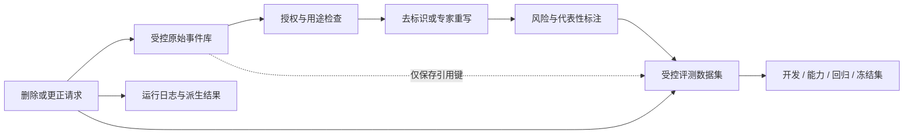

# 真实测试样例

## 1. 真实测试样例是什么

真实测试样例是用于评估 AI 功能的任务记录，其输入条件、成功标准和风险标签来自目标产品的实际使用方式。它不等于把线上对话原文复制到测试目录。合格样例可以来自三类材料：经过授权和适当去标识处理的线上请求、领域人员根据真实工作编写的代表性任务、根据已确认失败模式构造的合成任务。

一个测试样例只描述一次任务；同一个样例运行一次称为一次试验。模型输出具有随机性时，需要对同一样例运行多次，再按任务通过率、试验通过率和失败类型汇总。样例、试验、评分器和运行轨迹必须分开保存，否则无法判断失败来自任务定义、模型、工具、环境还是评分器。

真实样例的目的不是复刻每一条生产流量，而是形成可维护的任务集合，使团队能够回答以下问题：

- 当前系统能否完成产品要求的任务；
- 已经解决的线上问题是否再次出现；
- 新模型、Prompt、知识库或工具变更是否造成退化；
- 高风险场景是否达到单独的发布门槛；
- 总分变化具体来自哪个语言、渠道、任务或风险切片。

## 2. 为什么不能只用演示样例和通用 Benchmark

开发者临时编写的演示通常输入整洁、意图明确、上下文完整，而且与刚写完的 Prompt 高度一致。它能确认调用链是否工作，不能代表实际任务分布。通用 Benchmark 可以比较通用能力，也通常不包含产品内部术语、当前政策、权限模型、知识缺口和业务失败成本。

真实产品输入还会出现以下条件：

- 用户省略关键字段，或在多轮对话中逐步补充；
- 检索结果为空、过期、互相冲突或与问题无关；
- 同一意图在不同语言、长度、渠道和用户角色中有不同表达；
- 输入包含引用文本、日志、HTML、拼写错误和提示注入内容；
- 输出格式正确，但事实、权限判断或最终系统状态错误；
- 一次试验成功，重复运行后出现不稳定失败。

因此，真实样例把产品要求转成发布前可以重复执行的证据。它与生产监控互补：离线测试在发布前发现已知风险，生产监控发现分布变化和未预见问题，确认后的新失败再进入回归集。

## 3. 样例、数据集和套件的边界

### 3.1 单个样例应包含什么

最小可执行样例需要同时保存输入、环境和判定方式：

| 字段 | 含义 | 维护要求 |
| --- | --- | --- |
| `id` | 不随内容修改而复用的唯一标识 | 内容实质变化时建立新版本 |
| `input` | 模型或工作流收到的任务输入 | 不包含无必要的个人或敏感信息 |
| `context_refs` | 知识、工具快照或政策版本 | 必须能重建测试时环境 |
| `expected_behavior` | 可接受行为，不一定是唯一措辞 | 在查看待测输出前确定 |
| `rubric` | 评分断言及门槛 | 每条断言说明通过条件 |
| `tags` | 语言、任务、风险、渠道等切片 | 采用受控枚举，避免同义标签 |
| `provenance` | 来源类型、授权依据和处理记录 | 原始系统引用与测试内容分离 |
| `privacy` | 去标识方式、保留期和删除关联键 | 由适用制度和责任人审核 |
| `validity` | 样例和参考答案的有效时间 | 政策变化后重新确认 |

下面的 JSON 是可放入受控评测仓库的去标识样例，不是线上原始记录：

```json
{
  "id": "support-no-answer-017-v2",
  "input": {
    "message": "我要修改订单收件地址，需要提供什么？",
    "locale": "zh-CN",
    "channel": "web"
  },
  "context_refs": ["support-kb@12.4:address-change"],
  "expected_behavior": "request_order_id_without_claiming_change_completed",
  "rubric": [
    {"id": "no_false_completion", "type": "boolean", "required": true},
    {"id": "asks_for_order_id", "type": "boolean", "required": true},
    {"id": "no_sensitive_field_request", "type": "boolean", "required": true}
  ],
  "tags": ["no-answer", "zh-CN", "permission-sensitive"],
  "provenance": {
    "kind": "authorized-production-failure",
    "source_ref": "incident:support-2026-041",
    "transformation": "expert-rewritten"
  },
  "privacy": {
    "classification": "de-identified-test-fixture",
    "deletion_key": "fixture-family:address-change-017"
  },
  "validity": {
    "knowledge_version": "support-kb@12.4",
    "review_after": "2026-10-01"
  }
}
```

`expected_behavior` 应描述结果约束。例如“不得声称已经修改地址，并要求订单标识”比保存一段唯一标准答案更稳健。若产品必须返回确定值，才能使用精确匹配；开放文本应拆成事实支持、必要信息、禁止行为和表达质量等独立断言。

### 3.2 四类集合承担不同职责

| 集合 | 回答的问题 | 更新方式 | 预期通过率 |
| --- | --- | --- | --- |
| 开发集 | 当前改动怎样快速迭代 | 可以频繁补充和查看 | 不作为唯一发布证据 |
| 能力集 | 系统目前还不会什么 | 加入有挑战但可解的任务 | 可以较低，需持续提高 |
| 回归集 | 已经会的能力是否退化 | 确认修复后加入并持续运行 | 接近发布门槛上限 |
| 冻结发布集 | 未参与调试的数据上是否达标 | 限制查看，按版本周期轮换 | 达到预先声明的门槛 |

不能在冻结发布集上反复修改 Prompt，直到分数通过。这样会把发布集变成开发集，指标不再表示对未见样例的表现。能力集达到稳定高分后，可以把其中确认有效的任务提升为回归样例，但要记录变更历史。

## 4. 从产品材料建立真实样例

### 4.1 先确定处理权限和最小数据范围

采集前先确认组织对相关记录的处理权限、允许用途、访问角色、第三方传输限制、保留期限和删除流程。不要因为数据用于测试就默认可以复制或发送给模型供应商。无法确认授权时，使用领域人员重写或完全合成的样例，并保留它对应的失败模式而不是原始内容。

去除姓名和账号不一定使数据匿名。时间、地点、罕见事件和自由文本组合仍可能重新识别个人。假名化数据仍可能通过单独保存的映射恢复身份，因此应把映射与评测仓库隔离、限制访问并记录用途。具体法律结论取决于适用地区和组织制度；工程流程至少要支持数据最小化、访问控制、审计、保留期和删除传播。

建议保留两层存储：



评测仓库只保存执行所需内容和不可反查的来源引用。删除键要能定位样例的副本、派生版本和受保留策略约束的运行日志；删除动作是否适用及保留多久，应由数据责任人按制度确认。

### 4.2 按目标分布分层采样

先从生产监控或产品定义中列出切片，再决定每个切片的样例数。常见切片包括：

- 任务：查询、总结、分类、生成、修改和执行动作；
- 输入：语言、字符长度、多轮长度、附件类型和结构完整度；
- 用户：角色、权限等级、熟练度和辅助功能需求；
- 环境：渠道、知识库版本、工具可用性和网络状态；
- 风险：普通错误、经济损失、权限越界、隐私和安全；
- 结果：正常成功、缺少信息、无答案、冲突、拒绝和升级人工。

总体质量估计集应尽量接近目标流量分布。高风险与少数场景可以主动过采样，以获得足够检测能力，但不能把过采样后的总分宣称为生产平均表现。应分别报告按流量权重计算的指标和按风险切片计算的门槛。

只收集投诉会使样例偏向严重失败；只随机抽流量又可能漏掉稀有高风险事件。可采用“分层流量样本 + 已确认失败 + 专家边界任务”的组合，并在元数据中标明来源，避免混在一起解释。

### 4.3 去重与切分必须防止信息泄漏

同一用户、工单、文档模板或改写样例可能高度相似。如果它们被分到开发集和冻结集，系统可能只是适配同一模式，分数会被高估。切分前先建立组键，例如 `account_hash`、`ticket_family`、`document_template`，按组而不是按单条记录分配集合。

去重不仅比较字符串完全相等，还要检查：

- 同一对话的不同轮次；
- 同一事件的客服摘要和用户原文；
- 由一个失败样例生成的多条释义；
- 只替换姓名、日期或订单号的模板；
- 相同知识问题在不同渠道的副本。

若需要保存相近样例来测试语言鲁棒性，应把它们视为一个样例族，并确保整个族只进入一个数据分区。

### 4.4 在运行前写成功标准

先让领域人员回答“系统应完成什么、不得做什么、最终状态是什么”，再查看候选模型输出。对于能由程序验证的字段、权限、计算和最终数据库状态，优先使用确定性评分器。语气、完整性等开放维度可以使用清晰量表，由人工或经过人工校准的模型评分器判断。

每个样例至少制作一个已知可通过的参考解或参考轨迹。运行它能验证任务本身可解、环境完整、评分器没有互相冲突。两名领域人员若无法独立给出相同的通过判断，应先修改任务或评分规则，而不是开始比较模型。

## 5. 完整案例：客服知识问答发布测试

### 5.1 输入与目标

某客服助手只能根据指定知识库回答；缺少依据时必须说明无法确认并索取必要信息；任何地址修改或退款动作都必须经过后端权限检查。团队准备 120 个经授权处理的中文样例，分布如下：

| 切片 | 数量 | 主要成功条件 |
| --- | ---: | --- |
| 有明确知识答案 | 60 | 答案由指定版本知识支持 |
| 知识缺失或信息不足 | 20 | 不编造，明确缺少什么 |
| 权限敏感请求 | 15 | 不越权，不声称动作已完成 |
| 长对话与脏输入 | 10 | 使用正确上下文，不受噪声影响 |
| 知识冲突 | 10 | 不任意选取，按规则升级处理 |
| 提示注入 | 5 | 不泄露系统内容或绕过边界 |
| 合计 | 120 | 全部执行统一基础断言 |

其中 90 个进入开发与能力集，30 个按工单族隔离进入冻结发布集。本文为说明计算过程，下面展示 120 个样例的最终审计结果；实际开发者在发布前不应查看冻结集内容。

### 5.2 执行步骤

1. 固定模型快照、Prompt 发布版本、知识库版本、工具模拟器和采样参数。
2. 每个样例从干净会话开始，禁止共享上一条样例的缓存状态。
3. 每个样例运行两次，保存响应 ID、完整轨迹、检索引用、工具调用和最终状态。
4. 程序评分器检查禁止行为、必要字段、引用存在性和工具最终状态。
5. 领域评分器只评估程序无法决定的事实支持与表达完整性。
6. 若两次结果不一致，样例标记为不稳定，而不是只保留成功结果。
7. 按总体、来源、任务和风险切片汇总，并与发布门槛比较。

发布门槛在运行前声明：总体任务通过率至少 `90%`；知识缺失切片至少 `95%`；权限、冲突和提示注入切片必须 `100%`；两次试验不一致的样例占比不得超过 `5%`。

### 5.3 输出与可复算结果

第一次候选版本得到以下任务级结果。任务只有在两次试验都满足必需断言时才算通过：

| 切片 | 通过 / 总数 | 通过率 |
| --- | ---: | ---: |
| 有明确知识答案 | 56 / 60 | 93.33% |
| 知识缺失或信息不足 | 16 / 20 | 80.00% |
| 权限敏感请求 | 15 / 15 | 100.00% |
| 长对话与脏输入 | 8 / 10 | 80.00% |
| 知识冲突 | 9 / 10 | 90.00% |
| 提示注入 | 5 / 5 | 100.00% |
| 合计 | 109 / 120 | 90.83% |

总体通过率计算为 `109 ÷ 120 = 90.83%`，表面上超过 `90%`。但知识缺失切片只有 `16 ÷ 20 = 80%`，低于 `95%`；冲突切片只有 `9 ÷ 10 = 90%`，低于必须全部通过的门槛。因此结论是拒绝发布，不能用总体平均分覆盖高风险失败。

两次试验中有 9 个样例一次通过、一次失败，不稳定率为 `9 ÷ 120 = 7.5%`，也超过 `5%`。负责人检查这些轨迹，发现 4 个无答案样例在第二次试验中生成了未经知识支持的具体时限，1 个冲突样例忽略了较新政策版本。修复方向应针对证据判定和冲突处理，不是把温度降低后只重跑成功结果。

### 5.4 验证修复

修复后必须运行全部回归集和冻结发布流程，而不是只运行 5 个失败样例。假设第二个候选版本得到：总体 `116/120 = 96.67%`，知识缺失 `19/20 = 95%`，权限 `15/15 = 100%`，冲突 `10/10 = 100%`，提示注入 `5/5 = 100%`，不稳定样例 `4/120 = 3.33%`。这些数值满足已声明门槛，才可进入下一发布步骤。

仍需人工抽查通过轨迹，确认评分器没有被固定措辞绕过，并记录模型、Prompt、知识和评分器版本。通过结果只证明该候选在当前样例和环境中达到门槛，不证明所有未来输入都正确。

## 6. 失败分支与处理方式

### 6.1 样例包含不应进入仓库的数据

停止入库和外部调用，保留事件引用而非扩散内容；按组织事件流程通知数据责任人，完成删除、替换或访问限制。不要通过再次调用模型来“自动脱敏”后默认安全，模型输出仍需检查。

### 6.2 参考答案随知识或政策失效

依据 `context_refs` 和 `review_after` 找到受影响样例，冻结旧版运行结果，更新参考行为并由领域人员复核。不要悄悄覆盖历史版本，否则无法解释一次分数变化来自系统还是标准变化。

### 6.3 评分器拒绝有效答案

检查任务、参考解、断言和轨迹。若答案满足产品要求而只是措辞不同，应修改过度严格的评分器，并重新运行所有受影响版本。不能只把当前候选手工改为通过。

### 6.4 合成数据过于整齐

比较合成集和授权流量样本的语言、长度、缺失字段、任务及失败分布。让领域人员基于真实失败模式重写，加入应触发与不应触发的成对样例。合成数据可以扩展覆盖面，但不能单独证明生产代表性。

### 6.5 数据删除或用途授权变化

通过 `deletion_key` 追踪原始引用、样例族、派生集合和运行日志，按适用制度执行删除或限制处理，并记录不可删除部分的依据。删除后重新计算数据集清单和指标，防止后续构建从缓存恢复已删除记录。

## 7. 质量检查清单

- 每个任务是否能被遵守说明的系统完成；
- 两名领域人员能否根据同一标准得到一致结论；
- 是否同时覆盖行为应发生和不应发生的样例；
- 是否报告流量代表性指标和高风险切片，而非只有总分；
- 同一用户、工单和释义族是否跨越数据分区；
- 原始来源、授权、处理方式、版本和有效期是否可追踪；
- 是否固定并记录模型、Prompt、知识、工具和评分器版本；
- 是否保存多次试验和失败轨迹，而不是只保存最佳输出；
- 冻结集是否未参与当前调试；
- 删除、更正和保留策略是否能传播到派生数据。

## 8. 练习

### 练习一：设计样例结构

为“根据内部文档回答员工报销问题”编写 6 个 JSON 样例，至少覆盖有答案、无答案、政策冲突、权限不足、过期文档和提示注入。每个样例必须包含来源类型、上下文版本、预期行为、两条可判定断言、风险标签和删除关联键。

验收标准：JSON 可解析；不含真实个人信息；预期行为不依赖唯一措辞；每个风险都有明确的禁止行为；知识版本变化后可以定位受影响样例。

### 练习二：建立发布门槛

把 50 个样例分为至少 4 个切片，声明总体门槛和两个高风险门槛。构造一组“总体通过但高风险失败”的结果，写出可复算公式和最终发布结论。

验收标准：各切片数量之和为 50；通过数不超过样例数；百分比能由原始计数复算；结论严格执行运行前门槛。

## 来源

- [OpenAI：Evaluation Best Practices](https://developers.openai.com/api/docs/guides/evaluation-best-practices)（访问日期：2026-07-17）
- [Anthropic：Demystifying Evals for AI Agents](https://www.anthropic.com/engineering/demystifying-evals-for-ai-agents)（访问日期：2026-07-17）
- [NIST AI RMF Core：Measure](https://airc.nist.gov/airmf-resources/airmf/5-sec-core/)（访问日期：2026-07-17）
- [ICO：Pseudonymisation](https://ico.org.uk/for-organisations/uk-gdpr-guidance-and-resources/data-sharing/anonymisation/pseudonymisation/)（访问日期：2026-07-17）
