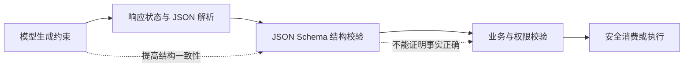

# Prompt 工作流中的 JSON Schema 与运行时校验

## 1. JSON Schema 在工作流中负责什么

JSON Schema 是描述 JSON 实例结构和约束的规范。它可以声明值的类型、对象允许的属性、必填字段、枚举、字符串长度、数字范围和数组成员结构。验证器读取 Schema 与待验证数据，返回是否通过以及失败路径。

在 AI 工作流中，Schema 通常同时出现在两个位置：

1. 调用模型时，把 Schema 作为 Structured Output 或 Tool 参数的生成约束；
2. 接收结果后，由应用自己的验证器在运行时重新验证。

这两个位置不能相互替代。生成约束提高模型返回目标结构的概率或在供应商支持范围内强制结构；运行时校验判断应用实际收到的字节是否符合本地契约。模型还可能拒绝任务、调用中断、达到输出限制或返回供应商错误，所以程序必须先检查响应状态，再解析和校验。

Schema 只判断结构，不判断事实是否正确、当前用户是否有权限、订单是否存在、金额计算是否符合业务政策。完整工作流至少包含三层：



## 2. 为什么“请严格返回 JSON”不够

Prompt 中的自然语言不是机器可执行契约。模型可能增加 Markdown 围栏、改字段名、遗漏值、把数字写成字符串，或在无法完成任务时返回解释文本。即使文本能被 `JSON.parse` 解析，也不代表它满足消费者需要的字段和类型。

以下内容都是合法 JSON，但可能不是合法业务输入：

```json
[
  {"order_id": "O-100", "amount": "29.90"},
  {"order_id": "O-100", "amount": -1},
  {"order_id": "O-100", "amount": 29.9, "approved": true},
  {"order": "O-100", "amount": 29.9}
]
```

第一条金额类型错误，第二条违反数值范围，第三条含有消费者未定义字段，第四条缺少必填字段。JSON 解析只能确认语法，JSON Schema 才能发现这些结构问题；但即使全部通过，仍需查询真实订单和权限。

## 3. 先理解 Schema 的核心组成

### 3.1 方言与 `$schema`

JSON Schema 有不同草案。`$schema` 声明当前 Schema 使用的元 Schema，也就是方言和关键字语义。例如 Draft 2020-12：

```json
{
  "$schema": "https://json-schema.org/draft/2020-12/schema",
  "$id": "https://example.com/schemas/refund-assessment-v1.json",
  "type": "object"
}
```

验证器必须配置为支持同一草案。不能用 Draft 7 的默认验证器读取 2020-12 Schema 后假设所有关键字生效。供应商的 Structured Output 也可能只支持 JSON Schema 的一个子集；用于模型调用的 Schema 应以该供应商当前文档为准，本地持久化 Schema 则可采用团队明确支持的完整方言。必要时从同一源定义生成两个兼容版本，并对二者进行契约测试。

### 3.2 `type` 不会自动限制对象字段

`type: "object"` 只要求实例是对象。`properties` 声明已知属性的子 Schema，但默认不表示其他属性一定被拒绝。若消费者只接受明确字段，应显式设置 `additionalProperties: false`。

```json
{
  "type": "object",
  "properties": {
    "decision": {"type": "string"},
    "confidence": {"type": "number"}
  },
  "required": ["decision", "confidence"],
  "additionalProperties": false
}
```

`properties` 和 `required` 是两件事。只在 `properties` 中声明字段，不会使它必填；只在 `required` 中列出名称，也不描述该字段的类型。

### 3.3 枚举、常量和组合

- `enum`：值必须是列出的成员之一；
- `const`：值必须等于一个固定值，适合 Schema 版本或事件类型；
- `allOf`：实例必须通过所有子 Schema；
- `anyOf`：至少通过一个子 Schema；
- `oneOf`：必须且只能通过一个子 Schema；
- `not`：不得通过指定子 Schema。

`oneOf` 的分支若能同时匹配，验证会失败。设计带判别字段的联合类型时，可以用固定 `const` 使分支互斥。供应商 Structured Output 是否支持这些组合关键字，需要单独核对。

### 3.4 字符串、数字和数组约束

常见结构约束包括：

| 类型 | 关键字 | 示例作用 |
| --- | --- | --- |
| 字符串 | `minLength`、`maxLength`、`pattern` | 限制长度和可验证模式 |
| 数字 | `minimum`、`maximum`、`multipleOf` | 限制范围和步长 |
| 数组 | `items`、`minItems`、`maxItems`、`uniqueItems` | 约束成员与数量 |
| 对象 | `minProperties`、`maxProperties` | 限制属性数量 |

Draft 2020-12 使用 `prefixItems` 描述元组前缀，`items` 描述其余成员。复制旧草案中的数组 Schema 前要确认语义，不能只替换版本号。

### 3.5 `format` 和 `default` 不是通用运行时行为

`format: "date-time"` 的断言行为取决于方言词汇表和验证器配置；某些实现把它作为注解，某些实现需要额外格式插件。对于系统必须拒绝的值，应测试所选验证器的行为，必要时增加明确模式或业务解析器。

`default` 是注解，不等于所有验证器都会写入缺失字段。Ajv 等实现可以通过选项修改数据、填默认值或进行类型转换，但这是实现行为，不是“验证通过”本身。AI 输出边界通常应关闭隐式类型转换和自动修补，使错误可见并可追踪。

## 4. 从消费者反推最小输出契约

不要先让模型自由输出，再根据一次结果补 Schema。应从消费者实际使用的数据反推：

1. 哪些字段是执行后续逻辑所必需；
2. 每个字段允许什么类型和范围；
3. 缺失信息如何显式表示；
4. 哪些字段由模型判断，哪些必须由代码计算；
5. 是否允许额外字段；
6. 版本变更如何兼容旧消费者。

假设模型负责从客服请求中提取退款意图和证据，代码负责决定是否有退款资格。模型输出不应包含可直接执行的 `approved: true`，因为权限和政策不是语言模型可授权的事项。最小 Schema 可以写为：

```json
{
  "$schema": "https://json-schema.org/draft/2020-12/schema",
  "$id": "https://example.com/schemas/refund-assessment-v1.json",
  "title": "RefundAssessmentV1",
  "type": "object",
  "properties": {
    "schema_version": {"const": "1.0"},
    "order_id": {
      "type": ["string", "null"],
      "pattern": "^O-[0-9]{6}$"
    },
    "intent": {
      "type": "string",
      "enum": ["request_refund", "ask_policy", "other"]
    },
    "reason_code": {
      "type": "string",
      "enum": ["damaged", "late", "changed_mind", "unknown"]
    },
    "evidence_quotes": {
      "type": "array",
      "items": {"type": "string", "minLength": 1, "maxLength": 200},
      "maxItems": 3
    },
    "missing_fields": {
      "type": "array",
      "items": {"type": "string", "enum": ["order_id", "reason"]},
      "uniqueItems": true
    }
  },
  "required": [
    "schema_version",
    "order_id",
    "intent",
    "reason_code",
    "evidence_quotes",
    "missing_fields"
  ],
  "additionalProperties": false
}
```

这里允许 `order_id` 为 `null`，以区别“用户没提供”与“字段被模型漏掉”。如果某个 Structured Output 服务要求所有属性都列入 `required`，这种显式空值也是表达可选语义的方法之一；这属于服务约束，不是 JSON Schema 对所有系统的统一要求。

## 5. Prompt 只解释语义，不重复另一套结构

Schema 描述机器约束，Prompt 描述字段如何根据任务语义产生。两者应引用同一个版本，不要在 Prompt 里粘贴一份字段清单，随后独立修改 Schema。

适合放入 Prompt 的规则包括：

- `order_id` 只从用户消息中提取，不根据上下文猜测；
- `evidence_quotes` 必须是输入中的短原文，不生成新事实；
- 没有订单号时输出 `null`，并在 `missing_fields` 中加入 `order_id`；
- `reason_code` 无法确定时使用 `unknown`；
- 输出只用于信息提取，不代表批准退款。

不应交给 Prompt 的规则包括：

- 当前登录用户是否拥有该订单；
- 退款窗口是 7 天还是 30 天；
- 已退款金额和可退余额的精确计算；
- 是否写入退款事务；
- 幂等键、审计日志和审批状态转换。

这些规则应由后端依据当前数据确定。模型可以解释代码得出的结果，但不能覆盖代码判定。

## 6. 运行时校验的正确顺序

从网络收到响应后，按以下顺序处理：

1. 检查 HTTP 和供应商响应状态；
2. 区分完成、拒绝、取消、超时、不完整和服务错误；
3. 只在存在目标输出时解析 JSON；
4. 使用固定方言的本地验证器执行 Schema；
5. 将错误路径转成内部可观测事件，不把完整敏感输出写入普通日志；
6. 执行跨字段、数据库、权限和政策校验；
7. 只有全部通过才交给消费者或动作执行器。

以下 JavaScript 使用 Ajv 的 Draft 2020-12 实现演示结构校验。`schema` 是上一节解析后的对象：

```js
import Ajv2020 from "ajv/dist/2020.js";

const ajv = new Ajv2020({
  allErrors: true,
  strict: true,
  coerceTypes: false,
  useDefaults: false,
  removeAdditional: false
});

export function createRefundValidator(schema) {
  const validate = ajv.compile(schema);

  return function validateRefundAssessment(value) {
    if (validate(value)) {
      return { ok: true, value };
    }

    return {
      ok: false,
      kind: "schema_error",
      errors: (validate.errors ?? []).map((error) => ({
        path: error.instancePath,
        keyword: error.keyword,
        message: error.message
      }))
    };
  };
}
```

关闭 `coerceTypes` 可以防止字符串金额等错误被静默转换；关闭 `useDefaults` 可以防止验证器替模型补值；关闭 `removeAdditional` 可以保留额外字段错误。若业务确实需要转换，应在结构验证之后用有名称、可测试的规范化函数处理，并保留原始值和转换错误。

## 7. 完整案例：退款请求信息提取

### 7.1 输入

固定输入如下：

```json
{
  "message": "订单 O-482731 到货时外壳已经裂了，我想退款。照片已在上一条消息上传。",
  "authenticated_user_id": "U-17"
}
```

模型只收到用户消息和字段语义。`authenticated_user_id` 不需要交给模型，它由后端用于权限检查。模型返回：

```json
{
  "schema_version": "1.0",
  "order_id": "O-482731",
  "intent": "request_refund",
  "reason_code": "damaged",
  "evidence_quotes": ["到货时外壳已经裂了", "照片已在上一条消息上传"],
  "missing_fields": []
}
```

### 7.2 结构验证

这个输出满足所有必填字段、枚举、订单号模式、数组上限和额外字段限制，因此 Schema 验证通过。但此时仍不能退款。程序还不知道订单归属、交付日期、已退金额、图片是否存在和当前政策版本。

### 7.3 业务校验与输出

后端查询得到以下确定性数据：

```json
{
  "order_id": "O-482731",
  "owner_user_id": "U-17",
  "paid_amount_cents": 12900,
  "refunded_amount_cents": 0,
  "delivered_at": "2026-07-14T08:00:00Z",
  "damage_evidence_count": 1,
  "policy_version": "refund-policy-2026-07"
}
```

代码依次验证：登录用户与订单所有者一致；订单存在；当前时间在适用窗口内；损坏证据存在；可退金额为 `12900 - 0 = 12900` 分。最终业务输出为“可进入退款确认，最高可退 129.00 元”，而不是直接执行写操作。用户确认后，动作服务还需验证幂等键和最新订单状态。

### 7.4 可验证结果

| 检查层 | 输入 | 结果 |
| --- | --- | --- |
| JSON 解析 | 模型输出文本 | 成功 |
| Schema | 6 个必填字段及约束 | 成功 |
| 订单归属 | `U-17 === U-17` | 成功 |
| 证据 | `damage_evidence_count = 1` | 成功 |
| 可退金额 | `12900 - 0` | `12900` 分 |
| 动作状态 | 尚未获得最终确认 | 不执行退款 |

这个结果明确了 Schema 通过和业务允许执行之间的距离。任何一层失败都应返回有类型的内部错误，并停止后续副作用。

## 8. 必须实现的失败分支

### 8.1 响应拒绝或不完整

不要把拒绝文本送入 JSON 修复器。记录供应商响应 ID、状态和安全可记录的错误摘要，根据产品规则提示用户、重试或升级人工。输出达到上限时，应先检查不完整原因，再决定缩小任务或提高合理限制。

### 8.2 JSON 语法错误

返回 `parse_error`，保留经过脱敏的诊断信息。自动删除 Markdown、补引号或正则提取对象会改变原始输出，可能掩盖持续退化。若业务选择一次受限重试，应记录第一次失败并限制最大次数。

### 8.3 Schema 错误

返回 `schema_error` 及 `instancePath`、`keyword`，例如 `/order_id` 与 `pattern`。不要在错误路径中拼接字段原值。错误可用于离线切片统计，判断是漏字段、额外字段、类型还是枚举漂移。

### 8.4 业务错误

即使 Schema 通过，订单可能不属于当前用户。此时返回统一的权限或资源不可用结果，不让模型根据订单内容自行决定是否披露。金额、窗口和状态转换都由代码重新计算。

### 8.5 Schema 与供应商子集不兼容

调用前在 CI 中编译本地 Schema，并对供应商请求 Schema 做契约测试。若服务不支持某关键字，不能假装约束仍存在；应简化生成 Schema，并在本地验证层保留完整规则。两份 Schema 必须从同一契约源生成或有自动差异测试。

## 9. Schema 版本与兼容性

Schema 变更同时影响模型、验证器、消费者、历史数据和回放测试。应使用不可变版本，并把版本写入 `$id`、输出字段或发布清单。

一般来说，新增可选字段对允许额外字段的旧消费者更容易兼容；但若旧消费者设置了 `additionalProperties: false`，即使新增可选字段也会失败。新增必填字段、收窄枚举、修改类型和改变字段语义通常是破坏性变更。

安全迁移步骤：

1. 建立 v2 Schema 和对应运行时类型；
2. 让消费者先支持 v1 与 v2；
3. 用固定样例对两个版本做契约测试；
4. 发布模型输出 v2，并监控各错误类型；
5. 确认没有 v1 消费者后再停止 v1；
6. 历史回放保留原 Schema 和转换器版本。

TypeScript 接口不能替代运行时 Schema。TypeScript 类型在编译为 JavaScript 时会被擦除，网络响应在运行时仍是未知值。团队可从 Schema 生成类型，或从单一类型源生成 Schema，但生成产物必须进入 CI 差异检查，防止手工双写漂移。

## 10. 测试与可观测性

每个 Schema 至少测试：

- 一个完整合法实例；
- 每个必填字段缺失；
- 每个枚举出现未知值；
- 边界长度和边界数值；
- 错误类型，例如数字字符串；
- 额外属性；
- `null` 与字段缺失的区别；
- 供应商拒绝、不完整和超时；
- Schema 通过但权限或业务失败；
- v1 与 v2 消费者兼容性。

生产指标应区分 `provider_error`、`refusal`、`incomplete`、`parse_error`、`schema_error` 和 `business_error`。只统计“调用失败率”会掩盖根因。日志保存请求 ID、模型版本、Prompt 版本、Schema 版本、错误路径和耗时；对可能含敏感内容的输入输出使用受控存储和保留策略。

## 11. 练习

### 练习一：建立分类输出契约

为工单分类设计 Draft 2020-12 Schema，包含 `schema_version`、`category`、`urgency`、`evidence` 和 `missing_fields`。关闭额外字段，限制证据最多 3 条，并让缺失信息有明确表示。

验收标准：Schema 本身可由 2020-12 验证器编译；一个合法实例通过；缺字段、未知枚举、额外字段和错误类型各有一个失败测试；Prompt 没有重复维护第二份字段结构。

### 练习二：增加业务信任边界

在练习一之后增加“只有值班负责人可将紧急工单升级”的业务规则。模型可以提取紧急程度，但不能输出授权结果。

验收标准：权限来自后端当前会话；Schema 通过但无权限时不会执行动作；日志能区分结构失败与权限失败；重试不会绕过权限检查。

## 来源

- [JSON Schema：Draft 2020-12](https://json-schema.org/draft/2020-12)（访问日期：2026-07-17）
- [JSON Schema：2020-12 Validation Specification](https://json-schema.org/draft/2020-12/json-schema-validation)（访问日期：2026-07-17）
- [OpenAI：Structured Outputs](https://developers.openai.com/api/docs/guides/structured-outputs)（访问日期：2026-07-17）
- [Ajv：JSON Schema Validator](https://github.com/ajv-validator/ajv)（访问日期：2026-07-17）
- [TypeScript：Erased Types](https://www.typescriptlang.org/docs/handbook/2/basic-types.html#erased-types)（访问日期：2026-07-17）
