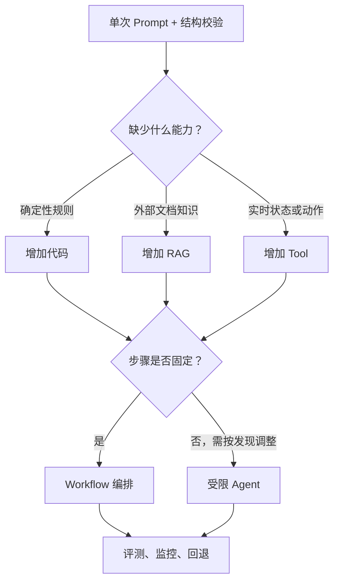
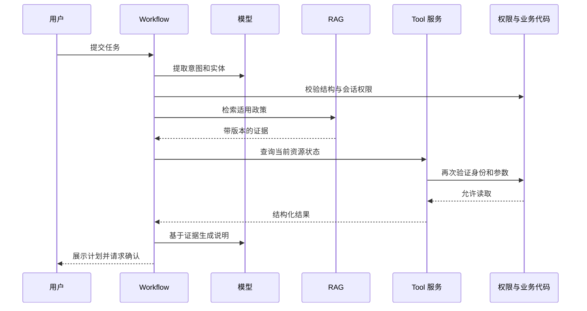

# Prompt、代码、RAG、Tool、Workflow 与 Agent 的选择

## 1. 方案选择要解决什么问题

AI 功能出现错误时，首先要确定错误属于哪一层，再选择能够直接控制该层的机制。Prompt、代码、RAG、Tool、Workflow 和 Agent 不是相互替代的同类组件，它们控制不同变量：

- Prompt：描述任务、上下文、边界和输出语义；
- 代码：执行确定性的计算、校验、权限和状态转换；
- RAG：从外部知识集合检索与当前问题相关的内容，作为生成上下文；
- Tool：让模型或编排器调用外部能力以读取实时状态或执行动作；
- Workflow：用预定义步骤、分支、重试和审批组织多个组件；
- Agent：让模型根据中间结果动态决定下一步和工具使用，直到达到停止条件。

选择原则是先使用能满足要求的最小系统，再用真实测试样例验证。如果失败根因是缺少当前订单状态，继续扩写 Prompt 不会产生可靠的实时事实；如果根因是权限规则没有执行，把规则放进 RAG 文档也不能替代后端授权。

## 2. 六种机制的责任与边界

### 2.1 Prompt：控制任务表达

Prompt 适合声明：

- 当前任务及非目标；
- 输入字段和上下文的含义；
- 输出内容、格式和缺失信息处理；
- 可用证据范围和引用要求；
- 语言、语气、长度和受众；
- 示例及边界任务的期望行为。

Prompt 的优势是修改快、适合处理自然语言语义、能在同一模型上适配不同任务。它的结果是概率性的，并会受到模型、上下文、采样参数和输入变化影响。Prompt 不能成为可靠的权限系统、财务计算器、事务锁或审计控制。

适合 Prompt 的问题：“摘要遗漏了风险项”“分类标签的含义不清”“缺少信息时仍然猜测”。不适合 Prompt 的问题：“必须精确计算税费”“只有管理员可以退款”“需要查询一分钟前的库存”“写操作必须恰好执行一次”。

### 2.2 代码：执行确定性规则

代码适合输入和规则都能明确表示、相同条件必须得到相同结果的部分：

- 数值计算、日期范围和枚举映射；
- Schema 校验、输入规范化和长度限制；
- 身份认证、资源授权和字段级权限；
- 状态机、幂等、事务和并发控制；
- 速率限制、预算、超时和重试上限；
- 日志脱敏、审计和错误分类。

代码的优势是可单元测试、可审计、行为稳定。它不擅长直接理解开放自然语言、模糊意图和多种正确表达。常见组合是由模型提取结构化候选，代码验证并执行规则。

任何安全、合规或业务不变量都应在模型之外再次执行。即使 Tool 参数 Schema 已约束输入，工具服务端也必须使用当前身份重新验证，不能信任模型声称的用户角色或资源归属。

### 2.3 RAG：提供外部知识上下文

RAG 将用户查询转换为检索请求，从知识库取回相关片段，再把片段与问题交给模型生成答案。它适合以下知识：

- 组织私有文档，模型训练时无法获得；
- 经常更新、需要独立发布和删除的内容；
- 回答必须引用来源或显示证据；
- 文档规模超过单次上下文，需按相关性选取；
- 同一模型需要服务不同租户或权限知识域。

RAG 的可控点包括文档采集、分块、元数据、索引、查询改写、召回、重排、权限过滤、上下文组装和引用验证。它不是“连接向量数据库”这一个动作。检索失败会产生无答案，召回错误会给生成器错误证据，旧索引会产生过期答案。

RAG 不适合替代强一致性事务查询。账户余额、库存和订单状态通常应从权威 API 或数据库 Tool 读取。把它们定期复制到向量索引会产生时效和一致性窗口。RAG 也不会自动消除幻觉；系统仍需验证回答是否由取回内容支持，并允许无依据时停止回答。

### 2.4 Tool：读取状态或执行能力

Tool 是带名称、描述、输入契约和结果的外部能力。模型可以选择调用 Tool，或由 Workflow 在固定步骤中调用。典型 Tool 包括：

- 查询订单、库存、日历、工单和天气；
- 执行数据库查询或精确计算；
- 创建退款草稿、发送消息、写文件；
- 调用搜索、浏览器或内部服务；
- 获取大型资源的特定部分。

Tool 与 RAG 的区别不只在“读”和“写”。Tool 也能读取数据，但它通常调用一个明确业务能力并返回结构化实时结果；RAG 通常在文档集合中按相关性检索证据。订单号能定位唯一记录时优先 Tool；用户询问某项政策且需要从多份文档找依据时优先 RAG。

工具描述和参数 Schema 帮助模型正确调用，不构成服务端安全边界。Tool 实现必须验证参数、当前授权、速率和资源归属；敏感或不可逆操作应展示实际参数并获得确认；写操作需要幂等键；结果要区分协议错误、业务错误和成功。

### 2.5 Workflow：固定可预测的执行路径

Workflow 由代码预先定义步骤和转换条件。常见形式包括：

- 顺序：提取 → 校验 → 查询 → 生成；
- 路由：按任务类型选择不同模型或处理器；
- 并行：独立检查同时运行，再聚合结果；
- 条件分支：有证据则回答，无证据则升级人工；
- 评估循环：生成 → 评分 → 在有限次数内修订；
- 人工审批：在外部副作用前暂停并确认。

Workflow 适合步骤已知、顺序有业务意义、失败需要恢复或审计的任务。它可以把概率性模型节点包在确定性控制流中，明确每一步输入、输出、超时、重试和补偿。

缺点是新增任务类型往往需要修改流程；若任务路径高度开放，穷举分支会复杂。但只要路径可预见，Workflow 通常比自由 Agent 更容易测试、控制成本和恢复失败。

### 2.6 Agent：动态决定路径

Agent 在循环中观察当前状态、选择模型或 Tool 动作、接收结果，再决定下一步。它适合无法在执行前列出固定步骤、任务跨度大且需要根据发现持续调整的工作，例如在一个未知代码库中定位并修复跨文件问题，或为开放研究任务决定后续搜索方向。

Agent 的自由度带来新的风险：循环不停止、重复调用、成本不可预测、错误逐步传播、工具误用和中间状态污染。生产 Agent 至少需要：

- 明确目标、允许范围和完成标准；
- 工具白名单与最小权限；
- 步数、时间、费用和数据边界；
- 每个工具的输入与结果校验；
- 敏感动作的确认或审批；
- 可恢复的状态、幂等和终止原因；
- 完整轨迹和结果级评测。

Agent 不是“更高级的 Workflow”。两者解决的问题不同：Workflow 的路径由代码定义，Agent 的路径由模型根据环境决定。许多产品只需一个模型调用、检索或固定工作流。

## 3. 从失败类型选择机制

| 失败现象 | 先验证的根因 | 优先机制 | 为什么 |
| --- | --- | --- | --- |
| 输出任务或字段语义理解错 | 指令和示例是否含糊 | Prompt | 直接澄清任务表达 |
| JSON 类型或字段不稳定 | 是否有生成约束和本地校验 | Schema + 代码 | 结构必须机器验证 |
| 算错金额、日期或排序 | 规则是否可确定表达 | 代码 | 相同输入必须稳定 |
| 不知道内部政策 | 是否存在权威文档 | RAG | 按问题取回外部证据 |
| 使用了过期政策 | 索引版本和有效期是否正确 | RAG + 代码 | 检索新内容并过滤版本 |
| 不知道当前订单状态 | 是否有权威实时 API | Tool | 读取当前系统记录 |
| 执行了越权动作 | 服务端是否验证当前身份 | 代码 | Prompt 和 Tool 描述不能授权 |
| 多步任务中断后重复写入 | 状态、幂等和恢复是否定义 | Workflow + 代码 | 控制步骤与副作用 |
| 下一步取决于未知发现 | 路径是否无法预先枚举 | 受限 Agent | 运行时动态选择动作 |
| Agent 循环或成本失控 | 是否有停止和预算边界 | 代码 + Workflow | 外部强制终止条件 |

同一错误可能需要组合方案。例如 RAG 回答中出现不支持的事实，根因可能是召回错误、Prompt 没要求仅依据证据、或生成后没有支持性检查。应对检索和生成分层评测，而不是把所有失败归为“Prompt 不好”。

## 4. 逐级增加系统复杂度

可以按以下顺序做基线，每一级只有在固定评测集证明不足时才升级：

“最小”不等于代码行数最少，而是故障模式和权限范围最小。把所有步骤塞进一个长 Prompt 可能代码少，但其结果难校验；把可预测任务做成 Workflow 往往更简单。

每次升级前记录：

1. 哪些真实失败证明当前方案不足；
2. 新机制直接解决哪个根因；
3. 新增延迟、费用、数据访问和故障模式；
4. 成功、失败、超时和权限的验收标准；
5. 如何降级、回滚或人工接管。

## 5. 组合机制时的信任边界

一套常见生产路径如下：

模型输出在进入代码、检索过滤器或 Tool 前都是不可信输入。RAG 文档也可能包含恶意指令，检索内容应作为数据而不是高优先级系统指令。Tool 结果来自外部系统，仍需验证类型、错误状态和内容大小。确认页面必须展示即将执行的真实参数，不能只展示模型概述。

## 6. 完整案例：订单退款助手

### 6.1 产品要求

用户用自然语言询问或申请退款。系统需要解释适用政策，查询当前订单，计算可退金额，在写入前取得确认，并确保重复请求不会生成两笔退款。政策来自版本化知识库，订单与身份来自交易系统。

发布目标：

- 意图和订单号提取准确率至少 `95%`；
- 政策回答的关键事实必须有当前有效文档支持；
- 权限越界、重复退款和未确认写入必须为 `0`；
- P95 总延迟低于 `4.0s`；
- 单任务模型费用低于 `¥0.04`。

### 6.2 逐层选择

第一层使用 Prompt 提取 `intent`、`order_id`、`reason_code` 和缺失字段，因为用户表达开放。输出使用 Schema 约束，并由代码重新验证。

第二层使用 RAG 检索退款政策，因为政策私有、会更新且回答需要引用。检索阶段按租户、地区、商品类型、生效时间和文档状态过滤，未取回有效证据时不允许模型自行补充。

第三层使用只读 Tool 查询订单，因为支付状态、归属、交付时间和已退款金额是实时事务数据。Tool 服务用当前会话重新验证订单归属，不接受模型提供的 `user_is_owner`。

第四层使用代码计算退款窗口和金额。金额以整数分计算：`可退金额 = 已支付金额 - 已退款金额`，并受当前政策上限约束。

第五层使用 Workflow 固定执行顺序：提取 → 校验 → 检索政策 → 查询订单 → 业务判断 → 展示计划 → 用户确认 → 幂等写入 → 查询最终状态。这个任务的步骤和审批点已知，不需要 Agent 自由决定路径。

### 6.3 为什么不选单一方案

| 单一方案 | 无法满足的要求 |
| --- | --- |
| 只有 Prompt | 不知道实时订单，不能强制权限、金额和幂等 |
| 只有代码 | 难以处理开放自然语言和多种用户表达 |
| 只有 RAG | 文档索引不是订单交易真相，不能执行动作 |
| 只有 Tool | 查询和写入能力不负责解释长政策与自然语言 |
| 自由 Agent | 固定流程被动态化，增加写操作和成本风险 |

最终方案不是把六种机制全部使用，而是 `Prompt + RAG + Tool + 代码 + Workflow`；不使用 Agent，因为路径能够预先定义。

### 6.4 固定测试输入

测试输入：“订单 O-482731 昨天收到时已经破损，退掉要扣钱吗？如果可以就帮我退。”当前用户为 `U-17`。RAG 返回 `refund-policy-2026-07` 的两段有效证据；订单 Tool 返回订单属于 `U-17`、已支付 `12900` 分、已退款 `0` 分、在退款窗口内。

代码算出可退金额 `12900 - 0 = 12900` 分。Workflow 输出退款计划和政策引用，但不执行写入，因为“如果可以就帮我退”不能替代系统展示准确金额后的最终确认。用户确认后，写 Tool 使用幂等键 `refund:O-482731:full:v1`，再查询最终状态。

### 6.5 基线与组合方案的可复算比较

团队用同一组 200 个样例比较三版。费用为模型和检索的测量均值，延迟为测试环境 P95：

| 方案 | 任务通过 | 权限或重复写入违规 | P95 延迟 | 平均费用 |
| --- | ---: | ---: | ---: | ---: |
| A：单次 Prompt | 128 / 200 = 64% | 7 | 1.2s | ¥0.012 |
| B：Prompt + RAG + Tool | 174 / 200 = 87% | 3 | 2.8s | ¥0.029 |
| C：B + 代码规则 + Workflow | 190 / 200 = 95% | 0 | 3.6s | ¥0.034 |

方案 C 满足准确率、零违规、延迟和费用门槛。与 B 相比增加的 16 个通过任务来自权限、金额、确认和重试恢复，而不是更长 Prompt。由于零违规是硬门槛，即使 A 更快更便宜也不能发布。

这些数字只能说明当前固定集和测试环境。若实际流量分布、工具延迟或政策复杂度变化，必须通过生产监控和新样例重新验证。

## 7. 各层失败时怎样处理

### 7.1 Prompt 或结构失败

缺字段或未知枚举返回结构错误；最多执行预先限定的重试，并记录原始失败。不要用正则静默补全后直接进入 Tool。持续失败时要求用户补充信息或升级人工。

### 7.2 RAG 无结果或证据冲突

无有效证据时明确无法确认，不使用模型参数知识补充私有政策。多份有效文档冲突时按生效时间和文档权威规则处理；规则不能决定时升级政策负责人。检索输入、过滤条件、文档版本和引用进入轨迹。

### 7.3 Tool 超时或返回业务错误

只读查询可按错误类型进行有上限的退避重试。写操作重试必须复用同一幂等键，并先查询最终状态。权限错误不应通过换 Prompt 或重复调用绕过；向用户返回不泄露资源存在性的统一结果。

### 7.4 Workflow 中断

保存当前状态和已完成副作用，恢复时从安全检查点继续。不能从第一步盲目重放所有写操作。每个节点声明超时、可重试错误、最大次数和补偿策略。

### 7.5 Agent 超出边界

若开放任务确实使用 Agent，外部执行器在步数、时间、费用或工具边界达到上限时强制停止。模型说“还需要一步”不能覆盖预算。停止后返回轨迹和未完成状态，由人工决定是否扩展权限或预算。

## 8. 评测必须按层定位

端到端通过率不能告诉团队应修改哪一层。至少分别测量：

- Prompt：意图、实体、缺失字段和输出结构；
- RAG：召回覆盖、排序、权限过滤、版本和证据相关性；
- 生成：事实是否由证据支持，引用是否对应；
- Tool：参数校验、授权、超时、错误和幂等；
- 代码：边界值、金额、日期、状态机和并发；
- Workflow：路由、重试、恢复、审批和最终状态；
- Agent：任务完成、工具轨迹、停止原因、成本和环境结果。

修改任一层后运行该层测试和端到端回归。若只看最终文本，系统可能声称“退款成功”但数据库没有记录；结果级评测必须检查权威系统最终状态。

## 9. 架构评审清单

- 失败根因是否有真实样例和可复现证据；
- 能否用单次模型调用加结构校验满足要求；
- 哪些规则必须确定执行，是否全部在代码中；
- 所需信息是文档知识、实时状态还是动作能力；
- RAG 是否有权限、版本、无答案和引用策略；
- Tool 是否最小权限、服务端校验、超时、审计和幂等；
- 执行步骤是否可以预先定义，是否真的需要 Agent；
- 是否声明费用、延迟、步数和数据边界；
- 敏感副作用是否显示真实参数并获得确认；
- 每层是否有独立评测、监控和回退路径；
- 新机制增加的复杂度是否由指标改善证明。

## 10. 练习

### 练习一：为知识问答选择方案

场景：员工询问当前差旅政策，也可能要求查询自己的报销单进度。分别为“解释政策”和“查询进度”选择组件，并画出信任边界。

验收标准：政策使用带版本和权限过滤的 RAG；进度使用验证当前身份的 Tool；模型不能根据文档猜测报销状态；无证据、无权限和 Tool 超时都有明确分支。

### 练习二：判断是否需要 Agent

比较两个任务：固定格式生成周报；在未知代码库中定位造成间歇性失败的原因。为每个任务写出最小架构、停止条件、可执行动作和评测方式。

验收标准：周报不引入自由 Agent；代码诊断若使用 Agent，必须限制目录、命令、时间和步数；任何写入或外部副作用单独授权；评测检查最终结果而非只检查模型解释。

## 来源

- [Anthropic：Building Effective Agents](https://www.anthropic.com/engineering/building-effective-agents)（访问日期：2026-07-17）
- [OpenAI：Function Calling](https://developers.openai.com/api/docs/guides/function-calling)（访问日期：2026-07-17）
- [Model Context Protocol：Tools](https://modelcontextprotocol.io/specification/2025-11-25/server/tools)（访问日期：2026-07-17）
- [Lewis 等：Retrieval-Augmented Generation for Knowledge-Intensive NLP Tasks](https://arxiv.org/abs/2005.11401)（访问日期：2026-07-17）
