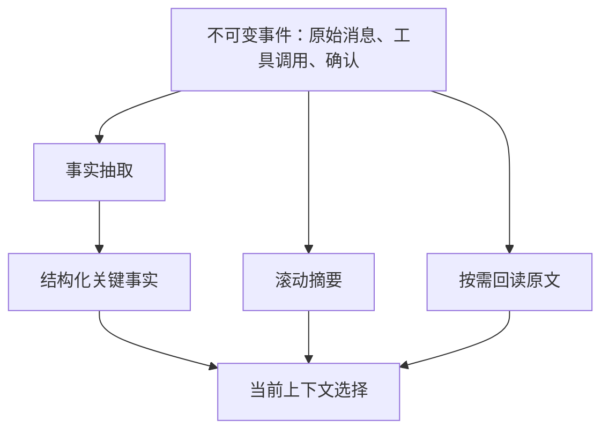

# 长对话摘要与关键事实保留

对话摘要把较早的多轮内容压缩为更短表示，以释放上下文空间。摘要不是原始记录，也不是数据库事实；它是可能遗漏、误归因或改写含义的模型派生数据。可靠系统应把可验证事实、未决事项、用户偏好和原始证据位置分别管理。

## 前置知识与能力边界

前置阅读：

- [Token Budget 的建立与分配](03-token-budget-allocation.md)。
- [指令与数据的边界](01-instruction-data-boundary.md)。
- [固定样例与模型/Prompt 对比](../13-evaluation/fixed-cases-comparison.md)。

摘要适合减少重复语言，不适合替代合同、账本、授权记录、精确代码、审批参数和需要逐字引用的原文。

## 对话中需要区分的内容

| 类型 | 示例 | 压缩策略 |
|---|---|---|
| 当前目标 | 修复支付回调重复入账 | 原意保留，可结构化 |
| 用户明确约束 | 只能修改 `payments/` | 原文或等价受控字段 |
| 已验证事实 | 订单状态来自数据库 | 保存值、版本、来源和时间 |
| 未验证陈述 | 用户说已获经理批准 | 标为声明，不提升可信度 |
| 已完成决策 | 选择方案 B，拒绝方案 A | 保存理由和决策主体 |
| 未决问题 | 是否允许重放旧事件 | 保持开放状态 |
| 工具结果 | 测试 17/18 通过 | 保存运行 ID 和摘要 |
| 闲聊与重复 | 多次表达感谢 | 可删除 |
| Secret | API Key | 不应进入摘要或上下文 |

如果所有内容都被压成一段自然语言，来源、状态和有效期会丢失。

## 分层状态模型



原始事件是审计和重算依据；滚动摘要用于连续性；结构化事实用于精确选择。任何摘要错误都应能通过原始事件重建。

## 摘要 Schema

```json
{
  "summaryVersion": 3,
  "coversThroughEventId": "evt_184",
  "goal": "修复支付回调重复入账",
  "constraints": [
    {
      "text": "只修改 payments/ 目录",
      "sourceEventId": "evt_103",
      "status": "active"
    }
  ],
  "verifiedFacts": [
    {
      "key": "failing_test",
      "value": "payment_retry.test.ts",
      "source": "test-run:run_77",
      "observedAt": "2026-07-17T09:20:00Z"
    }
  ],
  "decisions": [
    {
      "choice": "使用事件 ID 作为幂等键",
      "decidedBy": "user",
      "sourceEventId": "evt_160"
    }
  ],
  "openQuestions": [
    "旧事件保留多久"
  ],
  "excluded": [
    {"eventRange": "evt_110..evt_122", "reason": "repetition"}
  ]
}
```

`coversThroughEventId` 使系统知道哪些事件已纳入摘要。没有覆盖水位，重试可能重复总结或漏掉消息。

## 摘要更新流程

1. 读取上一个已提交摘要和其覆盖水位。
2. 加载水位之后的完整事件。
3. 分离用户消息、助手消息、工具结果和确认事件。
4. 用 Schema 生成候选摘要。
5. 校验来源事件确实存在。
6. 对关键数字、ID、路径和否定词做确定性比对。
7. 保存新摘要，使用乐观版本避免并发覆盖。
8. 只在摘要提交后推进覆盖水位。
9. 运行关键事实问答回归。

摘要生成失败时保留旧摘要和新增原始事件，不能把失败的半截结果设为当前状态。

## 关键事实的提取规则

### 主体

“Alice 建议 Bob 删除缓存”不能摘要成“Bob 建议删除缓存”。每条决策记录说话者、批准者与执行者。

### 否定

“不要自动退款”与“自动退款”只有一个否定词差异，后果完全相反。关键约束应存原文片段和结构化布尔含义。

### 数字和单位

金额、时区、日期、百分比、版本和数量必须保留单位。`30` 不能脱离“分钟”或“天”。

### 时间

“明天”要绑定消息时间与用户时区，转换成明确日期时记录转换依据。不能在摘要下一次更新时重新解释。

### 状态

要求标记 `proposed`、`confirmed`、`superseded`、`completed` 或 `rejected`。旧决定被新决定覆盖后仍保留来源，但不再作为活动约束。

## 摘要器的确定性外壳

```javascript
export function validateSummary(summary, eventsById) {
  const errors = [];

  if (!Number.isInteger(summary.summaryVersion)) {
    errors.push("summaryVersion must be an integer");
  }

  for (const constraint of summary.constraints ?? []) {
    const event = eventsById.get(constraint.sourceEventId);
    if (!event) {
      errors.push(`missing source event ${constraint.sourceEventId}`);
      continue;
    }
    if (event.kind !== "user_message" && event.kind !== "approval") {
      errors.push(`invalid constraint source ${constraint.sourceEventId}`);
    }
  }

  for (const fact of summary.verifiedFacts ?? []) {
    if (!fact.source || !fact.observedAt) {
      errors.push(`fact ${fact.key} lacks provenance`);
    }
  }

  return {ok: errors.length === 0, errors};
}
```

该校验不能证明摘要语义完全正确，但能拒绝无来源约束和缺少 provenance 的“事实”。

## 应用案例一：长时间代码任务

### 输入

任务经历 160 轮：

- 用户最初要求修复重复扣款。
- 第 42 轮限制只能修改 `payments/`。
- 第 71 轮测试显示重复源于 webhook 重试。
- 第 95 轮模型建议按订单 ID 去重。
- 第 101 轮用户拒绝，因为同一订单可多次合法支付。
- 第 128 轮用户确认使用 provider event ID。
- 第 150 轮测试 17/18 通过，剩余时区用例失败。

### 压缩步骤

1. 保留当前目标。
2. 把目录限制记录为 active constraint。
3. 保存“订单 ID 方案被拒绝”，防止再次提出。
4. 把 event ID 方案记录为用户确认决策。
5. 保存测试运行 ID 与唯一失败用例。
6. 删除中间重复解释，但保留对应事件范围。
7. 最近 12 轮继续原文保留，便于处理当前失败。

### 输出

```json
{
  "goal": "修复 webhook 重试造成的重复扣款",
  "activeConstraints": [
    "只修改 payments/ 目录"
  ],
  "confirmedDecisions": [
    "以 provider event ID 作为幂等键"
  ],
  "rejectedAlternatives": [
    "订单 ID：同一订单允许多次合法支付"
  ],
  "currentState": {
    "testRun": "run_91",
    "passed": 17,
    "failed": 1,
    "failure": "timezone boundary"
  }
}
```

### 验证

- 向只读评估器询问“允许修改哪些目录”，必须回答 `payments/`。
- 询问“为何不用订单 ID”，必须能定位第 101 轮。
- 摘要前后继续任务，各运行一次真实测试。
- 将关键事实移到对话中部，确认抽取不依赖位置。
- 摘要器升级后从原始事件重建并比较字段差异。

### 失败分支

若摘要只写“决定加入幂等”，没有键类型，模型可能再次选择订单 ID。修复是将决策拆为可操作字段，并保存被拒方案与理由。

## 应用案例二：旅行规划

### 输入

用户多轮表达：

- 出发地上海。
- 可出发日期为 2026-10-02 或 10-03。
- 不坐红眼航班。
- 预算最初为 12,000 元，之后改为 15,000 元。
- 对花生严重过敏。
- 用户删除了“喜欢靠窗座位”的记忆。

### 摘要处理

1. 把预算旧值标为 superseded。
2. 严重过敏属于高敏感个人数据，只有当前旅行任务确需时才保留。
3. 删除请求后，不再把靠窗偏好加入摘要；同时安排持久记忆删除。
4. 相对日期转为用户确认的绝对日期。
5. 航班搜索工具仍以结构化参数调用，不让模型自由改日期。

### 输出状态

```json
{
  "trip": {
    "origin": "SHA",
    "departureDates": ["2026-10-02", "2026-10-03"],
    "maxBudget": {"amount": "15000", "currency": "CNY"},
    "excludeRedEye": true
  },
  "sensitiveConstraints": [
    {
      "type": "allergy",
      "value": "peanut",
      "scope": "current_trip"
    }
  ],
  "deletedPreferences": ["seat_preference"]
}
```

### 验证

- 任何候选航班不得违反日期与红眼条件。
- 价格比较使用同币种和同税费范围。
- 新请求不得重新出现靠窗偏好。
- 当前旅行结束后，过敏信息按定义的范围过期。
- 用户可查看摘要并纠正出发机场。

### 失败分支

若滚动摘要采用“用新摘要总结旧摘要”，删除过的座位偏好可能从旧摘要重新进入。更新时必须把删除 tombstone 作为高优先级输入，并从可验证事件重建受影响字段。

## 滚动摘要、分段摘要和检索的取舍

| 方案 | 优点 | 风险 | 适用情况 |
|---|---|---|---|
| 单一滚动摘要 | 输入小、使用简单 | 错误递归累积 | 连续低风险聊天 |
| 分段摘要 | 可定位原始范围 | 需要额外选择 | 长项目与会议 |
| 结构化事实 + 最近原文 | 精确、易校验 | Schema 设计成本 | 任务型助手 |
| 原始事件检索 | 保留细节 | 检索可能漏召回 | 超长、多会话 |
| 全量历史 | 无摘要误差 | Token、噪声、位置问题 | 短会话 |

生产系统常组合结构化事实、最近原文、分段摘要和按需检索。

## 并发与版本

同一会话可能同时发生模型回复、工具回调和用户编辑。摘要记录应包含：

- `summary_version`。
- `covers_through_event_id`。
- `source_event_count`。
- `created_at`。
- `generator_model`。
- `prompt_version`。
- `schema_version`。

更新使用 compare-and-swap。版本冲突时重新加载新增事件，不覆盖另一个更新者已提交的摘要。

## 摘要评估

### 字段级

- 关键事实召回率。
- 错误事实率。
- 主体归因准确率。
- 数字与单位完全匹配率。
- 活动约束状态准确率。
- provenance 可定位率。

### 任务级

- 摘要后任务完成率。
- 重复询问率。
- 违反已确认约束率。
- 错误恢复到已拒方案的比例。
- 用户纠正次数。

摘要语言流畅度不是主要验收指标。

## 调试路径

1. 找到错误回答依赖的摘要字段。
2. 查看字段来源事件与抽取版本。
3. 判断是未抽取、错误合并、过期未失效还是选择阶段遗漏。
4. 用原始事件重放摘要。
5. 将该事件序列加入回归集。
6. 同时检查修复是否错误保留更多敏感数据。

## 数据保护与用户控制

- 摘要的保存期不能自动长于原始数据允许期限。
- 用户删除原始消息时，派生摘要和向量索引也要处理。
- 敏感事实应有目的、范围、过期和访问记录。
- 调试页面展示脱敏内容。
- 用户纠正事实时保存修订，不静默篡改审计事件。
- 平台托管会话状态的保留行为需要与产品政策一致。

## 综合练习：项目协作助手

让助手跨 300 轮讨论维护需求、决策、风险和任务。

验收标准：

- 原始事件不可变，并有稳定事件 ID。
- 摘要包含覆盖水位和 Schema 版本。
- 需求、决策、拒绝方案、未决问题分别存储。
- 每个关键字段能定位原始消息或工具运行。
- 并发摘要更新不会丢事件。
- 删除或更正可传播到派生状态。
- 评估集包含主体混淆、否定、数字、旧值覆盖和中部事实。
- 摘要前后项目问答准确率、Token、延迟和费用都有对照。

## 来源

- [MemGPT: Towards LLMs as Operating Systems](https://arxiv.org/abs/2310.08560)（访问日期：2026-07-17）
- [Recursively Summarizing Enables Long-Term Dialogue Memory](https://arxiv.org/abs/2308.15022)（访问日期：2026-07-17）
- [Exploring Factual Consistency in Dialogue Comprehension](https://arxiv.org/abs/2311.07194)（访问日期：2026-07-17）
- [OpenAI API：Conversations](https://platform.openai.com/docs/api-reference/conversations)（访问日期：2026-07-17）
- [OpenAI API：Data controls](https://platform.openai.com/docs/models/default-usage-policies-by-endpoint)（访问日期：2026-07-17）
