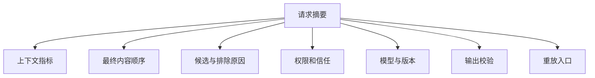
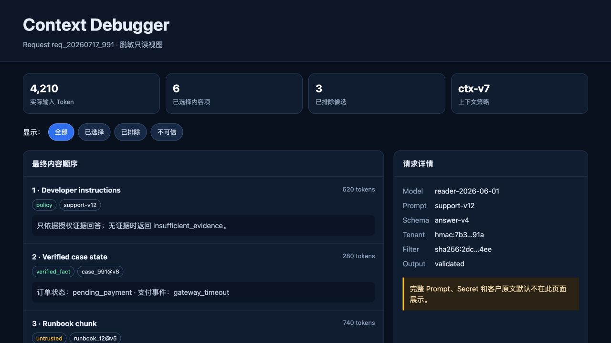
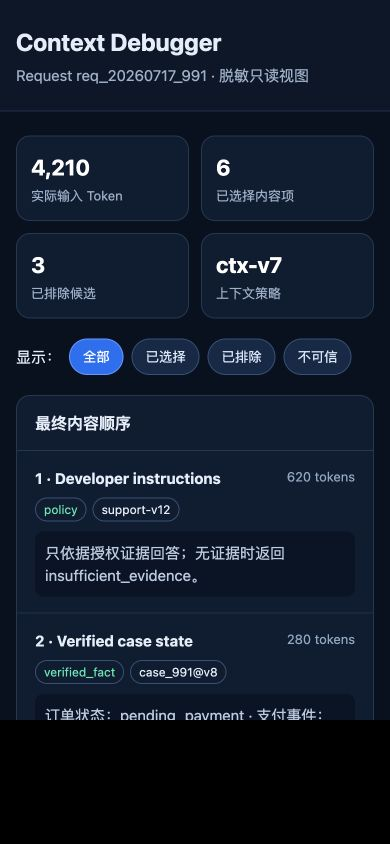

# 上下文调试页面

上下文调试页面把一次模型调用的内容项、顺序、来源、信任级别、权限过滤、Token 分配和排除原因展示为可检查状态。它面向开发、质量和受授权的安全人员，不应成为任意浏览用户 Prompt 与敏感数据的后台。

## 前置知识与产出

前置阅读：

- [最终模型输入的记录与可重放性](07-final-model-input-recording.md)。
- [上下文去重、过期与冲突](05-dedup-staleness-conflicts.md)。
- [上下文权限与租户隔离](06-context-permission-tenant-isolation.md)。

可运行示例：

- [Context Debugger HTML](../../examples/context-engineering/context-debugger.html)。

页面只展示脱敏的静态示例，不连接生产日志或模型 API。

## 调试页面要回答的问题

1. 这次请求使用哪个模型、Prompt、Schema 和上下文策略版本。
2. 最终输入有哪些内容项，顺序是什么。
3. 每项来自哪里，是否可信，属于哪个资源版本。
4. 每项占多少 Token。
5. 哪些候选被排除，原因是什么。
6. 权限过滤是否在检索前生效。
7. 是否存在过期、重复或冲突内容。
8. 输出是否通过结构和业务校验。
9. 能否定位 trace，而不直接暴露 Secret 与完整敏感正文。

页面不应尝试展示模型的私有思维过程。工程调试依赖真实输入、输出、选择决策与可观察事件。

## 信息架构



所有区域以同一个 request ID 和 trace ID 关联。重放入口应默认只读且禁止生产副作用。

## 请求摘要

建议字段：

| 字段 | 作用 | 展示边界 |
|---|---|---|
| request ID | 定位应用请求 | 可展示随机 ID |
| trace ID | 跨服务关联 | 不编码用户身份 |
| task | 区分功能 | 使用受控枚举 |
| created at | 还原时间 | 展示绝对时刻与时区 |
| user/tenant | 权限上下文 | 默认 HMAC 或别名 |
| status | completed/failed/cancelled | 区分业务与模型状态 |
| latency | 总时长和阶段时长 | 不只显示模型耗时 |

不要把 bearer token、session cookie、完整邮箱或客户名称放在标题。

## 上下文内容项

每项应显示：

- 最终位置。
- 类型：指令、当前输入、历史、事实、检索、工具结果。
- 来源和版本。
- trust label。
- estimated/actual token。
- selected/excluded。
- 选择或排除理由。
- 内容 hash。
- 脱敏预览。
- 原始 artifact 的受控访问入口。

### 顺序很重要

只用表格按来源分组会隐藏最终 Prompt 顺序。调试器应提供“最终顺序”和“按来源聚合”两个视图。

### 预览不是原文

预览必须标记：

- 是否截断。
- 是否脱敏。
- 是否摘要。
- 是否经过格式转义。
- 原始内容是否仍存在。

不能用预览 hash 代替最终发送内容的 hash。

## 候选与排除

```json
{
  "candidateId": "policy-v3#refund",
  "decision": "expired",
  "policyRule": "valid_at_query_time",
  "validTo": "2026-07-01T00:00:00Z",
  "queryTime": "2026-07-17T09:00:00Z",
  "contentVisible": false
}
```

权限拒绝候选的正文和敏感标识默认不显示。页面可以显示：

```text
permission_denied: 4 candidates
```

只有安全调查角色在有审计的流程中才能展开受控详情。

## Token 可视化

### 必须区分

- context limit。
- reserved output。
- safety margin。
- fixed instructions。
- selected context。
- excluded by budget。
- API actual usage。
- cached tokens。

进度条要配数值和文本，不能只靠颜色。超过预算时显示哪个步骤做了裁剪或摘要。

### 不应展示虚假精度

本地估算与服务端 Usage 可能不同。页面分别显示：

```text
estimated input: 4,080
actual input: 4,210
difference: +130
```

不要把估算写成“精确 Token”。

## 信任和权限展示

颜色只能辅助，标签文字不可省：

- `policy`。
- `verified_fact`。
- `untrusted`。
- `model_derived`。
- `permission_denied`。

权限面板显示决策 ID、filter hash 和允许范围摘要，不显示完整角色 token。模型上下文中若出现其他租户 ID，应触发明显安全告警。

## 版本和 Artifact

页面应能回答：

| Artifact | 必需标识 |
|---|---|
| 模型 | provider + 完整 model ID |
| Prompt | 不可变版本或内容 hash |
| Schema | 版本和 hash |
| 工具 | 名称、版本、Schema hash |
| 上下文策略 | 版本 |
| tokenizer | 库与 encoding 版本 |
| reranker | 模型与配置 |
| 内容 | source/version/hash |

只写“latest”无法重放。

## 一个安全的 API 响应

```json
{
  "request": {
    "id": "req_20260717_991",
    "traceId": "4bf92f3577b34da6a3ce929d0e0e4736",
    "task": "support_answer",
    "status": "completed"
  },
  "versions": {
    "model": "reader-2026-06-01",
    "prompt": "support-v12",
    "schema": "answer-v4",
    "contextPolicy": "ctx-v7"
  },
  "budget": {
    "estimatedInput": 4080,
    "actualInput": 4210,
    "reservedOutput": 1200
  },
  "items": [
    {
      "position": 1,
      "kind": "instruction",
      "source": "support-v12",
      "trust": "policy",
      "tokens": 620,
      "preview": "只依据授权证据回答……"
    }
  ],
  "excludedCounts": {
    "expired": 1,
    "duplicate": 1,
    "permissionDenied": 4
  }
}
```

API 服务端根据调试者权限生成视图，不能把完整内部 trace 发到浏览器后再用 CSS 隐藏。

## 应用案例一：回答引用旧政策

### 输入

工单助手回答“退款期 7 天”，当前政策实际是 30 天。开发者打开 request `req_991`。

### 页面检查路径

1. 请求版本显示模型正常，Prompt 为 `support-v12`。
2. 最终顺序中出现 `policy-v3`，标签为 untrusted。
3. 候选区域显示 `policy-v5` 被 budget 排除。
4. `policy-v3` 的 `validTo` 为空，说明索引元数据错误。
5. 引用校验只验证“引用存在”，没有验证“版本当前有效”。

### 诊断输出

```json
{
  "rootCause": "stale_metadata",
  "contributingFactors": [
    "budget_policy_ignored_document_version",
    "citation_validator_did_not_check_validity"
  ],
  "affectedArtifacts": [
    "index:policy-v3",
    "context-policy:ctx-v7",
    "citation-validator:v2"
  ]
}
```

### 修复验证

- 重建 v3/v5 metadata。
- 上下文策略先过滤有效期再分配预算。
- 引用校验加入查询时间与版本。
- 结构重放显示 v3 excluded、v5 selected。
- 固定政策问答回归全部通过。

### 失败分支

若页面只显示最终 Prompt，开发者能看到 v3，却看不到 v5 曾被候选并错误排除。候选决策是根因分析的必要部分。

## 应用案例二：工具调用参数异常

### 输入

Agent 试图请求：

```json
{
  "tool": "fetch_url",
  "arguments": {
    "url": "http://169.254.169.254/latest/meta-data/"
  }
}
```

控制层正确拒绝了请求。

### 页面需要展示

- 原始用户任务：“总结公开产品页”。
- 工具结果之前的外部网页 chunk。
- chunk 的 `untrusted` 标签。
- 模型提出的参数。
- URL 策略拒绝原因 `link_local_address`。
- 工具从未真正发起网络请求。
- 当前模型暴露的工具集合。

### 输出状态

```json
{
  "proposal": "fetch_url",
  "authorization": "denied",
  "validation": {
    "scheme": "http",
    "resolvedAddressClass": "link_local",
    "reason": "network_target_not_allowed"
  },
  "sideEffect": "not_started"
}
```

### 验证

- 页面不尝试加载该 URL 生成预览。
- 地址被显示为文本，不成为可点击自动请求。
- 重放使用模拟工具。
- 相同攻击加入对抗回归。

### 失败分支

若调试页面自动生成远程链接预览，它自身可能发起 SSRF。调试器渲染不可信 URL 时必须禁用自动抓取，并对外链增加明确操作和安全检查。

## 交互状态

调试页至少处理：

- Loading：显示正在读取哪些安全视图。
- Empty：请求存在但没有模型调用。
- Permission denied：不泄露 request 是否属于别人。
- Partial trace：某些 span 未采样。
- Deleted artifact：显示已按保留政策删除。
- Corrupted manifest：hash 不匹配。
- Completed：所有区域可用。
- Exporting：导出范围和脱敏规则明确。

## 无障碍要求

- 筛选按钮使用真实 `button`。
- 当前筛选用 `aria-pressed`。
- 指标区域有可访问名称。
- 状态不只靠红绿颜色。
- 键盘可以访问所有控件。
- 焦点样式清晰。
- 窄屏改为单列，不产生横向滚动。
- 代码和长 ID 可换行，但保持可复制。

## 前端安全

### XSS

Prompt、网页、工具结果和模型输出都必须按文本渲染。不要用未净化的 `innerHTML`。Markdown 渲染器要禁用危险 HTML、脚本 URL 和自动资源加载。

### URL

不可信 URL 默认显示文本。允许点击时经过中转页、scheme allowlist 和目标提示。

### 导出

导出文件可能包含敏感信息。服务端按字段 allowlist 生成，带用途、过期和审计；不能直接下载浏览器内全部 state。

### 权限

API 每次请求都重新授权。前端路由隐藏和按钮禁用不构成权限控制。

## 性能与分页

一个 Agent trace 可能有数千步骤。页面应：

- 分页加载摘要。
- 按需加载预览。
- 大内容用 artifact ID。
- 虚拟化长列表时保持键盘和屏幕阅读器可用。
- 不在浏览器下载完整敏感 trace 后再过滤。
- 显示采样和缺失数据。

## 实际示例的检查点

[可运行页面](../../examples/context-engineering/context-debugger.html) 提供：

- 指标卡片。
- selected/excluded/untrusted 筛选。
- 内容项顺序。
- trust 与 exclusion 标签。
- 脱敏请求详情。
- 桌面双栏和窄屏单栏布局。

筛选行为应满足：

```text
全部 -> 5 项
已选择 -> 3 项
已排除 -> 2 项
不可信 -> 3 项
```

桌面视图：



390px 窄屏视图：



真实浏览器验证结果：

- 桌面宽度与 390px 宽度均没有横向溢出。
- 浏览器控制台没有错误。
- 使用键盘可以把焦点移到筛选按钮。
- 选择“已排除”后，按钮的 `aria-pressed` 更新为 `true`。
- 筛选后列表只保留 `expired` 与 `duplicate` 两项，与数据状态一致。

继续扩展示例时，应把这些检查加入浏览器自动化回归测试，防止布局、ARIA 状态和筛选逻辑退化。

## 调试页面自身的观测

- 谁访问了哪个 request。
- 展开了哪些敏感 artifact。
- 是否导出。
- 服务端脱敏规则版本。
- 授权 decision ID。
- 页面错误和缺失 span。

访问日志不能再次保存展开的完整内容。

## 常见错误

### 直接展示厂商原始请求

方便但可能含 Secret、完整 PII 和无关内部字段。应转换为应用层安全视图。

### 只展示 selected

无法解释召回和选择错误。至少显示安全聚合的排除原因。

### 用模型解释 trace

模型可以辅助总结，但真实选择和权限决策来自代码事件。不能让模型生成的根因覆盖证据。

### 开放生产重放

重放可能重复邮件、支付或删除。默认使用只读模拟和独立环境。

### 调试权限过宽

“工程师”角色不能自动读取所有租户 Prompt。使用按工单、租户、时间和目的授权的临时访问。

## 生产验收清单

- 页面通过受控身份访问。
- 内容由服务端脱敏和裁剪。
- selected 顺序与 manifest 一致。
- exclusion reason 可解释。
- 权限拒绝内容不泄露详情。
- Token 估算和实际值分开。
- 工具提案与真实执行状态分开。
- 不渲染不可信 HTML。
- 重放默认无副作用。
- 桌面、窄屏和键盘可用。
- 查看与导出有审计。
- 数据删除后页面显示 tombstone，不恢复原文。

## 综合练习：Agent Trace 调试器

扩展示例以查看多步骤 Agent。

验收标准：

- 时间线包含模型调用、工具提案、授权、确认和结果。
- 每一步能展开当时的上下文 manifest。
- 工具结果标明可信级别和截断。
- 循环步骤被聚合但可定位。
- 高风险参数默认遮罩，按权限临时展开。
- 重放器使用模拟工具并禁止生产凭据。
- 1000 步 trace 仍可分页和键盘操作。
- XSS、SSRF、跨租户和导出权限进入安全测试。

## 来源

- [OpenTelemetry：Generative AI Semantic Conventions](https://opentelemetry.io/docs/specs/semconv/gen-ai/)（访问日期：2026-07-17）
- [W3C Trace Context](https://www.w3.org/TR/trace-context/)（访问日期：2026-07-17）
- [OWASP Cross Site Scripting Prevention Cheat Sheet](https://cheatsheetseries.owasp.org/cheatsheets/Cross_Site_Scripting_Prevention_Cheat_Sheet.html)（访问日期：2026-07-17）
- [NIST Privacy Framework Core](https://www.nist.gov/system/files/documents/2021/05/05/NIST-Privacy-Framework-V1.0-Core-PDF.pdf)（访问日期：2026-07-17）
