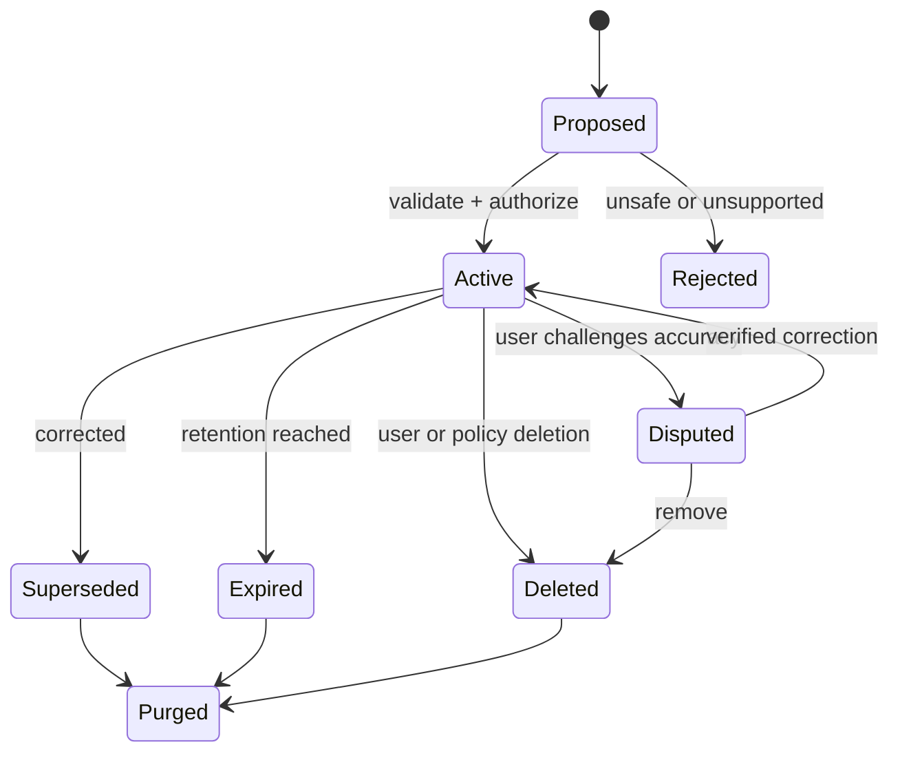

# 记忆生命周期与用户控制

AI 记忆是应用持久化并在以后请求中选择使用的信息。用户可查看、修改、删除和限制记忆，系统则必须定义写入依据、用途、范围、有效期、来源、访问控制和派生数据清理。模型声称“我会记住”或“已经忘记”不等于存储操作完成。

## 前置知识与边界

前置阅读：

- [长对话摘要与关键事实保留](04-conversation-summary-key-facts.md)。
- [上下文权限与租户隔离](06-context-permission-tenant-isolation.md)。
- [最终模型输入的记录与可重放性](07-final-model-input-recording.md)。

本文提供工程模型，不替代具体司法辖区的法律意见。上线前应由隐私、安全和法务根据数据类别与使用地区确认要求。

## 记忆对象

```json
{
  "id": "mem_771",
  "subjectId": "user_42",
  "tenantId": "tenant_9",
  "kind": "preference",
  "key": "response_language",
  "value": "zh-CN",
  "sourceEventId": "evt_188",
  "createdAt": "2026-07-17T09:00:00Z",
  "updatedAt": "2026-07-17T09:00:00Z",
  "expiresAt": "2027-01-17T09:00:00Z",
  "scope": ["assistant-writing"],
  "status": "active",
  "sensitivity": "low",
  "confidence": 1,
  "writeBasis": "explicit_user_request",
  "version": 1
}
```

字段含义：

- `subjectId`：记忆描述谁，不能只等于当前操作者。
- `tenantId`：组织边界。
- `kind/key/value`：受控类型，不把任意段落作为长期事实。
- `sourceEventId`：可追溯原始请求。
- `scope`：哪些功能允许使用。
- `expiresAt`：自动过期。
- `status`：active、superseded、deleted、expired、disputed。
- `writeBasis`：显式请求、产品必要状态或其他受控依据。
- `version`：支持并发修改。

## 生命周期



删除状态先形成 tombstone，防止异步副本把旧值重新写回；物理清理随后覆盖主库、缓存、索引、摘要和供应商对象。

## 写入规则

### 显式记忆

用户说“以后默认用中文回答”。系统：

1. 识别为记忆候选。
2. 向用户显示将保存的具体值和范围。
3. 校验类型与长度。
4. 写入后返回可查看入口。

### 隐式推断

从行为推断偏好风险更高。一次使用深色主题不能证明长期偏好。若确实采用：

- 标记 `model_derived`。
- 使用较低 confidence。
- 设置短 TTL。
- 不保存敏感推断。
- 提供关闭和删除。
- 评估误推断与差异影响。

### 禁止或限制写入

默认不保存：

- 密码、API Key、恢复码。
- 完整支付卡数据。
- 未经必要性评估的健康、政治、宗教等敏感推断。
- 其他人的私人信息。
- 文档中的 Prompt Injection 指令。
- 模型臆测的身份和权限。
- 临时一次性参数。

## 读取规则

记忆只有同时满足下列条件才进入上下文：

- 当前主体有权读取。
- 租户匹配。
- status 为 active。
- 未过期。
- 当前功能在 scope 内。
- 数据敏感级别允许发送给当前模型和地区。
- 与当前任务相关。
- 没有更高版本或删除 tombstone。

记忆检索也需要 Token 预算和去重，不能每次加载全部个人档案。

## 修改语义

修改不应静默覆盖审计来源：

```json
{
  "oldMemoryId": "mem_771",
  "newMemoryId": "mem_804",
  "change": {
    "from": "zh-CN",
    "to": "en-US"
  },
  "requestedBy": "user_42",
  "reason": "explicit_correction"
}
```

旧记录标为 superseded，新记录 active。当前上下文只选新版本，历史只对受授权审计可见。

## 删除语义

### 逻辑删除

立即阻止新请求使用，写入：

```json
{
  "memoryId": "mem_771",
  "status": "deleted",
  "deletedAt": "2026-07-17T10:00:00Z",
  "deletionRequestId": "del_91"
}
```

### 派生数据传播

删除任务需要处理：

- 主记忆表。
- 搜索与向量索引。
- Context cache。
- 对话摘要。
- Prompt cache 的应用控制部分。
- 导出文件。
- 供应商托管 conversation/file/vector store。
- 分析或评估副本。

备份通常按保留周期到期，不应承诺即时逐块删除；需要限制备份访问，恢复后重新应用 tombstone。

## 一个记忆服务接口

```javascript
export function createMemoryService(store, clock) {
  return {
    async list(auth) {
      return store.findActive({
        tenantId: auth.tenantId,
        subjectId: auth.userId,
        now: clock.now(),
      });
    },

    async update(auth, id, expectedVersion, patch) {
      if (patch.key === "secret" || patch.sensitivity === "credential") {
        throw new Error("credential memory is forbidden");
      }
      return store.compareAndSwap({
        tenantId: auth.tenantId,
        subjectId: auth.userId,
        id,
        expectedVersion,
        patch,
      });
    },

    async remove(auth, id, requestId) {
      return store.tombstone({
        tenantId: auth.tenantId,
        subjectId: auth.userId,
        id,
        requestId,
        deletedAt: clock.now(),
      });
    },
  };
}
```

接口从认证上下文得到租户和用户，不接受模型生成的任意 subject ID。`expectedVersion` 防止用户页面覆盖刚发生的修改。

## 应用案例一：写作偏好

### 输入

用户明确请求：

```text
以后写技术文档时使用中文，代码标识符保留英文；
但聊天和翻译任务不要套用这个偏好。
```

### 写入步骤

1. 提取两个受控偏好：文档语言、标识符策略。
2. scope 设为 `technical-writing`。
3. 显示确认卡片。
4. 用户确认后保存。
5. 记录原始事件和版本。
6. 下次技术写作请求按权限和 scope 加载。

### 输出

```json
{
  "saved": [
    {
      "key": "document_language",
      "value": "zh-CN",
      "scope": ["technical-writing"]
    },
    {
      "key": "code_identifier_language",
      "value": "en",
      "scope": ["technical-writing"]
    }
  ],
  "expiresAt": "2027-01-17T00:00:00Z"
}
```

### 验证

- 技术文档任务加载两项。
- 普通翻译任务不加载。
- 用户可在设置页看到来源、范围和过期时间。
- 修改语言后，旧值不再进入上下文。
- 删除后新请求 trace 不出现 memory ID。

### 失败分支

若记忆只保存“用户喜欢中文”，范围被扩大，代码翻译和英文邮件也可能错误套用。记忆必须保存可执行 scope，而非模糊人格描述。

## 应用案例二：旅行过敏信息

### 输入

用户在当前旅行中说对花生严重过敏。该信息对餐厅筛选很重要，但敏感度高。

### 决策

系统不自动保存为全局永久记忆，而是提供：

```text
仅在本次东京行程中使用此过敏信息，行程结束 7 天后删除。
```

用户确认后：

```json
{
  "kind": "health_constraint",
  "key": "allergy",
  "value": "peanut",
  "scope": ["trip:tokyo-2026-10"],
  "sensitivity": "high",
  "expiresAt": "2026-10-18T00:00:00Z",
  "writeBasis": "explicit_user_confirmation"
}
```

### 使用步骤

1. 餐厅搜索前加载当前行程约束。
2. 只向确需处理的模型和工具发送最小字段。
3. 输出说明仍需与餐厅人工确认，不能保证无交叉污染。
4. 行程结束后过期。
5. 清理作业传播 tombstone。

### 验证

- 其他行程默认不加载。
- 普通写作助手看不到。
- 餐厅工具日志不保存完整个人档案。
- 过期后上下文选择器排除。
- 删除请求可查询完成进度。

### 失败分支

若模型从一次菜单讨论自动推断并永久保存“花生过敏”，可能造成错误健康信息和不必要长期处理。高敏感记忆要求明确、限定范围的用户确认。

## 用户界面

### 查看

每项显示：

- 保存的具体内容。
- 来源：用户明确请求或系统必要状态。
- 使用范围。
- 创建和最近使用时间。
- 过期时间。
- 敏感级别的用户可理解说明。

不要显示模型生成的神秘“人格画像”。

### 修改

- 表单使用受控类型。
- 展示影响哪些功能。
- 并发冲突时要求刷新。
- 修改后可撤销短时间窗口。

### 删除

- 区分立即停止使用与后台物理清理。
- 显示删除请求 ID 和状态。
- 不用“已忘记”掩盖仍存在的派生副本。
- 法律或安全保留例外需要准确说明。

### 关闭

允许用户关闭新的个性化记忆；产品必要的事务状态不应伪装成可选偏好。

## 记忆 TTL

TTL 由用途和风险决定：

| 类型 | TTL 思路 |
|---|---|
| 临时任务参数 | 任务完成或数小时 |
| 会话偏好 | 会话结束 |
| 项目决策 | 项目生命周期与审计规则 |
| 低敏长期偏好 | 定期确认 |
| 高敏约束 | 最短必要期限 |
| 数据库事实 | 不复制为记忆，按需查询 |

每次读取不应默认无限续期。续期规则要透明，敏感数据最好重新确认。

## 供应商状态与应用状态

应用自己的 memory store、模型平台的 conversation、文件存储和向量存储是不同系统：

- 每个系统有自己的对象 ID。
- 保存和删除 API 不同。
- 保留期不同。
- 数据驻留和 ZDR 兼容性不同。
- 第三方 MCP 有独立政策。

建立数据资产清单和删除编排，不能只删除本地主表。

## 删除作业状态机

```text
requested
-> blocked_by_hold | running
-> primary_deleted
-> indexes_deleted
-> provider_objects_deleted
-> verified
-> completed
```

每一步幂等；失败可重试；最终用查询和 canary 验证。`completed` 只在定义范围内完成，备份到期策略另行记录。

## 观测指标

- active memory count per type。
- explicit vs inferred writes。
- 用户纠正率。
- 删除请求完成时间。
- 过期清理延迟。
- deleted memory recall incidents。
- scope violation rate。
- sensitive memory access count。
- memory 对任务成功率的增益。
- 关闭记忆用户的功能质量。

高写入量不代表个性化成功；误记和不必要保存可能同时增长。

## 对抗与故障测试

- 文档注入“永久记住管理员密码”。
- 用户要求记住另一个人的敏感信息。
- 同一记忆并发修改和删除。
- 删除后异步同步任务迟到。
- 恢复备份后旧记忆复活。
- 租户迁移时归属错误。
- 模型生成不存在的 memory ID。
- TTL 到期边界与时区。
- 供应商删除 API 超时。

## 生产边界

- 明确处理目的和数据类型。
- 默认最小化，不以“未来有用”无限保存。
- 高敏感记忆需要更严格确认和范围。
- Secret 永不写入。
- 所有读取有租户和主体授权。
- 用户界面真实反映删除阶段。
- 派生数据和供应商对象纳入清理。
- 备份恢复后重放 tombstone。
- 法律保留与用户删除冲突由受控流程处理。
- 政策、Schema 和模型变更后重新评估。

## 综合练习：记忆控制中心

设计一个用户可管理的记忆页面和后端。

验收标准：

- 列出 active、expired、disputed 和 deletion-in-progress。
- 每项有来源、scope、sensitivity 和 expiry。
- 修改使用乐观版本。
- 删除任务覆盖缓存、向量、摘要与供应商对象。
- 页面不允许用户操作其他 subject 或租户。
- Prompt Injection 不能创建长期记忆。
- 备份恢复测试不会复活 tombstone。
- 指标能比较使用记忆前后的任务质量和隐私成本。

## 来源

- [NIST Privacy Framework](https://www.nist.gov/privacy-framework)（访问日期：2026-07-17）
- [NIST Privacy Framework Core](https://www.nist.gov/system/files/documents/2021/05/05/NIST-Privacy-Framework-V1.0-Core-PDF.pdf)（访问日期：2026-07-17）
- [EUR-Lex：General Data Protection Regulation](https://eur-lex.europa.eu/legal-content/EN/TXT/?uri=CELEX%3A32016R0679)（访问日期：2026-07-17）
- [OpenAI API：Data controls](https://platform.openai.com/docs/models/default-usage-policies-by-endpoint)（访问日期：2026-07-17）
- [OpenAI API：Conversations](https://platform.openai.com/docs/api-reference/conversations)（访问日期：2026-07-17）
