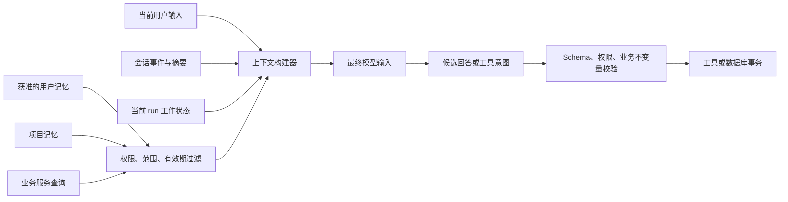

# 会话记忆、工作记忆、用户记忆、项目记忆与数据库事实

AI 应用中的“记忆”不是一个统一的数据集合。会话记忆、工作记忆、用户记忆、项目记忆和数据库事实具有不同的主体、寿命、写入权限与一致性要求。把它们混在同一个向量库中，会造成临时推断长期化、用户偏好污染团队项目、旧摘要覆盖实时业务数据等问题。

本文建立可执行的分层规则：模型可以读取哪些数据、可以建议写入哪些数据、何时必须查询权威数据库，以及冲突时谁拥有最终决定权。

## 前置知识

- [上下文 Token 预算分配](03-token-budget-allocation.md)
- [上下文去重、过期与冲突](05-dedup-staleness-conflicts.md)
- [上下文权限与租户隔离](06-context-permission-tenant-isolation.md)
- [记忆生命周期与用户控制](09-memory-lifecycle-user-control.md)

## 五类状态的核心区别

| 类型 | 描述对象 | 典型寿命 | 主要写入者 | 权威程度 | 典型内容 |
|---|---|---:|---|---|---|
| 会话记忆 | 一次连续会话 | 分钟到数天 | 会话服务 | 对会话历史权威 | 消息、工具事件、会话摘要 |
| 工作记忆 | 当前任务的执行状态 | 一次运行 | 编排器与工具 | 对运行状态权威 | 当前计划、已完成步骤、临时变量 |
| 用户记忆 | 某个自然人的跨会话信息 | 月或更久 | 受控记忆服务 | 对已确认偏好有限权威 | 语言、格式偏好、用户确认的长期约束 |
| 项目记忆 | 团队或项目共享知识 | 随项目演进 | 项目成员与受控同步任务 | 对项目约定有限权威 | 技术决策、术语、仓库规范 |
| 数据库事实 | 业务系统当前记录 | 由业务规则决定 | 业务服务或授权人员 | 对业务状态权威 | 订单状态、余额、库存、权限 |

“权威”必须限定范围。会话服务可以权威地说明用户发送过什么，却不能证明用户陈述的外部事实为真；用户记忆可以保存“用户偏好中文”，却不能决定订单是否已退款。

## 一个统一但不混同的状态模型

每条上下文数据都应携带来源元数据：

```json
{
  "id": "ctx_918",
  "class": "project_memory",
  "subject": {
    "tenantId": "tenant_7",
    "projectId": "project_lili"
  },
  "key": "runtime.node.version",
  "value": "24",
  "source": {
    "type": "repository_file",
    "uri": "package.json",
    "revision": "8c14d2a"
  },
  "authority": "project_convention",
  "confidence": 1,
  "observedAt": "2026-07-17T08:00:00Z",
  "expiresAt": null,
  "version": 12
}
```

至少需要这些维度：

- `class`：决定生命周期和冲突策略。
- `subject`：数据属于哪个用户、会话、运行、项目和租户。
- `source`：能够回到原始记录。
- `authority`：这条数据可以决定什么。
- `observedAt`：何时读取或推导。
- `expiresAt`：何时停止自动使用。
- `version`：用于并发控制与缓存失效。

只保存 `text` 和 `embedding` 无法可靠执行这些规则。

## 会话记忆

会话记忆保存一次对话或任务会话中已经发生的事件。

### 包含的内容

- 用户与助手消息。
- 工具调用参数、结果摘要和错误状态。
- 会话级附件引用。
- 对旧消息生成的摘要。
- 会话内确定的临时偏好，例如“这次只输出 JSON”。
- 分支、重试和取消事件。

### 不包含的内容

- 未经确认的跨会话用户画像。
- 项目全局规范的唯一副本。
- 订单、余额、库存等业务事实的缓存真相。
- 编排器私有但未持久化的瞬时变量。

### 会话事件应追加，不静默改写

```json
{
  "conversationId": "conv_21",
  "sequence": 184,
  "eventType": "tool_result",
  "parentEventId": "evt_183",
  "createdAt": "2026-07-17T08:42:13.418Z",
  "payloadRef": "blob://tool-results/result_183.json",
  "payloadHash": "sha256:5f...",
  "status": "completed"
}
```

追加事件可以区分原始消息、后来更正和摘要。编辑用户消息时，宜建立新分支或新版本，不应覆盖旧消息后假装模型从未看过旧值。

### 摘要只是派生视图

会话摘要用于节约 Token，不是原始历史的替代真相。摘要必须记录：

- 覆盖的事件序列范围。
- 摘要器与 Prompt 版本。
- 尚未解决的事项。
- 被保留的明确约束。
- 可回溯的原始事件 ID。

若摘要写着“用户选择 A”，但较新的消息选择 B，应按事件序列使用 B，并标记旧摘要过期。

## 工作记忆

工作记忆是一次正在执行的任务所需的最小可变状态。它通常位于编排器、状态机或任务数据库中，而不应只存在模型生成的自然语言里。

### 典型结构

```json
{
  "runId": "run_204",
  "state": "waiting_for_payment_confirmation",
  "goal": "为订单创建退款申请",
  "completedSteps": [
    {
      "id": "load_order",
      "resultRef": "order_snapshot:ord_8:v19"
    }
  ],
  "pendingSteps": ["confirm_amount", "create_refund"],
  "variables": {
    "orderId": "ord_8",
    "requestedAmountCents": 12900
  },
  "attempts": {
    "create_refund": 0
  },
  "deadline": "2026-07-17T09:00:00Z",
  "version": 6
}
```

### 工作记忆与会话记忆的差别

用户可能在一个会话里同时启动多个任务，因此 conversation ID 不能代替 run ID。反过来，一个长任务也可能跨多个会话恢复，因此 run ID 不应依附单个浏览器连接。

工作记忆需要：

- 明确状态枚举。
- 原子状态迁移。
- 幂等步骤 ID。
- 重试次数和截止时间。
- 工具结果引用。
- 乐观锁版本或事务保护。

模型可以建议下一步，但编排器必须验证状态迁移。例如，只有 `confirmed` 状态才能进入 `refund_submitted`；一句“退款已经确认”不能直接绕过业务检查。

### 清理边界

运行成功后可以压缩工作记忆，只保留审计结果；运行失败时应保留恢复所需状态。临时 Secret 不得进入持久化工作记忆，工具凭证应以短期授权引用表示。

## 用户记忆

用户记忆跨会话描述同一个用户，适合保存用户明确确认且以后仍有用的信息。

### 适合保存

- 回答语言。
- 时区与单位制。
- 用户主动设置的无障碍偏好。
- 输出格式偏好。
- 用户明确要求长期记住的非敏感约束。

### 不应自动升级为用户记忆

- 当前会话里的一次格式要求。
- 从单次点击推断出的喜好。
- 模型猜测的职业、身份或健康状况。
- 文档内出现的第三方信息。
- 当前任务的中间变量。
- 业务系统可实时查询的状态。

### 写入必须经过类型化接口

```javascript
const allowedUserMemory = {
  response_language: {
    validate: value => /^[a-z]{2}(?:-[A-Z]{2})?$/.test(value),
    ttlDays: 365
  },
  timezone: {
    validate: value => Intl.supportedValuesOf("timeZone").includes(value),
    ttlDays: 365
  }
};

export function proposeUserMemory(input) {
  const rule = allowedUserMemory[input.key];
  if (!rule || !rule.validate(input.value)) {
    return { accepted: false, reason: "unsupported_or_invalid" };
  }

  return {
    accepted: true,
    requiresConfirmation: true,
    memory: {
      key: input.key,
      value: input.value,
      sourceEventId: input.sourceEventId,
      expiresInDays: rule.ttlDays
    }
  };
}
```

任意 `key/value` 写入接口会把 Prompt Injection、敏感推断和超长文本变成长期上下文。允许列表应由应用代码维护，模型只提交候选值。

## 项目记忆

项目记忆属于项目或团队，不属于单个用户。它解决跨成员、跨会话仍要一致遵守的工程知识。

### 典型内容

- 架构决策记录及其状态。
- 代码风格与目录约定。
- 产品术语表。
- 已确认的 API 契约。
- 项目目标和非目标。
- 部署环境、所有者和运行手册的引用。

### 来源优先级

项目记忆通常是索引或派生视图，仓库文件、配置中心、工单系统可能才是原始来源。建议记录：

```text
受版本控制的当前配置
    > 已批准且生效的决策记录
    > 项目记忆中的结构化提取
    > 对话摘要
    > 模型推断
```

这个顺序不是所有项目的普遍标准，而是一个可配置例子。团队需要按数据类型定义优先级。例如，服务所有者可能以服务目录为准，接口契约可能以发布后的 OpenAPI 文件为准。

### 项目记忆的更新

代码合并后，旧项目记忆不会自动变真。同步流程需要：

1. 读取新的仓库 revision。
2. 找到受影响的项目记忆。
3. 重新提取或标记 stale。
4. 保留来源 revision。
5. 更新检索索引。
6. 运行冲突检查。

如果系统无法证明记忆对应当前 revision，就应把它展示为历史信息，而不是当前规范。

## 数据库事实

数据库事实是业务系统根据约束和事务维护的当前记录，例如订单状态、账户余额、库存和权限关系。

### 数据库事实不是“另一种记忆”

模型上下文里的数据库结果只是某一时刻的快照。事实的当前值仍由业务服务决定：

```text
模型看见：订单 ord_8 在 08:42 为 paid，version=19
实际变化：08:43 支付系统完成部分退款，version=20
模型动作：08:44 请求全额退款
正确处理：业务服务以 version=20 重新验证并拒绝冲突
```

模型不能根据旧快照覆盖新状态。

### 读路径

1. 从模型输出提取受控查询意图。
2. 应用层校验主体、租户和字段权限。
3. 业务服务查询数据库。
4. 返回必要字段、版本和读取时间。
5. 将结果标为 `database_snapshot`。
6. 在执行写操作时重新验证。

### 写路径

数据库写入需要确定性命令，而不是把自然语言响应当作提交：

```sql
UPDATE orders
SET status = 'refund_requested',
    version = version + 1,
    updated_at = CURRENT_TIMESTAMP
WHERE id = :order_id
  AND tenant_id = :tenant_id
  AND status = 'paid'
  AND version = :expected_version;
```

受影响行数为零表示状态、版本、租户或 ID 不匹配。应用必须返回冲突，重新读取后让用户确认，不能要求模型假定写入成功。

事务隔离影响一次事务能看见哪些并发结果。选择 `READ COMMITTED`、`REPEATABLE READ` 或 `SERIALIZABLE` 时，应根据业务不变量决定，并正确处理死锁或 serialization failure 重试。

## 五类数据如何进入模型输入



上下文构建器要保留类别标签，而不是拼接成无法区分来源的一段文字。推荐使用明确区块：

```text
<current_request trust="user">...</current_request>
<run_state authority="orchestrator" version="6">...</run_state>
<user_preferences authority="confirmed-user">...</user_preferences>
<project_context revision="8c14d2a">...</project_context>
<database_snapshot read_at="..." version="19">...</database_snapshot>
```

标签有助于模型理解，但不能替代服务端权限与事务检查。

## 冲突矩阵

| 冲突 | 处理 |
|---|---|
| 当前用户输入 vs 用户记忆 | 当前明确要求用于本次任务；询问是否更新长期记忆 |
| 新会话事件 vs 旧会话摘要 | 使用新事件，重建或增量修正摘要 |
| 工作状态 vs 模型声称已完成 | 以编排器状态和工具回执为准 |
| 项目文件 vs 旧项目记忆 | 以团队定义的权威来源与 revision 为准 |
| 数据库查询 vs 用户陈述 | 展示差异；业务操作以授权数据库状态为准 |
| 两个数据库写入并发 | 用事务、约束、版本检查与重试处理 |
| 用户记忆 vs 项目规范 | 按适用范围处理；项目强制规范不能被个人偏好绕过 |

不要用一个全局“confidence 分数”解决所有冲突。高 confidence 的旧订单快照仍然可能过期；低 confidence 的用户偏好也不能覆盖权限规则。

## 完整案例一：跨会话代码助手

### 输入与状态

用户在新会话中要求：“为项目增加 CSV 导出，代码继续用 Node 24 和 TypeScript，不要添加新运行时依赖。”

系统已有：

- 用户记忆：回答语言为中文。
- 项目记忆：Node 22、禁止新依赖，来源 revision `a10`。
- 当前仓库：`package.json` 声明 Node 24，revision `b21`。
- 会话记忆：本次尚无历史。
- 工作记忆：任务状态 `planning`。

### 处理步骤

1. 检查项目读取权限和租户。
2. 读取当前仓库 revision `b21`。
3. 检测到项目记忆中的 Node 22 来自旧 revision。
4. 将该条记忆标记 stale，不向模型声明 Node 22 是当前要求。
5. 从当前配置得到 Node 24；从仍有效的项目规范得到“禁止新依赖”。
6. 将用户中文偏好用于回答展示，不把它写入代码规范。
7. 工作记忆记录计划、文件清单和测试状态。
8. 工具修改完成后，以测试进程退出码和 Git diff 更新完成状态。

### 最终上下文片段

```json
{
  "runState": {
    "state": "planning",
    "completedSteps": []
  },
  "userPreferences": {
    "responseLanguage": "zh-CN"
  },
  "projectFacts": {
    "nodeVersion": {
      "value": "24",
      "source": "package.json",
      "revision": "b21"
    },
    "newRuntimeDependencies": {
      "value": "forbidden",
      "source": "docs/engineering.md",
      "revision": "b21"
    }
  },
  "excluded": [
    {
      "key": "nodeVersion",
      "value": "22",
      "reason": "stale_revision"
    }
  ]
}
```

### 验证

- 确认生成方案没有安装依赖。
- 运行 TypeScript 编译与项目测试。
- 检查最终输入记录中没有 Node 22。
- 检查工作状态只有在测试回执成功后才进入 `completed`。

### 失败分支

若 `package.json` 与 CI 配置分别要求 Node 24 和 Node 22，不应任选一个。系统应报告权威来源冲突、附带两个 revision，并阻止把冲突结果写回项目记忆，直到项目维护者确认。

## 完整案例二：售后助手处理退款

### 输入与状态

用户说：“把刚才那笔 129 元订单全额退款，以后退款都不用再问我。”

可用数据：

- 会话记忆：上一条消息提到订单 `ord_8`。
- 工作记忆：尚未创建退款 run。
- 用户记忆：没有“免确认退款”设置。
- 项目记忆：退款超过 100 元必须二次确认。
- 数据库事实：订单已支付 129 元，可退余额 79 元，version 20。

### 处理步骤

1. 从会话指代解析候选订单 `ord_8`，但不把它当授权。
2. 查询业务服务，得到当前可退余额与 version。
3. 项目规则要求二次确认；用户要求“以后不用问”不能覆盖强制规则。
4. 请求金额 129 元超过可退余额 79 元，不能提交原命令。
5. 工作记忆进入 `awaiting_user_confirmation`，记录候选金额 79 元和 version 20。
6. 不创建“永久免确认退款”的用户记忆，因为该偏好与强制控制冲突。
7. 用户确认 79 元后，业务服务再次读取订单并用当前版本提交。

### 输出

```json
{
  "status": "needs_confirmation",
  "orderId": "ord_8",
  "requestedAmountCents": 12900,
  "refundableAmountCents": 7900,
  "reason": "requested_amount_exceeds_refundable_balance",
  "nextAction": "confirm_7900",
  "snapshotVersion": 20
}
```

### 验证

- 数据库没有在确认前产生退款记录。
- 租户与订单所有权由业务服务检查。
- 请求金额和可退金额使用整数最小货币单位。
- 写入时检查订单 version 和可退余额。
- 审计事件关联用户确认与最终事务 ID。

### 失败分支

如果确认期间另一渠道又退款 30 元，version 变化。提交条件不再成立，业务服务返回冲突；系统重新查询并显示新的可退金额，不能自动按旧确认继续执行。

## 读取与写入权限表

| 操作 | 模型 | 上下文构建器 | 记忆服务 | 业务服务 |
|---|---|---|---|---|
| 建议会话摘要 | 可以 | 验证并保存 | 不适用 | 不适用 |
| 改变工作状态 | 只建议 | 由编排器校验 | 不适用 | 工具回执参与 |
| 新增用户记忆 | 只提交候选 | 传递确认 | 类型、权限、生命周期校验 | 不适用 |
| 更新项目记忆 | 只提交候选 | 携带来源 | 要求项目权限和 revision | 可提供权威来源 |
| 查询数据库事实 | 生成受控意图 | 校验参数 | 不适用 | 授权查询 |
| 写业务数据库 | 不直接执行 | 提交结构化命令 | 不适用 | 事务与不变量检查 |

## 性能与成本取舍

### 全量上下文

优点是实现简单、较少遗漏近期信息；缺点是 Token 成本高、旧信息干扰大、敏感信息暴露面更广。它适合小型、短寿命会话，不适合跨项目长期记忆。

### 摘要

摘要节约 Token，但会丢失细节并引入错误。应保留原始事件、覆盖范围与重建能力。

### 检索式记忆

按相关性检索可以扩展容量，但相似度不等于权限、时效或权威。检索前需要主体过滤，检索后需要版本与冲突检查。

### 实时业务查询

读取延迟和服务依赖更高，但对动态业务事实通常不可替代。可以使用短期缓存降低成本，缓存必须携带版本、TTL 和失效规则；执行写操作前仍需重新验证。

## 可观测性

每次构建上下文建议记录：

- 各类别候选数与选中数。
- 过滤原因：权限、过期、范围、重复、冲突。
- 来源 revision 与数据库快照版本。
- 各类别 Token 数。
- 记忆命中后是否被实际引用。
- 旧事实导致工具冲突的次数。
- 用户纠正或删除记忆的次数。
- 项目记忆同步延迟。

日志应使用 ID、hash 和脱敏预览，不能复制完整敏感值。指标应能区分“没有检索到”“检索到但无权使用”“因过期排除”。

## 常见错误与排查

### 所有内容都写入向量库

现象：一次性要求在几个月后仍出现。

排查：检查写入是否有 `class`、主体、TTL 和写入依据。修复时按来源重新分类，不能只降低相似度。

### 把会话 ID 当任务 ID

现象：两个并行任务的步骤互相覆盖。

排查：检查状态键是否包含 run ID，工具回执是否关联步骤 ID。

### 把模型输出当数据库写入成功

现象：页面显示“已退款”，数据库没有记录。

排查：只允许工具事务回执产生 `completed` 状态，并把事务 ID 返回前端。

### 用户偏好覆盖项目强制规则

现象：用户的格式或确认偏好绕过合规步骤。

排查：确认规则是否带有 scope 与 authority，确定性控制是否位于应用代码。

### 项目记忆没有 revision

现象：仓库升级后仍给出旧命令。

排查：记录提取来源 revision；代码变更触发失效或重建。

### 旧数据库快照被重复使用

现象：并发写入覆盖新状态。

排查：写命令携带 expected version，检查受影响行数，冲突后重新确认。

## 生产检查清单

- [ ] 五类状态有独立 class、主体和生命周期。
- [ ] 会话事件、工作 run、用户、项目和租户 ID 不混用。
- [ ] 每条长期记忆有来源、范围、版本与删除路径。
- [ ] 项目记忆能追踪权威文件 revision。
- [ ] 数据库快照包含读取时间和业务版本。
- [ ] 模型不能直接改变工作状态或提交数据库事务。
- [ ] 权限过滤在检索和拼装之前执行。
- [ ] 冲突策略按数据类型定义，而不是只按相似度或 confidence。
- [ ] 工具写入使用幂等键、事务与业务不变量。
- [ ] 用户可以查看、修改和删除用户记忆。
- [ ] 日志不记录 Secret 与完整敏感正文。
- [ ] 恢复、重试与并发冲突有测试。

## 集成练习

实现一个支持“继续上次项目任务”的助手，验收条件：

1. 会话事件使用追加日志，并能由原始事件重建摘要。
2. 每次执行都有独立 run ID、状态机、步骤 ID 和重试计数。
3. 只允许保存 `response_language` 与 `timezone` 两种用户记忆。
4. 项目规范从 Git revision 读取，revision 变化后旧记忆自动失效。
5. 业务任务从数据库查询当前状态，写操作使用 expected version。
6. 构造一次“旧摘要与新消息冲突”、一次“项目记忆与仓库冲突”、一次“数据库并发更新”。
7. 三种冲突都产生明确错误或重新确认，不静默选择旧值。
8. 输出一次脱敏的上下文调试记录，展示每项类别、来源、版本、选择原因和 Token 数。

## 来源

- [MemGPT: Towards LLMs as Operating Systems](https://arxiv.org/abs/2310.08560)（访问日期：2026-07-17）
- [PostgreSQL 18：Transaction Isolation](https://www.postgresql.org/docs/18/transaction-iso.html)（访问日期：2026-07-17）
- [PostgreSQL 18：Row Security Policies](https://www.postgresql.org/docs/18/ddl-rowsecurity.html)（访问日期：2026-07-17）
- [OpenAI API：Conversation state](https://platform.openai.com/docs/guides/conversation-state)（访问日期：2026-07-17）
- [NIST AI 100-2 E2025：Adversarial Machine Learning Taxonomy](https://doi.org/10.6028/NIST.AI.100-2e2025)（访问日期：2026-07-17）
