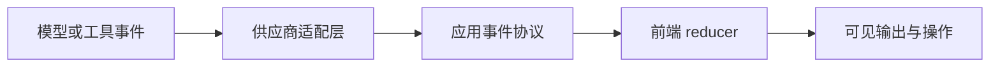

# 流式输出的停止、重试与继续生成

流式输出把模型生成过程拆成连续事件，使用户更早看到结果。停止、重试和继续生成不是三个按钮文案，而是三种不同语义：

- 停止：请求终止当前 run，已经产生的内容标记为不完整。
- 重试：以明确输入快照创建新的 run，并保留与原 run 的关系。
- 继续生成：从已确认的内容与结构状态出发创建后续生成，不能假设模型内部生成状态仍存在。

三者都必须处理重复点击、网络断开、服务端仍运行、工具副作用和部分输出。

## 前置知识与边界

- [AI 任务状态机与界面状态](01-ai-task-state-machine.md)
- HTTP 流、SSE 或 WebSocket 的基本用法。
- 幂等键、run ID 和事件 sequence。

本文不限定模型供应商。协议事件名应适配具体 API，但应用层语义保持稳定。

## 流式输出的四层



### 供应商事件

可能包含 response created、文本 delta、工具参数 delta、完成和错误。它们不是直接面向产品界面的契约。

### 应用事件

应用层把供应商差异转换为稳定协议：

```json
{
  "runId": "run_81",
  "sequence": 14,
  "type": "content.delta",
  "payload": {
    "blockId": "answer",
    "text": "增量文本"
  }
}
```

### 客户端状态

客户端去重、检测缺口、维护临时缓冲和终态。

### 渲染状态

渲染器决定何时提交 DOM、如何显示不完整结构、是否自动滚动和怎样通知辅助技术。

任意一层错误都不能用“再拼一次字符串”掩盖。

## 停止的准确语义

### 停止不是关闭连接

`AbortController.abort()` 可以停止浏览器对 fetch 的等待，但不保证服务端或模型停止计算：

```javascript
const controller = new AbortController();

const response = await fetch(`/api/runs/${runId}/events`, {
  signal: controller.signal
});

// 只停止客户端读取。
controller.abort();
```

产品中的“停止生成”通常还要调用服务端取消端点：

```http
POST /api/runs/run_81/cancel
Idempotency-Key: cancel-run_81-v1
Content-Type: application/json

{"reason":"user_requested"}
```

客户端进入 `cancelling`，直到收到：

- `run.cancelled`：确认已停止。
- `run.completed`：取消到达前任务已经完成。
- `cancel.rejected`：任务不允许取消或 ID 不匹配。
- 超时：继续查询任务状态，不能直接显示已停止。

### 停止后的内容

已经显示的内容需要保留并明确标识：

```json
{
  "outputStatus": "incomplete",
  "terminationReason": "user_cancelled",
  "lastSequence": 48,
  "finalized": false
}
```

不完整内容不能当作：

- 通过 Schema 校验的 JSON。
- 已闭合的 Markdown。
- 已完整执行的工具参数。
- 已覆盖全部证据的结论。
- 已完成的业务动作。

用户可以复制草稿，但界面应显示“生成已停止，内容可能不完整”。

### 取消的竞态

取消与完成可能同时发生：

```text
t0 用户点击停止
t1 服务端完成生成
t2 取消请求到达
t3 完成事件到达客户端
```

服务端应以单一终态事务处理。若完成已经提交，取消返回 `already_terminal` 并携带真实终态；前端不能用点击时间覆盖服务端事实。

## 重试的准确语义

重试创建新尝试，至少保留：

```json
{
  "runId": "run_82",
  "retryOf": "run_81",
  "attempt": 2,
  "inputSnapshotId": "input_19",
  "promptVersion": "prompt_7",
  "modelConfigVersion": "cfg_12",
  "reason": "provider_timeout"
}
```

### 相同输入重试

适用于临时网络、限流或供应商错误。输入、附件 revision、工具权限与参数不变。

### 修改后重试

用户编辑 Prompt、附件或选项后，这是新的输入版本。仍可记录来源 run，但不能宣称是完全相同的重试。

### 自动重试

自动重试只适用于：

- 明确可重试的错误。
- 没有产生不可重复副作用，或操作具有幂等保障。
- 在次数、时间和成本预算内。
- 尊重服务端 `Retry-After`。

权限拒绝、输入超限、Schema 永久不兼容不应盲目重试。

### 重试不能重复外部动作

模型生成可以重新请求，邮件发送、付款与记录创建必须使用工具操作 ID 和幂等键。发生超时时先查询原操作：

```text
unknown -> query(operation_id)
    completed -> 使用原结果
    running   -> 继续等待
    failed    -> 判断是否安全重试
    not_found -> 按业务规则决定
```

## 继续生成的准确语义

继续生成不是恢复模型隐藏的随机采样过程。通常要发起新的模型调用，并传入：

- 原始任务目标。
- 已接受的输出。
- 停止原因。
- 需要继续的边界。
- 结构化完成进度。
- 去重和结束条件。

### 文本续写

```json
{
  "operation": "continue",
  "parentRunId": "run_81",
  "acceptedOutputHash": "sha256:...",
  "instruction": "从最后一个完整段落后继续，不重复已有内容",
  "boundary": {
    "lastCompleteBlockId": "section_3",
    "discardedSuffix": "未完成的半句"
  }
}
```

直接把最后几个字符拼回 Prompt 容易重复句子或改变论证。更可靠的方法是按段落、列表项、JSON 节点或代码语法边界继续。

### 结构化输出续写

若 JSON 流在中途停止，不能简单追加字符串：

```text
{"items":[{"id":1},{"id":
```

应保留最后一个通过验证的结构节点：

```json
{
  "acceptedItems": [{"id": 1}],
  "nextIndex": 1,
  "requiredTotal": 10
}
```

后续调用只生成剩余 items，服务端再进行数组合并、唯一键检查和最终 Schema 校验。

### 工具调用续写

工具参数只在完整解析和授权后执行。部分参数：

```text
{"recipient":"alice@example.com","subject":"合同
```

必须丢弃或保留为不可执行缓冲，不能尝试“猜完”并调用工具。

## 一个统一命令接口

```javascript
export function createRunCommands(api) {
  return {
    async stop(state) {
      if (!["queued", "running", "streaming", "waiting_for_confirmation"]
        .includes(state.status)) {
        return { ok: false, code: "not_cancellable" };
      }

      return api.cancelRun({
        runId: state.runId,
        idempotencyKey: `cancel:${state.runId}:v1`
      });
    },

    async retry(state, inputSnapshot) {
      if (!["failed", "cancelled"].includes(state.status)) {
        return { ok: false, code: "not_retryable_state" };
      }

      return api.createRun({
        retryOf: state.runId,
        inputSnapshot,
        idempotencyKey: crypto.randomUUID()
      });
    },

    async continueFrom(state, continuation) {
      if (!["cancelled", "completed"].includes(state.status)) {
        return { ok: false, code: "continuation_requires_terminal_parent" };
      }

      return api.createRun({
        parentRunId: state.runId,
        mode: "continue",
        acceptedOutputHash: continuation.acceptedOutputHash,
        boundary: continuation.boundary,
        idempotencyKey: crypto.randomUUID()
      });
    }
  };
}
```

实际权限和幂等保障必须在服务端再次检查，客户端守卫只改善交互。

## 输出提交缓冲

每个 delta 到达后立刻写 DOM 会造成大量重排。可以使用缓冲并按动画帧提交：

```javascript
export function createTextBuffer(commit) {
  let pending = "";
  let scheduled = false;

  function flush() {
    scheduled = false;
    if (!pending) return;
    const chunk = pending;
    pending = "";
    commit(chunk);
  }

  return {
    push(text) {
      pending += text;
      if (!scheduled) {
        scheduled = true;
        requestAnimationFrame(flush);
      }
    },
    flush
  };
}
```

缓冲只优化渲染，不改变事件 sequence。取消时先把已确认收到的缓冲提交，再标记 incomplete，或明确丢弃未提交缓冲并记录边界。

## 自动滚动

新内容到达时只有用户仍靠近底部才自动滚动：

```javascript
function isNearBottom(element, threshold = 80) {
  const remaining =
    element.scrollHeight - element.scrollTop - element.clientHeight;
  return remaining <= threshold;
}
```

用户向上阅读后：

- 不抢回滚动位置。
- 显示“有新内容”按钮。
- 点击后滚到底部。
- 停止与重试按钮保持可达。

## 可访问状态

不要将每个 delta 放进 assertive live region。建议：

```html
<section id="answer" aria-busy="true" aria-labelledby="answer-title">
  <h2 id="answer-title">回答</h2>
  <div id="rendered-output"></div>
</section>

<p id="generation-status" role="status" aria-live="polite">
  正在生成回答
</p>

<button type="button" id="stop">停止生成</button>
```

状态区在阶段改变时更新：

- 正在检索资料。
- 正在生成回答。
- 生成已停止，内容不完整。
- 回答已完成。

按钮点击后焦点不应被自动移到不断变化的输出。任务结束后，可以把状态宣布给读屏器，但保留用户当前焦点。

## 完整案例一：长报告生成

### 输入

用户要求根据 12 个已授权文档生成五章节报告。服务端按章节输出 block 事件。

```json
{
  "type": "block.completed",
  "sequence": 31,
  "block": {
    "id": "section_2",
    "title": "风险分析",
    "contentHash": "sha256:..."
  }
}
```

### 停止流程

1. 用户在第三章生成一半时点击停止。
2. 前端进入 cancelling，禁用重复点击。
3. 服务端停止新模型和工具步骤，等待当前可取消操作返回。
4. 服务端确认最后完整 block 是 `section_2`。
5. 第三章临时文本保留为 draft，不进入正式 artifact。
6. 前端显示前两章为 accepted，第三章为 incomplete。

### 继续流程

1. 用户选择“从第三章继续”。
2. 客户端发送 artifact version、前两章 hash 与下一章节 ID。
3. 服务端验证 artifact 未被其他人修改。
4. 新 run 只生成 section 3–5。
5. 每章独立校验引用与结构。
6. 全部完成后用版本检查合并。

### 验证

- 已完成章节没有重复。
- 继续时 artifact version 变化会返回冲突。
- 第三章的半句没有进入最终报告。
- 引用只指向授权的 12 个文档。
- 新 run 的成本和 parent run 分开记录。

### 失败分支

如果用户在停止后编辑了第二章，旧 `acceptedOutputHash` 不匹配。系统要求以新版 artifact 重新计算 continuation boundary，不能把旧续写结果覆盖到新版本。

## 完整案例二：代码生成与测试

### 输入

助手生成补丁并运行测试。模型输出补丁只是候选，测试工具是独立步骤。

### 状态

```text
generating_patch
patch_ready
waiting_for_apply_confirmation
applying_patch
running_tests
completed | failed
```

### 停止

- generating_patch：可以取消模型，未完成 diff 不可应用。
- waiting_for_apply_confirmation：拒绝后不改文件。
- applying_patch：若写入事务不可安全中断，按钮应显示“等待当前写入完成”，而不是假装立即停止。
- running_tests：可终止测试进程，但已经修改的文件不会自动撤销。

### 重试

测试失败后有两种不同操作：

- “重新运行测试”：不重新生成补丁。
- “让 AI 修复失败”：创建新模型 run，输入失败日志的受控摘要与当前 diff。

界面不能都写成“重试”而隐藏成本和副作用差异。

### 验证

- 取消补丁生成后 Apply 按钮不可用。
- 重新测试不产生第二份代码修改。
- AI 修复使用最新工作树 hash。
- 生成期间文件被外部修改时，应用步骤检测冲突。
- 测试超时保留退出原因与截断日志引用。

### 失败分支

应用补丁成功后网络中断。恢复页面查询文件操作记录，发现已应用；不得自动再次应用。用户可以选择运行测试或查看 diff。

## 重试预算

自动重试要定义：

```json
{
  "maxAttempts": 3,
  "maxElapsedMs": 45000,
  "maxAdditionalCostUsd": 0.05,
  "backoff": "exponential_with_jitter",
  "retryableCodes": [
    "provider_timeout",
    "rate_limited",
    "temporary_unavailable"
  ]
}
```

指数退避减少同步拥塞，jitter 避免大量客户端同时再次请求。预算耗尽后显示真实错误和手动操作，不无限循环。

## 选择操作文案

| 场景 | 推荐操作 | 不准确文案 |
|---|---|---|
| 生成中，希望结束 | 停止生成 | 取消全部 |
| 网络断开，run 仍存在 | 重新连接 | 重试生成 |
| 临时错误，输入不变 | 重试 | 继续 |
| 用户修改输入后再提交 | 使用修改后的内容重新生成 | 重试 |
| 输出因长度截断 | 从最后完整章节继续 | 恢复原模型 |
| 工具结果未知 | 查询执行结果 | 再试一次 |

文案要对应实际命令，用户才能理解成本与副作用。

## 可观测性

记录：

- 首字节与首个可见内容时间。
- delta 数、字节数和最大 sequence。
- 用户停止时间、取消确认时间和取消延迟。
- 取消后仍产生的模型 Token 与工具事件。
- retryOf、attempt、错误类型和额外成本。
- continuation parent、边界与接受内容 hash。
- 重复片段率和继续后的结构校验失败。
- 自动重试预算耗尽率。

不要把完整 Prompt 和输出直接写入普通指标标签。

## 常见错误与排查

### 停止后立即显示 cancelled

客户端只发送了请求。应先显示 cancelling，等待权威终态。

### 继续生成重复上一段

检查是否使用语义边界与 accepted hash，而不是只拼接最后字符。对章节、列表和结构化节点建立 ID。

### 重试造成重复发送

检查工具操作是否有幂等键，超时后是否先查询原操作。

### 断网后“重试”创建第二个 run

先用旧 run ID 查询状态和补发事件。只有旧 run 明确失败且策略允许时创建新 run。

### 取消后半截 JSON 被业务代码解析

只有完成事件到达且整体 Schema 通过后，才把结构化输出交给业务层。

### 自动滚动阻碍阅读

检测用户是否靠近底部。用户向上滚动后停止跟随，使用“新内容”提示。

## 生产验收清单

- [ ] 停止同时覆盖客户端连接和服务端 run。
- [ ] cancelling 与 cancelled 是不同状态。
- [ ] 部分输出有 incomplete 标记。
- [ ] 完成与取消竞态由服务端单一终态解决。
- [ ] 重试记录 retryOf、输入快照和尝试次数。
- [ ] 自动重试受次数、时间、成本和错误类型约束。
- [ ] 外部工具操作具有幂等性并可查询结果。
- [ ] 继续生成绑定 accepted output hash 和结构边界。
- [ ] 半截 JSON、工具参数和代码块不可直接执行。
- [ ] 事件按 run ID 与 sequence 去重。
- [ ] 渲染批处理不改变事件语义。
- [ ] 自动滚动尊重用户阅读位置。
- [ ] 状态通知对辅助技术可用且不过度播报。
- [ ] 所有操作的成本和副作用在文案中可区分。

## 集成练习

实现一个可生成多章节说明书的界面：

1. 服务端按 block ID 产生事件，每个完成章节有 hash。
2. 任意生成阶段都能请求停止，并显示 cancelling。
3. 停止后完整章节进入 artifact，未完成章节作为不可发布草稿。
4. “重试失败章节”和“从下一章节继续”使用不同命令。
5. 重连按 last sequence 补发，不创建新 run。
6. 继续前检查 artifact version 和 accepted hash。
7. 测试取消与完成竞态、重复 delta、sequence 缺口、编辑冲突。
8. 记录每次重试和继续的额外 Token、耗时与结果。

## 来源

- [WHATWG HTML：Server-sent events 与 Last-Event-ID](https://html.spec.whatwg.org/multipage/server-sent-events.html)（访问日期：2026-07-17）
- [DOM Standard：AbortController](https://dom.spec.whatwg.org/#interface-abortcontroller)（访问日期：2026-07-17）
- [Streams Standard](https://streams.spec.whatwg.org/)（访问日期：2026-07-17）
- [W3C WAI-ARIA 1.2：aria-busy 与 live regions](https://www.w3.org/TR/wai-aria/)（访问日期：2026-07-17）
- [OpenAI API：Streaming events](https://platform.openai.com/docs/api-reference/responses-streaming)（访问日期：2026-07-17）
