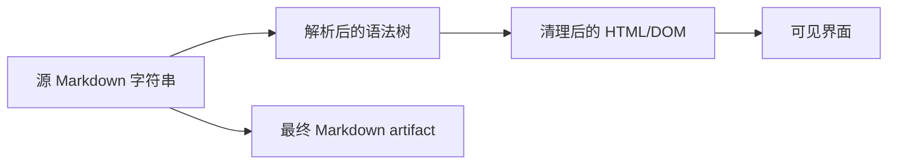

# 流式 Markdown 与未闭合代码块渲染

流式 Markdown 在任意时刻都可能停在强调符号、链接、HTML 标签或代码围栏中间。每个 delta 到达后直接解析全文，会造成 DOM 反复重构、代码块闪烁、复制内容变化和安全过滤边界不一致。可靠实现要区分临时源文本、稳定块、最终文档与经过清理的 HTML。

## 前置知识与边界

- [流式断线、重复事件与不完整 JSON](03-disconnect-duplicate-events-partial-json.md)
- Markdown、DOM、XSS 与增量渲染基础。

本文以 CommonMark 风格语法说明解析边界。GitHub Flavored Markdown、数学公式、Mermaid 与自定义组件需要各自的扩展规则，不能假设所有解析器结果一致。

## 四种表示



必须区分：

- 源 Markdown：模型实际输出，可用于复制和审计。
- 语法树：解析器对当前源文本的解释。
- 清理后 DOM：允许进入页面的元素与属性。
- 最终 artifact：收到完成事件并通过验证的版本。

用户看到的 DOM 不能反向作为最终 Markdown 来源，因为语法高亮、折叠按钮和引用组件会添加额外节点。

## 为什么增量会改变旧内容

输入第一段：

```text
这是 **重要
```

解析器可能暂时显示星号。后续到达：

```text
内容**。
```

旧文本变成 `<strong>`。同样情况发生在：

- 反引号代码。
- 链接标签和目标。
- 列表缩进。
- 块引用。
- 表格分隔行。
- HTML block。
- 围栏代码块。

因此“已有字符永远对应同一 DOM 节点”不成立。

## 稳定前缀与活动尾部

一种工程策略把文档分成：

```json
{
  "stableBlocks": [
    {"id":"p1","type":"paragraph","source":"第一段。"},
    {"id":"h2","type":"heading","source":"## 第二节"}
  ],
  "activeTail": "```javascript\nconst value = "
}
```

稳定块只在确定边界后提交；活动尾部允许重复解析。边界可以是：

- 服务端显式 `block.completed`。
- 两个换行之后完成的段落。
- 已闭合围栏代码块。
- 已闭合列表或引用块。
- 最终完成事件。

只按空行切分并不完整，因为围栏代码块内部可以有空行。生产实现应使用支持增量状态的解析器，或由服务端产生结构化 block 事件。

## 代码围栏

CommonMark 围栏由至少三个连续反引号或波浪线开始。开围栏可带 info string，闭围栏必须使用相同字符且长度不少于开围栏。

示例：

    ```javascript
    const total = 42;
    ```

未闭合：

    ```javascript
    const total =

文档流尚未结束时，未闭合围栏只是 provisional；run 完成后仍未闭合，则属于模型输出不完整或合法的 CommonMark EOF 行为与产品预期冲突。界面应按产品规则标为不完整，不能自动声称代码可运行。

### 围栏状态

```javascript
export function scanFenceLines(source) {
  const lines = source.split(/\r?\n/);
  let open = null;

  for (let index = 0; index < lines.length; index += 1) {
    const line = lines[index];
    const match = line.match(/^( {0,3})(`{3,}|~{3,})(.*)$/);
    if (!match) continue;

    const marker = match[2][0];
    const length = match[2].length;

    if (!open) {
      open = {
        marker,
        length,
        line: index + 1,
        info: match[3].trim()
      };
      continue;
    }

    const isClosing =
      marker === open.marker &&
      length >= open.length &&
      match[3].trim() === "";

    if (isClosing) open = null;
  }

  return open;
}
```

这段扫描器只用于解释围栏状态，不是完整 Markdown 解析器。它没有覆盖容器块中的所有语义，应使用经过规范测试的 Markdown 库。

## 未闭合代码块的界面

流中：

- 显示“代码仍在生成”。
- 使用纯文本或临时高亮。
- 禁用“运行”。
- 复制按钮可复制当前草稿，但标记不完整。
- 不自动补闭合围栏到源 artifact。

流结束：

- 若围栏闭合并通过语言解析，可启用运行或下载。
- 若围栏未闭合，显示“代码块不完整”。
- 提供“继续生成”或“复制草稿”。
- 对执行类操作要求重新校验。

界面为了渲染可以在内存中添加虚拟闭合标记，但该标记不能混入原始源文本：

```javascript
function previewSource(source) {
  const open = scanFenceLines(source);
  if (!open) return { source, repairedForPreview: false };

  const fence = open.marker.repeat(open.length);
  return {
    source: `${source}\n${fence}`,
    repairedForPreview: true
  };
}
```

预览上应保留 `repairedForPreview`，避免用户把临时闭合作为模型真实输出。

## 代码高亮

每个 Token 都对整个文档重新高亮成本很高。建议：

- 完成的代码块只高亮一次。
- 活动代码块按 50–150ms 节流。
- 大代码块超过阈值后先显示纯文本。
- 高亮在 Worker 中执行时，按 block ID 与 version 丢弃旧结果。
- 未知语言回退到纯文本。

不能根据 info string 动态加载任意脚本。语言名称应映射到允许列表。

## 原始 HTML

Markdown 解析器可能允许原始 HTML：

```html

```

模型输出、检索内容和用户内容都属于不可信输入。安全选项：

1. 禁止原始 HTML，全部按文本处理。
2. 允许有限 HTML，解析后使用维护中的 sanitizer。
3. 使用原生安全 DOM API 建立节点。

不要用字符串替换删除 `<script>`。危险行为还可能存在于事件属性、URL、SVG、MathML、CSS 和解析差异中。

## Markdown 链接

链接必须检查 URL scheme：

```javascript
export function safeLinkTarget(raw, base = location.origin) {
  let url;
  try {
    url = new URL(raw, base);
  } catch {
    return null;
  }

  const allowed = new Set(["https:", "http:", "mailto:"]);
  return allowed.has(url.protocol) ? url.href : null;
}
```

还要决定：

- 相对链接如何解析。
- `file:`、`data:`、`javascript:` 是否拒绝。
- 外链是否显示域名。
- 新窗口是否使用适当 `rel`。
- 引用链接是否只指向授权 source ID。

链接文本和目标分开显示有助于识别伪装域名。

## 图片与远程资源

直接渲染模型提供的远程图片会向第三方发送用户 IP、Referer 或带签名 URL。产品可以：

- 默认不加载远程图片。
- 只允许可信域名。
- 通过受控代理加载。
- 移除敏感查询参数。
- 显示明确的加载操作。

`data:` 图片可能体积巨大，也要限制 MIME、字节数和解码成本。

## Mermaid 与可执行扩展

Mermaid、数学公式和自定义组件不是普通 Markdown：

- Mermaid 解析可能消耗大量 CPU。
- 自定义指令可能访问外部资源。
- 图中链接仍需 URL 策略。
- 错误图不能阻塞整篇回答。
- 服务器与客户端版本差异会产生不同结果。

流中先显示代码源；只有围栏完成、大小合规并通过受控渲染后生成图。不要在每个 delta 上重跑图布局。

## DOM 更新策略

### 全量重渲染

每次从完整 Markdown 重新解析。

优点：

- 实现简单。
- 解析结果与完整文档一致。

缺点：

- 长内容成本高。
- DOM 节点替换导致选择和焦点丢失。
- 代码块反复高亮。
- 图片重复加载。

### 活动尾部重渲染

稳定块保持不变，只解析尾部。

优点：

- 性能和交互更稳定。
- 复制、选择与滚动不易跳动。

缺点：

- 边界算法复杂。
- 解析器扩展可能跨块影响。

### 服务端 block 事件

服务端确定段落、代码和引用块。

优点：

- 恢复和局部更新清晰。
- 容易为每块分配 ID。

缺点：

- 协议复杂。
- 需要供应商事件到 block 的可靠转换。
- 修改 Markdown 扩展时要版本化协议。

## 保持选择与焦点

流式输出不应：

- 每次更新把焦点移到输出。
- 替换用户正在选择的代码节点。
- 用户向上滚动后强制滚底。
- 在复制菜单打开时删除目标节点。

可以为稳定 block 使用持久 key，并把活动尾部放在独立容器。最终化时尽量原位替换，而不是重建整个 answer。

## 复制行为

至少区分：

- 复制原始 Markdown。
- 复制纯文本。
- 复制单个代码块。

代码复制必须来自源代码节点，不包含行号、按钮和高亮 span。未完整代码块应在按钮名称或状态中说明“复制未完成代码”。

## 完整案例一：流式技术回答

### 输入事件

回答包含解释、JavaScript 代码和后续列表。网络 chunk 恰好在三个反引号和中文字符中间分割。

### 处理

1. 使用 `TextDecoder` 流式解码字节。
2. 事件 framing 完成后得到 text delta。
3. reducer 按 sequence 去重。
4. Markdown 层把完整解释段落提交为稳定 block。
5. 遇到开围栏后，创建 active code block。
6. 代码 delta 以纯文本追加并节流高亮。
7. 闭围栏到达后，代码块标为 complete。
8. 对 JavaScript 做语法检查后才启用“运行”。
9. 后续列表成为新的稳定 block。
10. run completed 后保存最终 Markdown hash。

### 验证

- 在每个字节边界切分，中文不损坏。
- 重放 delta 不重复代码。
- 开围栏期间运行按钮禁用。
- 代码复制不包含行号。
- 用户选择代码时新段落到达，选择不丢失。
- `` 示例不产生事件处理器。

### 失败分支

run 在代码字符串中间失败。界面保留临时代码、标为 incomplete，运行按钮保持禁用。用户选择继续时，从最后完整语法单元重新生成；最终 artifact 不自动加入虚拟闭合字符。

## 完整案例二：包含 Mermaid 与引用的分析报告

### 输入结构

```text
## 架构


结论来自资料 [1]。
```

### 处理

1. heading 与段落使用标准 Markdown 渲染。
2. Mermaid 围栏完成前只显示源代码。
3. 完成后检查字节数、节点数前置估算和允许配置。
4. 在隔离的受控渲染流程中生成 SVG。
5. 对 SVG 做安全处理，不允许任意外链和脚本。
6. 引用 `[1]` 通过 source ID 映射，不直接相信模型 URL。
7. 最终 artifact 保存 Markdown、图源和引用 manifest。

### 验证

- 图围栏未完成时不启动 Mermaid。
- 超过限制的图显示源代码和错误。
- 图渲染失败不影响报告其他部分。
- 引用 ID 不存在时显示“缺少来源”，不创建空链接。
- 最终页面在禁用 JavaScript 的阅读模式仍有图源与文字说明。

### 失败分支

模型在 Mermaid label 中生成恶意链接。渲染策略拒绝非允许 URL；报告保留图源并显示具体错误，不把未清理 SVG 插入 DOM。

## 一个块级状态模型

```json
{
  "id": "code_2",
  "type": "code",
  "sourceRange": {"start": 184, "end": 431},
  "status": "provisional",
  "language": "javascript",
  "source": "const result =",
  "renderVersion": 7,
  "validation": {
    "syntax": "not_run",
    "security": "plain_text_only"
  }
}
```

状态：

- provisional：仍会改变。
- complete：语法块边界已结束。
- validated：通过该类型的验证。
- invalid：完成但解析或安全检查失败。
- stale：源版本变化，旧渲染结果不可用。

## Worker 竞态

高亮或 Mermaid 在 Worker 中完成时，源可能已经更新：

```javascript
function acceptRenderResult(block, result) {
  if (result.blockId !== block.id) return false;
  if (result.renderVersion !== block.renderVersion) return false;
  if (result.sourceHash !== block.sourceHash) return false;
  return true;
}
```

只凭 block ID 会把旧高亮覆盖到新源。

## 安全层

推荐多层：

1. Markdown 解析器关闭不需要的 HTML 与扩展。
2. URL 使用允许协议和来源策略。
3. 解析后 HTML 使用维护中的 sanitizer。
4. 避免 `innerHTML`，或使用 Trusted Types 控制注入 sink。
5. CSP 限制脚本、对象和外部资源。
6. 依赖持续更新并运行恶意语料回归。

Trusted Types 是 Web 安全机制，不会自动判断模型事实或链接是否可信。CSP 也不是 sanitization 的替代品。

## 性能预算

为回答定义：

- 最大源文本字节。
- 单 block 最大字节。
- 每秒最大 DOM 提交次数。
- 高亮最大代码行数。
- Mermaid 最大节点和边数。
- 最多远程资源数。
- 解析 Worker 超时。
- 保留的 render version 数。

超过限制时采用纯文本、安全截断或下载 artifact，不能让浏览器主线程长期阻塞。

## 测试矩阵

### 语法边界

- 强调符号中断。
- 行内代码中断。
- 链接文本、目标与 title 中断。
- 反引号和波浪线围栏。
- 开围栏比闭围栏长。
- 列表与引用嵌套。
- HTML block。
- EOF 前未闭合围栏。

### 安全

- 事件属性。
- `javascript:` 链接。
- SVG 与 MathML。
- 外部图片追踪。
- `data:` 大对象。
- DOM clobbering 名称。
- Mermaid 链接与 HTML label。

### 交互

- 用户选择文本时继续流式。
- 用户向上滚动。
- 代码复制。
- 读屏器状态播报。
- Worker 旧结果迟到。
- 页面断线恢复与重复 block。

## 可观测性

记录：

- Markdown 源字节与 block 数。
- 全量和尾部解析耗时。
- DOM 提交频率和长任务。
- 未闭合围栏数量。
- sanitizer 删除的元素、属性类别，不记录敏感正文。
- 被拒绝 URL scheme。
- 高亮和 Mermaid 超时。
- stale render result 丢弃数。
- 最终源 hash 与 artifact version。

## 常见错误

### 自动补围栏并写回源

预览修复污染原始输出，后续继续生成会出现双闭合。虚拟修复只用于渲染。

### 每个 delta 运行高亮和 Mermaid

造成主线程阻塞和闪烁。完成 block 后渲染，活动尾部节流。

### Markdown parser 开启 HTML 就认为安全

解析只建立结构，不会自动删除危险 HTML。必须配置策略和 sanitization。

### 最终 DOM 反序列化成 Markdown

会混入高亮 span、按钮和扩展节点。最终 artifact 来自源 Markdown。

### 代码围栏完整就启用运行

围栏闭合只说明 Markdown 边界结束。还要做语言语法、权限、环境和副作用限制。

### 用户滚动后仍强制跟随

尊重阅读位置，显示新内容提示。

## 生产验收清单

- [ ] 原始 Markdown、语法树、清理后 DOM 和 final artifact 分离。
- [ ] 活动尾部与稳定 block 分离。
- [ ] 未闭合围栏有 provisional 状态。
- [ ] 预览虚拟闭合不修改源文本。
- [ ] 代码运行只在完整和验证后启用。
- [ ] 原始 HTML 默认禁用或严格清理。
- [ ] URL scheme 与远程资源有策略。
- [ ] Mermaid 等扩展在 block 完成后受限渲染。
- [ ] Worker 结果检查 block ID、version 和 hash。
- [ ] DOM 更新不抢焦点、选择和滚动。
- [ ] 复制代码不包含界面节点。
- [ ] 解析、渲染和资源使用有上限。
- [ ] 恶意 Markdown 与任意截断位置有测试。
- [ ] 最终 artifact 有 version、hash 和验证结果。

## 集成练习

实现一个支持代码与 Mermaid 的流式 Markdown 阅读器：

1. 字节流使用增量 UTF-8 解码，事件按 sequence 去重。
2. 已完成 block 保持稳定，只重解析 active tail。
3. 未闭合代码块显示草稿状态，运行按钮禁用。
4. JavaScript 代码完成后通过语法检查才能运行。
5. Mermaid 完成后在限制节点数和超时的流程中渲染。
6. 原始 HTML 不执行，危险 URL 被拒绝。
7. 用户向上滚动或选择文本时，流式更新不抢回位置。
8. 对每个字符位置截断固定 Markdown 样本，页面均不报错、不执行不可信内容。

## 来源

- [CommonMark Specification](https://spec.commonmark.org/)（访问日期：2026-07-17）
- [IETF RFC 7764：The text/markdown Media Type](https://www.rfc-editor.org/rfc/rfc7764)（访问日期：2026-07-17）
- [OWASP Cross Site Scripting Prevention Cheat Sheet](https://cheatsheetseries.owasp.org/cheatsheets/Cross_Site_Scripting_Prevention_Cheat_Sheet.html)（访问日期：2026-07-17）
- [W3C Trusted Types](https://www.w3.org/TR/trusted-types/)（访问日期：2026-07-17）
- [W3C WAI-ARIA 1.2](https://www.w3.org/TR/wai-aria/)（访问日期：2026-07-17）
