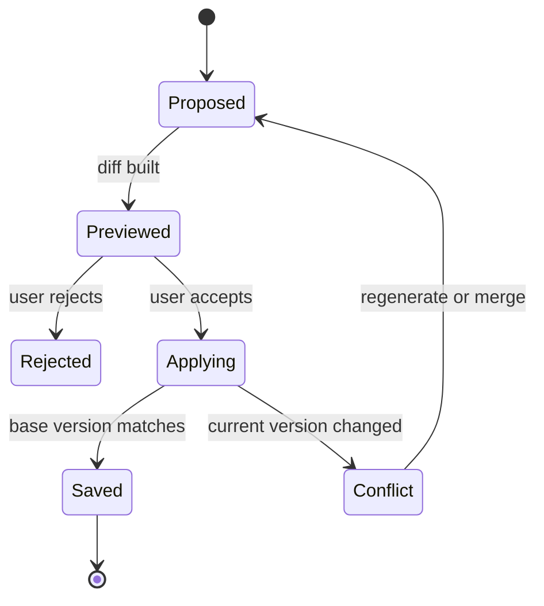

# AI Artifact 的差异、历史与恢复

AI 生成的文档、代码、表格和图形应作为有版本的 artifact 管理。聊天消息只能说明生成过程，不能代替可编辑对象的当前版本。可靠的 artifact 系统需要不可变版本、明确基线、差异展示、并发控制、恢复语义与审计来源。

## 前置知识与边界

- [AI 任务状态机与界面状态](01-ai-task-state-machine.md)
- [流式 Markdown 与未闭合代码块渲染](04-streaming-markdown-incomplete-code-blocks.md)
- Git diff、HTTP 条件请求与 JSON 基础。

本文的“恢复”是创建一个以历史内容为基础的新版本，不是抹掉历史。代码仓库仍应使用 Git 等版本控制系统；应用 artifact 历史不能假装拥有 Git 的全部合并语义。

## Artifact 与聊天消息

```json
{
  "artifactId": "art_41",
  "type": "markdown_document",
  "currentVersion": 7,
  "title": "发布说明",
  "scope": {
    "tenantId": "tenant_8",
    "projectId": "project_2"
  }
}
```

版本对象：

```json
{
  "artifactId": "art_41",
  "version": 7,
  "parentVersion": 6,
  "contentRef": "blob://artifacts/art_41/v7.md",
  "contentHash": "sha256:...",
  "createdBy": {
    "type": "ai_run",
    "id": "run_93"
  },
  "createdAt": "2026-07-17T11:20:00Z",
  "changeSummary": "补充兼容性与回滚步骤",
  "status": "active"
}
```

聊天消息可以引用 `artifactId/version`，但不能内嵌一份独立“当前内容”后继续修改，否则两个副本会漂移。

## 不可变版本

已保存的版本内容不应原地修改。编辑产生新版本：

```text
v5 --用户编辑--> v6 --AI 修改--> v7
```

不可变版本支持：

- 可靠 diff。
- 恢复历史。
- 审计谁改变了什么。
- 重现 AI 使用的输入。
- 内容 hash 校验。
- 并发冲突检测。

删除权限可能要求限制或清除内容，但审计记录仍要按隐私与保留策略设计，不能承诺“永久不可删除”。

## 基线

每个修改必须声明基线：

```json
{
  "artifactId": "art_41",
  "baseVersion": 7,
  "operation": "ai_rewrite",
  "instruction": "压缩第二节并保留全部引用"
}
```

若 AI 在 v7 上生成补丁，而当前已是 v8，直接应用会覆盖 v8 修改。服务端应返回版本冲突，要求：

- 重新生成。
- 尝试受控合并。
- 用户比较两份变化。

不能自动把旧补丁应用到新内容而不验证上下文。

## 差异的种类

### 文本行 diff

适合 Markdown、代码和纯文本。展示添加、删除与上下文行。

边界：

- 自动换行不应被当成实际换行。
- 换行符规范化要在保存策略中明确。
- 大段移动可能显示为删除加新增。
- 中文逐词 diff 需要明确分词策略。

### 字符或词级 diff

适合短文案和句子修改。长文全文字符 diff 噪声大，应在改变行内局部展示。

### 结构化 diff

适合 JSON、表格和表单：

```json
{
  "path": "/settings/retry/maxAttempts",
  "operation": "replace",
  "before": 3,
  "after": 5
}
```

数组按索引 diff 容易把插入解释成后续全部替换。业务对象应有稳定 ID。

### 语义 diff

“语气更简洁”“风险结论改变”属于解释层。模型可以生成辅助摘要，但不能替代确定性的内容 diff。界面应先提供真实变更，再展示 AI 解释并标明其非权威性。

## Patch 与完整快照

### 每版完整快照

优点：

- 读取简单。
- 单版本损坏影响有限。
- 恢复快速。

缺点：

- 大 artifact 存储成本高。

### 只保存增量 patch

优点：

- 小改动存储少。

缺点：

- 读取历史需要重放。
- patch 链损坏影响后续版本。
- Schema 演进复杂。

### 混合

定期快照，中间保存 patch；每个版本仍有最终内容 hash。读取时重放并验证 hash，失败则回退到最近完整快照或报错。

## JSON Patch 的边界

JSON Patch 定义 `add`、`remove`、`replace`、`move`、`copy` 和 `test`。`test` 可以在应用修改前检查基线值：

```json
[
  {
    "op": "test",
    "path": "/version",
    "value": 7
  },
  {
    "op": "replace",
    "path": "/title",
    "value": "新版发布说明"
  }
]
```

安全边界：

- Patch 路径需要授权，不能允许修改 tenantId、owner 或权限字段。
- 操作数量、深度和结果大小需要上限。
- 应用应是原子的；任一操作失败，整体不提交。
- Patch 成功后仍做完整 Schema 与业务校验。
- 模型生成的 patch 是候选，不直接执行。

## HTTP 并发控制

服务端可用 ETag 表示当前版本：

```http
GET /artifacts/art_41
ETag: "art_41-v7-sha256..."
```

更新时：

```http
PUT /artifacts/art_41
If-Match: "art_41-v7-sha256..."
Content-Type: text/markdown
```

若当前版本已改变，条件失败。客户端重新加载差异，而不是覆盖。

ETag 的具体强弱语义和缓存交互应遵循 HTTP 规范；应用也可以显式使用 `baseVersion`，两者可以同时用于清晰错误信息。

## 保存 AI 变更

AI 输出建议经过阶段：



`proposed` 不进入当前 artifact。只有保存事务成功，currentVersion 才变化。

## 接受全部与选择性接受

### 接受全部

适合短小、易检查的改动。仍要显示基线、目标版本和 validation。

### 按 hunk 接受

适合文本与代码。每个 hunk 应包含：

- 唯一 ID。
- 基线上下文 hash。
- 添加与删除。
- 依赖的其他 hunk。
- 校验结果。

选择性接受会产生一个不同于 AI 完整提案的新内容，需要重新解析、测试和生成 change summary。

### 按字段接受

适合表单和 JSON。敏感或强约束字段可以禁止 AI 修改，或始终要求单独确认。

## 恢复历史版本

恢复 v4 时，不把 currentVersion 从 8 改回 4，也不删除 v5–v8。创建 v9：

```json
{
  "version": 9,
  "parentVersion": 8,
  "contentCopiedFromVersion": 4,
  "operation": "restore",
  "reason": "用户恢复到发布前文案"
}
```

这样：

- 历史仍单调。
- 可以撤销恢复。
- 审计能看到恢复发生在何时。
- 外部引用 v8 仍可解析。

恢复前检查权限、依赖和当前版本。代码或配置恢复后还要重新测试，不因历史版本曾经有效就假设现在仍有效。

## 分支

多人或多个 AI run 可从同一版本产生候选：

```text
v7
├── proposal A：压缩
└── proposal B：补充案例
```

候选分支不必立刻成为正式版本。用户可以比较 A、B，再创建合并版本 v8。

分支需要：

- base version。
- 创建者与 run。
- 过期时间。
- 与 current 的偏离状态。
- 接受或废弃结果。

## 合并

三方合并需要：

- base：双方共同基线。
- ours：当前版本。
- theirs：AI 提案。

自动合并只适合互不重叠且结构可验证的修改。冲突区域必须展示：

```text
base:    最大重试 3 次
current: 最大重试 4 次
AI:      最大重试 5 次
```

不能用“AI 更自信”决定。用户或业务规则选择，保存后再运行校验。

## Artifact 类型的验证

| 类型 | 保存前检查 |
|---|---|
| Markdown | 解析、链接策略、未闭合扩展块 |
| JavaScript/TypeScript | parser/compiler、lint、test |
| JSON | 语法、Schema、业务规则 |
| 表格 | 列类型、唯一键、公式与引用 |
| Mermaid | 解析、资源限制、安全 SVG |
| HTML | conformance、sanitization、可访问性 |
| 配置 | Schema、环境约束、dry run |

“模型成功完成”不在验证列表中。

## 完整案例一：AI 编辑产品说明

### 输入

当前文档 v12。用户要求“缩短开头，不改数字和引用”。

### 生成

1. 服务端锁定输入快照 v12 与 content hash。
2. AI 产生候选 v12-proposal-3。
3. 确定性检查提取所有数字与引用 ID。
4. 发现候选把“30 天”改为“14 天”。
5. 对应 hunk 标为 constraint failed。
6. 界面显示逐词 diff、失败规则和原文来源。

### 用户操作

用户接受其他两个 hunk，拒绝数字 hunk。系统：

1. 在 v12 上应用选中 hunk。
2. 重新检查数字和引用。
3. 以 `If-Match`/baseVersion 保存 v13。
4. 记录 proposal、选择结果和验证报告。

### 并发失败

用户预览期间同事保存了 v13。提交时 current 已不是 v12，服务端返回冲突。界面加载同事 diff 与 AI proposal，尝试三方合并；重叠开头由用户选择，不能静默覆盖。

### 验证

- 拒绝 hunk 不进入 v13。
- 数字和引用集合与 v12 一致。
- history 中 v12 不变。
- diff 来源明确为 v12→v13。
- 旧 proposal 标为已处理，不可重复应用。

## 完整案例二：代码补丁与回滚

### 输入

AI 在 commit/artifact version `c1` 上修复解析器。生成三个 hunk并建议运行测试。

### 应用流程

1. 检查工作树或 artifact 仍基于 `c1`。
2. 在隔离分支应用 patch。
3. 编译并运行目标测试。
4. 显示 diff、测试命令、退出码与日志引用。
5. 用户确认后创建 `c2`。

### 线上问题

部署后发现性能回退。用户选择恢复 `c1` 内容：

1. 系统创建反向变更候选，不删除 `c2`。
2. 检查当前 `c3` 是否包含其他修改。
3. 只逆转与修复相关的变更。
4. 再次编译、测试与基准。
5. 保存 `c4`，记录 `reverts=c2`。

### 失败分支

若 `c3` 已修改同一函数，机械恢复整个 `c1` 会丢失新功能。系统显示三方冲突并要求人工处理，不提供误导性的“一键回滚成功”。

### 验证

- `c2`、`c3` 历史仍可查看。
- 恢复产生新版本。
- 测试回执关联实际 content hash。
- 部署状态与 artifact 保存状态分开。
- 恢复代码没有自动恢复数据库 schema 或外部状态。

## 历史界面

每个版本展示：

- 版本号和绝对时间。
- 作者：用户、服务账户或 AI run。
- 父版本与分支来源。
- 变更摘要。
- 校验和测试状态。
- 内容 hash。
- 发布或部署状态。
- 查看、比较、恢复权限。

AI 生成摘要可帮助浏览，但点击后应能看到真实 diff。

## 大文件与二进制 artifact

大文件不能每次在浏览器计算全文 diff：

- 服务端预计算索引。
- 分页或按 block 加载。
- 图片使用视觉 diff 和元数据，不声称像素变化代表语义变化。
- 二进制文件保存内容寻址 blob。
- 设定版本与存储保留策略。
- 导出历史需要权限与审计。

## 来源与可追溯性

版本应关联：

- 用户指令。
- 模型与 Prompt 版本。
- 输入 artifact version。
- 使用的检索 source IDs。
- 工具和测试回执。
- 接受者与确认时间。

不要保存供应商私有推理过程。可追溯性依赖可验证输入、输出、diff 和工具事实。

## 权限边界

- 查看 artifact 不一定允许查看全部历史。
- 查看 diff 可能泄露已删除敏感内容。
- 恢复权限通常高于阅读权限。
- AI run 不能扩大用户当前权限。
- 跨租户 artifact ID 返回统一拒绝。
- 分享链接应绑定版本或明确跟随 current。

用户要求删除敏感数据时，需要按隐私策略处理历史 blob、索引、缓存和导出，而不是只创建一个“删除内容”的新版本。

## 可观测性

记录：

- proposal 生成、接受、拒绝与过期。
- diff 大小与 hunk 数。
- 选择性接受率。
- base version 冲突率。
- 自动合并与人工冲突数。
- 保存前验证失败原因。
- 恢复次数与恢复后再次撤销次数。
- 内容读取与历史访问审计。
- artifact blob hash 校验失败。

不要把完整文档放入 metrics label 或普通错误日志。

## 常见错误

### 把聊天最后一条当当前文档

聊天可能包含旧副本。使用 artifact ID 与 current version。

### AI proposal 自动保存

用户看不到差异，并发时覆盖内容。proposal 与 current 分离。

### Diff 没有基线名称

用户无法判断是 v5→v6 还是 current→proposal。明确两侧版本与时间。

### 恢复会删除后续历史

恢复应创建新版本；只有受控数据删除流程可以清除历史内容。

### 测试结果未绑定 hash

代码变化后仍显示旧的“测试通过”。测试回执必须关联 content hash。

### JSON 数组按索引合并

插入导致对象错配。业务数组使用稳定 ID 并按 Schema 合并。

### 恢复代码等于恢复系统

数据库、部署和外部副作用可能已经变化。分别设计迁移和补偿。

## 生产验收清单

- [ ] artifact 和聊天消息分离。
- [ ] 每个版本不可变且有 content hash。
- [ ] 每次提案绑定 base version。
- [ ] proposal 不自动成为 current。
- [ ] diff 明确两侧版本和类型。
- [ ] 选择性接受后重新验证完整 artifact。
- [ ] 更新使用 baseVersion 或 `If-Match`。
- [ ] 冲突使用三方基线处理。
- [ ] 恢复创建新版本，不抹历史。
- [ ] 测试和校验绑定内容 hash。
- [ ] 历史、diff、恢复分别授权。
- [ ] 删除敏感信息有独立数据治理路径。
- [ ] 大文件 diff 有资源上限。
- [ ] 操作关联 AI run、来源与工具回执。

## 集成练习

实现一个 AI Markdown 编辑器：

1. 文档以不可变版本保存，每版有 parent、hash 和创建者。
2. AI 修改先成为 proposal，显示行级和词级 diff。
3. 用户可以按 hunk 接受；保存前重新解析链接与引用。
4. 两个浏览器从同一版本并发修改，后提交者收到冲突。
5. 提供 base/current/proposal 三方比较。
6. 恢复历史内容时创建新版本。
7. 测试结果绑定 proposal hash，内容变化后状态变为 stale。
8. 历史接口验证项目和租户权限，并记录恢复审计。

## 来源

- [IETF RFC 6902：JavaScript Object Notation Patch](https://www.rfc-editor.org/rfc/rfc6902)（访问日期：2026-07-17）
- [IETF RFC 6901：JavaScript Object Notation Pointer](https://www.rfc-editor.org/rfc/rfc6901)（访问日期：2026-07-17）
- [IETF RFC 9110：HTTP Semantics，条件请求与 ETag](https://www.rfc-editor.org/rfc/rfc9110)（访问日期：2026-07-17）
- [Git Documentation：git-diff](https://git-scm.com/docs/git-diff)（访问日期：2026-07-17）
- [W3C PROV-O：The PROV Ontology](https://www.w3.org/TR/prov-o/)（访问日期：2026-07-17）
