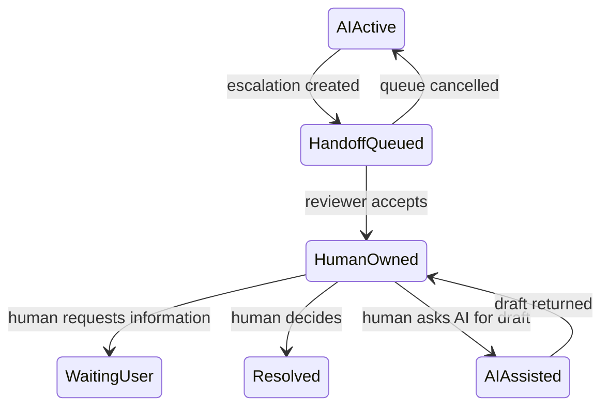

# 不确定性、人工确认与人工接管

AI 界面需要把“不确定”“需要确认”和“转人工”建模为不同状态。不确定性描述证据或预测的限制；确认是在执行特定动作前由有权限的人批准准确参数；人工接管是把任务、证据和控制权转交给人员或团队。一个“AI 可能出错”的提示无法代替这三种机制。

## 前置知识与边界

- [引用、证据视图与无法回答状态](06-citations-evidence-no-answer.md)
- [AI 任务状态机与界面状态](01-ai-task-state-machine.md)
- 权限、审计、幂等工具调用基础。

本文提供通用工程模式。医疗、法律、金融、招聘等领域需要按适用法规、组织政策和专业责任另行设计。

## 不确定性的来源

### 输入不完整

用户说“取消我的订单”，但有三个进行中订单。缺少目标 ID，不能执行。

### 输入含糊

“下周五”依赖时区和当前日期；“大客户”依赖业务定义。

### 证据不足

检索到相关资料，但没有直接支持结论。

### 证据冲突或过期

两个政策 revision 给出不同规则。

### 模型输出不稳定

相同输入可能产生不同候选；结构化输出可能校验失败。

### 工具结果未知

调用超时后不知道外部动作是否完成。

### 业务状态变化

确认后、执行前库存、余额或权限已经变化。

这些来源需要不同恢复方式，不能统一显示“置信度较低”。

## 不使用一个虚假的百分比

模型产生的 `confidence: 0.92` 若没有校准方法、任务定义和验证集，不代表 92% 正确概率。产品可以展示：

- 证据覆盖：3 个主张中 2 个有直接证据。
- 输入完整性：缺少目标地区。
- 来源状态：两份资料冲突。
- 规则结果：金额超过人工审核阈值。
- 分类模型的校准概率，前提是明确任务、数据和校准评估。

界面应说明可验证信号，不把任意模型自评分数包装为科学概率。

## 状态模型

```text
answer_ready
needs_information
needs_confirmation
needs_review
handoff_queued
human_owned
resolved
```

区别：

- `needs_information`：需要用户补充事实。
- `needs_confirmation`：动作和参数已明确，等待批准。
- `needs_review`：内容需要有资格人员判断。
- `handoff_queued`：已创建人工队列项，尚未被领取。
- `human_owned`：人员已接管，AI 不再自动执行。

## 风险驱动的控制

可按动作属性决定控制：

| 属性 | 低风险例子 | 高风险例子 |
|---|---|---|
| 可逆性 | 修改草稿 | 发送、删除、支付 |
| 影响范围 | 个人视图 | 全组织数据 |
| 金额或权益 | 无 | 退款、资格决定 |
| 数据敏感度 | 公开资料 | 健康、身份、Secret |
| 权限变化 | 无 | 新增管理员 |
| 外部传播 | 本地预览 | 邮件、社交发布 |

控制由应用规则计算，不让模型自行降低风险等级。

## 确认对象

确认必须绑定具体动作：

```json
{
  "confirmationId": "conf_71",
  "runId": "run_44",
  "actorId": "user_9",
  "action": "email.send",
  "parameters": {
    "recipients": ["client@example.com"],
    "subject": "合同更新",
    "bodyArtifactVersion": 12
  },
  "parametersHash": "sha256:...",
  "riskReasons": ["external_communication"],
  "expiresAt": "2026-07-17T12:10:00Z",
  "status": "pending"
}
```

确认不应只保存 `approved=true`。执行时检查：

- 当前操作者仍有权限。
- confirmation 属于当前 run 和租户。
- 未过期、未使用、未撤销。
- 参数 hash 未变化。
- 业务前置条件仍成立。
- 操作幂等键唯一。

## 确认界面

用户需要看到：

- 要执行什么。
- 对谁或哪个资源执行。
- 精确参数与重要差异。
- 可能的副作用和可逆性。
- 为什么需要确认。
- 确认有效期。
- 拒绝后会发生什么。

危险操作使用明确动词，如“发送给 3 位收件人”“删除 24 个文件”，而不是“继续”。

### 避免确认疲劳

每个低风险步骤都弹窗会使用户机械点击。改进方法：

- 草稿和预览无需确认。
- 多个同类可逆操作批量预览。
- 只在风险边界确认。
- 参数变化后才重新确认。
- 提供组织策略，而不是永久“以后都允许”绕过高风险控制。

## 双重检查不是重复询问

有效双重检查使用不同证据或角色：

- 系统验证金额、权限与版本。
- 用户确认业务意图。
- 高风险场景由第二位有资格人员审批。

连续问两次“确定吗”没有增加确定性。

## 人工审核

审核对象应包含：

```json
{
  "reviewId": "review_18",
  "type": "policy_exception",
  "priority": "high",
  "reasonCodes": [
    "conflicting_policy_sources",
    "amount_above_threshold"
  ],
  "subject": {
    "tenantId": "tenant_8",
    "caseId": "case_90"
  },
  "evidenceManifestId": "manifest_12",
  "aiProposalId": "proposal_33",
  "deadline": "2026-07-17T14:00:00Z",
  "requiredRole": "senior_support"
}
```

不要只转发聊天全文。审核人员需要结构化任务、原因、证据、AI 提案、已执行动作和待决定字段。

## 人工接管

接管意味着所有权变化：



进入 `human_owned` 后：

- AI 可以按人员请求生成草稿。
- AI 不再独立执行受控动作。
- 新用户消息路由给当前所有者或队列。
- 自动超时与 SLA 由队列系统管理。
- 所有权释放或转交有明确事件。

## 接管包

至少包含：

- 用户目标与当前问题。
- 身份、租户和权限上下文的安全引用。
- 已确认事实。
- 未解决问题。
- 证据列表与 locator。
- AI 候选及其 validation。
- 已发生的工具副作用与操作 ID。
- 当前 artifact version。
- 用户已做的确认或拒绝。
- 截止时间与优先级。

不得包含无关敏感历史或 Secret。

## 队列与 SLA

界面不应承诺没有后端保障的“马上有人回复”。展示：

- 已成功创建转接单。
- 队列或负责团队。
- 可验证的预计时间范围，若系统确实提供。
- 状态查询入口。
- 紧急渠道，仅在真实存在且适用时。

转接创建失败时保留上下文草稿并给出重试，不能显示“已转人工”。

## 用户补充信息

`needs_information` 应问最少且决定性的问题：

```json
{
  "missingFields": [
    {
      "key": "orderId",
      "reason": "multiple_open_orders",
      "allowedValues": ["ord_8", "ord_9", "ord_10"]
    }
  ]
}
```

比开放式“请提供更多信息”更易完成。收集后仍要校验字段归属和权限。

## 拒绝与安全替代

不能执行时：

- 说明不能完成的动作类别。
- 不泄露内部检测规则或受限数据。
- 提供范围内替代，例如生成草稿、解释步骤或转给授权人员。
- 保留已完成的低风险工作。

拒绝不等于人工接管。只有创建并接受队列项才算转接。

## 完整案例一：邮件发送

### 请求

“根据这份合同给所有客户发通知。”

### 处理

1. AI 生成草稿，不发送。
2. 系统发现“所有客户”没有确定名单。
3. 进入 `needs_information`，要求选择客户分组。
4. 用户选择“华东区续约客户”，服务端解析为 128 个已授权联系人。
5. 因外部群发和人数阈值进入 `needs_review`。
6. 审核人员检查模板、退订要求与名单。
7. 审批后生成 confirmation，显示收件人数、主题、正文 version。
8. 用户确认，发送服务使用幂等 batch ID。

### 失败分支

确认后正文被编辑。body artifact version 从 12 变为 13，旧 confirmation hash 不匹配。系统要求重新审核和确认，不能发送未审版本。

### 人工接管

审核人员领取 case 后拥有发送决策。AI 只按审核人员要求修正文案。用户界面显示“由合规审核处理中”，而不是继续出现可点击发送按钮。

### 验证

- 名单不进入模型上下文，只提供安全统计与必要字段。
- 审批和用户确认是不同事件。
- 双击确认只创建一个 batch。
- 发送结果按每位收件人记录，不把部分成功标为全部完成。

## 完整案例二：售后退款例外

### 请求

用户要求退 500 元，政策自动退款上限为 200 元，资料中还有地区规则冲突。

### 处理

1. 数据库确认订单、可退余额和版本。
2. 证据验证发现两份地区政策冲突。
3. 系统不生成“可以退款”的确定结论。
4. 创建 `policy_exception` review，要求 senior support。
5. 接管包包含订单安全引用、金额、两份证据 locator 和未执行状态。
6. 人员选择适用政策并决定退 300 元。
7. 用户看到准确金额并确认。
8. 业务服务执行事务，检查 version 和幂等键。

### 失败分支

人工审核期间订单通过其他渠道退了 100 元。执行前业务校验发现 version 变化，旧决定不能直接提交；案件回到人员，显示新可退余额。

### 验证

- AI 没有权限改政策或上限。
- 转接成功后有 review ID。
- 人工决定和用户确认都绑定订单 version。
- 工具回执是完成退款的唯一依据。

## 不确定性组件

推荐结构：

```html
<section aria-labelledby="uncertainty-title">
  <h2 id="uncertainty-title">需要确认的信息</h2>
  <p>当前有两个进行中的订单，无法确定要取消哪一个。</p>
  <fieldset>
    <legend>选择订单</legend>
    <!-- 服务端提供的受权选项 -->
  </fieldset>
</section>
```

组件规则：

- 直接写明缺失内容。
- 展示可选择值的来源和时间。
- 不只用黄色或警告图标。
- 保留用户已输入内容。
- 提交后显示验证错误在对应字段附近。

## 审核工作台

审核人员应能：

- 查看原因码和风险项。
- 检查原始证据，不只看 AI 摘要。
- 比较当前与提案 artifact。
- 修改或拒绝建议。
- 记录决定理由。
- 执行或转交给更高权限。
- 看到工具是否已经产生副作用。

工作台也必须按最小权限过滤；审核角色不能自动查看所有租户案件。

## 自动化边界

可以自动化：

- 输入完整性检查。
- 金额、权限、版本等规则。
- evidence ID 和 Schema 校验。
- 阈值触发审核。
- 队列路由和 SLA 计时。

不能仅靠 Prompt 保证：

- 模型永不越权。
- 高风险动作总会主动请求确认。
- 人工决定一定正确。
- 用户理解了所有风险。

确定性守卫放在服务端工具网关与业务服务。

## 可观测性

记录：

- needs information 的原因和解决率。
- confirmation 创建、过期、拒绝和执行。
- 参数变化导致确认失效次数。
- review 原因、队列时间、领取与解决时间。
- 接管后 AI 是否仍尝试自动执行。
- 人员修改 AI 提案的比例和类别。
- 转接失败与重复 case。
- 用户放弃和确认疲劳信号。

审核质量不能只看速度。还要抽检决定正确性、政策一致性与用户结果。

## 常见错误

### 显示“92% 可信”

没有校准依据。改为具体证据、缺失字段和冲突状态。

### 一个“确认”覆盖后续所有动作

确认绑定一个参数快照和有效期。参数、权限或业务状态变化后失效。

### 把聊天转发给人工就算接管

需要 review ID、队列状态、所有者与接管包。

### AI 决定自己无需审核

风险规则在应用代码和业务策略中计算。

### 转人工后 AI 继续执行

所有权状态应阻止自动工具调用。

### 接管包含全部历史

最小化数据，提供与任务有关的证据引用。

## 生产验收清单

- [ ] 不确定来源使用具体 reason code。
- [ ] 不使用未经校准的模型自信百分比。
- [ ] needs information、confirmation、review 和 handoff 分离。
- [ ] 确认绑定动作、参数 hash、主体、权限和过期时间。
- [ ] 参数或业务版本变化后确认失效。
- [ ] 高风险动作使用明确动词和影响范围。
- [ ] 自动审核阈值由确定性策略触发。
- [ ] 人工接管具有队列 ID 和所有者状态。
- [ ] 接管后 AI 不独立执行受控动作。
- [ ] 接管包包含证据、未决事项和已发生副作用。
- [ ] 转接失败不能显示成功。
- [ ] 执行工具使用幂等键并重新校验业务状态。
- [ ] 工作台和案件历史执行最小权限。
- [ ] 指标覆盖质量、等待、失效和人工修正。

## 集成练习

实现一个可起草并发送客户通知的助手：

1. 草稿阶段无需确认。
2. 收件人集合、正文版本和发送渠道构成参数 hash。
3. 超过 50 人自动进入人工审核。
4. 人员领取后任务进入 human owned，AI 工具执行被阻止。
5. 人员修改正文后旧确认失效。
6. 用户确认后使用 batch 幂等键发送。
7. 模拟转接失败、审核超时、参数变化和部分发送成功。
8. 界面准确显示每个状态、负责人、下一步和真实业务结果。

## 来源

- [NIST AI Risk Management Framework](https://www.nist.gov/itl/ai-risk-management-framework)（访问日期：2026-07-17）
- [NIST AI RMF Playbook](https://airc.nist.gov/AI_RMF_Knowledge_Base/Playbook)（访问日期：2026-07-17）
- [ISO/IEC 23894:2023：Artificial intelligence — Guidance on risk management](https://www.iso.org/standard/77304.html)（访问日期：2026-07-17）
- [W3C WAI-ARIA 1.2](https://www.w3.org/TR/wai-aria/)（访问日期：2026-07-17）
- [OWASP Agentic AI Threats and Mitigations](https://genai.owasp.org/resource/agentic-ai-threats-and-mitigations/)（访问日期：2026-07-17）
