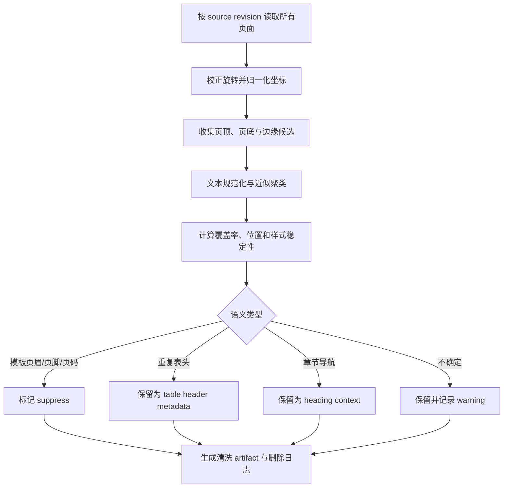

# 重复页眉页脚的识别与清洗

页眉、页脚、页码、水印和跨页重复表头属于文档版面信息。它们有时是无关模板，有时又是理解正文不可缺少的证据。解析管线的任务不是删除页面顶部和底部的文字，而是识别重复模板、保留有语义的结构，并记录每次清洗决定。

## 前置知识与能力边界

前置阅读：

- [异构文档格式解析](01-document-formats-and-parsing.md)。
- [标题、页码、来源与原文定位](02-structure-page-source-locators.md)。

本文处理分页文档中的重复区域，重点是 PDF、扫描 PDF 和演示文稿。Markdown 与 HTML 通常已有可用的文档结构，不应先分页再套用页眉页脚算法。

完成后应能：

- 区分模板页眉、章节标题、跨页表头、脚注和正文。
- 用文本、位置、样式和页面覆盖率共同识别候选。
- 让清洗后的 block 仍可定位到原文。
- 用标注页评估误删和漏删，而不是只看文本是否变短。
- 在 OCR、奇偶页和多模板文档中安全降级。

## 为什么不能直接裁掉页面边缘

把页面上方 10% 和下方 10% 全部裁掉会删除：

- 章节首页靠近页顶的一级标题。
- 顶部开始的表格第一行。
- 页底的合同例外条款。
- 法律文书的签章与日期。
- 学术论文的脚注。

只按重复文字删除也不可靠：

- 每页重复的表格列名应当保留或附着到表格分块。
- “第 3 章 安全要求”可能在本章每页重复，既是导航信息，也可作为 heading path。
- 页码每页都不同，文本频率低，但位置和样式高度稳定。
- OCR 会把同一句保密声明识别成多个相近字符串。

因此，“重复”和“无用”是两个不同判断。重复检测产生候选，语义分类决定如何处理。

## 输入数据

可靠清洗以带版面信息的 page/block 为输入：

```json
{
  "sourceId": "manual-aster-pro",
  "sourceRevision": "sha256:3d9a...",
  "pageIndex": 12,
  "pageWidth": 595.28,
  "pageHeight": 841.89,
  "rotation": 0,
  "blocks": [
    {
      "blockId": "p12-b1",
      "text": "Aster Pro 服务手册 · Rev 4",
      "bbox": [72.0, 34.0, 310.0, 48.0],
      "fontSize": 8.5,
      "fontWeight": 400
    },
    {
      "blockId": "p12-b2",
      "text": "4.2 更换电源模块",
      "bbox": [72.0, 90.0, 288.0, 116.0],
      "fontSize": 16.0,
      "fontWeight": 700
    }
  ]
}
```

至少保留：

| 字段 | 用途 | 缺失时的风险 |
|---|---|---|
| `sourceRevision` | 绑定清洗结果与原文件 | 文件更新后复用旧决定 |
| `pageIndex` | 计算跨页覆盖并定位 | 无法抽查原页 |
| 页面尺寸与旋转 | 归一化坐标 | 横向页与竖向页混在一起 |
| `bbox` | 判断位置带和稳定性 | 只能依赖易变文本 |
| 原始文本 | 计算相似与回放 | 无法证明删除了什么 |
| 字体与样式 | 区分标题、脚注和模板 | 章节标题容易误判 |
| block 顺序 | 恢复阅读序 | 清洗后段落顺序错乱 |

扫描件还应保存 OCR 引擎、语言、置信度与图像 region。不能只保存 OCR 文本。

## 识别管线



顺序不能颠倒。若未先校正旋转，横向附录的页顶会落在坐标侧边；若未按 revision 分组，不同版本中的相同模板会被错误合并。

## 第一步：归一化页面坐标

PDF 常用 point，扫描图像常用 pixel。比较不同尺寸页面时使用归一化坐标：

```text
x0_normalized = x0 / page_width
y0_normalized = y0 / page_height
x1_normalized = x1 / page_width
y1_normalized = y1 / page_height
```

必须先把页面旋转映射到统一阅读方向。原始 bbox 仍应保留，清洗 artifact 可同时记录：

```json
{
  "originalBbox": [34, 72, 48, 310],
  "normalizedBbox": [0.121, 0.040, 0.521, 0.057],
  "originalRotation": 90,
  "coordinateTransform": "rotate-clockwise-90-v1"
}
```

位置带只是候选生成条件。例如：

- 页顶候选：归一化 `y1 <= 0.12`。
- 页底候选：归一化 `y0 >= 0.88`。
- 侧边水印：靠左右边缘且旋转文本。

这些值是项目配置，不是通用标准。必须在目标文档集的标注页上选择。

## 第二步：文本规范化

规范化用于比较，不应覆盖原文。常见变换：

1. Unicode 规范化，例如 NFC。
2. 合并连续空白。
3. 统一可证明等价的全角、半角符号。
4. 将纯页码替换为 `<PAGE_NUMBER>`。
5. 将“第 12 页 / 共 86 页”中的数字替换为占位符。
6. 对 OCR 常见混淆进行受控替换，但保留原值和规则版本。

示例：

```text
原文：Aster Pro 服务手册 · Rev 4      第 12 页 / 共 86 页
比较键：Aster Pro 服务手册 · Rev 4 第 <N> 页 / 共 <N> 页
```

不要：

- 全部转小写后覆盖展示文本。
- 删除所有数字；型号、版本和年份可能决定语义。
- 用模型生成“语义等价文本”替代确定性规范化。
- 在不同语言间翻译后再判重复。

## 第三步：形成近似重复簇

完全字符串相等只适用于数字已经归一化、OCR 稳定的文档。复杂文档可组合：

- 规范化文本的编辑距离。
- 字符 n-gram Jaccard。
- bbox 中心和高度差。
- 字号、字重、颜色、对齐方式。
- 页面奇偶性。

候选 A 和 B 可在满足下列条件时进入同一簇：

```text
text_similarity >= 0.92
AND abs(normalized_y(A) - normalized_y(B)) <= 0.015
AND font_size_ratio BETWEEN 0.9 AND 1.1
```

阈值必须通过标注集校准。Embedding 相似度可作为辅助信号，但它可能把内容不同、主题相近的章节标题聚在一起，不能单独决定删除。

## 第四步：计算跨页覆盖

定义一个候选簇在适用页面集合中的覆盖率：

```text
coverage = 出现该簇的页面数 / 适用页面数
```

“适用页面”不一定是全文：

- 封面和封底有独立模板。
- 目录使用罗马数字页码。
- 正文奇偶页的书名和章名不同。
- 附录横向页面使用另一套页脚。

先按页面模板聚类，再计算覆盖率，通常比对整份文件直接计算更准确。

覆盖率高说明“可能是模板”，不说明“可以删除”。跨页表头往往覆盖率也很高。

## 第五步：语义分类

### 模板页眉

典型特征：

- 位于稳定的顶部区域。
- 跨多个非相邻页面出现。
- 内容是文档名、组织名、版本或保密级别。
- 与正文阅读序之间有明显间距或分隔线。

处理：

- 从用于 embedding 的正文中 suppress。
- 保留在 source metadata。
- 文档版本、保密级别等业务信息若影响答案，应作为结构化 metadata，而非完全丢弃。

### 页脚和页码

页码通常从正文文本中 suppress，但保留 `pageIndex`、`pageLabel` 和印刷页码。版权或保密声明可保存在 source metadata。

如果页脚含“本页以下无正文”“签署页”等法律意义文字，不能仅凭位置删除。

### 重复表头

跨页表格的列名必须与后续行关联。处理方式：

- 表头 block 不作为独立正文 chunk。
- 表格结构中保存 column header。
- 每个分块后的表格片段注入必要列名。
- 引用仍指向出现该表头的原页或逻辑表格。

### 章节导航

书籍常在奇数页显示章节名、偶数页显示书名。可把章节名写入 `headingPath`，正文中 suppress 重复副本。前提是解析器已经建立其与页面正文的正确范围。

### 脚注

脚注通常不是页脚模板。它的文本随页面变化，并通过上标编号与正文关联。应作为 footnote block 保存，必要时附着到引用它的段落。

### 水印

水印可能是：

- “DRAFT”状态标识，影响内容可信度。
- 用户名或订单号，属于敏感信息。
- 背景装饰，无业务语义。

应先分类和脱敏，再决定是否进入检索正文。不能把所有斜体或透明文字直接删除。

## 清洗结果的数据模型

清洗不能原地覆盖解析结果。输出新的不可变 artifact：

```json
{
  "artifactId": "clean-manual-r4-v3",
  "sourceRevision": "sha256:3d9a...",
  "parserVersion": "layout-parser-5.2",
  "cleanerVersion": "header-footer-cleaner-3.0",
  "policyVersion": "service-manual-cn-v4",
  "blocks": [
    {
      "blockId": "p12-b1",
      "action": "suppress_from_retrieval_text",
      "semanticRole": "running_header",
      "clusterId": "cluster-header-01",
      "confidence": 0.98
    }
  ],
  "warnings": []
}
```

`action` 可使用受控枚举：

| action | 行为 |
|---|---|
| `keep` | 保留在阅读序和检索正文 |
| `suppress_from_retrieval_text` | 不进入正文 embedding，但保留原 block |
| `attach_as_metadata` | 转成 source、section 或 table metadata |
| `redact_sensitive` | 按脱敏规则生成派生文本 |
| `review_required` | 不确定，隔离或进入人工抽查 |

删除原 block 会破坏原文回放。更安全的方式是保留解析 artifact，用 action 控制不同消费者看到的视图。

## 应用案例一：服务手册

### 输入

86 页 PDF 包含：

- 第 1 页封面。
- 第 2–4 页目录。
- 第 5–80 页正文。
- 第 81–86 页横向零件表。
- 正文页顶是“Aster Pro 服务手册 · Rev 4”。
- 正文页底是“内部使用 · 第 N 页 / 共 86 页”。
- 每章首页在顶部有大字号章节标题。

### 处理

1. 按 portrait-body、landscape-parts、front-matter 分页面模板。
2. 正文模板中，页眉规范化后覆盖 73/76 页。
3. 章节标题覆盖率低，字号为 20，且后方紧跟段落；分类为 heading。
4. 页脚中的数字归一化后覆盖 76/76 页。
5. 横向零件表的列名跨 6 页重复，分类为 table header。
6. 生成 suppress 和 attach metadata 决策。

### 输出

- 正文 chunk 不再重复手册名和页码。
- 每个 chunk 仍带 source revision 和 page locator。
- 零件表的每个子块带完整列名。
- heading path 保留章标题。

### 验证

- 随机抽查 20 页，正文误删为 0。
- 所有 86 个页面 locator 可打开原页。
- 查询“Rev 4 是否适用”时，可以从 source metadata 获得版本，不依赖被 suppress 的页眉。
- 查询零件编号时，结果包含对应列名和单位。

### 失败分支

若按全文而不是页面模板计算，横向附录的页眉只覆盖 6/86 页，无法识别。修复方式是先做页面模板聚类，再在模板内部统计。

## 应用案例二：扫描合同

### 输入

42 页扫描合同：

- 顶部有合同编号和客户名。
- 底部有“Confidential”和手写签字缩略图。
- OCR 对 `O`、`0` 和空格识别不稳定。
- 第 19 页底部有真正的例外条款。

### 处理

1. OCR block 绑定图像 bbox 和置信度。
2. 合同编号按受控模式规范化，客户名进入敏感字段，不用于普通调试日志。
3. “Confidential”由文本近似、位置稳定和图像区域共同识别。
4. 手写签字分类为 signature，不视为重复模板。
5. 第 19 页例外条款虽然位于页底，但不属于任何高覆盖簇，因此保留。

### 输出

普通检索文本不含重复客户名和保密声明；签字、例外条款以及原始页图仍在受权限控制的 artifact 中。

### 验证

- 使用含页底条款的专项标注集计算 body deletion precision。
- 以低 OCR 置信页面为重点抽样。
- 使用无权账号验证调试器不显示客户名和签字图。
- 对 OCR 引擎升级前后做配对回归。

### 失败分支

若规范化规则删除全部数字，不同合同编号会落入同一簇，可能跨文档泄漏模板统计。聚类范围必须限制在 source revision 或明确的同模板安全域内。

## 评估数据集

至少标注：

- 正文普通页。
- 每章首页。
- 目录和封面。
- 奇数页与偶数页。
- 横向页面。
- 跨页表格。
- 含脚注的页面。
- OCR 低置信页面。
- 只有一页的文档。
- 多语言与双栏页面。

每个候选 block 的 gold label 可为：

```text
running_header
running_footer
page_number
table_header
section_heading
footnote
body
watermark_semantic
watermark_decorative
uncertain
```

### 指标

对 `suppress` 决策计算：

```text
precision = 正确 suppress 的 block / 所有 suppress 的 block
recall = 正确 suppress 的 block / 所有应 suppress 的 block
```

生产中误删正文通常比漏掉一条页眉更严重，因此不能只优化 recall。还应记录：

- `body_deletion_rate`：正文被错误 suppress 的比例。
- `table_header_attachment_rate`：表格子块带必要列名的比例。
- `locator_replay_rate`：清洗结果可回到原 block 的比例。
- `duplicate_token_ratio`：最终 chunk 中模板文字占比。
- 按文档、格式和解析器版本的质量分布。

## 调试顺序

当结果仍含页眉或误删正文时：

1. 确认 source revision 与 cleaner policy 是否匹配。
2. 检查页面 rotation 与归一化 bbox。
3. 查看候选是否进入正确页面模板。
4. 对比原文、规范化文本和 cluster key。
5. 查看覆盖率的分母是否排除了封面、目录和横向页。
6. 检查语义分类，而不是只修改频率阈值。
7. 回放被 suppress block 的原页与上下文。
8. 用固定标注集重跑 precision、recall 和正文误删率。

不要通过持续降低相似度阈值来“消灭重复”。这会扩大候选簇，最终把主题相近的标题当成模板。

## 性能与运维

### 大文档

全文两两比较是平方复杂度。可先按以下键分桶：

- 页面模板。
- 顶部、底部、侧边位置带。
- 规范化文本长度区间。
- 字体样式簇。
- 字符 n-gram 指纹。

在桶内再做近似比较。记录每份文档的 block 数、候选数、簇数和处理耗时。

### 增量更新

来源 revision 改变时重新运行整份文档的模板识别。不能只清洗变化页，因为覆盖率和页面模板可能整体变化。

### 版本与回滚

保存：

- parser version。
- OCR version。
- normalization rules version。
- clustering config。
- semantic classification policy。
- gold set version。

新 cleaner 先生成影子 artifact。通过误删门槛后再让下游 chunker 使用；旧 artifact 保留到回滚窗口结束。

## 安全边界

- 不在不同租户之间聚类页眉文本。
- 客户名、合同号和水印可能是个人或商业敏感数据。
- 调试日志展示 hash、类别和脱敏预览，不默认展示完整原文。
- 模型分类器的输出必须经过受控 action 映射，不能让模型直接删除存储对象。
- 原文查看器仍需执行 source revision 级授权。
- OCR 或解析服务是外部处理器时，要明确数据区域、保存周期和访问控制。

## 综合练习

实现一个页眉页脚清洗实验：

1. 准备三份分页文档：普通手册、跨页表格、扫描合同。
2. 为每份文档标注至少 15 页。
3. 实现坐标归一化、文本规范化、候选聚类和 action 输出。
4. 将章节标题、脚注和表格列名作为不可误删样例。
5. 输出清洗前后文本、block 决策、原文 locator 与指标。
6. 注入旋转页、OCR 错字和奇偶页模板。
7. 比较完全匹配、近似文本加位置、版面聚类三种方案。

### 验收标准

- 清洗结果不覆盖原解析 artifact。
- 每个 suppress 决策能回放到 source revision、page 和 bbox。
- 标注集上正文误删为零；其他阈值由项目风险明确设定。
- 跨页表格分块保留列名。
- 低置信与未知模板进入 warning 或人工复核，不静默删除。
- 更新 cleaner 版本后能与基线配对比较并回滚。
- 无权用户无法通过日志、错误或查看器读取敏感页眉。

## 来源

- [PDF 2.0 — ISO 32000-2 项目信息与勘误](https://pdfa.org/resource/iso-32000-pdf/)（访问日期：2026-07-18）
- [PyMuPDF Page 文本与坐标 API](https://pymupdf.readthedocs.io/en/latest/page.html)（访问日期：2026-07-18）
- [Unstructured 文档元素与 metadata](https://docs.unstructured.io/open-source/concepts/document-elements)（访问日期：2026-07-18）
- [DocLayNet: A Large Human-Annotated Dataset for Document-Layout Analysis](https://arxiv.org/abs/2206.01062)（访问日期：2026-07-18）
