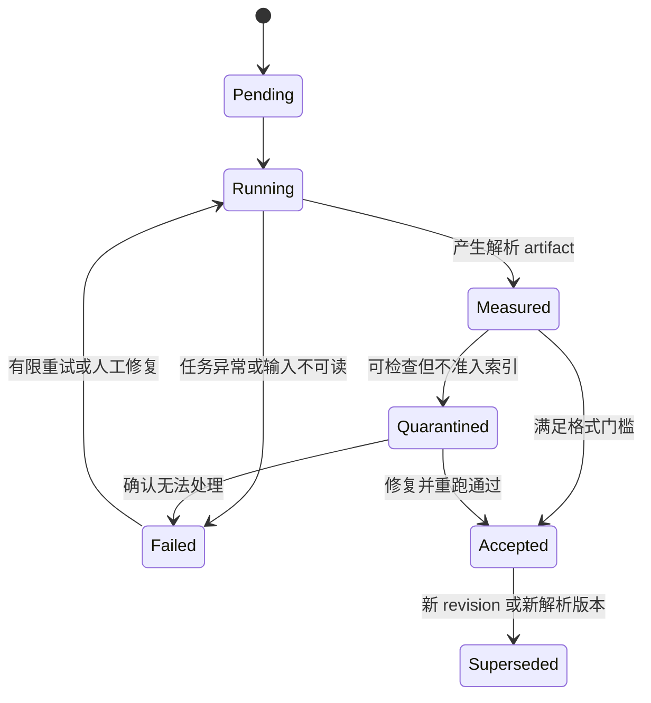

# 按文件记录解析质量

“解析成功”只表示程序没有终止，不表示内容可用于检索。空白扫描页、错位表格、丢失标题、乱码和失效定位都可能伴随成功状态进入索引。解析质量必须绑定到每个文件 revision，按格式检查内容、结构和定位，并以明确门槛决定接受、隔离或失败。

## 前置知识与产出

前置阅读：

- [异构文档格式解析](01-document-formats-and-parsing.md)。
- [标题、页码、来源与原文定位](02-structure-page-source-locators.md)。
- [重复页眉页脚的识别与清洗](03-remove-repeated-headers-footers.md)。

本文不讨论“哪一个解析库最好”。目标是建立独立于具体解析器的质量合同：

- 输入 revision 是否完整处理。
- 输出文本是否可读。
- 标题、列表、表格与阅读序是否可信。
- locator 能否回到原文。
- 哪些页面或元素失败。
- 是否允许进入索引。

最终产出是不可变的 parsing quality report，而不是一条模糊的日志。

## 质量的四个层次

### 1. 运行质量

检查解析任务本身：

- 是否启动、超时或取消。
- 是否处理全部页面、工作表、幻灯片和附件。
- 是否触发 OCR。
- 是否出现库异常或资源限制。
- 输入 hash 与实际读取字节是否一致。

运行成功是必要条件，不是充分条件。

### 2. 内容质量

检查可见内容：

- 文本覆盖。
- Unicode 合法性与替换字符。
- 单词或汉字可读性。
- 数字、单位和符号是否保留。
- OCR 置信度与无文本区域。
- 图片、公式和图注是否有明确处理状态。

### 3. 结构质量

检查：

- 标题层级。
- 段落与列表。
- 表格行列和合并单元格。
- 多栏阅读序。
- 脚注与引用关系。
- 页眉页脚分类。

字符总数正常不能证明结构正确。

### 4. 定位质量

检查每个用于检索的 block 是否能回到：

- source revision。
- page、sheet、slide 或 DOM fragment。
- bbox、cell range 或 text range。
- 原始 quote 或内容 hash。

定位失效会直接破坏引用、调试和证据查看。

## 文件 revision 是质量报告的最小单位

质量不能只按批次或数据源记录。一个批次里可能同时有正常 Word、损坏 PDF 和需要密码的 Excel。

建议 identity：

```json
{
  "sourceId": "policy-refund",
  "sourceRevision": "sha256:54c1...",
  "canonicalUri": "repo://policies/refund-v18.pdf",
  "mediaType": "application/pdf",
  "sizeBytes": 2841931,
  "declaredPageCount": 42,
  "ingestionBatchId": "batch-20260718-09"
}
```

同一个 `sourceId` 的内容改变后必须产生新 `sourceRevision` 和新质量报告。不能沿用旧分数。

## 质量报告结构

```json
{
  "reportId": "pqr-policy-refund-54c1-v2",
  "sourceRevision": "sha256:54c1...",
  "parser": {
    "name": "pdf-layout-pipeline",
    "version": "5.2.1",
    "configHash": "sha256:9af0..."
  },
  "ocr": {
    "used": true,
    "engine": "ocr-engine-4",
    "languages": ["chi_sim", "eng"]
  },
  "status": "quarantined",
  "counts": {
    "pagesExpected": 42,
    "pagesProcessed": 42,
    "blocks": 816,
    "tables": 7,
    "warnings": 3,
    "errors": 0
  },
  "metrics": {
    "pageSuccessRate": 1,
    "textCoverage": 0.94,
    "locatorReplayRate": 0.997,
    "replacementCharacterRate": 0.0002
  },
  "gateReasons": [
    "table_header_accuracy_below_policy"
  ]
}
```

字段原则：

- `status` 是门槛决定，不是分数的同义词。
- 指标必须有计算定义与适用格式。
- 不适用使用 `not_applicable` 或缺失原因，不填 0。
- warning、error 和 rejected element 要有 locator。
- parser、OCR、policy 和标注集都要有版本。

## 状态机



状态含义：

| 状态 | 是否可索引 | 行为 |
|---|---:|---|
| `pending` | 否 | 等待处理 |
| `running` | 否 | 任务进行中 |
| `measured` | 否 | 指标已生成，门槛未决策 |
| `accepted` | 是 | 当前 policy 下可进入后续 |
| `quarantined` | 否 | 保存 artifact，等待修复或复核 |
| `failed` | 否 | 没有可接受解析结果 |
| `superseded` | 否 | 被新 revision 或版本替代 |

索引器只读取 `accepted` 的不可变报告 ID。不能用“无 failed 日志”推断可索引。

## 通用确定性检查

### 页面或子文档完整性

```text
page_success_rate = successfully_processed_units / expected_units
```

unit 对不同格式分别是 page、sheet、slide、HTML 主文档及明确纳入的附件。

需要识别：

- 加密或损坏部分。
- 隐藏 sheet 是否在范围内。
- Word header/footer 与正文的独立处理。
- HTML iframe、shadow content 或动态加载是否在范围外。

### 空输出

检查：

- 文件非空但 block 数为 0。
- 有页面图像但字符数为 0，且 OCR 未运行。
- 某页字符数相对相邻页异常。
- 表格被识别但没有 cell。

空输出必须是明确 warning、quarantine 或 failed，不能直接 accepted。

### 字符异常

可计算：

```text
replacement_character_rate = U+FFFD 数量 / 所有 Unicode code point 数量
control_character_rate = 非允许控制字符数量 / 所有 code point 数量
```

还应统计：

- 重复乱码片段。
- 连续异常空格。
- OCR 低置信字符。
- 语言检测与预期语言的差异。

语言检测只作信号。代码、型号和多语言合同会让单一语言标签失真。

### 重复与爆炸

解析器错误可能把同一层重复数百次。检查：

- 完全重复 block 比例。
- 相邻重复页比例。
- 文本长度相对文件大小异常。
- 单页 block 数异常。
- DOM 遍历循环或嵌套表格重复。

## 格式专用检查

## PDF

应记录：

- 声明页数与处理页数。
- 原生文本页、图像页、混合页数量。
- 页面 rotation 与尺寸分布。
- 字符 bbox 覆盖与越界。
- 多栏顺序抽查。
- 表格和脚注状态。
- PDF page label 与物理页 index。

扫描 PDF 的 `textCoverage` 需要以 OCR 后可见文本区域为基准，不能拿字符数除以文件字节数。

## Word

检查：

- heading style 与 outline 映射。
- 正文段落、表格、列表和文本框。
- 页眉页脚是否独立分类。
- 批注、修订和隐藏文本采用什么策略。
- 嵌入对象是否被处理或明确跳过。
- relationship 中的图片、超链接是否有效。

修订状态必须明确。例如“接受修订后的可见文本”与“保留所有 revision”会产生不同事实。

## HTML

检查：

- 使用静态响应还是浏览器渲染后的 DOM。
- 主内容抽取规则。
- title、heading、列表、table、code 和链接。
- 隐藏、折叠和脚本生成内容的策略。
- canonical URL 与抓取时刻。
- DOM locator 在保存 revision 中是否可重放。

不要把导航、Cookie banner 和相关文章列表的高字符覆盖当作高质量正文。

## Markdown

检查：

- frontmatter 是否解析。
- heading 层级。
- fenced code block 是否闭合。
- 表格和列表结构。
- 链接与图片目标。
- HTML block 的处理。

原始 Markdown 与渲染文本都可以保存，但要区分用途。

## 表格文件

检查：

- sheet 数量和可见性。
- used range。
- 合并单元格。
- 公式与显示值。
- 日期序列、百分比、货币和单位。
- 空行空列和表头推断。
- row/column locator。

公式结果依赖工作簿计算状态。若解析器不重算公式，要记录 cached value 的来源。

## 扫描件

检查：

- 图像分辨率、旋转和倾斜。
- OCR 语言。
- 每页平均与低分位置信度。
- 阅读序。
- 手写、印章、复选框和签名。
- 敏感信息脱敏状态。

OCR confidence 不能跨引擎直接比较。质量门槛要绑定引擎与版本。

## 结构准确性如何测量

### 标题

对标注页面计算：

- heading detection precision/recall。
- level accuracy。
- heading path accuracy。
- 正文误判为 heading 的比例。

### 表格

按任务选择：

- table detection。
- row/column 数量。
- cell text accuracy。
- header association。
- merged-cell span。
- 数字与单位配对。

只比较序列化文本会掩盖列错位。

### 阅读序

给标注 block 排序，比较：

- 相邻顺序准确率。
- 成对先后关系。
- 多栏切换错误。
- 图注与图的相邻关系。

阅读序错误会让 chunk 拼接出不存在的语义。

## Locator 回放测试

从解析结果抽样 block：

1. 按 locator 打开对应 revision。
2. 找到 page、sheet、slide 或 DOM 节点。
3. 根据 bbox、range 或 selector 定位。
4. 比较 quote hash 或允许的规范化文本。
5. 记录 exact、relocated、stale 或 failed。

定义：

```text
locator_replay_rate =
  exact 或经允许重锚成功的 locator 数量
  / 被抽查 locator 数量
```

重锚必须保留原因。不能在文本相似时静默跳到另一个段落。

## 门槛策略

门槛按格式、业务风险与下游用途制定。

示例：

| 条件 | 普通帮助文档 | 合同与政策 |
|---|---:|---:|
| page success | 允许极少非关键附件隔离 | 所有范围内页面成功 |
| locator replay | 高比例且失败可见 | 关键证据必须可回放 |
| replacement char | 低于校准门槛 | 关键数字和条款人工抽查 |
| table header | 表格可单独隔离 | 关键表格必须通过 |
| 权限 metadata | 必须存在 | 必须存在且快照可审计 |

表格中不写通用数字，是因为输入格式和风险不同。项目必须在 versioned policy 中给出自己的可执行阈值。

门槛决策优先级：

1. 安全和权限缺失：直接 failed 或 quarantine。
2. 输入不完整：不进入索引。
3. 关键结构失败：按业务范围 quarantine。
4. 可降级元素失败：隔离该元素并明确覆盖范围。
5. 仅展示质量问题：可 accepted with warning，但下游可见。

## 应用案例一：混合格式政策库

### 输入

一批 240 个文件：

- 120 个原生 PDF。
- 30 个扫描 PDF。
- 45 个 Word。
- 25 个 HTML。
- 20 个 Excel。

目标是支持退款政策问答和逐条引用。

### 管线

1. 先按 media type 路由解析器。
2. 每个文件生成独立 parsing artifact。
3. 通用检查运行在全部文件。
4. 格式专用检查产生指标与 warning。
5. 高风险政策抽样 locator、标题和表格。
6. gate policy 产生 accepted、quarantined 和 failed。
7. 索引任务只订阅 accepted report。

### 发现

- 一个扫描 PDF 进程成功但 18 页均为空，原因是 OCR 语言未配置。
- 两个 Excel 的费率列显示值丢失，原因是公式 cached value 为空。
- 一个 HTML 主要文本来自导航，主内容选择器失败。
- 其余文件通过。

### 输出

问题文件分别 quarantine，并有：

- source revision。
- 错误阶段。
- 受影响 page/sheet。
- 解析器和配置版本。
- 修复建议。
- 重试是否安全。

正常文件不因整个批次部分失败而阻塞。

### 修复验证

- OCR 文件用正确语言重跑，页面文本覆盖与人工抽查通过。
- Excel 用可计算工作簿环境生成值，核对单位和公式。
- HTML 固定主内容规则并保存 DOM revision。
- 全部问题文件获得新的 report ID，旧 report 进入 superseded。

### 失败分支

若质量只按批次记录“237/240 成功”，索引器无法知道哪三个文件不可用，也无法阻止旧失败结果进入召回。

## 应用案例二：解析器升级

### 目标

PDF 解析器 v5 改善多栏顺序，但可能改变 block 边界和 locator。团队需要判断是否升级 18,000 份文档。

### 影子评估

1. 从真实库分层抽 300 份，覆盖单栏、多栏、扫描、表格和不同语言。
2. 同一 source revision 分别运行 v4 与 v5。
3. 保存两套不可变 artifact。
4. 比较运行、内容、结构和定位指标。
5. 对差异最大的页面人工复核。
6. 在固定 RAG 问题集上比较 evidence recall 与 citation replay。

### 决策

v5 的多栏顺序改善，但旧 PDF 坐标转换在旋转 270 度页面上出错。团队先修复 locator，再重新评估，不因平均标题准确率提高就直接发布。

### 发布

- v5 全量生成蓝色 artifact。
- 通过门槛后切换 index generation。
- 保留 v4 索引与解析 artifact 到回滚窗口结束。
- 监控 locator failure、空结果和用户引用打开失败。

### 失败分支

若直接覆盖 v4 block，历史引用指向的 block ID 消失，线上回答即使内容正确也无法回到当时证据。

## 失败注入

需要主动加入：

| 故障 | 预期状态 | 观察点 |
|---|---|---|
| PDF 最后一页损坏 | quarantine 或 failed | pages expected/processed |
| 扫描页关闭 OCR | quarantine | image-only pages 与零文本 |
| HTML 主内容选择器失效 | quarantine | 导航比例、heading 分布 |
| 表格列整体右移 | quarantine | header-cell 对齐 |
| locator offset 单位改变 | quarantine | replay failure |
| ACL metadata 缺失 | failed | security gate |
| 任务超时 | failed/retryable | cancelled downstream work |
| 同 revision 重复提交 | 幂等复用 | artifact ID 与 hash |

每种故障都应有固定夹具和明确错误码。

## 调试路径

解析质量失败时按顺序检查：

1. 输入字节 hash、media type 和解密状态。
2. parser route 与配置版本。
3. 运行日志、资源限制、超时和取消。
4. 页面或子文档级状态。
5. 原始 block 与结构 artifact。
6. 质量指标的分子、分母与抽样方法。
7. gate policy 版本和命中规则。
8. 索引器是否读取了正确 report ID。

不要先调整总分。总分只能展示，根因存在于具体检查、页面和元素。

## 监控与数据保留

聚合维度：

- media type。
- parser 和 OCR 版本。
- 数据源。
- 文件大小与页数区间。
- 语言。
- accepted/quarantined/failed。
- gate reason。

监控：

- quarantine rate 的突增。
- 空文本与 OCR fallback。
- locator replay failure。
- 单文件处理 p95/p99。
- 每页成本。
- 重试和死信。
- accepted 文件进入索引的延迟。

解析 artifact 可能含敏感正文。日志与指标只保留必要的 hash、计数和脱敏预览；原文按数据保存政策和授权访问。

## 与检索评估集成

解析质量报告和端到端 RAG 评估互补：

- 解析检查能定位空页、错表和 locator。
- 检索 Recall@K 能发现关键证据没有进入候选。
- Groundedness 能发现生成主张不受上下文支持。
- Citation Accuracy 能发现引用错位。

一个回答错误时，先看 gold evidence 所在文件是否 accepted，再检查对应 block 和 locator，然后进入 chunk、retrieval 和 generation。没有分层 artifact，只能把所有错误归因于模型。

## 综合练习

建立一个多格式解析质量门：

1. 准备 PDF、扫描 PDF、Word、HTML、Markdown 和表格各两份。
2. 为每种格式定义至少五项专用检查。
3. 生成结构化 parsing quality report。
4. 实现 accepted、quarantined、failed 和 superseded。
5. 为每份文件抽样回放 locator。
6. 注入空 OCR、错列、乱码、缺页和权限 metadata 缺失。
7. 用解析器两个版本运行同一 revision 并生成差异报告。
8. 让索引器只接受通过 gate 的 report ID。

### 验收标准

- 12 个文件分别拥有独立、不可变的质量报告。
- 进程成功但空内容的文件不会 accepted。
- 不适用指标不会填成 0。
- 所有失败能定位到 page、sheet、slide、DOM 或处理阶段。
- locator 抽样可回到正确 source revision。
- ACL metadata 缺失属于发布阻断。
- parser 升级能影子运行、配对比较和回滚。
- 报告中没有 Secret、完整个人信息或无权正文。

## 来源

- [Apache Tika 3.3.1 Parser 接口与元数据](https://tika.apache.org/3.3.1/parser.html)（访问日期：2026-07-18）
- [Unstructured 文档元素与 metadata](https://docs.unstructured.io/open-source/concepts/document-elements)（访问日期：2026-07-18）
- [PyMuPDF Page API](https://pymupdf.readthedocs.io/en/latest/page.html)（访问日期：2026-07-18）
- [DocLayNet: A Large Human-Annotated Dataset for Document-Layout Analysis](https://arxiv.org/abs/2206.01062)（访问日期：2026-07-18）
- [Tesseract User Manual](https://tesseract-ocr.github.io/tessdoc/)（访问日期：2026-07-18）
