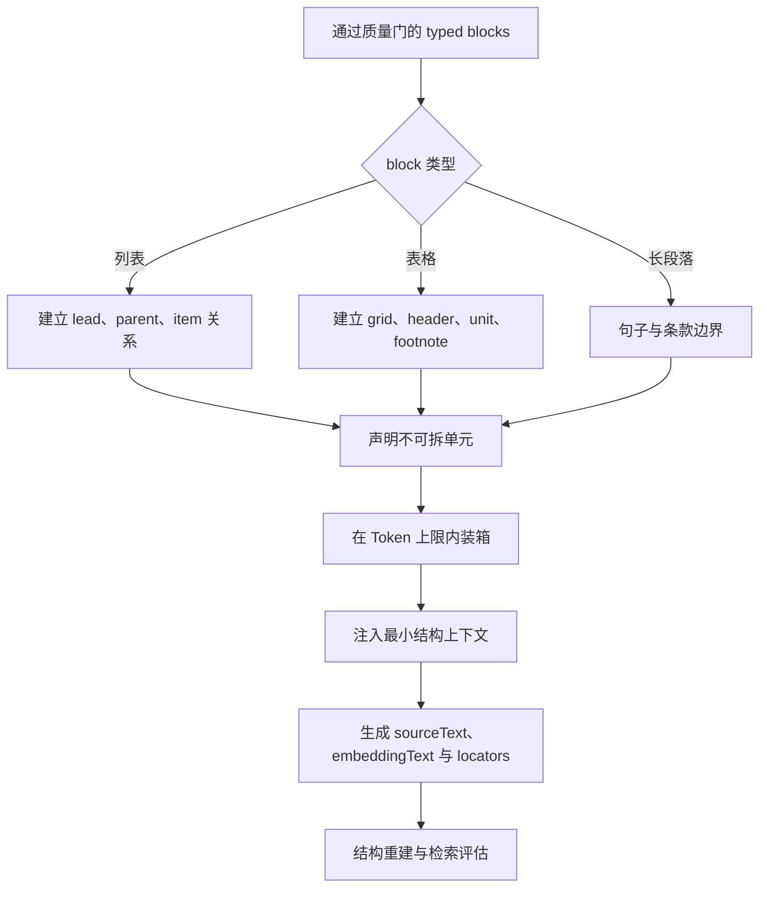

# 列表、表格与超长段落的分块

列表、表格和超长段落不能用同一套字符串窗口安全处理。列表项依赖父条件与顺序，表格单元格依赖行列标题和单位，超长段落需要在句群边界拆分同时保留范围。分块器应先识别结构不变量，再在 Token 上限内形成可独立解释、可回到原文的 chunk。

## 前置知识与目标

前置阅读：

- [固定、段落、标题、语义、滑动窗口与父子分块](01-chunking-strategies.md)。
- [Chunk 长度、重叠与结构保留的比较](02-length-overlap-structure.md)。
- [标题、页码、来源与原文定位](../05-rag-parsing/02-structure-page-source-locators.md)。

本文假定解析层已经输出 typed blocks。若解析器把表格变成无结构文本，chunker 不能可靠恢复所有行列关系，应先隔离或降级并记录 parsing warning。

## 结构不变量

### 列表

一个列表项的含义可能依赖：

- 列表前的引导句。
- 父列表项。
- 编号和顺序。
- 同级项共同限定的范围。
- 项内的多个段落或代码块。

### 表格

一个 cell 的含义依赖：

- 表名或图注。
- row header。
- column header。
- 单位。
- 合并单元格范围。
- 脚注。
- source revision 和 sheet/page。

### 超长段落

长段落可能包含：

- 前提。
- 主规则。
- 多个并列条件。
- 例外。
- 生效时间。
- 交叉引用。

“在 500 Token 处切开”可能把否定、例外或单位留到另一块。

## 统一的结构化输入

```json
{
  "sourceRevision": "policy-v18",
  "blocks": [
    {
      "id": "b10",
      "type": "paragraph",
      "text": "符合以下全部条件时可以退款："
    },
    {
      "id": "b11",
      "type": "list_item",
      "level": 1,
      "marker": "1.",
      "text": "商品未激活。",
      "parentId": null
    },
    {
      "id": "b12",
      "type": "list_item",
      "level": 1,
      "marker": "2.",
      "text": "在购买后 14 天内提交。",
      "parentId": null
    }
  ]
}
```

列表前导句需要显式关系：

```json
{
  "listId": "list-refund-all",
  "leadBlockId": "b10",
  "logic": "all_required",
  "itemIds": ["b11", "b12"]
}
```

若 `logic` 是解析器推断，应保存 derivation 和置信度；不能把模型推断当原文事实。

## 处理总流程



## 列表分块

## 列表的数据模型

```json
{
  "listId": "steps-reset",
  "ordered": true,
  "lead": "重置设备前依次完成：",
  "items": [
    {
      "id": "item-1",
      "ordinal": 1,
      "level": 1,
      "text": "导出当前配置。",
      "children": []
    },
    {
      "id": "item-2",
      "ordinal": 2,
      "level": 1,
      "text": "断开外部电源。",
      "children": [
        {
          "id": "item-2-a",
          "ordinal": 1,
          "level": 2,
          "text": "等待状态灯熄灭。"
        }
      ]
    }
  ]
}
```

`ordered` 决定顺序是否有语义。无序列表也可能表达 `all_required`，不能从 HTML `<ul>` 推断“任选”。

## 小列表

列表整体未超过 hard max 时，lead、全部 item 和尾随说明放在一个 chunk。这样最容易保留完整逻辑。

chunk metadata：

- list ID。
- ordered。
- logic。
- item locator 列表。
- heading path。

引用某一项时仍可高亮对应 item，不必引用整个 chunk。

## 长列表

长列表按完整 item 装箱：

1. 每块重复最小 lead。
2. item 不在段落内部切开，除非单 item 自身超长。
3. 父 item 与子项一起放置，或向子块注入父 item。
4. 保留原 ordinal。
5. 尾随的“以上条件必须同时满足”进入每个相关块的 logic metadata。

示例 embeddingText：

```text
设备重置 > 前置步骤
要求：以下步骤必须依次完成。
步骤 5：按住 Reset 10 秒。
步骤 6：等待状态灯变为蓝色。
```

“要求”是从原 lead 派生的上下文，display 应标明其来源 block，不能伪装成该列表项的原句。

## 嵌套列表

子项离开父项会失去范围。两种策略：

- parent prefix：每个子块注入父项。
- parent-child：索引子项，命中后取父项与同级必要项。

禁止让子项跨权限域；若父项含敏感内容，子项也不能通过 prefix 泄漏。

## 列表错误

- 只重复标题，不重复 lead 中的“全部满足”。
- 删除 ordinal，导致步骤顺序不可恢复。
- 将一个 list item 内的说明段落拆到别处。
- 把 checkbox 未勾选误读为否定。
- 把 bullet 字符当普通正文。
- 将分页重复的序号误当新列表。

## 表格分块

## 逻辑表格

解析结果应表达：

```json
{
  "tableId": "refund-fees",
  "title": "退款手续费",
  "columns": [
    {"id": "region", "label": "地区"},
    {"id": "period", "label": "购买后天数", "unit": "day"},
    {"id": "fee", "label": "手续费", "unit": "CNY"}
  ],
  "rows": [
    {
      "key": "cn-0-14",
      "cells": {
        "region": "中国大陆",
        "period": "0–14",
        "fee": "0"
      }
    }
  ],
  "footnotes": [
    {"marker": "*", "text": "定制商品不适用。"}
  ]
}
```

表格序列化为文本前，必须保留原 grid、cell locator 与 span。

## 按行组分块

适合列较少、行很多的表格：

```text
表：退款手续费
列：地区 | 购买后天数（日） | 手续费（CNY）
中国大陆 | 0–14 | 0
中国大陆 | 15–30 | 20
脚注：定制商品不适用。
```

每块重复：

- 表名。
- 所有必要列名。
- 单位。
- 适用脚注。

不应重复与这些行无关的脚注。

## 按列组分块

适合列很多、每次问题只涉及某一指标族。必须重复 row key。例如产品比较表按：

- 身份列：型号、版本。
- 性能列。
- 供电列。
- 合规列。

若 row key 不稳定，列组分块会让数据无法关联。

## 键值行

两列表格常表达属性：

```text
型号：Aster Pro
额定电压：220 V
防护等级：IP54
```

可以按相关属性组分块，但表名和对象 ID 必须进入每块。

## 合并单元格

例如“华东”跨三行。序列化每行时可向下填充逻辑值，但要区分：

- 原 cell text。
- 继承的 logical value。
- 原 cell span。

不能在原文引用中显示三个独立“华东”单元格。

## 表格脚注

脚注可能推翻数字的适用性。把脚注关联到：

- 整表。
- 某列。
- 某行。
- 某 cell。

分块时只附着相关脚注。脚注 locator 与数据 cell locator 都进入证据。

## 表格错误

- 每行只有数值，没有列名和单位。
- 用逗号串联，值本身也含逗号。
- 公式与 cached display value 混用。
- 日期序列被当普通数字。
- 合并单元格填充后失去原 span。
- 截断末列的例外标记。
- 表头重复进入检索候选，数据行反而排名低。

## 超长段落分块

## 先识别合法边界

边界优先级可为：

1. 明确条款编号。
2. 句子结束。
3. 分号连接的并列条件。
4. 逗号或短语边界。
5. Token 硬切。

硬切是最后降级，并记录 warning。

句子边界要处理：

- 缩写。
- 小数。
- 版本号。
- URL。
- 中文引号。
- 项目编号。
- 代码内标点。

## 句群装箱

将句子作为原子单元，按目标 Token 合并。加入一句超过 max 时：

- 当前块已达 min：先发出当前块。
- 当前块为空且单句超长：对单句进入 clause split。
- 最后短块：只在不跨结构边界时向前合并。

## 关系上下文

“但是”“除非”“上述条件”“以下情况”依赖上下文。可：

- 将前置条件作为 context prefix。
- 让相关句群属于同一 parent。
- 在命中后取相邻句群。

prefix 必须可追溯到原 block，不能由模型自由改写后当事实。

## 法律条款

条款中的定义、义务、例外和后果可能跨多句。优先以 clause number 为 parent：

```text
8.2 退款限制
8.2(a) 主规则
8.2(b) 例外
8.2(c) 生效时间
```

子条款可以索引，取回时按问题选择同一父条款的相关兄弟。不得自动取整份合同。

## 应用案例一：安装步骤

### 输入

维修手册中的 36 步安装流程，包含：

- 全局安全前置条件。
- 三个阶段。
- 第 14 步有四个子步骤。
- 第 28 步后的警告适用于 28–31。

### 设计

1. 每个阶段为 parent。
2. 安全前置条件作为受控 prefix 附着所有操作块。
3. 每块包含 4–6 个完整步骤。
4. 第 14 步和子步骤不可拆。
5. 警告单独形成 block，并关联步骤 28–31。
6. ordinal、block locator 和 page 保存。

### 检索

查询“更换模块后何时接通电源”：

- keyword 命中“电源”步骤。
- 取回相邻步骤和适用警告。
- 上下文按 ordinal 排序。
- 引用高亮具体步骤与警告。

### 验证

- 所有 36 个 ordinal 恰好对应一个原 item。
- 每个操作 chunk 有安全前置条件。
- 第 14 步的子步骤完整。
- 警告只附着 28–31。
- 邻接取回不跨阶段。

### 失败分支

若使用固定 500 Token，警告可能落在下一块。通过 overlap 虽可重复警告，但无法表达它只适用于 28–31。需要显式关系。

## 应用案例二：费率表

### 输入

一张 2,400 行费率表，列为：

- 地区。
- 产品级别。
- 重量区间。
- 基础费。
- 每公斤费。
- 生效日期。
- 备注标记。

### 设计

- `(地区, 产品级别, 重量区间, 生效日期)` 是逻辑 row key。
- 每 30 行一个 row-group chunk。
- 每块重复表名、列名和单位。
- 按生效日期建立 metadata filter。
- 备注标记关联脚注文字。
- 原 cell range 和工作表 revision 保存。

### 查询

“2026-07-10 华东 Pro 级 3.2kg 的费用规则”：

1. 实体规范化为 region ID。
2. 时间过滤有效 row。
3. keyword/dense 召回 row group。
4. 服务端确定性代码按区间计算，不让模型做最终计费。
5. 模型只解释规则并引用 cell。

### 验证

- 边界重量 1.0、1.01、5.0 分别测试。
- 旧生效日期不进入候选。
- 金额计算与数据库规则一致。
- 引用打开正确 sheet、row 和 column。
- 无权费率表不出现在 trace。

### 失败分支

把表格整行作为自然语言交给模型计算，会引入数字抄录和算术风险。RAG 提供证据，确定性计费仍由业务代码完成。

## 应用案例三：超长合规条款

### 输入

一个 3,100 Token 段落包含定义、五项义务、两个例外和生效日期。

### 设计

- 条款编号作为 parent。
- 定义块、义务块、例外块和日期块为 children。
- 每个 child 注入条款号和必要定义。
- 查询命中义务时同时检索相关例外。
- context selector 按 Token 预算选择，不自动加入全部 parent。

### 验证

- 30 条问题标注所需 child 组合。
- 测试否定和例外。
- 引用精确到句群。
- 修改定义后重新索引所有依赖 child。
- 对模型答案逐主张检查证据。

### 失败分支

若只命中义务句，答案会遗漏例外。评估集必须把“义务 + 例外”标成共同必要证据。

## 结构重建测试

### 列表

- ordinal 是否连续。
- parent-child 是否无环。
- lead 是否关联所有目标 item。
- 分块后按 ordinal 合并是否恢复原顺序。
- 每个 locator 是否回到原 item。

### 表格

- row/column 数量。
- row key 唯一性。
- header 与 cell 对齐。
- 合并单元格 span。
- 单位与脚注关联。
- 选定 chunk 合并后是否覆盖原表，无虚构 cell。

### 长段落

- source range 无重叠丢失。
- overlap 明确记录。
- 引号、括号和代码围栏不被错误切开。
- clause parent 关系正确。
- prefix 能回到来源 block。

## 指标

- `orphan_list_item_rate`：缺失 lead 或 parent 的 item 比例。
- `list_order_reconstruction_rate`。
- `table_header_attachment_rate`。
- `cell_locator_replay_rate`。
- `unit_attachment_rate`。
- `long_paragraph_boundary_coverage`。
- `hard_split_rate`。
- `structure_prefix_token_ratio`。
- 分类型 evidence Recall@K。
- citation span accuracy。

指标按文档类型报告。把列表、表格和普通段落混成一个平均值没有诊断价值。

## 调试路径

1. 打开 source revision 与解析 block。
2. 确认 typed structure 是否正确。
3. 查看不可拆单元与装箱决定。
4. 比较 sourceText、prefix、embeddingText。
5. 检查 Token 上限和 hard split warning。
6. 回放 list/table/clause locator。
7. 查看 gold evidence 是否完整落入一个块或合法组合。
8. 检查 retrieval 去重、邻接与 parent 扩展。
9. 最后检查生成与引用。

结构解析错误不能在 chunker 中用越来越复杂的字符串规则长期掩盖，应回到 parsing 修复。

## 生产边界

### 更新

- 表格任一 row 更新时，根据 row key 重建受影响 row group。
- 列名或单位改变时重建全表 chunks。
- 列表 lead 改变时重建所有依赖 item。
- 长段落定义改变时重建依赖 prefix 的 child。
- source revision 改变后不复用旧 locator。

### 事务与原子性

parent、child、neighbor 与 metadata 必须同一 generation 发布。部分写入会产生悬空关系。

### 安全

- 表格行级权限在 row group 和 parent 中保持。
- prefix 不带入其他安全域的标题或父项。
- 敏感脚注不因“重复必要上下文”泄漏。
- 费用、权限、合规决定由确定性服务验证。
- 调试视图默认展示结构和 hash，不展示完整敏感数据。

## 综合练习

构建结构感知 chunker：

1. 输入一份嵌套列表、一张带合并单元格和脚注的表格、一段超过 2,000 Token 的条款。
2. 定义 typed block Schema。
3. 实现不可拆单元、Token 装箱和 prefix。
4. 保存 sourceText、embeddingText 与 locators。
5. 生成 parent、child 和 neighbor。
6. 注入缺失表头、错误 ordinal、超长单句和权限不一致。
7. 建立至少 30 条问题与必要证据组合。
8. 比较结构方案与固定窗口方案。

### 验收标准

- 列表 lead、logic、ordinal 和 parent 可恢复。
- 每个表格数据块都有必要列名、单位与适用脚注。
- 合并单元格的逻辑填充不改写原 locator。
- 超长段落只在合法边界切分；硬切有 warning。
- prefix 可追溯且不作为虚构原文引用。
- 更新依赖能触发正确范围的重建。
- 权限与业务不变量不交给模型判断。
- 能按结构类型报告质量、成本和失败。

## 来源

- [HTML Living Standard — lists](https://html.spec.whatwg.org/multipage/grouping-content.html#the-ol-element)（访问日期：2026-07-18）
- [HTML Living Standard — table model](https://html.spec.whatwg.org/multipage/tables.html)（访问日期：2026-07-18）
- [OOXML SpreadsheetML 基础结构](https://learn.microsoft.com/en-us/office/open-xml/spreadsheet/structure-of-a-spreadsheetml-document)（访问日期：2026-07-18）
- [Unstructured Chunking](https://docs.unstructured.io/open-source/core-functionality/chunking)（访问日期：2026-07-18）
