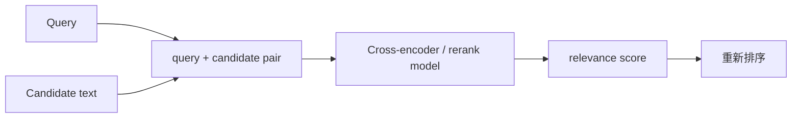

# Top-K、Threshold 与 Rerank

Top-K 控制每个阶段保留多少候选，Threshold 排除低于已校准相关门槛的结果，Rerank 使用更昂贵的模型重新判断 query 与候选的关系。三者处在多阶段检索的不同位置：第一阶段优先不漏证据，重排阶段改善前排精度，上下文选择阶段还要处理去重、覆盖、权限和 Token 预算。

## 前置知识与能力目标

前置阅读：

- [Dense、Keyword 与 Hybrid Retrieval](01-dense-keyword-hybrid.md)。
- [Query Rewrite、Multi-query、实体与时间过滤](03-query-rewrite-multiquery-entities-time.md)。

本文输出一条可观测候选漏斗：

```json
{
  "queryId": "q-812",
  "generation": "support-g42",
  "stages": {
    "keyword": {"requestedK": 100, "returned": 96},
    "dense": {"requestedK": 100, "returned": 100},
    "fused": {"unique": 148},
    "reranked": {"input": 60, "output": 20},
    "contextSelected": {"chunks": 7, "tokens": 2814}
  }
}
```

每次丢弃都应能回答：在哪个阶段、依据什么配置、是否因为权限、阈值、去重或预算。

## K 不是一个全局数字

常见 K：

| 名称 | 位置 | 目标 |
|---|---|---|
| `keywordK` | 倒排召回 | 覆盖精确词项 |
| `denseK` | ANN 召回 | 覆盖语义相关 |
| `fusionK` | 通道合并后 | 限制下游候选 |
| `rerankK` | 送入 reranker | 控制模型成本 |
| `contextK` | 送入生成 | 受 Token 和多样性约束 |

`contextK=5` 不代表 dense 只能召回 5 个。第一阶段 K 太小会造成 reranker 无法恢复被漏掉的 gold evidence。

## Top-K 的机制

### 固定 K

优点：

- 容量和成本易预测。
- 实现简单。
- 便于批量和缓存。

问题：

- 简单问题带入多余候选。
- 复杂多证据问题候选不足。
- 无答案问题仍返回 K 个“最不差”的结果。
- filter 高选择性时返回数可能少于 K。

### 自适应 K

可以依据：

- 查询类型。
- 预期证据数量。
- Top 分数与后续分数落差。
- 候选多样性。
- 可用 Token。
- 风险等级。

自适应策略必须在标注集上验证，不能让模型随意输出一个 K 后直接控制成本。

### Candidate depth

Reranker 输入深度 `N` 的选择要画：

```text
N ↑ → candidate recall 通常不降
N ↑ → rerank latency/cost 增加
N ↑ → 长尾噪声增加
```

寻找质量—成本曲线的拐点，而不是默认最大。

## Threshold

Threshold 用于判断结果是否达到最低相关性。但 raw score 的意义取决于：

- 检索模型。
- similarity/distance。
- 索引 generation。
- query 类型。
- 文档语言和长度。
- 候选集。

一个模型的 `0.75` 不能复制到另一个模型。BM25 分数也不跨查询直接解释。

## 阈值校准

准备标注 query-chunk 对：

```json
{
  "query": "E-431 如何处理",
  "chunkRevisionId": "error-e431@v7",
  "label": "relevant",
  "score": 0.782,
  "retrieverVersion": "dense-e4-g42"
}
```

对候选阈值计算：

- relevant recall。
- precision。
- false accept。
- false reject。
- answerable/no-answer accuracy。

选择由业务损失决定。高风险问答可能宁愿拒答，也不能带入弱相关证据。

### 查询级门槛

可用信号：

- top score。
- top1-top2 margin。
- keyword exact match。
- reranker calibrated probability。
- 是否覆盖必要实体。
- 多通道一致性。

这些信号组合需要版本化分类器或规则，不应把一个 score 当真值。

### Threshold 与 Top-K

执行顺序常为：

```text
召回 top K
→ 权限/有效期
→ fusion
→ rerank
→ threshold
→ context selection
```

也可在第一阶段做极低安全阈值去掉明显噪声。若过早用严格阈值，会在 rerank 前丢掉可恢复候选。

## Rerank

第一阶段通常独立编码 query 和 chunk；cross-encoder reranker 联合读取二者，能判断更细的词间关系。



### 输入

常包括：

- original query。
- standalone query（可选）。
- chunk embeddingText 或 displayText。
- heading path。
- 受控 metadata。

不要把无权正文发给 reranker。模型最大输入长度可能截断 chunk，截断方向要明确。

### 输出

```json
{
  "chunkRevisionId": "policy-custom-v18-c7",
  "score": 0.91,
  "model": "reranker-r5-2026-05",
  "inputTruncated": false,
  "queryVariant": "original"
}
```

Reranker score 仍不是天然概率。若要阈值，必须在任务数据上校准。

### 截断策略

reranker 的输入上限小于候选全文时，必须记录截断位置。常见选择：

- 保留开头：适合定义先出现的结构文档，但可能丢失末尾例外。
- 保留 query 周围窗口：需要先做词项定位，对纯语义命中不稳定。
- 分段评分后聚合：保留长证据，模型调用和候选投票增加。
- 使用结构摘要加关键原文：摘要是派生内容，最终引用仍要指向原始 span。

评估集要包含“支持句在末尾”和“例外在末尾”的样例。若 `inputTruncated=true`，调试器应展示被保留的 source range，而不是只展示原始 chunk。

### Pointwise、pairwise、listwise

- Pointwise：逐 query-document 评分，易并行。
- Pairwise：比较两个候选谁更相关，调用数增长。
- Listwise：一组候选共同排序，可利用相对信息，但受输入长度和位置影响。

选择取决于候选数、延迟、模型接口和评估。

### Reranker 失败

- gold 不在候选，无法恢复。
- 长 chunk 关键证据在截断末尾。
- 用改写 query 导致原意丢失。
- 对表格序列化理解错误。
- 训练分布与当前领域不同。
- 外部 API 数据边界不允许。
- 模型/别名漂移未记录。
- 成本超时后静默复用原顺序。

降级必须在 trace 标记 `rerank_status=skipped_timeout`。

## Context Selection

rerank top 排名仍不能直接拼接。需要：

### 去重

- 完全 chunk ID。
- 相邻 overlap。
- 同 parent。
- 相同内容不同来源。

### 覆盖

多证据问题可能需要主规则和例外。可用 subtopic/entity coverage，避免前五名都来自同一小节。

### Token 装箱

每个候选有：

- estimated tokens。
- relevance。
- required/optional。
- source diversity。
- citation value。

选择器遵守：

- 固定指令和输出 reserve。
- 不拆不可拆结构。
- 必要证据优先。
- 权限与有效期再次检查。

### 排序

送入模型时不一定按 rerank score：

- 同文档按原序排列。
- 主规则在例外前。
- 不同来源标出边界。
- 冲突按版本和生效时间展示。

重新排序不改变 relevance trace。

## 应用案例一：支持知识库

### 输入

50,000 chunks，混合错误码、手册和工单。总延迟目标 p95 1.5 秒。

### 基线

- keyword K=50。
- dense K=50。
- fusion unique 70。
- 直接取前 5。

失败：复杂症状题缺少例外，精确题有多余相邻块。

### 候选管线

- keyword/dense 各 100，并行。
- fusion 保留 120。
- 先去重到约 80。
- rerank 前 50。
- 校准阈值后保留最多 20。
- context selector 取 4–8 个、上限 3200 Token。

### 评估

按 query 类型画：

- candidate Recall@N。
- nDCG@10。
- context precision。
- answer completeness。
- groundedness。
- p95。
- 每请求 rerank 成本。

### 决策

错误码 exact query 的 rerank 输入降到 15；自然语言症状用 50；多条件问题允许 70。路由由确定性 query type 触发。

### 失败分支

只观察最终正确率会看不到 candidate recall 已下降、生成模型偶然用常识答对。检索门槛必须单独存在。

## 应用案例二：无答案政策问题

### 输入

知识库最新到 2026，用户问 2027 年尚未发布费率。

### 候选

Top-K 总会返回 2026 的相关费率。相关主题不等于支持具体时点。

### 策略

1. metadata filter 先要求有效时间覆盖 2027。
2. 结果为空，直接 answerability=no-evidence。
3. 若只按主题检索，reranker 还需将时间冲突标为不支持。
4. threshold 在 no-answer 标注集校准。
5. 生成器收到结构化 no-answer，不收到旧费率正文。

### 输出

说明知识库没有覆盖该时点，可展示当前可用资料范围，但不能把 2026 数字写成 2027。

### 验证

- false answer rate。
- false no-answer rate。
- 过期来源不进入 context。
- 文案不泄漏无权来源。

## 应用案例三：多来源冲突

### 输入

政策正文 v18 与旧 FAQ 对期限描述冲突。

### 选择

- retrieval 保留两个候选供冲突诊断。
- metadata 标出 publisher、revision、effective time。
- reranker 不负责裁定权威性。
- 确定性 source policy 决定正文优先，旧 FAQ 标 stale。
- context 可展示冲突或只使用当前权威来源，依产品规则。

### 失败分支

提高 reranker threshold 不能解决来源权威冲突。相关性模型可能更喜欢写得通俗的旧 FAQ。

## 参数实验

候选矩阵：

```json
{
  "candidateK": [20, 50, 100, 200],
  "rerankDepth": [0, 20, 50, 100],
  "contextTokenBudget": [1200, 2400, 3600],
  "thresholdPolicy": [
    "none",
    "global-calibrated-v2",
    "query-type-v3"
  ]
}
```

不要全笛卡尔积直接线上试。先：

1. 固定开发集筛除明显劣势配置。
2. 在独立 test 比较入围方案。
3. 对高风险标签设硬门槛。
4. 用 bootstrap 或配对差异估计不确定性。
5. 影子流量检查真实延迟与分布。

## 调试路径

一条 gold evidence 消失：

1. source revision 是否在 generation。
2. filter 后是否存在。
3. keyword/dense 原始 rank。
4. fusion 后 rank。
5. 是否在 rerank input depth 内。
6. rerank 后 score/rank。
7. threshold 是否排除。
8. context 去重/预算是否排除。
9. 最终模型输入是否记录。

记录每阶段 rejected reason：

```text
permission_denied
expired
outside_candidate_depth
rerank_below_threshold
duplicate_neighbor
token_budget
source_policy
```

## 性能与可靠性

### 批量 rerank

- 限制 batch 大小和总 Token。
- 记录排队、服务和网络耗时。
- 设总 deadline，不为每候选独立无限重试。
- partial response 不能默认为零分而不标记。

### 超时降级

选择：

- 使用 fused rank。
- 缩小 rerank depth。
- 明确失败，不生成高风险答案。

按任务风险决定。降级路径也进入评估集。

### Cache

rerank cache key：

```text
query_hash
candidate_content_hash
reranker_model
reranker_config
tenant_scope
```

候选文本、模型或权限变化时失效。

## 安全边界

- reranker 不接触未授权候选。
- query/candidate 视为不可信数据。
- 模型输出 score 不控制权限。
- 外部 reranker 的数据保存和区域合规明确。
- Prompt injection 不应改变排序控制指令。
- 业务来源权威性由配置，不由模型猜。
- Token/费用有硬上限。

## 综合练习

构建多阶段候选漏斗：

1. 至少 100 条问题并标注 gold chunk。
2. 记录 keyword/dense/fusion/rerank/context 各阶段。
3. 比较四个 candidate K 和三个 rerank depth。
4. 在 answerable/no-answer 上校准 threshold。
5. 实现 overlap 去重和多证据覆盖。
6. 注入 reranker 超时、截断、过期 source 和冲突来源。
7. 输出逐样例 rejected reason。

### 验收标准

- 每个 K 有明确阶段名。
- threshold 绑定 retriever/reranker 版本与数据集。
- reranker 只处理授权候选。
- gold 未在 candidate 时不会归因于生成。
- context selector 同时考虑相关性、覆盖、去重与 Token。
- 超时降级可观测并经过评估。
- 高风险和无答案门槛独立报告。

## 来源

- [Dense Passage Retrieval for Open-Domain Question Answering](https://arxiv.org/abs/2004.04906)（访问日期：2026-07-18）
- [HYRR: Hybrid Infused Reranking for Passage Retrieval](https://arxiv.org/abs/2212.10528)（访问日期：2026-07-18）
- [BEIR: A Heterogeneous Benchmark for Zero-shot Evaluation of Information Retrieval Models](https://arxiv.org/abs/2104.08663)（访问日期：2026-07-18）
- [Lost in the Middle: How Language Models Use Long Contexts](https://arxiv.org/abs/2307.03172)（访问日期：2026-07-18）
