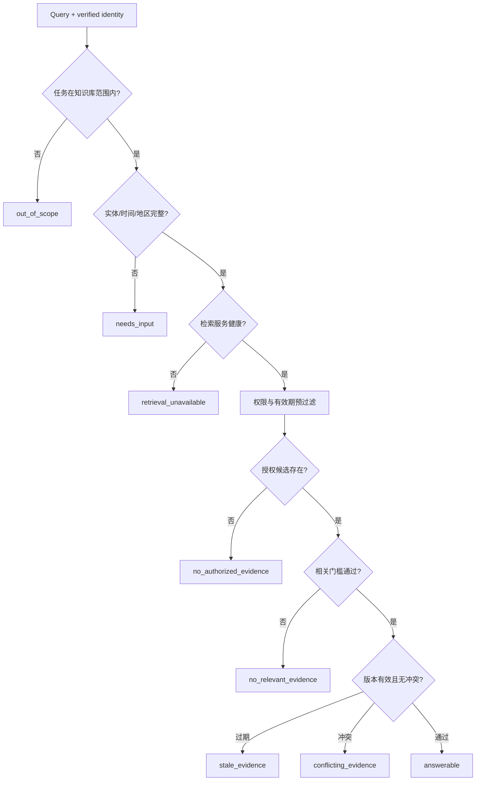

# 无相关结果时的拒答与降级

检索器即使没有相关证据也常会返回“最相似”的 Top-K。拒答系统要区分知识库范围外、授权后无结果、资料过期、来源冲突、查询不完整和服务故障，并返回对应状态。它不是一句“我不知道”，而是一条从检索证据到用户操作的可验证失败路径。

## 前置知识与能力边界

前置阅读：

- [Citation、证据与无法回答](../04-ai-ux/06-citations-evidence-no-answer.md)。
- [Metadata Filter 与权限过滤](02-metadata-permission-filters.md)。
- [Top-K、Threshold 与 Rerank](04-topk-threshold-rerank.md)。

本文处理 evidence availability。模型是否回答得流畅不影响证据是否足够。高风险事实不能通过模型预训练记忆填补私有或时效知识空缺。

## 无答案状态分类

建议用受控状态：

| 状态 | 含义 | 用户动作 |
|---|---|---|
| `out_of_scope` | 知识库不覆盖该任务 | 切换功能或来源 |
| `needs_input` | 缺少实体、时间、地区等 | 补充信息 |
| `no_authorized_evidence` | 授权范围内无可用证据 | 请求访问或联系负责人 |
| `no_relevant_evidence` | 有资料但与问题不相关 | 改写或人工升级 |
| `stale_evidence` | 只有过期资料 | 查看旧资料范围，不回答当前事实 |
| `conflicting_evidence` | 当前来源互相冲突 | 展示冲突并升级 |
| `retrieval_unavailable` | 检索服务故障 | 重试或稍后恢复 |
| `answerable` | 有足够证据 | 进入生成 |

权限状态对普通用户的文案要避免泄漏“某个受限文档存在”。内部 trace 可记录 denied count，但访问受控。

## Answerability 的输入

```json
{
  "originalQuery": "2027 年 Pro 费率是多少？",
  "queryPlan": {
    "productId": "plan:pro",
    "effectiveAt": "2027-01-01T00:00:00+08:00"
  },
  "retrieval": {
    "authorizedCandidates": 0,
    "expiredCandidates": 4,
    "lowRelevanceCandidates": 12
  },
  "knowledgeCoverage": {
    "latestEffectiveTo": "2026-12-31T23:59:59+08:00"
  },
  "serviceStatus": "healthy"
}
```

这类结构比让模型阅读一堆低分候选后决定“有无答案”更可控。

## 决策顺序



顺序很重要。服务故障不能显示成“没有资料”，否则用户会错误认为知识库不覆盖。

## 范围判定

知识库应有 coverage metadata：

```json
{
  "domain": "support-policy",
  "products": ["aster-pro", "aster-basic"],
  "regions": ["cn-east", "cn-south"],
  "documentTypes": ["policy", "manual"],
  "timeCoverage": {
    "start": "2024-01-01T00:00:00+08:00",
    "end": "2027-01-01T00:00:00+08:00"
  }
}
```

coverage 说明库预期覆盖什么，不代表每个问题都有答案。它由数据控制面维护，不应让生成模型自由编写。

范围分类器可以是规则或模型，但：

- 先处理确定性产品/功能路由。
- 输出结构化 domain 与置信状态。
- 低置信进入澄清，不直接拒绝。
- 在真实 query 分布上评估。

## 缺少输入

问题“退款期限多久”可能缺：

- 地区。
- 商品类型。
- 购买时间。
- 订单状态。

如果不同取值会产生不同答案，就不能选择默认。返回：

```json
{
  "status": "needs_input",
  "missing": ["region", "purchaseTime"],
  "question": "请提供购买地区和购买时间。",
  "preservedQueryId": "q-91"
}
```

补充后继续同一任务，保留已确认实体，但重新计算权限与有效期。

## 相关性门槛

Top-K 的存在不等于 relevant。门槛可组合：

- 检索/rerank score。
- exact entity coverage。
- gold 校准的 answerability classifier。
- source type。
- 时间有效性。
- 是否覆盖所有必要子问题。

### 多证据完整性

问题“规则是否改变”需要两个版本；只检索到当前版本，主题相关却不足以回答“改变”。Answerability Schema：

```json
{
  "requiredEvidence": [
    {"role": "before_revision", "satisfied": false},
    {"role": "after_revision", "satisfied": true}
  ],
  "status": "no_relevant_evidence",
  "reason": "missing_before_revision"
}
```

## 过期资料

过期不总是删除：

- 历史订单需要旧政策。
- 当前问题不能用旧政策。

决策依赖业务时刻。若用户问 2027，只有 2026：

- 不生成 2027 数字。
- 可以说明知识库资料覆盖到 2026。
- 可提供当前已发布资料入口，但明确时间。
- 提供订阅更新或人工联系。

不要把 `latest indexed` 当 `currently effective`。两者字段不同。

## 冲突来源

冲突检测需要：

- 原子主张。
- source authority。
- revision/effective time。
- publisher。
- 解析质量。

确定性策略可以选当前权威 policy，而不是旧 FAQ。无法裁定时返回 conflicting：

```json
{
  "status": "conflicting_evidence",
  "claims": [
    {
      "value": "14 days",
      "sourceRevision": "policy-v18",
      "effectiveAt": "2026-07-01"
    },
    {
      "value": "7 days",
      "sourceRevision": "faq-v6",
      "effectiveAt": null
    }
  ]
}
```

模型可解释冲突，不能隐藏冲突并猜一个值。

## 检索故障

区分：

- query embedding 超时。
- keyword index unavailable。
- vector index unavailable。
- authorization service unavailable。
- reranker timeout。
- active generation missing。

降级策略：

| 故障 | 低风险搜索 | 高风险政策 |
|---|---|---|
| Dense 失败 | 可 keyword-only，标 degraded | 只有评估证明才允许 |
| Keyword 失败 | 可 dense-only | 精确实体任务可能拒绝 |
| Authz 失败 | 不降级 | 不降级 |
| Rerank 失败 | 可 fused rank | 按任务门槛 |
| 全检索失败 | unavailable | unavailable |

授权失败绝不能降级为“不过滤”。

## 生成合同

生成器只接受：

```json
{
  "answerability": "answerable",
  "evidence": [
    {
      "evidenceId": "ev-1",
      "sourceRevision": "policy-v18",
      "locator": "section:refund-window",
      "text": "标准退款期限为 14 天。"
    }
  ],
  "requiredCitationIds": ["ev-1"]
}
```

若 status 不是 answerable，走确定性 UX 状态，不调用自由回答 Prompt，或使用严格限制的说明模板。

输出校验：

- 每个事实主张有 evidence ID。
- citation ID 存在且有权。
- 结构合法。
- no-answer 状态不出现具体未证实值。
- 不泄漏 denied source。

## 应用案例一：未来费率

### 输入

“2027 年华东 Pro 级 3kg 费用是多少？”

### 处理

1. 实体和单位完整。
2. 费率库 coverage 到 2026-12-31。
3. 2027 filter 后无有效 row。
4. 旧 row 进入 `expiredCandidates`，不进入模型 context。
5. status=`stale_evidence`。

### 用户状态

```text
当前资料未覆盖 2027 年费率。现有资料的有效期截至 2026-12-31。
```

可提供“查看当前费率”和“联系定价团队”，但不显示 2026 金额作为预测。

### 验证

- 2026-12-31 边界可回答。
- 2027-01-01 拒答。
- 时区明确。
- 无答案中不出现费率数字。
- stale 与 service unavailable 文案不同。

### 失败分支

模型看到 2026 表后可能把日期替换成 2027。解决不是追加“不要幻觉”，而是不把过期表作为 answer evidence。

## 应用案例二：权限受限合同

### 输入

用户问合同的终止日期。索引中有合同，但当前用户无权。

### 行为

- 预过滤后授权候选为 0。
- 普通响应写“在当前可访问资料中无法找到可用证据”。
- 不显示合同标题、日期或“你没有权限访问合同 X”。
- 可提供正式申请访问入口。

### 审计

受权安全人员可看到：

- decision ID。
- denied count。
- policy version。
- query hash。

正文仍需额外权限。

### 失败分支

若先 rerank 再过滤，外部 reranker 已接触合同。最终答案不泄漏不能证明系统安全。

## 应用案例三：冲突政策

### 输入

当前 policy v18 写 14 天；FAQ v6 写 7 天，且没有有效期。

### 处理

1. 两者都被召回。
2. source policy 标记正式政策优先。
3. FAQ 标记 stale candidate。
4. 回答 14 天并引用 v18。
5. 内部发出 stale source 质量事件。

若没有权威性规则，则 status=`conflicting_evidence`，展示两个受权来源与日期并建议人工确认。

### 验证

- 不能让 reranker 分数决定事实权威。
- FAQ 更新后回归。
- 冲突样例加入评估集。
- 用户 citation 只打开有权版本。

## 应用案例四：检索服务部分失败

### 输入

Dense 服务超时，keyword 正常。问题是精确错误码。

### 策略

固定评估显示该 query type 的 keyword-only Recall@5 达到发布门槛，因此：

- 以 keyword-only 降级。
- response metadata 标 degraded。
- 监控 dense failure。
- 不把降级结果写入正常质量样本。

自然语言症状题则返回 temporary unavailable，因为 keyword-only 未达门槛。

## 评估集

至少包括：

- 正常可回答。
- 缺实体。
- 缺时间。
- 范围外。
- 无相关文档。
- 仅过期资料。
- 冲突来源。
- 无权资料。
- keyword/dense/reranker 故障。
- 高分但不支持。
- 多证据缺一。
- 恶意要求“忽略资料直接回答”。

标签是状态，不只是 expected answer。

### 指标

- answerable precision/recall。
- abstention precision/recall。
- unsupported answer rate。
- false no-answer rate。
- stale answer rate。
- conflict handling accuracy。
- unauthorized exposure rate。
- needs-input completion rate。
- degraded path quality。
- user retry/handoff completion。

高风险 unsupported answer 和 unauthorized exposure 可设置零容忍发布门槛。

## 调试路径

错误拒答：

1. 检查 scope 路由。
2. 检查缺失 slots。
3. 检查 authorization。
4. 检查 active generation。
5. 检查 metadata 时间边界。
6. 检查第一阶段 candidate recall。
7. 检查 threshold 与 rerank。
8. 检查 required evidence coverage。

错误回答：

1. 查看 answerability 状态是否被绕过。
2. 查看模型 context 是否含 stale/denied。
3. 将回答拆成 claims。
4. 找每个 claim 的 evidence。
5. 检查 citation validator。
6. 把失败加入回归。

## UX 边界

无答案状态应说明：

- 发生了什么。
- 哪类信息缺失。
- 用户能做什么。
- 已保存的输入是否仍在。

不要：

- 用红色错误代表正常 no-answer。
- 自动反复重试确定性无答案。
- 把 denied 和不存在区分得足以泄漏。
- 显示内部相似度和 Prompt。
- 用“模型不确定”替代具体 evidence 状态。

## 生产控制

- answerability policy 版本化。
- 阈值按 retriever/reranker generation。
- no-answer 模板国际化并安全审查。
- 状态与失败 reason 进入 trace。
- 降级路径单独 SLO。
- 人工 handoff 保留 query、授权证据和已完成步骤。
- 线上误答回流离线集。
- policy 变更后运行全量拒答回归。

## 综合练习

实现 Evidence Gate：

1. 构建至少 80 条状态标注问题。
2. 实现 scope、missing input、service health、auth、relevance、freshness 和 conflict 决策。
3. 生成结构化 answerability。
4. 只有 answerable 才进入回答生成。
5. 模拟未来日期、删除证据、ACL 撤销、冲突和 Dense 超时。
6. 输出逐阶段 reason 与安全用户文案。
7. 比较 threshold 配置。

### 验收标准

- Top-K 不会自动变成 answerable。
- 无权与不存在不会泄漏差异。
- stale 证据不支持当前事实。
- 多证据问题检查完整性。
- auth 服务失败不降级。
- 每个状态有用户下一步。
- unsupported answer 与 false no-answer 分开量化。
- 所有失败能回放到 generation、filter 和 evidence。

## 来源

- [Selective Prediction for Deep Neural Networks](https://arxiv.org/abs/1705.08500)（访问日期：2026-07-18）
- [GaRAGe: A Benchmark with Grounding Annotations for RAG Evaluation](https://aclanthology.org/2025.findings-acl.875/)（访问日期：2026-07-18）
- [Groundedness in Retrieval-augmented Long-form Generation](https://aclanthology.org/2024.findings-naacl.100/)（访问日期：2026-07-18）
- [NIST AI Risk Management Framework](https://www.nist.gov/itl/ai-risk-management-framework)（访问日期：2026-07-18）
