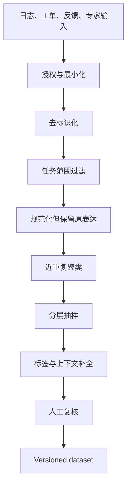

# 构建至少 50 条真实 RAG 问题

RAG 评估集的第一项资产是问题，不是模型答案。问题集要代表真实任务分布，并覆盖无答案、时效、冲突、权限和对抗边界。路线图中的“至少 50 条”是建立可分析分组的起点；样例数量增加不能弥补来源单一、近重复泄漏或缺失关键请求上下文。

## 前置知识与产出

前置阅读：

- [固定样例与模型/Prompt 对比](../13-evaluation/fixed-cases-comparison.md)。
- [无相关结果时的拒答与降级](../07-rag-retrieval/05-no-relevant-results.md)。

本文产出：

- versioned question dataset。
- 每条样例的来源 lineage。
- 任务、风险和边界标签。
- 请求身份、时间与会话上下文。
- development、test 和 challenge 拆分。
- 数据质量报告。

答案与证据标注在下一篇展开。

## 什么是真实问题

真实问题来自实际用户任务或能证明会发生的业务流程。来源包括：

- 去标识化搜索日志。
- 客服工单。
- 用户明确反馈。
- 无结果查询。
- 线上失败 trace。
- 领域专家处理的真实任务。
- 产品流程中必须回答的问题。

专家为补充边界而编写的问题有价值，但应标 `source=expert_authored`，不能伪装成生产分布。

纯模型生成问题只适合：

- 补充已定义攻击模式。
- 制造格式变化。
- 扩展语言或拼写扰动。

它不能估计真实频率，也容易复制当前文档措辞。

## 样例 Schema

```json
{
  "caseId": "rag-refund-0041",
  "datasetVersion": "refund-eval-v5",
  "input": {
    "query": "定制版两周后还能退吗？",
    "conversation": [],
    "requestTime": "2026-07-18T10:00:00+08:00",
    "timezone": "Asia/Shanghai",
    "principalFixture": "support-cn-standard",
    "tenantFixture": "tenant-a"
  },
  "labels": {
    "task": "policy_qa",
    "answerability": "answerable",
    "evidenceShape": "rule_plus_exception",
    "risk": "high",
    "language": "zh-CN",
    "sourceType": "production_log"
  },
  "lineage": {
    "sourceRecordId": "query-log-hmac-812",
    "collectedAt": "2026-07-10",
    "transformations": ["pii_redaction", "whitespace_normalization"]
  }
}
```

### `caseId`

稳定且不编码个人信息。修正标注时保留 ID，增加 dataset version 与变更记录。

### `requestTime`

时效问题必须有绝对时间和时区。若业务依据订单时间，另保存受控 fixture，不用 requestTime 替代。

### `principalFixture`

权限问题要在可重建的测试身份下运行。fixture 不使用真实账号和生产 token。

### `lineage`

记录来源类型和允许的变换。不能保留可逆个人标识。

## 采集管线



每一步保留统计：输入数、排除数、原因、输出数。删除个人信息后不能把原文放在调试日志里。

## 去标识化

可能包含：

- 姓名。
- 邮箱。
- 电话。
- 地址。
- 订单号。
- 合同号。
- 公司内部项目。
- 访问 token。

替换规则要保持任务结构：

```text
原：订单 CN-829104 的退款日期？
夹具：订单 ORDER-001 的退款日期？
```

同时建立 fixture 数据库中的 `ORDER-001`。若只替换 query、不替换 gold source，测试无法运行。

不可把 Secret hash 后保留；低熵 token 仍可被枚举。Secret 应删除和轮换。

## 保留用户表达

以下特征影响检索：

- 错别字。
- 缩写。
- 口语。
- 代词。
- 不完整句。
- 中英混合。
- 错误码格式。
- 相对时间。

可以保存一个 normalizedQuery 供分析，但 runner 必须运行原始去标识文本。全部改成标准书面语会高估 query rewrite 和 retrieval。

## 标签体系

### 任务

- fact lookup。
- policy interpretation。
- compare versions。
- procedure。
- troubleshooting。
- table lookup。
- multi-hop。
- summarization with evidence。

### Answerability

- answerable。
- needs input。
- no evidence。
- stale only。
- conflict。
- unauthorized。
- out of scope。
- service failure（用于可靠性夹具）。

### Evidence shape

- one span。
- multiple spans same source。
- multiple sources。
- rule + exception。
- table cells。
- historical revisions。
- no evidence。

### 风险

- low：普通导航。
- medium：业务解释。
- high：费用、权限、合同、合规、安全操作。

风险影响发布门槛，不表示高风险问题更常见。

## 50 条的分层方案

一个起始集合可为：

| 分组 | 数量 | 目的 |
|---|---:|---|
| 单证据正常问题 | 12 | 基础召回与生成 |
| 多证据/规则例外 | 8 | 证据完整性 |
| 表格和精确实体 | 6 | 数字、错误码 |
| 多轮与改写 | 5 | 代词和上下文 |
| 无答案/范围外 | 5 | 拒答 |
| 过期/版本 | 4 | 时间 |
| 冲突来源 | 3 | 证据治理 |
| 权限 | 4 | 安全 |
| 对抗/注入 | 3 | 控制边界 |

这只是某项目的起始配额。真实生产比例另用加权报告，不应让挑战样例数量直接代表线上频率。

## 分层抽样

从生产池中按：

- 任务。
- tenant/产品（去标识后）。
- 语言。
- query 长度。
- 是否多轮。
- 有无点击/后续改写。
- 结果数。
- 反馈状态。

抽样时避免：

- 只取高频简单题。
- 只取团队印象深的失败。
- 同一用户连续相似 query 占多数。
- 当前系统已回答成功的 survivorship bias。

## 近重复

重复形式：

- 完全相同。
- 标点和空格不同。
- 实体值不同、结构相同。
- 同一会话连续改写。
- 同一模板批量生成。

流程：

1. 确定性规范化找 exact duplicate。
2. n-gram/embedding 找候选簇。
3. 人工判断任务是否等价。
4. 同一簇按频率保留代表样例。
5. challenge 可保留有意义的语言变体，但加 `variantGroupId`。

拆分数据集前先聚类。同簇不能跨 development/test。

## 数据拆分

### Development

用于：

- 调 Prompt。
- 选 chunk 参数。
- 校准 threshold。
- 分析失败。

### Test

只在候选方案确定后运行。频繁依据 test 调参会使其变成 development。

### Challenge

集中：

- 权限。
- 无答案。
- 对抗。
- 超长与复杂结构。
- 新出现失败。

Challenge 不替代 test 的生产代表性。

### 时间拆分

若系统随文档和用户行为变化，可按采集时间：

- 旧时间用于开发。
- 新时间用于 test。

同时冻结对应 source snapshot，否则答案变化被误判为系统回退。

## 应用案例一：从搜索日志构建 80 条

### 原始数据

一个月 42,000 条去标识前日志。允许用于质量改进，保存周期 30 天。

### 处理

1. 在受控环境移除账号、订单号和自由输入中的 PII。
2. 排除 Secret、恶意个人数据和无业务范围内容。
3. 规范化用于聚类，原表达保留。
4. 形成 9,200 个 query cluster。
5. 按任务、频率和反馈分层。
6. 高频簇抽 40，长尾失败抽 20，无答案/权限抽 20。
7. 领域人员补齐 request time、fixture 与标签。

### 输出

- 80 个稳定 case ID。
- 65 production log、10 failure feedback、5 expert boundary。
- development 50、test 20、challenge 10。
- 每组 variant cluster 不交叉。

### 验证

- PII 扫描。
- fixture 可运行。
- 标签分布。
- query 长度和语言与生产池比较。
- 双人抽查 20%。
- source snapshot 可访问。

### 失败分支

若只抽有点击结果的 query，会排除无结果和用户放弃的问题，系统拒答能力被高估。

## 应用案例二：新产品无日志

### 场景

Aster Mini 尚未上线，没有生产查询。

### 输入

- 旧产品同类任务分布。
- 新产品规格、政策和支持流程。
- 内测人员任务记录。
- 上线风险分析。

### 构建

1. 从旧产品提取任务结构，不复制答案。
2. 领域专家写新产品实体和边界。
3. 让内测人员在不看文档原句的情况下完成真实任务。
4. 记录自然语言和失败。
5. 模型仅生成拼写、语序和多语言扰动，人工复核等价。
6. 标记所有来源。

### 发布后

真实日志进入滚动集，比较合成/专家集与生产分布。若差异大，替换而不是无限追加。

### 失败分支

直接让模型阅读新文档后生成问题，query 会复用文档关键词，使 keyword retrieval 看起来异常好。

## 应用案例三：线上 Bug 回归

### Bug

用户问“超过两周的定制商品”，系统只引用标准 14 日规则，遗漏定制例外。

### 回归样例

保存：

- 去标识 query。
- 当时 source snapshot。
- 主规则与例外的必要证据。
- 失败类型 `missing_exception`。
- 修复版本。

增加最小对照：

- 普通商品两周内。
- 定制商品两周内。
- 定制商品超过两周。
- 无地区信息。

这样防止修复一个点后把普通规则全部拒答。

## 数据集质量检查

### Schema

- case ID 唯一。
- request time 带时区。
- fixture 存在。
- 标签在受控枚举。
- source lineage 存在。

### 隐私

- PII/Secret 扫描。
- 文本人工抽样。
- 访问控制。
- 保存周期。
- 删除机制。

### 分布

- 各任务和 answerability。
- 语言。
- query 长度。
- 多轮比例。
- 风险。
- 来源类型。
- 近重复率。

### 可运行

- source snapshot 可加载。
- principal fixture 有效。
- query plan 输入完整。
- runner 不依赖生产服务写操作。

## 版本管理

变更：

```json
{
  "datasetVersion": "refund-eval-v6",
  "parent": "refund-eval-v5",
  "changes": {
    "added": ["rag-refund-0081"],
    "updated": ["rag-refund-0041"],
    "retired": ["rag-refund-0012"]
  },
  "reason": "new_failure_and_gold_revision_fix"
}
```

修正错误标注不应静默覆盖旧运行结果。运行记录绑定 dataset version。

Retire 原因：

- 任务不再存在。
- source 合法删除。
- 样例含不可保留数据。
- 重复且无独特覆盖。

退役样例不从历史报告消失。

## 生产回流

每周或每个发布周期：

1. 收集新失败和无结果。
2. 去标识。
3. 近重复匹配。
4. 若已有 case，增加 occurrence 统计。
5. 若新 failure mode，加入 challenge。
6. 定期刷新代表性 test，但保留固定核心集。

固定核心集支持长期比较，滚动集检测分布变化。

## 反例

- 50 条全部来自 README 标题。
- 所有问题都可回答。
- query 没有时间和 principal。
- 模型生成问题与参考答案后自己评分。
- development 与 test 共享近重复。
- 修复 Bug 只改旧 expected output，不新增边界。
- 用生产账号运行权限测试。
- 每次运行随机抽 50 条，无法配对。

## 综合练习

为一个政策助手建立 v1 问题集：

1. 从三种真实来源收集候选。
2. 去标识并建立 fixture。
3. 聚类去重。
4. 形成至少 60 条。
5. 覆盖正常、多证据、表格、多轮、无答案、过期、冲突、权限和对抗。
6. 拆分 development/test/challenge。
7. 输出数据卡和质量检查。
8. 加入一个真实 Bug 回归族。

### 验收标准

- 每条有 stable ID、来源和变换 lineage。
- 时效题有绝对时刻和时区。
- 权限题使用测试 principal。
- 近重复组不跨拆分。
- production 与 authored 来源可区分。
- PII/Secret 检查通过。
- 50 条以上不是同一模板替换实体。
- 数据集版本能重放历史运行。

## 来源

- [GaRAGe: A Benchmark with Grounding Annotations for RAG Evaluation](https://aclanthology.org/2025.findings-acl.875/)（访问日期：2026-07-18）
- [RAGEval: Scenario Specific RAG Evaluation Dataset Generation Framework](https://aclanthology.org/2025.acl-long.418/)（访问日期：2026-07-18）
- [OpenAI Evaluation best practices](https://platform.openai.com/docs/guides/evaluation-best-practices)（访问日期：2026-07-18）
- [NIST Privacy Framework](https://www.nist.gov/privacy-framework)（访问日期：2026-07-18）
