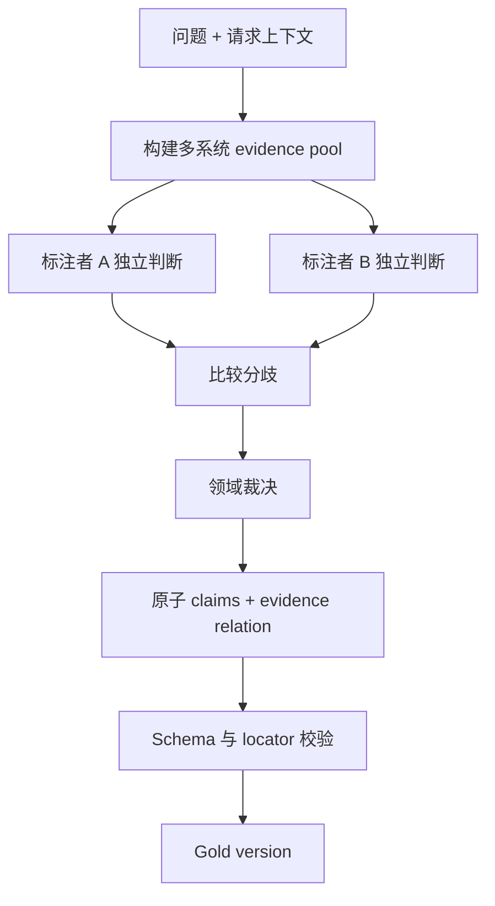

# 相关文档与参考答案标注

RAG 样例必须定义什么证据相关，以及可接受答案包含哪些主张。相关文档标注用于测检索，参考答案用于测生成；两者都要绑定 source revision、请求时刻和测试身份。只保存一段理想答案字符串，无法区分同义正确表达、缺失必要事实和引用了错误版本。

## 前置知识与产出

前置阅读：

- [构建至少 50 条真实 RAG 问题](01-real-question-set.md)。
- [标题、页码、来源与原文定位](../05-rag-parsing/02-structure-page-source-locators.md)。

每个标注样例产出：

- evidence universe。
- relevant evidence judgments。
- 必要/可选/冲突/禁止证据。
- 原子 reference claims。
- answerability。
- 可接受变体与不可接受主张。
- 标注者、裁决和版本。

## 相关性的单位

可以标：

- source/document。
- section。
- chunk。
- block/span。
- table cell。

文档级标注适合判断是否找对来源，但不够评估 chunk 和 citation。建议保留层级：

```json
{
  "sourceRevision": "policy-v18",
  "documentRelevance": "relevant",
  "evidence": [
    {
      "evidenceId": "ev-window",
      "blockIds": ["b41"],
      "locator": "section:refund/window",
      "judgment": "required"
    },
    {
      "evidenceId": "ev-custom",
      "blockIds": ["b57"],
      "locator": "section:refund/exceptions/custom",
      "judgment": "required"
    }
  ]
}
```

检索系统可以改变 chunk 边界，gold 仍以原始 block/span 定义。运行时计算候选 chunk 是否覆盖 gold evidence。

## Evidence universe

标注者要在固定 source snapshot 中判断。若只看当前检索器 Top-K，会漏掉检索器未找到的真正相关文档，形成 pooling bias。

候选池可来自：

- keyword 高深度。
- dense 高深度。
- 多种 embedding。
- 人工目录导航。
- 已知 source/版本。
- 其他系统。

合并去重后标注。仍不能保证全库绝对完整，因此报告 pooling 方法。

## 相关性等级

一个实用枚举：

| judgment | 含义 |
|---|---|
| `required` | 缺少它无法完整正确回答 |
| `supporting` | 能支持答案，但可由其他等价证据替代 |
| `contextual` | 帮助解释，不直接支持关键主张 |
| `irrelevant` | 与问题无关 |
| `stale` | 主题相关但对请求时刻失效 |
| `conflicting` | 与其他当前来源形成未裁决冲突 |
| `unauthorized_fixture` | 在测试身份下不可用 |
| `unjudged` | 未标注，不应当作 irrelevant |

`required` 可能是集合关系：

```json
{
  "evidenceRequirement": {
    "type": "all_of",
    "members": ["ev-window", "ev-custom"]
  }
}
```

或多个可替代证据：

```json
{
  "type": "any_of",
  "members": ["ev-policy-paragraph", "ev-authoritative-table-row"]
}
```

## 时间和权限

同一文档对不同样例判断不同：

- 2026-06-30 的订单使用 v17。
- 2026-07-01 使用 v18。
- 无权用户不能使用受限附件。

Gold 需要绑定：

```json
{
  "evaluationContext": {
    "businessTime": "2026-07-01T10:30:00+08:00",
    "principalFixture": "customer-standard",
    "tenantFixture": "tenant-a",
    "sourceSnapshot": "kb-g42"
  }
}
```

不能因文档事实正确就忽略权限。无权证据不允许进入参考答案。

## Reference claims

把答案拆成最小可判断主张：

```json
{
  "claims": [
    {
      "claimId": "c1",
      "text": "标准退款期限为购买后 14 天。",
      "required": true,
      "supportedBy": ["ev-window"],
      "value": {"amount": 14, "unit": "day"}
    },
    {
      "claimId": "c2",
      "text": "定制商品不适用该标准期限。",
      "required": true,
      "supportedBy": ["ev-custom"]
    }
  ]
}
```

结构化 value 适合数字、日期、枚举和实体。文本用于人工理解，不要求模型逐字匹配。

## 参考答案不是唯一字符串

以下可都正确：

```text
定制商品不适用标准 14 天退款规则。
标准期限为 14 天，但定制商品属于例外。
```

因此评估：

- 必要 claims 是否覆盖。
- 数值与单位是否正确。
- 是否有额外不支持 claim。
- 引用是否支持相应 claim。
- 格式是否满足产品要求。

可保留一个 reference rendering 作为示例，但不做纯字符串相等。

## 不可接受主张

显式标注常见错误：

```json
{
  "forbiddenClaims": [
    {
      "pattern": "定制商品可在 14 天内无理由退款",
      "reason": "contradicts_exception"
    },
    {
      "pattern": "手续费为 20 元",
      "reason": "not_supported_by_evidence"
    }
  ]
}
```

`pattern` 可以是语义 label，不一定用正则。确定性数字和实体可用结构化检查。

## Answerability 标注

如果 evidence 不足，参考输出不是编造一个答案，而是：

```json
{
  "answerability": "stale_evidence",
  "requiredBehavior": {
    "mustAbstain": true,
    "mayStateCoverage": "资料有效期截至 2026-12-31",
    "mustNotState": ["2027_fee_value"]
  }
}
```

无答案样例仍需要 evidence judgments：过期、冲突或 denied 候选用于验证系统有没有错误使用。

## 标注流程



高风险样例至少双人独立标注。标注者先看问题和来源，不先看当前系统答案，避免锚定。

## 标注界面

应显示：

- query、conversation、request/business time。
- principal fixture 的权限摘要。
- source title、publisher、revision、effective time。
- 原文与 locator。
- 解析 warning。
- relevance judgment。
- claim editor。
- 分歧与备注。

不应：

- 默认按当前 retriever rank 排序而不允许目录搜索。
- 显示真实用户身份。
- 把 model answer 放在首屏。
- 用颜色代替判断文字。
- 在保存时覆盖 source revision。

## 标注指南

### Required

判断问题：没有这段证据，能否仍在当前 source snapshot 中完整支持答案？

### Supporting

同一事实的另一个权威表达。用于 any-of。

### Contextual

例如产品背景，不能单独支持期限数字。

### Stale

主题相同但请求时刻不适用。历史问题中它可能重新变 required。

### Conflicting

主张冲突且 source policy 尚未裁定。若正式政策优先规则明确，旧 FAQ 可标 stale/invalid，而不是 conflict。

### Irrelevant

在该问题和上下文下无帮助。不要因语言不同或表达间接就轻易判 irrelevant。

## 应用案例一：规则加例外

### 问题

“定制版两周后还能按标准政策退款吗？”

### 候选

- v18 标准期限：14 天。
- v18 定制商品例外。
- v17 标准期限：7 天。
- 当前运费政策。

### 标注

- v18 标准期限 required。
- v18 定制例外 required。
- v17 stale。
- 运费 irrelevant。

Reference claims：

1. 标准期限是 14 天。
2. 定制商品不适用标准期限。
3. 超过两周不能据标准无理由规则退款。

第三条是前两条在问题条件下的受控推论。标注其 derivation，不能当原文直接引用。

### 失败分支

只标“定制例外”可能遗漏“两周”具体边界；只标期限会生成错误肯定答案。evidence requirement 是 all-of。

## 应用案例二：表格计算

### 问题

“华东 Pro 3.2kg 在 2026-07-10 的基础费用和每公斤费用？”

### Evidence

- 表名与单位。
- 匹配地区/产品/重量区间的 row。
- 生效日期 cell。
- 适用脚注。

Gold：

```json
{
  "claims": [
    {
      "claimId": "base_fee",
      "value": {"amount": 20, "currency": "CNY"},
      "supportedBy": ["cell:D42", "header:D1"]
    },
    {
      "claimId": "per_kg",
      "value": {"amount": 3.5, "currency": "CNY/kg"},
      "supportedBy": ["cell:E42", "header:E1"]
    }
  ]
}
```

列名和单位是证据的一部分。只标两个数值 cell 无法解释含义。

### 失败分支

若问题问最终费用，还需要确定性计算规则和舍入；参考答案不能默认模型算术。

## 应用案例三：历史版本

### 问题

“2026-06-20 购买的订单适用几天？”

Gold context 指向订单 fixture 的购买时刻。v17 在该时刻有效，因此：

- v17 required。
- v18 future/not applicable。

如果当前网页只显示 v18，标注工具必须能打开历史 source snapshot。

## 应用案例四：权限

### 问题

“合同 A 的终止日期？”

低权 fixture：

- 合同证据标 unauthorized。
- answerability=no_authorized_evidence。
- required behavior=abstain without existence leakage。

高权 fixture 可使用同一 query，但不同 case ID 或 parameterized fixture：

- 合同 evidence required。
- 日期 claim required。

权限差异属于测试输入，不能共享同一无 principal 的 gold。

## 一致性

可计算：

- Cohen's kappa（两标注者类别）。
- Krippendorff's alpha（多标注者/缺失）。
- evidence span overlap。
- claim agreement。
- adjudication rate。

一致性低可能来自指南不清、来源冲突或任务本身不可判。不要只通过培训让数字变高，应修正 Schema 和边界。

## Gold 版本变化

来源更新时：

- 历史 gold 保留旧 snapshot。
- 新当前问题建立或迁移到新 revision。
- 迁移需要重新判断 claims 与 evidence。
- locator 自动重锚后人工验证关键样例。
- 运行报告绑定 gold version。

修正 gold 错误：

```json
{
  "caseId": "rag-refund-0041",
  "goldVersion": 3,
  "change": "added_required_exception_evidence",
  "reviewedBy": ["annotator-7", "adjudicator-2"]
}
```

## 质量检查

- 每个 required claim 至少有 evidence。
- 每个 evidence 在固定 snapshot 中存在。
- locator replay。
- evidence 权限允许 fixture。
- effective time 覆盖 business time。
- no-answer 没有 required factual answer。
- any-of/all-of 无悬空 ID。
- value 单位和时区明确。
- stale/irrelevant 不支持 reference claim。
- 标注者与裁决记录存在。

## 调试评估失败

系统答案与 gold 不同：

1. 先检查 gold 是否仍有效。
2. 检查 source snapshot。
3. 检查问题上下文和 principal。
4. 将系统答案拆 claims。
5. 判断是检索未召回、context 未选择、生成遗漏、错误主张或引用错。
6. 若发现 gold 错，更新 gold version，不修改系统输出来“过测试”。

## 综合练习

对 60 条问题完成 evidence 与 claim 标注：

1. 使用多检索器构建候选池。
2. 以 block/span/cell 标 gold。
3. 为每题定义 required/supporting/stale/conflicting/unauthorized。
4. 将参考答案拆成 claims。
5. 定义 any-of/all-of。
6. 高风险题双人独立标注。
7. 回放全部 locator。
8. 生成一致性与裁决报告。

### 验收标准

- Gold 绑定 source snapshot、时间和 principal。
- 不依赖当前检索器 Top-K 作为完整 universe。
- 参考答案不是唯一字符串。
- required claim 有可定位证据。
- 表格值包含表头和单位。
- 无答案和权限样例定义禁止行为。
- 分歧有裁决，不静默覆盖。
- Gold 版本可重放。

## 来源

- [GaRAGe: A Benchmark with Grounding Annotations for RAG Evaluation](https://aclanthology.org/2025.findings-acl.875/)（访问日期：2026-07-18）
- [TREC Relevance Judgments](https://trec.nist.gov/data/qrels_eng/)（访问日期：2026-07-18）
- [KILT: a Benchmark for Knowledge Intensive Language Tasks](https://arxiv.org/abs/2009.02252)（访问日期：2026-07-18）
- [RAGEval: Scenario Specific RAG Evaluation Dataset Generation Framework](https://aclanthology.org/2025.acl-long.418/)（访问日期：2026-07-18）
