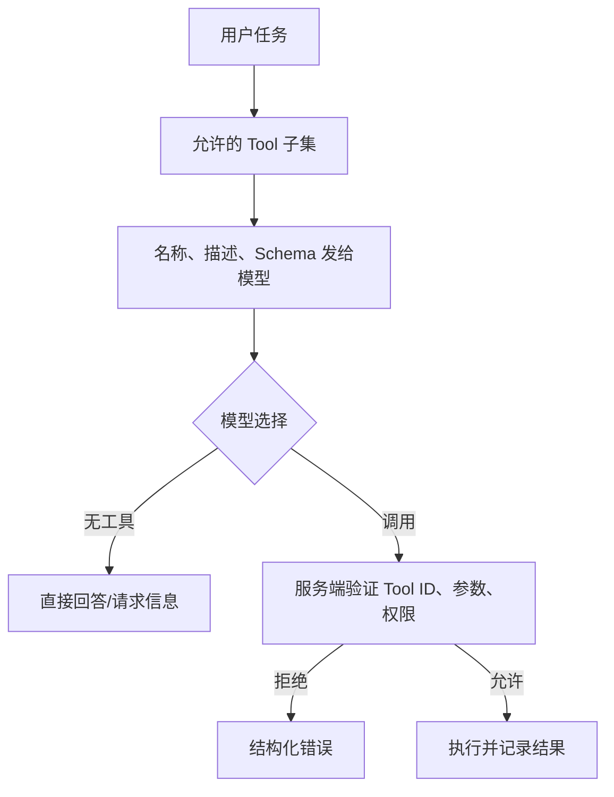

# 清晰的 Tool 名称与描述

Tool 名称和描述是模型选择能力的接口，也是开发者、审批者和审计人员理解行为的入口。名称应稳定标识动作，描述应明确用途、适用条件、不会做什么、重要副作用与所需前提。它们帮助选择，不构成安全授权；服务端仍要校验身份、参数和业务状态。

## 前置知识与产出

前置阅读：

- [多轮、Streaming、Structured Output、Tool Calling 与多模态](../01-model-api/core-api-capabilities.md)。
- [指令与数据的边界](../03-context-engineering/01-instruction-data-boundary.md)。

本文产出：

- 命名约定。
- 描述合同。
- tool catalog。
- 选择测试集。
- 版本与弃用策略。
- 调试所需的选择 trace。

## Tool 定义的三个受众

### 模型

根据名称、描述和 Schema 判断是否调用、调用哪个、参数填什么。

### 用户

在确认界面理解“将发生什么”。给模型的技术描述不一定适合直接展示，需单独 `title` 和影响摘要。

### 工程系统

通过稳定 ID 路由执行、设置策略、统计成功率和审计。

不能让一个随意自然语言字符串同时承担全部责任。

## 名称

推荐使用动词 + 资源：

```text
search_orders
get_order
preview_refund
create_refund
cancel_refund
```

### 规则

- 使用 API 支持的字符集和长度。
- 在同一 catalog 唯一。
- 表示一个动作，不用 `helper`、`manage`、`do_task`。
- 读写差异写入动作。
- 名称稳定，显示文案可本地化。
- 不嵌入 tenant、环境或版本号。

### 不清晰名称

```text
order_tool
execute
process_request
update
admin
```

问题在于无法知道资源、动作和副作用。

### 过度具体

```text
refund_order_14_days_cn_pro_v18
```

业务规则会变化，名称不应编码全部策略。稳定动作是 `create_refund`；服务端根据订单事实和当前 policy 判断。

## 描述合同

一个有用描述回答：

1. 做什么。
2. 何时使用。
3. 何时不要使用。
4. 关键输入来自哪里。
5. 是否有副作用。
6. 返回什么类别结果。

示例：

```json
{
  "name": "preview_refund",
  "title": "预览退款影响",
  "description": "根据已验证的订单 ID 计算可退金额、手续费和受影响支付记录，不创建退款。创建前必须先调用此工具，并把返回的 previewId 与影响摘要展示给用户。",
  "inputSchema": {
    "type": "object",
    "properties": {
      "orderId": {"type": "string", "pattern": "^ORDER-[0-9]{6}$"}
    },
    "required": ["orderId"],
    "additionalProperties": false
  }
}
```

描述中的“不创建退款”帮助区分 preview 与 create。真正禁止写入仍通过工具实现和数据库权限保证。

## 描述不能代替 Schema

不应写：

```text
传入合法订单 ID 和可选金额，金额必须大于 0。
```

却把 Schema 留成：

```json
{"type": "object"}
```

模型可能遵循描述，恶意或错误调用者不会。类型、required、范围和枚举进入 Schema；业务授权与账户状态进入服务端。

## Catalog 结构

```json
{
  "catalogVersion": "support-tools-v12",
  "tools": [
    {
      "id": "orders.get",
      "name": "get_order",
      "title": "查看订单",
      "description": "读取当前用户有权查看的单个订单，不修改订单或支付状态。",
      "risk": "read",
      "owner": "order-platform",
      "schemaVersion": "3",
      "policyId": "order-read-v7",
      "deprecated": false
    }
  ]
}
```

模型可见字段应最小化。owner、policy 等可留在控制面。

## 同名与冲突

不同 Server 都有 `search` 时，Host 需要命名空间：

```text
orders.search_orders
knowledge.search_documents
crm.search_customers
```

展示给模型的最终名称受具体 API 限制，可编码安全前缀。路由必须基于服务端 catalog ID，不解析模型自造前缀。

## Tool 选择过程



先按用户、租户、功能和任务状态缩小可见 Tool 子集。给模型数百个相似工具会增加歧义、Token 和错误选择。

## 描述中的负边界

当两个工具相似时写明确边界：

```json
[
  {
    "name": "search_orders",
    "description": "按日期、状态或客户可见标识搜索订单，返回摘要列表；已知精确 orderId 时使用 get_order。"
  },
  {
    "name": "get_order",
    "description": "按精确 orderId 读取一笔订单详情；不知道 orderId 时使用 search_orders。"
  }
]
```

不要在每个描述塞入整个 catalog。只写最近的易混淆边界。

## 动态状态

描述不应包含会频繁变化的：

- 当前余额。
- 当前权限。
- 今日限额。
- 某订单状态。

这些由服务端读取。否则描述缓存会使模型依据旧状态选择。

可动态决定是否暴露某工具：

- 未登录不暴露订单工具。
- 没有审批权限不暴露 approve。
- 任务已经完成不暴露重复提交。

即使不暴露，执行端仍防止伪造调用。

## Catalog 规模与命名空间

Tool 数量增加会产生三个问题：

- 相似名称竞争，模型选择准确率下降。
- 名称、描述和 Schema 占用输入 Token。
- 用户无法理解确认界面来自哪个系统。

Host 应按当前任务、用户权限和产品区域裁剪 catalog。例如“查看订单”阶段只暴露订单读取与搜索，不把部署、账单和文件删除工具全部发送给模型。裁剪规则由确定性服务执行，并记录 catalog subset hash。

命名空间至少区分资源域：

```text
orders_search
knowledge_search
calendar_search_events
```

如果 API 允许 server-qualified identity，可让路由 identity 保持 `serverId/toolName`，再为模型生成满足字符约束的别名。别名映射必须不可由模型修改：

```json
{
  "modelVisibleName": "orders_search_orders",
  "catalogId": "orders-server/tools/search_orders",
  "mappingVersion": "host-map-v3"
}
```

当两个 Server 宣称相同 Tool 时，Host 不按“后注册覆盖前注册”处理。未知或未批准 Server 的描述不能进入模型 catalog。

## 描述的可验证断言

描述中的行为应能转成 contract test：

| 描述断言 | 测试 |
|---|---|
| “不修改订单” | 调用前后业务 revision 不变 |
| “只返回当前用户可见订单” | 跨 tenant/ACL fixture |
| “最多返回 50 条” | 51 条数据的上限测试 |
| “已知 ID 时使用 get_order” | Tool 选择对照 |
| “创建前必须 preview” | 无 preview 的 command 被拒 |

无法由实现保证的营销句不应进入描述。例如“总能找到正确答案”既不能测试，也会误导模型继续调用。

## 多语言与本地化

Tool 的稳定 `name` 不本地化。`title` 和用户确认文案可以本地化。给模型的描述使用与任务输入匹配的语言时，要保证各语言版本语义一致：

- 副作用不能只在某一语言出现。
- “不执行”“仅预览”等负边界不能漏译。
- enum 和字段名保持 Schema 中的稳定值。
- 本地化版本随 catalog version 发布并运行同一选择集。

若团队无法维护多语言描述，可使用单一受测描述，而不是运行时让模型翻译安全边界。

## 描述冲突与优先级

Tool 描述说“可删除任意文件”，Host policy 只允许 workspace 生成物。执行端以 Host policy 为准。冲突处理：

1. 不暴露不受信 Tool。
2. catalog 标记 policy mismatch。
3. 返回安全错误给调用方。
4. 审计 Server/tool version。

不能把冲突文本同时交给模型，让模型选择遵守哪一条。

## 版本与弃用

Schema 不兼容变化：

- 新 tool ID 或明确版本。
- 保持旧执行到迁移窗口。
- catalog 标 deprecated。
- 记录替代 tool。
- 调用旧工具返回结构化迁移错误。

```json
{
  "code": "tool_deprecated",
  "tool": "lookup_order",
  "replacement": "get_order",
  "retryable": false
}
```

不要让模型从描述文字猜迁移。

## 应用案例一：订单查询

### 初始 catalog

```text
order_tool
find
details
```

模型对“看看上个月失败的订单”经常选择 `details`，参数中虚构 order ID。

### 重构

```text
search_orders
get_order
```

`search_orders` 描述日期/状态查询和摘要列表；`get_order` 明确只接受已知 ID。

### 测试集

- 已知订单 ID。
- 不知道 ID，按日期找。
- 多个匹配。
- 无匹配。
- 请求修改订单。
- 请求其他租户订单。

### 验证

- selection accuracy。
- unnecessary tool call。
- fabricated identifier rate。
- clarification rate。
- unauthorized execution 必须为零。

### 失败分支

名称优化后，模型仍可能选错。服务端发现 `ORDER-...` 不存在时返回 `not_found`，不自动搜索相似订单，避免泄漏。

## 应用案例二：退款

### Tools

- `preview_refund`：只计算。
- `create_refund`：写入。
- `get_refund_status`：读取状态。

### 用户请求

“这笔订单如果退，到账多少？”

只应 preview。描述中区分“计算”与“创建”，工具风险元数据标 read/compute/write。

“确认按刚才金额退款”：

- 模型可选择 create。
- 服务端要求有效 previewId 与 confirmation token。
- 描述不能绕过确认。

### 测试

- 询价不写入。
- 明确创建。
- preview 过期。
- 金额变化。
- 重复确认。
- 无权限。

### 失败分支

把工具命名为 `refund_order` 并描述“查看或执行退款”，模型无法稳定选择，审批界面也无法表述影响。应拆分能力。

## 应用案例三：知识检索与网页抓取

Tools：

- `search_knowledge`：只查授权知识库。
- `fetch_public_url`：只抓允许的公网 URL。

描述要写清数据范围。用户说“查公司政策”应选知识库，不把内部 URL 传给公网 fetch。执行端对 URL 做 allowlist、DNS/IP 校验和响应限制。

## 选择评估

每条样例标：

```json
{
  "task": "查看上月失败订单",
  "allowedTools": ["search_orders"],
  "forbiddenTools": ["create_refund"],
  "mayUseNoTool": false,
  "requiredClarification": []
}
```

指标：

- correct tool。
- no-tool correctness。
- forbidden tool selection。
- unnecessary call。
- parameter readiness。
- clarification。
- execution authorization。

模型选择错误与服务端执行违规分开统计。

## A/B 测试描述

只改变描述，保持：

- tool set。
- Schema。
- model。
- system prompt。
- cases。

比较逐样例差异。若同时改名称与 Schema，无法归因。

描述测试也包含：

- 同义用户表达。
- 否定。
- 多轮代词。
- 恶意网页要求调用另一个工具。
- Tool 结果中的注入。

## 调试

记录：

- catalog version。
- 实际给模型的 tool IDs。
- 名称、描述和 Schema hash。
- model choice。
- validation result。
- authorization result。
- execution status。

不记录私有思维过程。选择错误时：

1. 可见 Tool 是否正确。
2. 名称是否冲突。
3. 描述边界是否明确。
4. Schema 是否要求模型猜未知字段。
5. 用户是否缺信息。
6. 是否应由固定 workflow 路由。

## 安全边界

- 描述来自外部 Server 时视为不可信，Host 决定是否展示。
- 用户文本不能重命名 Tool。
- 模型只提议调用。
- 工具执行端校验身份、权限、参数和状态。
- 读写能力分开。
- 高风险写入需要确认。
- 动态 Secret 不进入描述。
- 日志使用 catalog ID 与 hash。

## 综合练习

设计 8 个订单与知识工具：

1. 建稳定名称、title 和描述。
2. 为相似工具写正/负边界。
3. 只向不同角色暴露允许子集。
4. 准备 60 条选择样例。
5. 测 no-tool、clarification、read/write。
6. A/B 两版描述。
7. 注入伪造 ID、无权限和 Prompt injection。
8. 生成逐样例 trace。

### 验收标准

- 名称表示单一动作与资源。
- 描述说明使用与不使用条件。
- 变化业务状态不写进描述。
- Tool ID、显示 title 与路由 identity 分开。
- 服务端不信任模型选择。
- 选择指标与执行安全指标分开。
- catalog 可版本化和弃用。

## 来源

- [OpenAI Function Calling](https://platform.openai.com/docs/guides/function-calling)（访问日期：2026-07-18）
- [MCP Tools Specification 2025-11-25](https://modelcontextprotocol.io/specification/2025-11-25/server/tools)（访问日期：2026-07-18）
- [JSON Schema Draft 2020-12](https://json-schema.org/draft/2020-12)（访问日期：2026-07-18）
