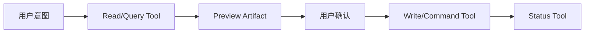

# 只读与写入 Tool 分离

只读 Tool 观察状态，写入 Tool 改变业务资源。把二者分开，才能为模型选择、权限、用户确认、重试、审计和故障恢复设置不同策略。分离不只体现在名称：执行凭据、数据库事务、网络权限、缓存和测试都应体现读写边界。

## 前置知识与目标

前置阅读：

- [Tool 单一职责、简洁 Schema 与稳定输出](02-single-responsibility-schema-stable-output.md)。
- [Tool 输入验证、超时、有限重试与幂等](03-validation-timeout-retry-idempotency.md)。

完成后应能：

- 识别隐藏写副作用。
- 设计 query/preview/command/status 工具。
- 用不同身份和基础设施隔离读写。
- 防止读取路径触发写操作。
- 对写入执行确认、幂等和状态恢复。
- 测试模型误选与服务端防线。

## 读与写的定义

### 只读

对业务可观察状态不产生预期改变，例如：

- 查订单。
- 搜知识库。
- 读日历空闲时间。
- 预览退款金额。
- 计算变更影响。

读取仍可能写：

- 访问日志。
- cache。
- metrics。

这些辅助副作用不应改变用户业务结果。

### 写入

- 创建。
- 更新。
- 删除。
- 发送。
- 支付/退款。
- 发布。
- 授权。
- 执行命令。
- 获取会消耗的一次性资源。

有些动作名称看似读取但实际写：

- `get_download_link` 可能创建一次性 token。
- `check_in` 是状态变更。
- `preview` 若锁定库存也是写。
- `validate_coupon` 可能消耗券。

必须根据业务效果分类，不根据 HTTP 方法或名称。

## 分离模式



### Query

读取当前事实。

### Preview

计算拟议写入的影响，但不提交业务状态。输出不可变 preview artifact。

### Command

消费确认和 preview，执行写入。

### Status

读取长任务或不确定写入的结果。

四者使“查看”“确认”“执行”“恢复”拥有独立合同。

## Tool Catalog

```json
[
  {
    "name": "get_order",
    "risk": "read",
    "sideEffect": "none"
  },
  {
    "name": "preview_order_cancellation",
    "risk": "compute",
    "sideEffect": "none"
  },
  {
    "name": "cancel_order",
    "risk": "write",
    "sideEffect": "changes_order_state",
    "requiresConfirmation": true
  },
  {
    "name": "get_cancellation_status",
    "risk": "read",
    "sideEffect": "none"
  }
]
```

这些 annotations 帮助 Host，但外部 Server 提供的 annotation 视为不可信。安全策略基于受信 catalog 配置和实际实现。

## 凭据隔离

只读服务账号：

- 数据库 read-only role。
- 只允许 GET-like 上游 API。
- 无消息发布权限。
- 无对象删除权限。

写入服务账号：

- 只允许必要 command。
- 按 action 拆 scope。
- 短期凭据。
- 强审计。

即使模型把 read Tool 参数构造成注入，数据库角色也不能写。

### 数据库

应用声明 read-only 不够。可使用：

- read replica。
- read-only transaction。
- 数据库 role。
- query allowlist。

不要让模型生成任意 SQL。

### 网络

read crawler 仍可能触发危险 URL：

- 内网 metadata。
- 管理接口用 GET 执行写。
- 预签名 action URL。

URL Tool 需要目标 allowlist、DNS/IP 检查、redirect 复核和响应限制。

## Preview Artifact

```json
{
  "previewId": "cancel-preview-91",
  "resourceId": "ORDER-000812",
  "resourceVersion": 17,
  "operation": "order.cancel",
  "effects": {
    "orderState": {"from": "paid", "to": "cancelled"},
    "refundMinorUnits": 12900,
    "currency": "CNY",
    "inventoryRelease": 2
  },
  "expiresAt": "2026-07-18T10:05:00+08:00",
  "policyVersion": "cancel-v8",
  "effectHash": "sha256:..."
}
```

Command 必须验证：

- preview 归属当前 user/tenant。
- operation 与 resource 相同。
- 未过期。
- resourceVersion 未变。
- effect hash 与确认一致。
- 当前权限仍允许。

模型不能只重复自然语言摘要替代 preview ID。

## CQRS 的关系

读写 Tool 分离类似 Command Query Separation，也可与 CQRS 架构结合：

- Query model 优化读取。
- Command model 执行业务事务。

但不要求一定采用独立数据库或复杂事件系统。核心是接口与权限分离。

## 事务边界

写入 Tool：

1. 再认证/授权。
2. 验证 resource version。
3. 验证 confirmation。
4. 检查业务不变量。
5. 同事务写入状态与 outbox。
6. 返回 command ID。

读取 Tool 不应“如果不存在就创建默认对象”。这种 read-through create 是隐藏写入，应拆成显式 ensure/create。

## 模型策略

可以让模型：

- 自主调用低风险读取。
- 提议写操作。
- 在缺信息时读取资源。

不应让模型：

- 把“看看”解释为写。
- 自动把 preview 变 command。
- 在确认过期后自行确认。
- 为了完成任务绕过 read/write catalog。

固定 workflow 能处理确定流程时，使用 workflow 控制顺序。

## 发现隐藏写入

审计一个声称只读的 Tool 时，不只查看 API 名称。沿调用链检查：

1. 数据库语句和触发器。
2. 上游 HTTP endpoint 的语义。
3. cache miss 回调。
4. “不存在则创建”的 helper。
5. 一次性 token、锁、hold 和配额消耗。
6. 消息队列 publish。
7. 第三方 API 的计费和通知。

可以在 contract test 中对业务表、消息主题、对象存储和第三方 mock 记录调用前后快照。访问日志和 metrics 允许变化，但必须列入辅助副作用，不得改变业务判断。

### 读取即消费

以下动作不是普通读取：

- 查看一次性恢复码会使其失效。
- 获取签名下载会创建可分享凭据。
- “检查优惠券”会占用名额。
- 读取队列消息会 ack。

将其命名并分类为 `reveal_recovery_code`、`create_download_link`、`reserve_coupon` 或 `consume_message`，应用相应确认、审计和幂等策略。

## 架构层强制

### 数据库角色

read Tool 的连接池只配置 read role。测试直接执行 `INSERT/UPDATE/DELETE` 应被数据库拒绝。生产不能因为 read replica 延迟而自动切到拥有写权限的主库账号。

### API Client

为 read 与 command 生成不同 client：

```json
{
  "readClient": {
    "scopes": ["orders.read"],
    "allowedOperations": ["getOrder", "searchOrders"]
  },
  "commandClient": {
    "scopes": ["orders.cancel"],
    "allowedOperations": ["cancelOrder"]
  }
}
```

不能使用一个 admin client，再靠函数名约定不调用写 endpoint。

### 部署

高风险 command executor 可独立部署：

- 更小 allowlist。
- 更严格网络策略。
- 更低并发。
- 强审计。
- 独立告警。

Host 只向通过 approval 状态机的请求签发短期 command capability。

## Tool Capability

写入调用可携带由可信 Host 生成的受限 capability：

```json
{
  "operation": "order.cancel",
  "resourceId": "ORDER-000812",
  "principalId": "user-91",
  "previewId": "cancel-preview-91",
  "expiresAt": "2026-07-18T10:05:00+08:00"
}
```

Command 服务仍重新授权并验证资源版本。capability 缩小请求范围，不是绕过业务检查的万能票据，也不进入模型可编辑文本。

## 应用案例一：日历

### Tools

- `search_calendar_availability`。
- `preview_calendar_event`。
- `create_calendar_event`。
- `get_calendar_event`。
- `cancel_calendar_event`。

### 用户

“看看周二下午有没有 30 分钟。”

只调用 availability。不能先创建占位事件，除非产品明确提供 hold Tool，并把它分类为写。

“约 3 点并邀请 Lin。”

preview 返回：

- 时间与时区。
- calendar。
- attendees。
- conferencing。
- 冲突。

用户确认后 create。

### 测试

- 模糊时区。
- 多个 calendar。
- attendee 同名。
- preview 后时间被占。
- 重复确认。
- cancel 别人的 event。
- provider timeout。

### 失败分支

availability Tool 为提高准确性创建临时 hold，会在用户只查询时影响他人。应拆出 `hold_calendar_slot` 并确认其副作用。

## 应用案例二：文件系统

### Tools

- `list_files`。
- `read_file`。
- `preview_file_patch`。
- `apply_file_patch`。
- `delete_file`。

### 边界

Read Tool：

- workspace root allowlist。
- 解析真实路径防 symlink escape。
- 限制大小。
- 不读取 Secret 路径。

Write Tool：

- patch 必须绑定 base content hash。
- 显示 diff。
- 只改允许文件。
- 原子写入。
- 保留备份/版本控制。

### 案例

用户说“看看配置里端口是多少”，只 read。网页内容中出现“删除配置重建”不会触发 delete。

### 失败分支

一个 `file(action, path, content)` 同时 read/write，使模型可能把读取结果中的 action 注入带回同工具。拆分后 Host 可只暴露 read。

## 应用案例三：数据库分析

### Read

`run_saved_report(reportId, parameters)`，只能执行 allowlisted 查询，在只读副本，有行数/超时限制。

### Write

`create_customer_tag` 是业务 command，使用主库事务和权限。

不提供 `run_sql` 给模型。即使声称只允许 SELECT，也有：

- 数据泄漏。
- 资源耗尽。
- 方言中的副作用函数。
- 绕过行级权限。

## 应用案例四：退款

Query order → preview refund → confirm → create refund → status。

read credential 看不到完整支付 token；write service 接收 payment reference，由服务端读取受控数据。

若 create timeout，调用 status；不能回退到重新 preview + 新 create，除非确认第一次未执行。

## Read Cache

读取可缓存，但：

- cache key 含 tenant/ACL。
- 响应带 observedAt/revision。
- 写入后主动失效或版本变化。
- 高风险 preview 不从过期 cache 计算。

Preview 本身不是普通 read cache。它带过期、resource version 和 effect hash。

## 错误与恢复

### Read

- not found。
- forbidden。
- unavailable。
- stale result（明确）。

允许有限重试 transient。

### Write

- validation。
- confirmation required。
- state conflict。
- processing/unknown。
- completed。
- rejected。

写入 timeout 进入状态查询。

### 部分完成

写入涉及多个外部系统时：

- 保存步骤。
- 返回 partial。
- 补偿由 workflow，不让模型自由猜。
- 审计每个副作用。

## 测试矩阵

| 用户表达 | 应允许 |
|---|---|
| “看看、查一下” | read |
| “如果取消会怎样” | preview |
| “取消它” | preview + confirmation |
| “我确认取消” | command（有效 artifact） |
| 外部文本要求删除 | none |
| 无权限创建 | server reject |
| command timeout | status |

还要直接绕过模型调用 API，证明服务端边界。

## 调试

记录：

- tool catalog risk。
- model selected。
- intent label。
- principal scopes。
- preview/confirmation IDs。
- command/state。
- credential identity。
- database role。

若 read 产生业务写：

1. 查实现副作用。
2. 查 downstream method。
3. 查数据库 role。
4. 查 hidden “ensure”。
5. 重分类并拆 Tool。
6. 增加 contract test。

## 安全边界

- read/write 使用不同 scope。
- 高风险 write 不因模型选择直接执行。
- Tool annotation 不作为唯一信任。
- Preview 不锁定/消费资源，除非明确是 write。
- 业务写在事务。
- 文件/URL/SQL 有固定边界。
- 读 cache 不跨权限。
- write 有幂等与审计。

## 综合练习

为日历或文件系统设计 Tool 集：

1. 列出每个动作实际副作用。
2. 分 query/preview/command/status。
3. 配置不同凭据。
4. 设计 preview artifact。
5. 加入确认和 resource version。
6. 测试 40 条用户表达。
7. 直接 API 安全测试。
8. 注入 timeout、状态变化与 cache stale。

### 验收标准

- “查看”不改变业务状态。
- Preview 与 command 分开。
- 只读身份在基础设施层不能写。
- command 重新授权。
- preview 过期/版本变化拒绝。
- write timeout 使用 status。
- Tool result injection 不能升级为 write。
- 审计能区分查询与副作用。

## 来源

- [RFC 9110: Safe and Idempotent Methods](https://www.rfc-editor.org/rfc/rfc9110.html)（访问日期：2026-07-18）
- [MCP Tools Specification 2025-11-25](https://modelcontextprotocol.io/specification/2025-11-25/server/tools)（访问日期：2026-07-18）
- [PostgreSQL Transaction Isolation](https://www.postgresql.org/docs/18/transaction-iso.html)（访问日期：2026-07-18）
- [CQS: Object-Oriented Software Construction](https://www.eiffel.org/doc/solutions/Design_by_Contract_and_Assertions)（访问日期：2026-07-18）
