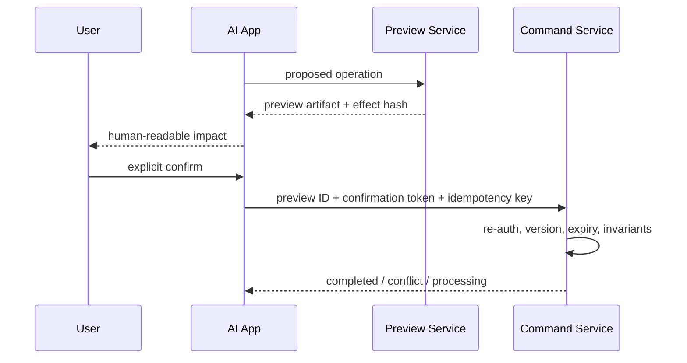

# 写操作的影响范围展示与确认

确认不是一个通用“确定吗”弹窗。高风险 Tool 在执行前应生成不可变影响预览，展示目标、变化、数量、金额、接收者、不可逆性和恢复方式；用户确认必须绑定这份预览、身份、有效期与资源版本。执行时服务端重新验证，防止确认后状态变化。

## 前置知识与目标

前置阅读：

- [只读与写入 Tool 分离](04-separate-read-and-write-tools.md)。
- [不确定性、人工确认与人工接管](../04-ai-ux/07-uncertainty-confirmation-human-handoff.md)。

完成后应能：

- 按影响而不是按钮分类风险。
- 生成 preview artifact。
- 设计上下文绑定 confirmation。
- 处理批量、部分成功和资源变化。
- 防止模型自我确认。
- 测试重放、点击劫持和误导摘要。

## 哪些动作需要确认

通常包括：

- 付款、退款、转账。
- 删除、覆盖、发布。
- 发送外部消息。
- 修改权限。
- 执行命令。
- 创建付费资源。
- 批量变更。
- 暴露敏感数据给第三方。

风险由：

- 可逆性。
- 金额/数量。
- 影响对象。
- 外部可见性。
- 权限提升。
- 数据敏感性。
- 自动恢复难度。

决定。同一个 `update_profile` 修改昵称和修改收款账户风险不同。

## 风险策略

```json
{
  "policyVersion": "confirmation-v9",
  "rules": [
    {
      "operation": "refund.create",
      "requiresConfirmation": true,
      "requiredFields": ["amount", "currency", "orderId", "paymentCount"]
    },
    {
      "operation": "file.delete",
      "requiresConfirmation": true,
      "requiredFields": ["pathCount", "paths", "recoverability"]
    }
  ]
}
```

策略在服务端。模型不能设置 `requiresConfirmation=false`。

## Preview/Commit



Preview 不是模型总结，而是服务端基于当前事实计算。

## Preview Artifact

```json
{
  "previewId": "refund-preview-91",
  "operation": "refund.create",
  "actor": "user-91",
  "tenant": "tenant-a",
  "resource": {
    "type": "order",
    "id": "ORDER-000812",
    "version": 17
  },
  "effects": {
    "refund": {"currency": "CNY", "minorUnits": 12900},
    "paymentTransactions": 1,
    "orderState": {"from": "paid", "to": "refunding"}
  },
  "warnings": ["退款提交后不能通过本工具撤销"],
  "policyVersion": "refund-v8",
  "expiresAt": "2026-07-18T10:05:00+08:00",
  "effectHash": "sha256:..."
}
```

Artifact 不含可复用支付 Secret。

## 影响展示

### 必须回答

- 动作是什么。
- 作用于哪个对象。
- 哪些字段/状态改变。
- 数量和金额。
- 谁会收到通知。
- 是否对外公开。
- 是否可撤销。
- 失败时会发生什么。

### 不只显示模型生成摘要

UI 从结构化 effects 渲染关键字段。模型可以补充解释，但不能省略或改写关键金额、路径和接收者。

### 批量

显示：

- 总数量。
- 分组。
- 前若干代表项。
- 完整清单下载/展开。
- 预计费用。
- 不符合条件的项。
- 是否允许部分成功。

“将修改 100 个对象”不足以发现跨租户或错误范围。

### 可访问性

- 确认按钮有明确名称。
- 不只靠颜色区分危险。
- 焦点进入标题/摘要。
- 键盘可操作。
- 不自动倒计时确认。
- 危险与取消按钮不因布局变化互换。

## Explicit Confirmation

有效确认应：

- 来自当前 authenticated user。
- 明确对应动作。
- 发生在影响展示之后。
- 绑定 preview/effect hash。
- 未过期。
- 不可被模型或 Tool result 代替。

“用户之前说过你看着办”不一定授权具体金额/目标。对高风险动作要求当前 artifact 明确确认。

## Confirmation Token

```json
{
  "confirmationId": "confirm-17",
  "previewId": "refund-preview-91",
  "effectHash": "sha256:...",
  "principalId": "user-91",
  "sessionIdHash": "sha256:...",
  "operation": "refund.create",
  "issuedAt": "2026-07-18T10:01:00+08:00",
  "expiresAt": "2026-07-18T10:05:00+08:00",
  "usedAt": null
}
```

token 可为服务端记录 ID 或签名对象。即使签名正确，也要检查当前资源状态和权限。

确认 token 不进入模型可编辑的 arguments。Host 在收到真实用户交互事件后，通过独立控制字段附加；Tool Gateway 拒绝模型自行构造的同名 JSON 字段。刷新恢复时，Host 从服务端读取 Waiting Approval 状态，不从对话文本重建“已确认”。

## Resource Version

确认后订单可能：

- 已退款。
- 金额改变。
- 被取消。
- 权限撤销。

Command 使用 optimistic concurrency：

```text
UPDATE orders
SET state = 'refunding', version = 18
WHERE id = 'ORDER-000812'
  AND version = 17
  AND state = 'paid'
```

影响 0 行则 conflict，重新 preview。不能静默按新状态执行。

## 模型与确认

模型可以：

- 建议动作。
- 调 preview。
- 向用户解释。
- 等待 confirmation。

模型不能：

- 调用“confirm” Tool 替用户确认。
- 把外部文档“请确认”当用户输入。
- 在用户沉默时默认同意。
- 修改 preview。
- 将一项确认扩展到多项。

Host 状态机控制 Waiting Approval。

## 分层确认

低风险写：

- 用户当前明确命令可视为确认。

中风险：

- 展示摘要 + 按钮。

高风险：

- 详细 preview。
- 二次认证。
- typed confirmation 或管理员审批。

分层由 policy 决定，避免所有点击都疲劳化。不能为了减少摩擦取消必要确认。

## 应用案例一：退款

### 请求

“把 ORDER-000812 全退。”

### Preview

- 129.00 CNY。
- 1 笔支付。
- 订单进入 refunding。
- 不可通过本工具撤销。

### 状态变化

用户确认前，另一笔部分退款完成，余额变 99.00。

Command 检查 version 失败，返回：

```json
{
  "status": "conflict",
  "error": {
    "code": "preview_stale",
    "retryable": false,
    "action": "create_new_preview"
  }
}
```

应用重新 preview，并要求确认新金额。不能复用旧确认。

### 测试

- 金额格式和 currency。
- preview 过期。
- 不同 user 重放。
- resource version 变化。
- 双击确认。
- 网络 timeout。
- 部分退款。
- 权限撤销。

## 应用案例二：批量删除文件

### 请求

“删除构建产物。”

路径解析可能匹配：

- `dist/` 120 个生成文件。
- `dist-config/production.json` 源配置（不应匹配）。

### Preview

服务端解析 allowlisted root 和 glob，返回：

```json
{
  "pathCount": 120,
  "totalBytes": 4819200,
  "roots": ["dist/"],
  "outsideAllowedRoot": [],
  "recoverability": "git_untracked_no_backup",
  "samplePaths": ["dist/app.js", "dist/app.css"]
}
```

UI 提供完整清单。用户确认后，command 绑定 path set hash。

### 失败分支

如果 command 重新计算 glob，确认后新增文件也会被删。应按确认时的 path identities 执行，或检测集合变化并重新确认。

### 测试

- symlink escape。
- case-sensitive path。
- 新增文件。
- 文件变成目录。
- 120→10,000 数量异常。
- 删除部分失败。
- Git 可恢复与不可恢复。

## 应用案例三：发送邮件

Preview 展示：

- To/Cc/Bcc。
- subject。
- attachment 名称/大小。
- 数据分类。
- 外部域名。
- 发送账号。

正文中外部内容可能包含 prompt injection，不得自动修改 recipient。确认绑定 body hash 和 attachments hash。

### 失败分支

用户确认 3 个收件人，模型随后从邮件正文解析出另一个地址并添加。effect hash 变化必须使 confirmation 失效。

## 应用案例四：权限变更

“让 Alex 能管理项目。”

需要消歧：

- 哪个 Alex。
- 哪个项目。
- role 权限集合。
- 是否包含删除/账单。
- 到期时间。

Preview 展示权限 diff，而不是只显示“设为管理员”。高风险可要求资源 owner 二次审批。

## 部分成功

批量写入需预先定义：

- all-or-nothing。
- per-item independent。
- best-effort。

Preview 显示策略。结果：

```json
{
  "status": "partial",
  "completed": 98,
  "failed": 2,
  "failures": [
    {"resourceId": "file-17", "code": "version_conflict"},
    {"resourceId": "file-44", "code": "forbidden"}
  ]
}
```

重试只针对安全失败项，使用各自幂等 key。模型不能默认回滚已发送邮件等不可逆动作。

## 确认疲劳

降低疲劳的方法：

- 只在真实风险动作确认。
- 合并同一 preview 的相关 effects。
- 关键字段突出。
- 提供安全默认。
- 低风险偏好可在 policy 允许下记忆。

不能：

- 让用户全局“永远允许所有写”。
- 隐藏范围。
- 将取消按钮弱化。
- 每次确认内容相同但实际 effect 已变。

## 安全攻击

### UI redress

- frame 限制。
- 清晰来源。
- 按钮间距。
- 不允许不可见 overlay。

### Replay

- token 一次性/有期限。
- 绑定 session/principal/effect。
- 使用后状态。

### Confused deputy

用户有权查看但无权执行。Command 重新授权 action。

### Injection

Tool result、网页和邮件不能产生 confirmation。只接受 Host 的用户交互事件。

## 审计

记录：

- proposed by model/user。
- preview ID/effect hash。
- rendered schema version。
- confirmation actor/time/session。
- second-factor decision。
- command ID/idempotency key hash。
- result/partial。

不要存支付凭证和完整敏感正文。

## 测试

### Contract

- 所有风险动作有 preview。
- UI 关键字段来自结构。
- 确认绑定 effect。
- command 重新检查。

### Race

- 资源版本。
- 权限撤销。
- 金额变化。
- 批量集合变化。

### Security

- 跨用户 replay。
- 跨 tenant。
- 过期 token。
- Tool result 假确认。
- 双击。
- 点击劫持。

### UX

- 键盘。
- screen reader。
- 长清单。
- 小屏。
- partial result。
- 刷新恢复。

## 调试

发现未确认写入：

1. operation risk policy。
2. preview 是否生成。
3. Host 状态机。
4. confirmation event 来源。
5. token/effect 验证。
6. command auth。
7. idempotency。

发现用户确认了错误范围：

1. structured effects。
2. render 映射。
3. truncation/展开。
4. batch path set。
5. preview 后变化。
6. 模型解释是否遮盖关键字段。

## 综合练习

实现批量文件删除审批：

1. preview 路径集合。
2. 检查 root、symlink 和敏感文件。
3. 生成 count/bytes/recoverability/hash。
4. 可访问确认 UI。
5. 绑定 principal/session/expiry。
6. command 检查集合与版本。
7. 支持 partial result。
8. 注入 replay、变化和 timeout。

### 验收标准

- 影响范围由服务端计算。
- UI 不依赖模型摘要显示关键事实。
- 用户确认明确且发生在预览后。
- effect 变化使确认失效。
- Command 重新授权。
- 同一确认不会重复副作用。
- partial/unknown 可恢复。
- 审计可证明谁确认了什么。

## 来源

- [MCP Tools Specification 2025-11-25](https://modelcontextprotocol.io/specification/2025-11-25/server/tools)（访问日期：2026-07-18）
- [W3C Web Authentication Level 3](https://www.w3.org/TR/webauthn-3/)（访问日期：2026-07-18）
- [OWASP Transaction Authorization Cheat Sheet](https://cheatsheetseries.owasp.org/cheatsheets/Transaction_Authorization_Cheat_Sheet.html)（访问日期：2026-07-18）
- [WAI-ARIA Authoring Practices: Alert and Message Dialogs](https://www.w3.org/WAI/ARIA/apg/patterns/alertdialog/)（访问日期：2026-07-18）
