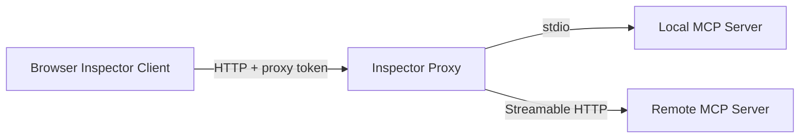
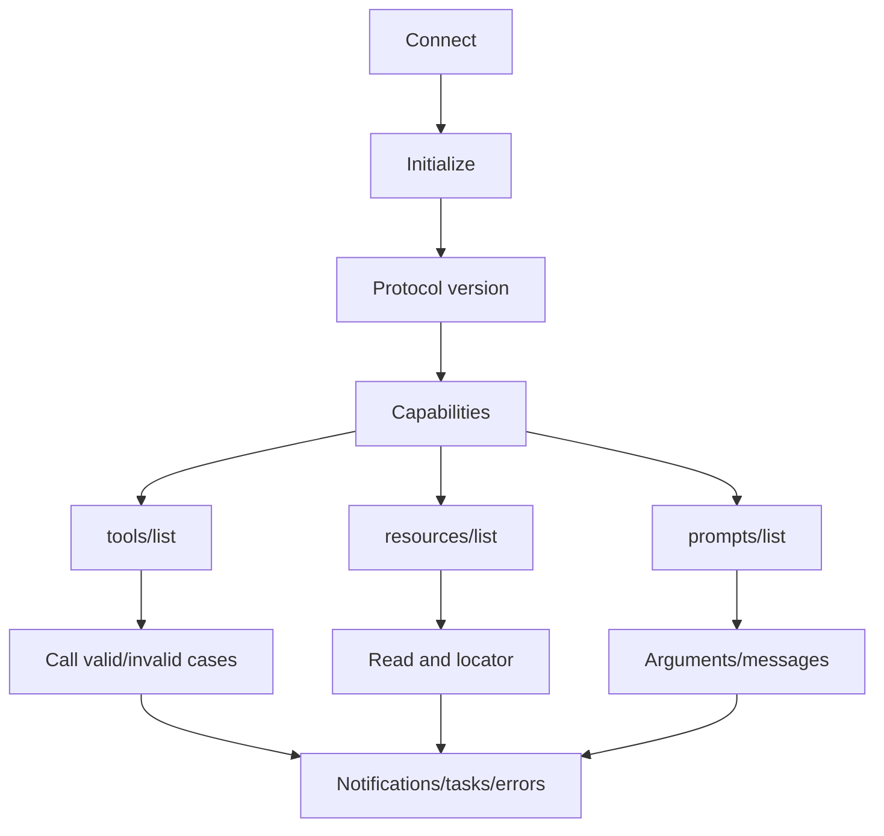

# 使用 MCP Inspector 调试 Server

MCP Inspector 是官方的交互式测试与命令行调试工具，由浏览器 Client 和本地 Proxy 组成。它可以连接 stdio 或远程 MCP Server，执行 initialize、列举 primitives、调用 Tool、读取 Resource 和获取 Prompt。Inspector 证明协议交互可执行，不证明 Server 已满足业务授权、安全隔离和生产负载要求。

## 前置知识与目标

前置阅读：

- [MCP Transport、Tools、Resources、Prompts 与 Capabilities](02-transports-primitives-capabilities.md)。

完成后应能：

- 安全启动 Inspector。
- 检查 initialize 与 capabilities。
- 验证 Tools/Resources/Prompts。
- 用 CLI 建立可重复的 smoke test。
- 定位 transport、JSON-RPC、Schema 和业务错误。
- 避免暴露 Proxy、token、环境变量与本机命令能力。

## Inspector 架构



Proxy 不是抓包代理。它本身是 MCP Client，同时向浏览器提供控制接口。由于 Proxy 可启动本地进程并连接 Server，它属于高权限开发工具。

## 安全启动

官方快速启动：

```sh
npx @modelcontextprotocol/inspector
```

对本地构建 Server：

```sh
npx @modelcontextprotocol/inspector node build/index.js
```

运行前：

- 在受信项目目录。
- 检查 package 来源与 lockfile。
- 不用 root。
- 不传生产 Secret。
- 默认绑定 localhost。
- 保留 Proxy authentication。
- 浏览器只打开终端输出的本地地址。

不要设置 `DANGEROUSLY_OMIT_AUTH=true`。禁用 Proxy auth 会让恶意网页尝试控制本机 Inspector。

## Proxy Token

Inspector 自动打开浏览器时会提供 Proxy session token。手工配置时：

- 从当前终端读取。
- 不提交到 Git。
- 不发截图。
- 不复用生产 token。
- 结束调试后关闭进程。

可显式生成：

```sh
MCP_PROXY_AUTH_TOKEN="$(openssl rand -hex 32)" npx @modelcontextprotocol/inspector
```

命令会把随机 token 设为当前进程环境。Shell history 不包含生成值。

## 绑定与 Origin

默认 localhost。容器示例也应映射到 `127.0.0.1`：

```sh
docker run --rm \
  -p 127.0.0.1:6274:6274 \
  -p 127.0.0.1:6277:6277 \
  -e HOST=0.0.0.0 \
  -e MCP_AUTO_OPEN_ENABLED=false \
  ghcr.io/modelcontextprotocol/inspector:latest
```

容器内 `0.0.0.0` 配合宿主只绑定 loopback。不要把 6274/6277 暴露公网。

Inspector 验证 Origin 防 DNS rebinding。只在确有额外本地 UI 时配置 `ALLOWED_ORIGINS`，使用精确 origin，不设通配。

## 调试顺序



先确认 lifecycle，再调业务。否则 method not found 可能只是 capability 未声明。

## 初始化检查

记录：

- Client/Server implementation name/version。
- requested 与 selected protocol version。
- Client capabilities。
- Server capabilities。
- instructions。

断言：

- selected version 受 Client 支持。
- tools/resources/prompts 与实现一致。
- listChanged/subscribe 不虚报。
- experimental capability 有明确测试。
- instructions 不含 Secret。

Inspector 显示 instructions 不表示 Host 会把它提升为 system。

## Tool 检查

对每个 Tool：

1. name 唯一清楚。
2. inputSchema 合法。
3. outputSchema 与 structuredContent。
4. annotations 只作 hint。
5. execution.taskSupport 与 Server capability 一致。

### 正常调用

```sh
npx @modelcontextprotocol/inspector --cli \
  node build/index.js \
  --method tools/call \
  --tool-name get_order \
  --tool-arg orderId=ORDER-000812
```

### JSON 参数

```sh
npx @modelcontextprotocol/inspector --cli \
  node build/index.js \
  --method tools/call \
  --tool-name search_orders \
  --tool-arg 'filter={"status":"failed","pageSize":10}'
```

Shell 引号只影响 CLI 传参，不是 Server 的验证机制。

### 负例

- 缺 required。
- wrong type。
- additional property。
- min/max。
- unknown Tool。
- forbidden resource。
- downstream timeout。
- malformed output。

Inspector 表单会做基础处理，深层验证仍由 Server。

## Resource 检查

```sh
npx @modelcontextprotocol/inspector --cli \
  node build/index.js \
  --method resources/list
```

检查：

- URI 稳定。
- MIME type。
- pagination。
- Resource Template。
- read 权限。
- 内容 byte 上限。
- subscribe/list changed。

负例：

- 未知 URI。
- path traversal。
- 其他 tenant。
- 删除 revision。
- 超大内容。
- 外部内容 Prompt injection。

Resource URI 是协议 identity，Inspector 能读不等于可直接交模型。

## Prompt 检查

```sh
npx @modelcontextprotocol/inspector --cli \
  node build/index.js \
  --method prompts/list
```

检查：

- arguments required/optional。
- get 输出 messages。
- 不包含 Server Secret。
- 不声称覆盖 Host policy。
- 不自动触发 Tool。
- 多语言输出。
- list changed。

把 Prompt 返回视为 Server 内容，人工检查它请求的数据范围。

## Remote Server

Streamable HTTP：

```sh
npx @modelcontextprotocol/inspector --cli \
  https://mcp.example.test/mcp \
  --transport http \
  --method tools/list \
  --header "Authorization: Bearer TEST_TOKEN"
```

实践中不要把真实 token 写进 shell history。使用测试环境、短期 token 和安全注入方式。命令输出与 CI 日志也需脱敏。

验证：

- TLS。
- HTTP Origin。
- authorization discovery。
- audience/scope。
- session。
- `MCP-Protocol-Version`。
- 401/403/404/429。
- SSE 中断。

## CLI 回归

Inspector CLI 适合 smoke：

```text
initialize
tools/list
resources/list
prompts/list
known read tool
invalid args
unknown resource
```

固定版本：

- Node runtime。
- Inspector package。
- Server commit。
- SDK。
- protocol version。

将 stdout 保存为脱敏 artifact，并对 JSON 结构断言。不要只检查进程 exit 0。

## Catalog 快照与差异

Inspector 导出的 `tools/list`、`resources/list` 和 `prompts/list` 可作为协议快照，但快照不是手工批准名单。CI 对比：

- primitive 新增、删除和重命名。
- input/output Schema。
- annotations。
- taskSupport。
- Resource URI/MIME。
- Prompt arguments。

不兼容变化应阻断发布：

```json
{
  "change": "tool_schema_breaking",
  "tool": "create_refund",
  "fromSchemaHash": "sha256:old",
  "toSchemaHash": "sha256:new",
  "reason": "required field added"
}
```

新增写 Tool 即使 Schema 合法，也要由 Host policy 审批。snapshot 中的 tool description 可能包含恶意内容，diff viewer 必须转义。

## Inspector 配置文件

多 Server 调试可使用配置文件。配置属于敏感开发资产：

- 不内嵌 bearer token。
- command/args 使用明确路径。
- env 只列必要变量。
- 每个 Server 使用测试资源。
- 文件权限限制。
- CI 使用 Secret 注入且日志遮蔽。

调试完成后确认没有配置把 Inspector 或目标 Server 绑定公共网卡。容器、远程开发机和端口转发都可能让“localhost”边界发生变化，需要检查实际监听地址和访问路径。

## 性能基线

Inspector 不是压测工具，但可记录单次阶段：

- initialize。
- list。
- tool call。
- Resource read。
- first event/total。

重复 20 次观察明显泄漏、冷启动和 timeout。正式容量测试使用专用客户端并设置并发、负载、数据脱敏；不要用浏览器反复点击推断 p95。

## 协议错误与 Tool 错误

### Protocol

- JSON parse。
- invalid request。
- method not found。
- invalid params。
- response ID mismatch。

### Tool

Server成功处理 `tools/call`，但业务失败，返回 `isError`/结构化错误。

Inspector 中分别检查。把业务 not_found 返回 JSON-RPC internal error 会让 Client 无法正确恢复。

## Notifications

测试：

- tools/list_changed。
- resources/list_changed。
- prompts/list_changed。
- resource updated。
- progress。
- logging。

断言：

- capability 已声明。
- notification 无 request ID。
- Host 重新 list/read。
- burst 去抖。
- 内容变化不自动授权。

## Tasks

若 Tool 与双方 capability 支持：

- task-required Tool 不能普通调用。
- create 取得 task ID。
- get/poll。
- result。
- cancel。
- expiry/TTL。

Tasks 在 2025-11-25 是实验功能，测试需固定协议/SDK，不把行为推断到不支持版本。

## 应用案例一：本地项目 Server

### 目标

Resource 暴露 roadmap，Tool 搜索 notes，Prompt 生成复核清单。

### 检查

- initialize 宣告三类 primitive。
- list。
- read roadmap。
- search valid query。
- search 空 query。
- Prompt region argument。
- Git 分支变化触发 Resource 更新。

### 安全

- `../../.ssh` URI 拒绝。
- stdout 没日志。
- Resource 最大 1MB。
- Tool result 中注入文本不触发写。

### 故障

Server 启动失败。Inspector Proxy 展示 child exit/stderr；修复入口文件后重连。不要向 stdout 加 debug。

## 应用案例二：远程工单 Server

### 目标

验证 OAuth 后只看测试 tenant。

### 身份矩阵

- support-a。
- viewer-a。
- admin-b。
- revoked-a。

### 调用

每个 token 运行 tools/list/get_ticket/add_comment preview。检查：

- Tool 可见性。
- Server object auth。
- 403 safe error。
- audit ID。
- token 不回显。

### 写入

Inspector 可直接调用 add_comment，因此只用专用测试 ticket，幂等 key，执行后清理。生产 Server 不应因 User-Agent=Inspector 绕过确认。

## 应用案例三：CI Smoke

构建后启动 stdio Server，通过 Inspector CLI：

1. list。
2. 对 Schema fixture 调 read tool。
3. invalid args。
4. unknown Tool。
5. Resource read。
6. Prompt get。

CI 设置 30 秒总 timeout，终止子进程，保存 JUnit 映射。安全/负载测试由独立套件执行。

## Inspector 不能证明

- 模型 Tool 选择质量。
- UI 确认正确。
- 多租户缓存隔离。
- 高并发。
- SSRF/DNS rebinding 全覆盖。
- 长任务崩溃恢复。
- 审计防篡改。
- 第三方 Server 可信。

它是协议实验台，不是认证徽章。

## 失败注入

| 注入 | 预期 |
|---|---|
| initialize 版本不兼容 | 断开 |
| capability 虚报 | 方法测试失败 |
| stdout 非 JSON | framing error |
| response ID 错 | protocol error |
| Tool 输出不符 Schema | contract failure |
| HTTP 404 session | reinitialize |
| SSE 半截 | pending request failed/recover |
| list cursor 循环 | Client 上限 |
| Proxy token 错 | 拒绝 |
| Origin 错 | 403 |

## 调试记录

保存：

- Inspector version。
- Node。
- command（Secret 删除）。
- Server commit。
- transport。
- initialize/capabilities。
- request/response ID。
- result/error。

截图不能替代结构 artifact，也不能包含 token。

## 综合练习

用 Inspector 验收一个 stdio 和一个 HTTP Server：

1. lifecycle。
2. 三类 primitive。
3. 正常和负例。
4. notifications。
5. task（若支持）。
6. auth/session/Origin。
7. malformed/framing/timeout。
8. CLI smoke。

### 验收标准

- Inspector 只绑定 localhost 且启用 auth。
- 不使用生产 Secret。
- capability 与方法一致。
- Schema 负例由 Server 拒绝。
- 协议与业务错误区分。
- CLI 可在固定环境复现。
- 安全结论不只依赖 Inspector。
- 调试 artifact 脱敏。

## 来源

- [MCP Inspector 官方仓库](https://github.com/modelcontextprotocol/inspector)（访问日期：2026-07-18）
- [MCP Inspector Releases](https://github.com/modelcontextprotocol/inspector/releases)（访问日期：2026-07-18）
- [MCP Transports 2025-11-25](https://modelcontextprotocol.io/specification/2025-11-25/basic/transports)（访问日期：2026-07-18）
- [MCP Schema Reference 2025-11-25](https://modelcontextprotocol.io/specification/2025-11-25/schema)（访问日期：2026-07-18）
