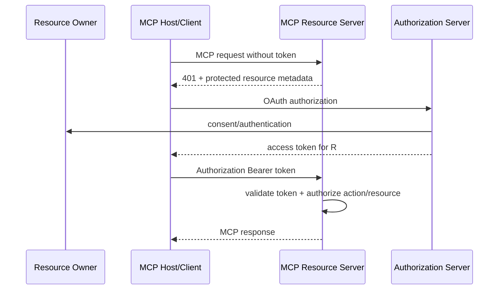

# MCP 认证、授权与日志

远程 Streamable HTTP MCP Server 的授权建立在 OAuth 体系上：Server 是 protected resource，Client 代表 resource owner 获取访问令牌，Authorization Server 负责授权。协议连接成功只说明 transport 可用；Server 仍需对每个 Tool、Resource 和对象执行授权，并生成脱敏、可关联、不可由模型伪造的审计日志。

## 前置知识与目标

- [MCP Host、Client 与 Server](01-host-client-server.md)。
- [Tool 权限、审计、脱敏与错误隔离](../09-tool-design/06-permission-audit-redaction-error-isolation.md)。

完成后应能：

- 区分 Client、resource owner、resource Server 与 authorization Server。
- 实现 protected resource metadata discovery。
- 正确携带和验证 access token。
- 对 primitive/object/action 授权。
- 隔离用户、tenant、session 与 cache。
- 设计协议日志、业务审计和安全事件。

## 角色



Host 不是 Authorization Server。MCP `clientInfo` 不是认证。

## Protected Resource Metadata

HTTP Server 实现 RFC 9728 metadata，指示 authorization servers 与资源信息。Client 用它发现授权端点，不能从用户输入任意 authorization URL。

401 响应可用 `WWW-Authenticate` 指向 metadata。Client：

- 验证 HTTPS。
- 检查 resource identity。
- 防止 metadata redirect 到不受信目标。
- 不把其他 Server token 发来。

## Authorization Server Discovery

规范要求 Client 支持 OAuth Authorization Server Metadata 与 OpenID Connect Discovery。Server 的授权 Server 可同域或独立。

验证：

- issuer 一致。
- endpoints HTTPS。
- metadata 签发/来源可信。
- redirect URI 精确。
- PKCE。
- state/nonce（按流程）。
- 不接受 open redirect。

## Client Registration

2025-11-25 推荐 OAuth Client ID Metadata Documents，并可支持 Dynamic Client Registration。选择取决于环境。

无论方式：

- public Client 不嵌入可保密 secret。
- redirect URI 固定。
- Client identity 与部署对应。
- registration 结果安全存储。
- 不让 MCP Server 提供任意可执行 registration 配置。

## Token 使用

每个 HTTP 请求：

```text
Authorization: Bearer ACCESS_TOKEN
```

不得：

- 放 query string。
- 放 JSON-RPC params。
- 写 Prompt。
- 写普通日志。
- 转发给下游或其他 MCP Server。

Token 验证：

- signature/issuer。
- audience 是当前 MCP Server。
- expiry/not-before。
- scope。
- token type。
- revocation/策略（按体系）。

只验签不验 audience 会导致 token substitution。

## Token 生命周期

### Access token

短期使用，只给目标 MCP Resource Server。Server 不把它兑换成其他服务的通用凭据；访问下游时使用受控 token exchange 或自己的最小服务身份，并保留 end-user 授权上下文。

### Refresh token

只由可信 Host 的 credential storage 管理：

- 不发给 MCP Server。
- 不发给模型。
- rotation/reuse detection。
- logout/revoke。
- 多设备隔离。

Browser/public Client 使用授权码 + PKCE。authorization code 一次性、短期，redirect 精确匹配。

### 过期与撤销

长 MCP session 不延长 token 权限。每次 HTTP 请求都验证 token；权限撤销后已有 session 与 cache 不能继续返回数据。长 Task 在提交和结果读取时分别授权，必要时在执行高风险步骤前再次检查。

## 下游 Delegation

MCP Server 调 CRM/API 时要区分：

- on-behalf-of user：下游能执行用户对象权限。
- service action：Server 自己拥有固定后台权限。

不能把收到的 bearer token原样发给 audience 不同的下游。若体系支持 token exchange，验证 requested audience/scope；否则由 Server policy 按用户身份调用内部授权接口。

审计同时记录 user actor 和 service actor，避免只看到“mcp-server 修改了资源”。

## Scope 与对象授权

scope 示例：

```text
tickets.read
tickets.comment
documents.read
```

scope 不是对象授权。`tickets.read` 用户仍只能读 tenant-a 与其队列内 ticket。

请求：

```json
{
  "method": "tools/call",
  "params": {
    "name": "get_ticket",
    "arguments": {"ticketId": "TICKET-812"}
  }
}
```

Server：

1. 从 token 得 principal/tenant。
2. 根据 Tool 映射 action。
3. 查询 ticket 时带 tenant。
4. policy engine 判断 object。
5. 字段级过滤。
6. 记录 decision ID。

不信任 arguments 中的 tenant/user。

## 增量授权

低风险读 scope 不必一开始申请写 scope。用户选择 add_comment 时：

- Server 以 `WWW-Authenticate` 提示需要额外 scope。
- Client 发起增量 consent。
- 用户明确了解。
- 新 token 只增加必要 scope。

不能在后台静默扩权。

## stdio 认证

stdio transport 不走 HTTP OAuth。Server 由 Host 本地启动，凭据通过受控环境或 OS credential broker。

规则：

- 最小环境。
- 不传全部 Host env。
- 不把 token写 arguments。
- 子进程权限隔离。
- 多用户服务不把 stdio 当天然用户隔离。

本地 Server 仍对 workspace root 和写操作授权。

## Session 隔离

`MCP-Session-Id` 不是 access token。Server：

- 高熵 opaque。
- 绑定授权主体。
- 不跨用户复用。
- 过期/删除。
- 日志 hash。
- 404 后新 initialize。

Client 收到他人 session ID 不能凭它访问资源。

## Cache

cache key：

```text
server identity
protocol/session generation
principal/tenant
authorization scope hash
tool/resource
arguments hash
source revision
```

权限撤销：

- policy version。
- short TTL。
- active invalidation。
- response 时再授权。

不要共享 MCP Tool result cache 而省略 principal。

## 日志分层

### Protocol log

- connection ID。
- method。
- JSON-RPC ID。
- protocol version。
- duration。
- transport status。

### Business audit

- actor/service actor。
- action。
- resource。
- authorization decision。
- confirmation。
- effect/result。
- idempotency。

### Security event

- invalid token。
- wrong audience。
- denied object。
- cross-tenant attempt。
- suspicious URL/path。
- rate limit。

三类保存/权限不同。

## Trace 关联

跨 Host、MCP Server、authorization Server 与下游：

```json
{
  "traceId": "4bf92f3577b34da6a3ce929d0e0e4736",
  "mcpRequestId": "req-17",
  "connectionId": "conn-hmac-8",
  "authorizationDecisionId": "pd-882",
  "downstreamRequestId": "crm-991"
}
```

外部传入 trace 字段先验证格式和长度，不能让用户伪造审计 event ID。跨信任域传播最小 correlation ID，不传播完整日志上下文和用户 PII。

## 保存与访问

为每类日志定义：

- owner。
- retention。
- storage region。
- access roles。
- deletion/legal hold。
- integrity。
- export redaction。

调试日志默认比审计短。安全事件可更久，但也不能无限保存完整 arguments。生产日志采样不能采掉所有 deny 和高风险 write。

## 脱敏

永不记录：

- access/refresh token。
- authorization code。
- Cookie。
- Client secret。
-完整 PII/正文。

可记录：

- token fingerprint/HMAC。
- issuer。
- audience。
- scopes（视敏感性）。
- principal pseudonym。
- decision ID。
- arguments/result hash。

错误 headers 进入日志前删除 Authorization。

## Log Injection

用户/Server 字符串可能含换行和伪 JSON。结构化 logger：

- 独立字段。
- 转义控制字符。
- 长度限制。
- 不把用户字段拼进 message。
- event 名受控。

日志 viewer 也要 HTML escape。

## 应用案例一：远程工单

### Scopes

- list/get：tickets.read。
- add_comment：tickets.comment。
- close：tickets.close + confirmation。

### 对象

support-cn 只能队列 CN。admin-b 即使有同 scope 也不能 tenant-a。

### 测试

- missing token。
- expired。
- wrong audience。
- read-only token 调 write。
- horizontal IDOR。
- group revoked/cache。
- session swapped。
- log token redaction。

### 失败恢复

401 expired：Host 走安全 refresh/authorization。403 不自动重试扩权，除非 Server明确 scope challenge且用户同意。

## 应用案例二：文档 Resource

Resource URI：

```text
docs://tenant-a/contracts/91
```

URI 中 tenant 不是授权事实。Server从 token 得 tenant，再核对 source ACL。

读取：

- locator。
- revision。
- allowed fields。
- download link 短期且用户绑定。

### 失败

用户把 URI 改 tenant-b。Server返回安全 forbidden/not found，不泄漏标题。日志记录 denied hash。

## 应用案例三：本地 Git Server

Host 本地 stdio：

- 环境只含 workspace root。
- read status 无 token。
- push Tool 不提供，或使用 OS credential broker并确认。

不能把 `GITHUB_TOKEN` 传给所有本地 MCP Server。若需要远程操作，Server获得特定 repo、短期 scope。

## 应用案例四：审计失败

高风险 close_ticket 已授权确认，但 central audit sink unavailable。

策略：

- 写入本地 durable outbox 与业务事务。
- outbox 成功才执行。
- Worker 后送 audit。
- buffer 容量告警。
- 无 durable buffer 时 fail closed。

不能执行后静默丢审计。

## OAuth 错误

区分：

- 401：token missing/invalid。
- 403：已认证但禁止。
- insufficient scope challenge。
- MCP JSON-RPC/Tool business error。

不要把所有 auth 错误包成 200 + Tool text，transport Client 需要正确处理授权。

## Rate Limit

维度：

- Client。
- user。
- tenant。
- tool。
- token。
- IP（辅助）。

返回 Retry-After。写入重试需幂等。认证端点有更严格防爆破。

## 审计查询

受权调查可按：

- trace。
- decision。
- command。
- resource pseudonym。
- time。

审计访问本身记日志。不允许普通模型调用“search_audit_logs”读取全组织日志。

## 安全失败注入

| 注入 | 预期 |
|---|---|
| token query string | reject |
| wrong audience | 401 |
| valid scope, wrong tenant | deny |
| session swap | deny/new session |
| policy revoke | cache invalid |
| auth server metadata redirect | block |
| audit sink down | durable/fail closed |
| log newline | escaped |
| refresh race | one controlled flow |
| Tool result token echo | output redaction |

## 调试

1. transport TLS/Origin。
2. protected resource metadata。
3. issuer/audience。
4. scope。
5. principal/tenant。
6. action/object policy。
7. cache/session。
8. output redaction。
9. audit delivery。

Inspector只用测试 token，调试输出脱敏。

## 观测

- auth success/failure。
- token audience failure。
- decision allow/deny。
- incremental consent。
- cache auth mismatch。
- session 404。
- audit lag/dead letter。
- cross-tenant attempts。
- rate limit。

不要按原始 user ID 做开放 metric label。

## 综合练习

为远程工单 Server 实现：

1. protected resource metadata。
2. OAuth discovery/PKCE。
3. token audience/scope。
4. object-level policy。
5. session/cache 隔离。
6. protocol/business/security logs。
7. durable audit。
8. 20 个 auth 负例。

### 验收标准

- token 只在 header。
- Client/Server identity 与用户身份分开。
- scope 不替代 object auth。
- session 不替代 token。
- cache 不跨权限。
- 写 scope 增量同意。
- Secret 不进日志/模型。
- 高风险写有可证明审计。
- auth 故障不会放行。

## 来源

- [MCP Authorization 2025-11-25](https://modelcontextprotocol.io/specification/2025-11-25/basic/authorization)（访问日期：2026-07-18）
- [MCP Security Best Practices](https://modelcontextprotocol.io/specification/2025-11-25/basic/security_best_practices)（访问日期：2026-07-18）
- [RFC 9728: OAuth 2.0 Protected Resource Metadata](https://www.rfc-editor.org/rfc/rfc9728.html)（访问日期：2026-07-18）
- [RFC 9700: OAuth 2.0 Security Best Current Practice](https://www.rfc-editor.org/rfc/rfc9700.html)（访问日期：2026-07-18）
