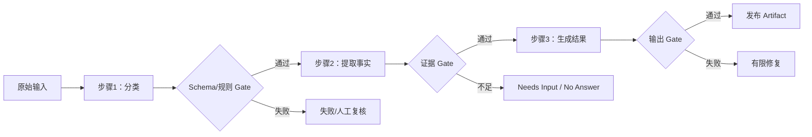
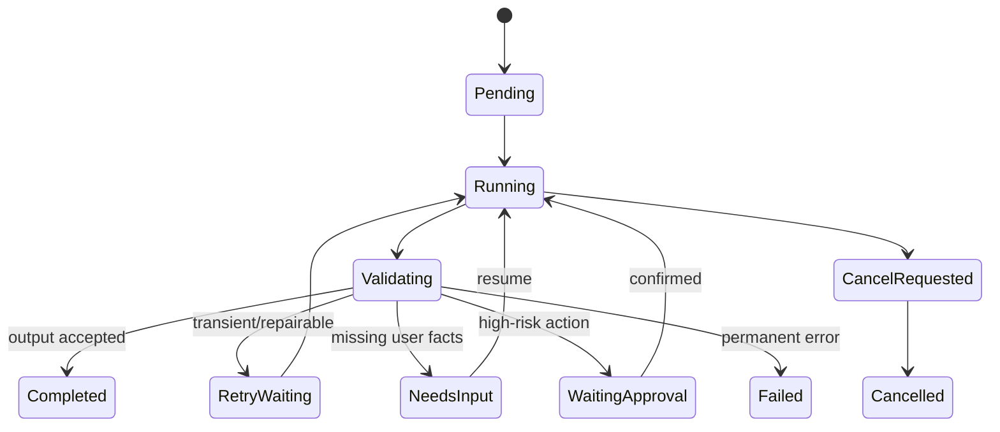

# Prompt Chaining 与 Sequential Workflow

Prompt Chaining 把一个任务拆成固定顺序的步骤，每一步读取经过验证的上一步输出，再产生结构化结果。它属于可预测 Workflow：流程拓扑由代码定义，模型只完成局部认知任务，不自行决定无限新增步骤。Sequential Workflow 是更宽的工程概念，步骤也可以是确定性代码、人工确认、检索或 Tool；Prompt Chaining 是其中包含多个模型调用的形式。

## 前置知识与能力边界

前置阅读：

- [Structured Output、Schema 与运行时校验](../01-model-api/structured-output-validation.md)。
- [AI 任务状态机](../04-ai-ux/01-ai-task-state-machine.md)。
- [Tool 输入验证、超时、有限重试与幂等](../09-tool-design/03-validation-timeout-retry-idempotency.md)。

适用条件：

- 子任务顺序固定。
- 每步输入输出可定义。
- 中间结果可以检查。
- 增加延迟换取准确性是可接受的。
- 失败能定位到某一步。

不适合：

- 步骤数量和顺序必须由任务动态发现。
- 多个独立步骤需要低延迟并行。
- 一个模型调用已经可靠满足目标。
- 任务本质是简单确定性转换。

## 与单 Prompt 的差异

单 Prompt：

```text
读取材料 → 分类 → 提取事实 → 判断风险 → 写最终回复
```

所有决策在一次输出中完成。问题：

- 中间结果不可单独验证。
- 失败无法定位。
- 输入/输出 Schema 复杂。
- 修改一个环节可能影响全部行为。

Prompt Chaining：



每个 Gate 是受控代码、领域规则或经校准评估器，不是“模型感觉不错”。

## Workflow 定义

一个可版本化定义：

```json
{
  "workflowId": "support-reply",
  "workflowVersion": "12",
  "steps": [
    {
      "id": "classify",
      "type": "model",
      "promptVersion": "support-classify-v5",
      "outputSchema": "ticket-classification-v3",
      "timeoutMs": 8000,
      "maxAttempts": 2,
      "next": "extract"
    },
    {
      "id": "extract",
      "type": "model",
      "promptVersion": "support-extract-v7",
      "outputSchema": "ticket-facts-v4",
      "timeoutMs": 12000,
      "maxAttempts": 2,
      "next": "compose"
    },
    {
      "id": "compose",
      "type": "model",
      "promptVersion": "support-compose-v9",
      "outputSchema": "support-reply-v6",
      "timeoutMs": 15000,
      "maxAttempts": 1,
      "next": null
    }
  ]
}
```

定义不包含 API key。模型完整 ID、参数、provider 由运行 manifest 固定。

## Step 合同

每步必须定义：

- 输入 Schema。
- 输出 Schema。
- 前置条件。
- 成功条件。
- 错误 taxonomy。
- timeout。
- retry。
- 是否有副作用。
- artifact 保存。
- 下一状态。

示例分类输出：

```json
{
  "category": "refund_policy",
  "language": "zh-CN",
  "entities": [
    {"type": "order_id", "value": "ORDER-000812"}
  ],
  "missingFields": [],
  "risk": "financial",
  "confidenceBand": "high"
}
```

`confidenceBand` 不直接授权金融动作，只帮助路由人工复核。

## 中间 Artifact

```json
{
  "artifactId": "art-extract-991",
  "workflowRunId": "run-812",
  "stepId": "extract",
  "attempt": 1,
  "inputArtifactIds": ["art-classify-990"],
  "schemaVersion": "ticket-facts-v4",
  "promptVersion": "support-extract-v7",
  "model": "reader-2026-06",
  "contentHash": "sha256:...",
  "status": "accepted",
  "createdAt": "2026-07-18T10:00:03Z"
}
```

中间结果不可变。重跑产生新 attempt/artifact，不覆盖旧输出。

正文可能含 PII，存储按分类、权限和保存周期管理。普通日志只保存 ID/hash/指标。

## 状态机



整个 workflow 和每个 step 都有状态。不能只保存 `currentStep=2`。

## 顺序与数据依赖

下一步只读取明确 artifact：

```json
{
  "step": "compose",
  "inputs": {
    "classificationArtifactId": "art-classify-990",
    "factsArtifactId": "art-extract-991",
    "policyEvidenceIds": ["ev-17", "ev-19"]
  }
}
```

不要把整个历史对话、所有模型输出和内部错误拼进下一 Prompt。使用最小所需字段：

- 降低 Token。
- 避免错误累积。
- 减少不可信指令。
- 改善重放。

## Gate 设计

### Schema Gate

- JSON parse。
- required。
- enum。
- type/range。
- unknown fields。

### Deterministic Gate

- 金额计算。
- ID 存在。
- 时间区间。
- 权限。
- 禁止词/格式。
- evidence locator。

### Semantic Gate

- 是否覆盖必要主张。
- 是否与证据一致。
- 分类是否正确。

Semantic Gate 使用人工标注集校准；Judge 版本写入 manifest。

### Human Gate

- 高风险确认。
- 冲突来源。
- 低置信但必须处理。
- 法律/财务例外。

人工结果也是结构 artifact，不是聊天里一句“可以”。

## 预算

运行前：

```json
{
  "budget": {
    "totalDeadlineMs": 45000,
    "maxModelCalls": 5,
    "maxInputTokens": 18000,
    "maxOutputTokens": 5000,
    "maxCostMinorUnits": 50,
    "maxRepairAttempts": 1
  }
}
```

### 分配

```text
总 deadline
├── classify 8s
├── extract 12s
├── retrieval 5s
├── compose 15s
└── 03-validation/reserve 5s
```

实际下一步 timeout：

```text
min(step configured timeout, workflow remaining deadline)
```

若剩余预算不足，不启动必然超时的模型调用。

### Token

每步独立：

- fixed instruction。
- artifact fields。
- output reserve。
- safety margin。

不要把上一步完整自然语言输出和结构输出都重复传入。

### Cost

累计 provider usage。超预算：

- 进入 budget_exceeded。
- 保存已完成 artifact。
- 不自动换更贵模型。
- 可让用户缩小范围或人工继续。

## 错误分类

| 错误 | 示例 | 恢复 |
|---|---|---|
| invalid_input | 缺用户字段 | NeedsInput |
| schema_output | JSON 不合规 | 有限 repair |
| semantic_reject | 证据不支持 | 重新检索/人工 |
| rate_limit | 429 | deadline 内退避 |
| timeout | step 超时 | 按幂等性有限重试 |
| dependency | 检索不可用 | degraded/fail |
| policy | 无权限 | fail closed |
| budget | Token/费用耗尽 | 保存/终止 |
| cancelled | 用户停止 | 传播取消 |

不能对所有错误重复整个 workflow。

## Step 重试

重试使用相同：

- workflow version。
- input artifact。
- prompt version。
- output Schema。

变化：

- attempt ID。
- provider request ID。
- 可选 repair instruction。

若重试修改 Prompt，记录新的 prompt version/hash。

### Repair

模型输出 Schema 错误时，可进行一次结构修复：

- 只传验证错误与原输出。
- 不增加新业务事实。
- 修复结果重新校验。

内容错误不能用“JSON repair”解决。

## Resume

进程崩溃后：

1. 读取 workflow run。
2. 找到最后 accepted artifact。
3. 检查 11-workflow/version 是否仍可执行。
4. 检查 source/权限/业务状态。
5. 从下一个未完成 step 恢复。

不要仅凭内存重跑全部。若 step 有副作用，需要幂等/status。

## Cancellation

用户取消：

- 标 `cancel_requested`。
- 停止排队步骤。
- abort 当前模型/Tool。
- 已完成 artifact 保留。
- 已提交副作用不能假装撤销。
- 最终状态说明 partial。

取消后 Worker 不能继续启动 compose。

## 应用案例一：内容审核与发布

### 目标

用户上传产品公告，需要：

1. 提取 claims。
2. 检查证据。
3. 检查敏感/合规。
4. 生成编辑建议。
5. 人工发布。

### Step 1：Claims

输入公告 artifact，输出：

```json
{
  "claims": [
    {
      "claimId": "c1",
      "text": "服务可用性达到 99.99%",
      "type": "numeric",
      "sourceSpan": {"start": 18, "end": 32}
    }
  ]
}
```

Gate 检查 span 能回放。

### Step 2：Evidence

检索批准数据源，对每 claim 输出 supported/contradicted/missing 与 evidence ID。

Gate：

- 无权 evidence 不用。
- 数字由确定性比较。
- missing 不进入“已验证”。

### Step 3：Compliance

固定规则先检查隐私、承诺和禁用措辞；模型对语境分类。高风险进入 reviewer。

### Step 4：Rewrite

只读取：

- 原文。
- accepted claim status。
- compliance findings。

不允许把 missing claim 改成新数字。

### Step 5：Publish

Workflow 不自动发布。生成 diff + impact；用户确认；发布 Tool 独立授权/幂等。

### 失败恢复

Evidence 服务超时：

- Step2 transient retry 一次。
- 仍失败，workflow `failed_dependency`。
- Step1 artifact 保留。
- 恢复只重跑 Step2。

### 验证

- 每 claim lineage。
- 无证据 claim 不发布。
- Publish 不由模型自确认。
- 取消后无发布。
- 版本变化重新 Gate。

## 应用案例二：结构化客服工单回复

### 输入

工单：

```text
订单 ORDER-000812 已取消，为什么还没退款？
```

### 固定链

1. 分类与实体提取。
2. 读取订单/退款状态。
3. 检索政策。
4. 生成结构化回复。
5. 验证引用与可操作下一步。

### Step 1

输出 category、orderId、intent、risk。订单 ID Schema 验证。

### Step 2

Tool 是 read-only，服务端授权。输出 observedAt 与 resourceVersion。

### Step 3

按地区/时间检索。若无 evidence，answerability=no-answer。

### Step 4

输出：

```json
{
  "summary": "退款正在处理中。",
  "facts": [
    {
      "text": "退款于 2026-07-17 09:20 提交。",
      "source": "tool:refund-status@v4"
    }
  ],
  "nextActions": [
    {"type": "wait_until", "at": "2026-07-20T09:20:00+08:00"}
  ],
  "citations": ["policy-refund-processing#p7"]
}
```

### Gate

- 日期来自 Tool。
- SLA 来自政策。
- 不承诺精确到账。
- citation 可回放。
- 其他 tenant 数据为零。

### 失败

订单 Tool 返回 forbidden：不进入模型，输出安全权限状态。不能让 Prompt 猜。

### Resume

用户补充正确订单 ID，从 Step1 新 attempt 开始；旧错误 ID artifact 保留但不作为新 Step2 输入。

## 应用案例三：多语言产品说明

链：

1. 生成中文 source outline。
2. Gate 标题/术语。
3. 翻译英文。
4. Gate 术语表、数字和链接。
5. 生成最终 Markdown。

为什么适合：

- 顺序固定。
- 翻译依赖批准 outline。
- 数字/链接可确定性检查。

不应：

- outline 错误后继续翻译。
- 将 reviewer 建议当 source fact。
- 自动发布。

## 失败累积

Sequential 的主要风险是早期错误传到后面。

防线：

- Gate。
- structured artifact。
- 最小字段。
- gold cases。
- fail fast。
- 人工检查高风险。

“多调用”本身不提高质量；没有 Gate 只会增加错误与费用。

## 可观测性

Trace：

```json
{
  "workflowRunId": "run-812",
  "workflowVersion": "12",
  "currentStep": "compose",
  "steps": [
    {
      "id": "classify",
      "status": "completed",
      "attempts": 1,
      "latencyMs": 720,
      "inputTokens": 420,
      "outputTokens": 86,
      "costMinorUnits": 1,
      "artifactId": "art-990"
    }
  ],
  "remainingBudget": {
    "deadlineMs": 30210,
    "modelCalls": 4,
    "costMinorUnits": 49
  }
}
```

指标：

- workflow completion。
- step pass/fail。
- retry。
- gate rejection。
- latency p50/p95。
- Token/cost by step。
- cancellation。
- resume。
- human wait。
- final task success。

不要只看最终模型 latency。

## 评估

### Step 级

- classification accuracy。
- extraction precision/recall。
- evidence coverage。
- Schema pass。
- citation accuracy。

### End-to-end

- task completion。
- correctness。
- completeness。
- groundedness。
- user correction。
- time/cost。

### Ablation

比较：

- 单 Prompt。
- chain 无 Gate。
- chain + deterministic Gate。
- chain + semantic/human Gate。

确认增加调用是否真正改善。

## 测试矩阵

### 正常

- 每条路径。
- 空/边界。
- 多语言。

### Step failure

- malformed JSON。
- content error。
- timeout。
- rate limit。
- dependency 500。

### 状态

- Worker crash。
- duplicate message。
- resume。
- cancel。
- waiting approval refresh。

### 预算

- step 耗尽 Token。
- cost cap。
- deadline 仅剩 1 秒。

### 安全

- user injection。
- retrieved injection。
- cross-tenant。
- model proposes write。
- forged confirmation。

## TypeScript Runner

核心 runner 使用 discriminated state：

```typescript
type StepStatus =
  | "pending"
  | "running"
  | "validating"
  | "retry_waiting"
  | "completed"
  | "needs_input"
  | "waiting_approval"
  | "failed"
  | "cancelled";

interface StepRecord {
  runId: string;
  stepId: string;
  attempt: number;
  status: StepStatus;
  inputArtifactIds: string[];
  outputArtifactId?: string;
  errorCode?: string;
  startedAt?: string;
  finishedAt?: string;
}
```

执行伪代码用 text 表示：

```text
load run with lock
if terminal or cancelled: stop
select fixed next step
check remaining budget
create attempt
execute with deadline
validate output
persist artifact and transition atomically
enqueue fixed next step
```

模型不返回 `nextStep` 控制拓扑。

## 并发与锁

虽然步骤顺序执行，队列可能重复投递：

- `(runId, stepId, attempt)` 唯一。
- transition 使用版本/事务。
- 只有 current step 可执行。
- duplicate worker 读取已完成结果。
- side effect 有幂等。

不要依赖“队列只投一次”。

## 数据库

最小表：

```text
workflow_runs
workflow_steps
artifacts
workflow_events
approvals
```

Run 保存：

- definition version。
- status/current step。
- budget used。
- user/tenant。
- created/deadline。
- optimistic version。

Artifact 大正文放对象存储，表存 URI/hash/ACL。

## 部署与变更

运行中的 v12 不应自动使用 v13 新拓扑。选择：

- 固定 v12 完成。
- 显式迁移，写 migration artifact。
- 取消并用 v13 新建。

Prompt/model 可否升级也由 workflow policy 决定。重放必须知道实际版本。

## 何时改用其他模式

Routing：

- 输入类别决定不同后续链。

Parallelization：

- 子任务独立，可并发。

Orchestrator-Workers：

- 子任务数量/类型无法预先确定。

Evaluator-Optimizer：

- 有清晰质量标准，迭代有可测改善。

不要把所有模式都嵌入一个框架再称“更智能”。

## 常见错误

- 步骤用长自然语言传递，无 Schema。
- 所有历史进入每步。
- 模型决定 next step。
- retry 整条链。
- 失败覆盖 artifact。
- 没有总预算。
- timeout 后仍启动下一步。
- high-risk write 无确认。
- Judge 无评估集。
- 版本升级改变运行中任务。

## 综合练习

实现客服回复 Workflow：

1. 五个固定步骤。
2. 每步输入输出 Schema。
3. 持久化 artifact。
4. deadline/Token/cost。
5. error taxonomy/retry。
6. cancel/resume。
7. 权限与 citation Gate。
8. 60 条评估集。

### 验收标准

- 拓扑由代码固定。
- 每步独立验证。
- 上一步错误不静默传播。
- crash 后从 accepted artifact 恢复。
- duplicate delivery 不重复副作用。
- 预算耗尽安全终止。
- 高风险动作等待真实确认。
- step 与 end-to-end 均有指标。
- 变更可重放和回滚。

## 来源

- [Building Effective AI Agents — Prompt Chaining](https://www.anthropic.com/engineering/building-effective-agents)（访问日期：2026-07-18）
- [AWS Step Functions Error Handling](https://docs.aws.amazon.com/step-functions/latest/dg/concepts-error-handling.html)（访问日期：2026-07-18）
- [AWS Step Functions Task State](https://docs.aws.amazon.com/step-functions/latest/dg/state-task.html)（访问日期：2026-07-18）
- [OpenAI Evaluation best practices](https://platform.openai.com/docs/guides/evaluation-best-practices)（访问日期：2026-07-18）
