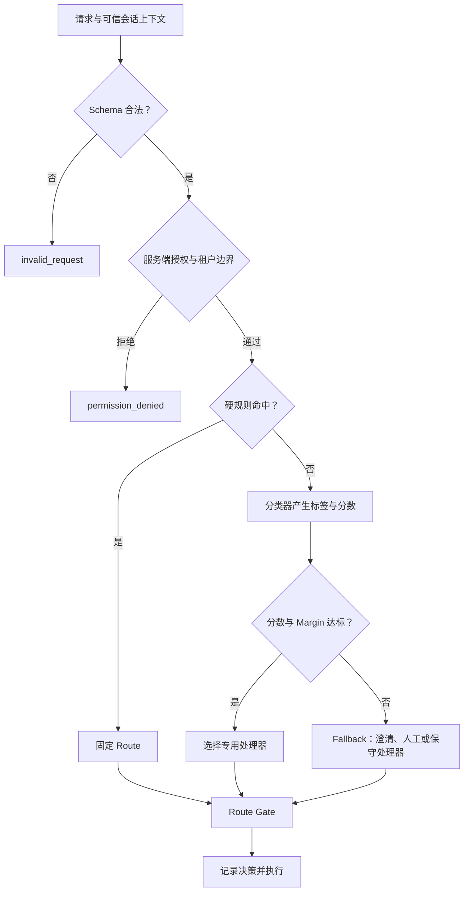

# Routing：规则、分类器与模型混合路由

Routing 是先判断输入属于哪一种受支持情形，再把请求交给专用处理器、模型或人工队列的 Workflow 模式。路由器的输出不是最终业务答案，而是一个受约束的决策：

```json
{
  "route": "metric_explanation",
  "decisionSource": "classifier",
  "confidence": 0.91,
  "policyVersion": "analytics-router-v18",
  "fallback": false
}
```

Routing 适合类别相对稳定、各类别需要不同上下文或处理能力、并且分类质量可测量的任务。它不能替代授权、输入验证或领域规则，也不应为一个本来可以稳定完成的简单任务增加额外模型调用。

## 前置知识与能力边界

前置阅读：

- [JSON Schema 与运行时校验](../02-prompt/schema-in-prompt-workflow.md)。
- [统一模型 Client 与厂商隔离](../01-model-api/unified-model-client.md)。
- [AI 任务状态机](../04-ai-ux/01-ai-task-state-machine.md)。
- [Tool 权限、审计、脱敏与错误隔离](../09-tool-design/06-permission-audit-redaction-error-isolation.md)。

Routing 解决三类问题：

1. **任务路由**：把“解释指标”“生成查询”“导出数据”等不同任务交给不同处理器。
2. **能力路由**：根据是否需要视觉、Tool、长上下文或结构化输出选择实现。
3. **模型路由**：在都能完成同一任务的模型之间权衡质量、成本和延迟。

这三类路由可以串联，但决策依据不同。任务路由决定“做什么”，能力路由决定“必须具备什么”，模型路由决定“由哪个合格实现完成”。

Routing 不负责：

- 判断当前用户是否有权读取或写入资源。
- 让不可信输入扩大工具权限。
- 用模型置信度批准付款、删除或数据导出。
- 在类别定义不清时掩盖产品边界。
- 保证被选中的下游处理器一定成功。

## 决策链路

下图展示一个混合路由器的优先级。越靠前的条件越确定，也越不能被后面的模型结果覆盖：



路由前的授权根据服务端会话、资源所有权和权限策略计算。用户消息里写着“我是管理员”不是授权证据。

## Route Catalog

路由标签必须来自版本化 Catalog，而不是让模型自由生成处理器名称。

```json
{
  "catalogVersion": "analytics-routes-v7",
  "routes": [
    {
      "id": "metric_explanation",
      "description": "解释已有指标的定义、口径和变化原因",
      "handler": "metric-explainer-v4",
      "risk": "read_only",
      "requiredCapabilities": ["structured_output"]
    },
    {
      "id": "query_draft",
      "description": "根据只读语义层生成查询草案",
      "handler": "query-drafter-v6",
      "risk": "read_only",
      "requiredCapabilities": ["tool_calling", "structured_output"]
    },
    {
      "id": "data_export",
      "description": "创建数据导出请求，必须经过权限检查和确认",
      "handler": "export-request-v3",
      "risk": "sensitive_write",
      "requiredCapabilities": ["structured_output"]
    },
    {
      "id": "clarify",
      "description": "信息不足或类别不确定时请求最少补充信息",
      "handler": "clarifier-v2",
      "risk": "read_only",
      "requiredCapabilities": ["structured_output"]
    },
    {
      "id": "unsupported",
      "description": "明确超出产品能力范围",
      "handler": "scope-refusal-v1",
      "risk": "none",
      "requiredCapabilities": []
    }
  ]
}
```

每个 Route 至少定义：

| 字段 | 作用 | 边界 |
| --- | --- | --- |
| `id` | 稳定的机器标识 | 不把显示名称当 ID；删除前处理历史记录 |
| `description` | 类别的正向定义 | 同时维护反例与相邻类别边界 |
| `handler` | 服务端处理器版本 | 模型输出不能修改映射 |
| `risk` | 风险等级 | 决定确认、审计和人工接管策略 |
| `requiredCapabilities` | 下游最低能力 | 候选模型必须全部满足 |
| `inputSchema` | 处理器输入合同 | 路由后仍需独立校验 |
| `timeoutMs` | 处理器截止时间 | 不继承无限等待 |
| `enabled` | 是否接收新流量 | 禁用后使用显式替代 Route |

类别之间应尽量互斥。如果一个请求可以同时需要多个独立处理器，先判断它是复合请求，随后拆分或转入专门的 orchestrator，而不是让单标签路由器随机选一个。

## 标签定义：闭集、开放集与多标签

### 闭集分类

闭集假定每个有效输入都属于已知类别之一。适用于：

- 固定 UI 发起的有限命令。
- 已知文档类型。
- 已约束的内部任务队列。

闭集仍然需要 `invalid` 或 `unsupported`，因为生产输入不会自动满足训练集假设。

### 开放集分类

开放集允许输入不属于任何已知业务类别。路由输出需要：

- `unsupported`：产品明确不支持。
- `clarify`：可能支持，但缺少区分信息。
- `human_review`：风险高或分类器无法可靠判断。

把未知输入强制归入最相似类别，会扩大误路由影响。

### 多标签分类

一句“解释本月留存下降，并把明细导出给我”同时包含：

- `metric_explanation`；
- `data_export`。

多标签输出不等于可以并行执行。数据导出仍需独立授权和确认。可以返回：

```json
{
  "kind": "compound",
  "intents": [
    {"route": "metric_explanation", "order": 1},
    {"route": "data_export", "order": 2}
  ],
  "requiresPlan": true
}
```

当产品只支持单任务，应请求用户选择，而不是静默丢弃其中一个意图。

## 四种路由实现

## 1. 确定性规则

规则读取可信的结构化信号：

- HTTP method、固定 endpoint。
- UI action ID。
- MIME 类型和文件签名。
- 账户套餐、地区和租户策略。
- 已验证的资源类型。
- 明确的金额或数据敏感等级。

优点：

- 可解释、可重放。
- 延迟低、成本固定。
- 适合安全和业务不变量。

限制：

- 不擅长自然语言语义边界。
- 规则增多后会出现优先级冲突。
- 关键词匹配容易被否定句、引用和拼写变化破坏。

以下规则是可靠信号：

```text
request.action == "create_export" → data_export
verified_file.media_type == "image/png" → image_pipeline
tenant.region == "eu" → eu_processing_pool
```

以下规则不应承担授权或高风险判断：

```text
message includes "导出" → 直接创建导出
message includes "安全" → 允许进入安全管理工具
message includes "管理员" → admin_handler
```

### 规则优先级

推荐从强约束到弱提示排序：

1. Schema 与协议合法性。
2. 身份、租户、地区和权限。
3. 明确 UI action 或 API operation。
4. 合同内业务规则。
5. 语义分类器。
6. Fallback。

规则需要唯一命中或有明确优先级。两个规则同时命中却没有冲突策略，应产生配置错误，而不是按代码遍历顺序决定。

## 2. 传统分类器或 Embedding 分类

可以使用逻辑回归、树模型、小型文本分类器或 Embedding 相似度：

- 输入固定，吞吐量大。
- 类别已有足够标注数据。
- 需要比大模型更低的延迟和成本。
- 需要稳定概率分数并进行校准。

Embedding 最近邻适合语义相似类别，但“最相似”不代表“足够相似”。必须设置接受阈值，并检查第一名与第二名的差距。

假设分类结果为：

```json
{
  "scores": {
    "metric_explanation": 0.47,
    "query_draft": 0.45,
    "data_export": 0.03,
    "unsupported": 0.05
  }
}
```

最高分虽然是 `metric_explanation`，但 `margin = 0.47 - 0.45 = 0.02`，说明两个类别难以区分。此时应澄清，不应只使用 `argmax`。

## 3. LLM 分类

LLM 分类适合：

- 类别依赖较长语义和上下文。
- 标注数据少，但类别说明和反例明确。
- 输入语言多样。
- 新类别需要快速实验。

输出必须是结构化闭集：

```json
{
  "route": "query_draft",
  "evidenceSpans": [
    "按国家看看近 30 天的付费转化"
  ],
  "missingFields": [],
  "confidenceBand": "high"
}
```

`evidenceSpans` 用于调试输入中的触发证据，不能暴露隐藏推理过程。服务端验证：

- `route` 是否在 Catalog。
- 证据片段是否确实存在于用户输入。
- `missingFields` 是否来自允许字段集合。
- 输出是否包含额外未知字段。

LLM 自报的 `high`、`0.95` 或自然语言“非常确定”不是经过校准的概率。要把它作为阈值信号，必须在独立标注集上测量不同分段的真实正确率，并在模型、Prompt 或标签集变化后重新校准。

## 4. 模型路由

模型路由是在多个合格模型之间选择，而不是先判断业务意图。候选模型首先通过硬过滤：

- 输入模态。
- Context 上限。
- Structured Output 或 Tool Calling 能力。
- 数据驻留与合规。
- 允许的供应商。
- 任务截止时间。
- 单请求成本上限。

之后才根据预测质量、成本和延迟排序。

一种决策函数：

```text
utility(model, request)
  = predicted_quality
  - λ_cost × estimated_cost
  - λ_latency × estimated_latency
```

`λ_cost` 和 `λ_latency` 是产品策略，不是模型属性。高风险任务还要满足最低质量门槛；不能仅因便宜而选择没有达到验收线的模型。

AWS Bedrock 的 Intelligent Prompt Routing 是具体供应商实现：它在受支持的同一家族模型之间预测响应质量，并结合配置的质量差标准与 fallback 模型进行选择。它不是所有路由系统的通用接口，也不能替代应用自己的权限和业务路由。

## 混合路由

生产系统通常组合多种实现：

```text
确定性拒绝/固定动作
  → 小型分类器处理常见清晰输入
  → LLM 处理语义复杂输入
  → 低置信度进入澄清或人工
```

混合路由的收益不是“模型越多越准确”，而是让不同决策由适合的机制承担：

- 安全边界：确定性代码。
- 高频稳定类别：低成本分类器。
- 长尾语义：LLM。
- 不确定和高风险：澄清或人工。

每层都要记录是否接管请求。否则无法区分是规则覆盖、分类器命中，还是 fallback 占比升高。

## 置信度、Margin 与拒答

## 分数的含义

以下数值看起来都像 `0–1`，含义不同：

| 信号 | 实际含义 | 能否直接当正确率 |
| --- | --- | --- |
| Softmax 分数 | 模型在当前标签间的相对输出 | 不能，除非已校准 |
| Embedding 相似度 | 向量几何接近程度 | 不能 |
| LLM 自报分数 | 生成文本的一部分 | 不能 |
| 校准后概率 | 在校准集上对应的经验正确率 | 可用于已验证分布内决策 |
| 规则命中 | 条件真假 | 不表示语义预测概率 |

### Top-1 阈值

只有最高类别分数达到 `τ_top1` 才接受：

```text
accept if top1_score >= 0.82
```

提高阈值通常减少自动处理覆盖率，也减少部分误路由。具体变化必须由验证集测量。

### Margin 阈值

第一名和第二名分数之差：

```text
margin = top1_score - top2_score
accept if margin >= 0.18
```

Top-1 高但 Margin 小，表示两个类别都很接近。Top-1 与 Margin 联合使用比单独 `argmax` 提供更多拒绝空间。

### 分类别阈值

误路由代价不同，阈值不应强制相同：

```json
{
  "metric_explanation": {"minScore": 0.78, "minMargin": 0.12},
  "query_draft": {"minScore": 0.84, "minMargin": 0.16},
  "data_export": {"minScore": 0.95, "minMargin": 0.25}
}
```

即使 `data_export` 达到阈值，也只是识别出意图，仍然不能跳过权限和确认。

## 拒答不是错误终止

路由器应区分：

- `clarify`：缺少一个可由用户补充的关键字段。
- `unsupported`：产品边界外。
- `human_review`：系统支持但风险或不确定性过高。
- `permission_denied`：身份已确定但无权执行。
- `temporarily_unavailable`：依赖不可用。

一个可操作的澄清结果：

```json
{
  "route": "clarify",
  "reasonCode": "ambiguous_metric_or_query",
  "question": "你希望了解“付费转化率”的定义，还是按国家查询近 30 天数据？",
  "allowedAnswers": ["解释指标", "查询数据"]
}
```

澄清问题应只询问决定 Route 所需的最少信息。用户回复后重新运行授权和路由，不能沿用已经过期的权限结论。

## Fallback 设计

Fallback 不是统一的“换更大模型再试”。需要按失败阶段定义：

| 失败 | 合理 Fallback | 不合理做法 |
| --- | --- | --- |
| 输入 Schema 错误 | 返回字段错误 | 让模型猜缺失字段 |
| 类别分数低 | 澄清或人工 | 强制选 Top-1 |
| 主分类器超时 | 备用分类器或保守 Route | 无限重试 |
| 专用模型限流 | 合格备用模型 | 换成缺少所需能力的模型 |
| 下游业务校验失败 | 返回业务错误或人工 | 重新路由到无关处理器 |
| 权限拒绝 | 明确拒绝 | 进入权限更高的 handler |
| 安全策略命中 | 固定安全响应 | 让生成模型重新解释策略 |

### Fallback 循环

禁止：

```text
router A → handler B 失败 → router A → handler B 失败 → ...
```

请求上下文保存：

- `routingAttempt`。
- `routesTried`。
- `modelsTried`。
- `deadlineRemainingMs`。
- `fallbackReason`。

同一个失败条件不重复进入已经失败的目标。达到最大尝试次数或截止时间后进入终态。

### Fallback 的语义一致性

备用模型或处理器必须满足同一合同：

- 相同输出 Schema。
- 相同工具权限上限。
- 相同数据驻留约束。
- 相同或更严格的安全策略。
- 可接受的质量下限。

如果 fallback 只能提供较弱能力，应显式降级输出，例如只给说明、不执行操作，并把 `degraded: true` 返回给上层。

## 可执行的混合路由器

下面的 JavaScript 示例把可信 UI action、授权结果、分类器分数、分类器可用性和阈值放在独立字段中。它只返回决策，不执行查询或导出。

```javascript
"use strict";

const ROUTES = new Set([
  "metric_explanation",
  "query_draft",
  "data_export",
  "clarify",
  "unsupported",
  "permission_denied",
  "temporarily_unavailable"
]);

const THRESHOLDS = {
  metric_explanation: { minScore: 0.78, minMargin: 0.12 },
  query_draft: { minScore: 0.84, minMargin: 0.16 },
  data_export: { minScore: 0.95, minMargin: 0.25 },
  unsupported: { minScore: 0.9, minMargin: 0.2 }
};

function assertRequest(request) {
  if (!request || typeof request !== "object") {
    throw new TypeError("request must be an object");
  }
  if (typeof request.requestId !== "string" || request.requestId.length === 0) {
    throw new TypeError("requestId is required");
  }
  if (typeof request.message !== "string") {
    throw new TypeError("message must be a string");
  }
  if (!["chat", "explain_metric", "create_export"].includes(request.action)) {
    throw new TypeError("action is invalid");
  }
  if (typeof request.permissions?.canReadAnalytics !== "boolean") {
    throw new TypeError("read permission is required");
  }
  if (typeof request.permissions?.canCreateExport !== "boolean") {
    throw new TypeError("export permission is required");
  }
}

function rankScores(scores) {
  if (!scores || typeof scores !== "object") {
    throw new TypeError("classifier scores are required");
  }

  const ranked = Object.entries(scores)
    .filter(([route, score]) => ROUTES.has(route) && Number.isFinite(score))
    .sort((a, b) => b[1] - a[1]);

  if (ranked.length < 2) {
    throw new TypeError("at least two valid route scores are required");
  }

  return ranked;
}

function decision(route, source, extra = {}) {
  if (!ROUTES.has(route)) {
    throw new TypeError(`unknown route: ${route}`);
  }

  return {
    route,
    decisionSource: source,
    policyVersion: "analytics-router-v18",
    ...extra
  };
}

function routeRequest(request, classifierResult) {
  assertRequest(request);

  if (!request.permissions.canReadAnalytics) {
    return decision("permission_denied", "authorization", {
      reasonCode: "analytics_read_denied"
    });
  }

  if (request.action === "create_export") {
    if (!request.permissions.canCreateExport) {
      return decision("permission_denied", "authorization", {
        reasonCode: "export_create_denied"
      });
    }

    return decision("data_export", "trusted_action", {
      requiresConfirmation: true
    });
  }

  if (request.action === "explain_metric") {
    return decision("metric_explanation", "trusted_action", {
      requiresConfirmation: false
    });
  }

  if (classifierResult.status !== "ok") {
    return decision("temporarily_unavailable", "fallback", {
      reasonCode: "classifier_unavailable",
      retryable: classifierResult.status === "timeout"
    });
  }

  const ranked = rankScores(classifierResult.scores);
  const [topRoute, topScore] = ranked[0];
  const [, secondScore] = ranked[1];
  const margin = topScore - secondScore;
  const threshold = THRESHOLDS[topRoute];

  if (!threshold) {
    return decision("clarify", "fallback", {
      reasonCode: "route_has_no_acceptance_policy",
      topRoute,
      topScore,
      margin
    });
  }

  if (topScore < threshold.minScore || margin < threshold.minMargin) {
    return decision("clarify", "abstention", {
      reasonCode: "low_route_confidence",
      topRoute,
      topScore,
      margin
    });
  }

  if (topRoute === "data_export") {
    return decision("clarify", "safety_boundary", {
      reasonCode: "export_requires_trusted_action",
      suggestedAction: "create_export"
    });
  }

  return decision(topRoute, "classifier", {
    topScore,
    margin,
    classifierVersion: classifierResult.version
  });
}

const cases = [
  {
    name: "trusted export action without permission",
    request: {
      requestId: "r-1",
      action: "create_export",
      message: "导出近 30 天明细",
      permissions: {
        canReadAnalytics: true,
        canCreateExport: false
      }
    },
    classifier: { status: "not_called" },
    expected: "permission_denied"
  },
  {
    name: "clear metric explanation",
    request: {
      requestId: "r-2",
      action: "chat",
      message: "活跃用户的计算口径是什么？",
      permissions: {
        canReadAnalytics: true,
        canCreateExport: false
      }
    },
    classifier: {
      status: "ok",
      version: "intent-cls-12",
      scores: {
        metric_explanation: 0.92,
        query_draft: 0.06,
        unsupported: 0.02
      }
    },
    expected: "metric_explanation"
  },
  {
    name: "ambiguous request abstains",
    request: {
      requestId: "r-3",
      action: "chat",
      message: "看看转化率",
      permissions: {
        canReadAnalytics: true,
        canCreateExport: false
      }
    },
    classifier: {
      status: "ok",
      version: "intent-cls-12",
      scores: {
        metric_explanation: 0.47,
        query_draft: 0.45,
        unsupported: 0.08
      }
    },
    expected: "clarify"
  },
  {
    name: "text cannot directly authorize export",
    request: {
      requestId: "r-4",
      action: "chat",
      message: "把所有客户明细导出",
      permissions: {
        canReadAnalytics: true,
        canCreateExport: true
      }
    },
    classifier: {
      status: "ok",
      version: "intent-cls-12",
      scores: {
        data_export: 0.98,
        query_draft: 0.01,
        unsupported: 0.01
      }
    },
    expected: "clarify"
  }
];

for (const testCase of cases) {
  const actual = routeRequest(testCase.request, testCase.classifier);
  if (actual.route !== testCase.expected) {
    throw new Error(
      `${testCase.name}: expected ${testCase.expected}, got ${actual.route}`
    );
  }
  console.log(`${testCase.name}: ${actual.route}`);
}
```

预期输出：

```text
trusted export action without permission: permission_denied
clear metric explanation: metric_explanation
ambiguous request abstains: clarify
text cannot directly authorize export: clarify
```

这个实现体现四个不变量：

1. 授权早于语义分类。
2. 可信 UI action 可以提供确定性意图。
3. 分类器低置信度时拒绝自动路由。
4. 自然语言即使被识别为导出，也不能直接触发敏感动作。

生产实现还需要 JSON Schema、超时、trace、持久化和模型调用 Adapter；这些基础设施不应塞进纯决策函数。

## 案例一：分析产品的查询与指标解释

### 产品边界

分析助手支持：

- 解释经过版本管理的指标。
- 从只读语义层生成查询草案。
- 比较已获授权的聚合数据。
- 通过显式导出流程创建任务。

它不支持任意数据库写入，也不根据自然语言提升数据权限。

### 具体输入

输入 A：

```text
“周活跃用户”为什么和报表里的登录人数不同？
```

证据：

- “为什么不同”是口径解释。
- 没有请求新查询或导出。
- 指标名能在可信指标 Catalog 中解析。

结果：

```json
{
  "route": "metric_explanation",
  "metricIds": ["weekly_active_users"],
  "needsQuery": false
}
```

处理器读取指标定义、过滤条件和版本历史，不获得 SQL 执行 Tool。

输入 B：

```text
按国家比较 2026 年第二季度新用户的 7 日留存。
```

证据：

- 有维度 `country`。
- 有时间范围。
- 有已知指标 `retention_7d`。
- 需要实际查询。

结果：

```json
{
  "route": "query_draft",
  "semanticQuery": {
    "metric": "retention_7d",
    "dimensions": ["country"],
    "timeRange": {
      "start": "2026-04-01",
      "endExclusive": "2026-07-01"
    },
    "cohort": "new_users"
  }
}
```

Route Gate 验证指标、维度和时间范围存在于语义层。下游只生成只读草案，执行前再次授权。

### 失败分支

输入 C：

```text
看看华东表现。
```

无法确定：

- “表现”指收入、转化还是留存。
- 时间范围是什么。
- “华东”使用哪个地区版本。

正确结果是 `clarify`：

```json
{
  "route": "clarify",
  "reasonCode": "missing_metric_and_time_range",
  "questions": [
    {
      "field": "metric",
      "prompt": "请选择指标。",
      "options": ["收入", "付费转化率", "7 日留存"]
    },
    {
      "field": "timeRange",
      "prompt": "请选择时间范围。",
      "options": ["近 7 天", "近 30 天", "自定义"]
    }
  ]
}
```

如果一次澄清只允许一个问题，先询问区分 Route 所必需的指标，再进入处理器后补时间。

### 验证

建立真实问题集：

- 指标解释 120 条。
- 查询草案 180 条。
- 数据导出 40 条。
- 复合请求 40 条。
- 超出范围 70 条。
- 模糊请求 50 条。

每条记录 ground truth Route、可接受的替代 Route、风险等级和误路由成本。数据导出误判成普通查询与普通解释误判成查询的代价不同，不能只看总体准确率。

上线验收：

- 未授权请求进入导出处理器为 0。
- `data_export` 只能由可信 action 触发。
- 高风险类别误路由率低于已定义门槛。
- 模糊集的自动接受率不超过离线验证边界。
- 每个决策能由 `policyVersion` 重放。

## 案例二：创作工作台的多模态处理路由

### 能力矩阵

创作工作台接收文本、已有图片和生成请求：

| Route | 输入 | 处理能力 | 输出 |
| --- | --- | --- | --- |
| `text_rewrite` | 文本 | 文本生成、结构化输出 | 修改稿与 Diff |
| `image_understanding` | 图片 + 问题 | Vision | 观察结果 |
| `image_edit` | 已有图片 + 编辑指令 | 图像编辑 | 新图片与 provenance |
| `image_generate` | 描述 | 图像生成 | 新图片 |
| `unsupported_media` | 不支持的媒体 | 无 | 支持范围说明 |

这里先做任务路由，再做模型路由。不能因为某个多模态模型“什么都能接收”，就让所有任务共享同一 Prompt 和输出合同。

### 具体输入与处理

输入 A：

```json
{
  "action": "edit_asset",
  "asset": {
    "id": "asset-82",
    "verifiedMediaType": "image/png",
    "width": 1600,
    "height": 900
  },
  "instruction": "保留主体，把背景改成纯白色"
}
```

固定 `action=edit_asset`、已验证图片类型和可访问 asset ID 决定 `image_edit`。不需要先调用 LLM 猜任务。

Route Gate：

1. 校验用户拥有 `asset-82` 的读取权限。
2. 校验编辑服务支持 PNG 和尺寸。
3. 对 instruction 做输入安全检查。
4. 给图像编辑服务签发仅能读取该 asset 的短期引用。

输入 B：

```json
{
  "action": "chat",
  "assets": ["asset-82"],
  "message": "这张图的按钮文字是什么？"
}
```

分类为 `image_understanding`，因为需要读取已有图片，而不是修改。处理器没有资产写权限。

输入 C：

```json
{
  "action": "create",
  "assets": [],
  "message": "生成一张 16:9 的蓝色抽象科技背景"
}
```

可信 create action、无源 asset 和生成描述决定 `image_generate`。

### 能力过滤与模型选择

`image_understanding` 的候选模型：

```json
[
  {
    "alias": "vision-fast",
    "supportsVision": true,
    "supportsStructuredOutput": true,
    "p95LatencyMs": 1600,
    "estimatedCost": 0.004
  },
  {
    "alias": "vision-quality",
    "supportsVision": true,
    "supportsStructuredOutput": true,
    "p95LatencyMs": 4200,
    "estimatedCost": 0.018
  }
]
```

小图文字读取可以先用 `vision-fast`；密集图表、OCR 质量评估未达标或用户选择高质量模式时使用 `vision-quality`。选择依据来自按任务切片的评估，不来自模型名称。

### 失败分支

文件扩展名是 `.png`，但文件签名和解码结果表明内容不是有效图片：

- 在媒体验证阶段返回 `invalid_asset`。
- 不把原始字节发送给 Vision 模型。
- 不依据扩展名进入 `image_understanding`。

用户要求“读取图片里的 API key 并发到公开链接”：

- 任务分类可能仍是 Vision。
- 数据泄露策略阻止输出和外发。
- 分类正确不代表操作被授权。

图像编辑模型限流：

- 只 fallback 到具有相同编辑能力、数据策略和输出 provenance 的模型。
- 不 fallback 到普通图像生成，后者无法保证保留原图主体。
- 如果没有合格候选，返回可重试的不可用状态。

### 验证

按输入结构切片：

- 单文本、单图、图文混合。
- 有 source asset 与无 source asset。
- `chat`、`create`、`edit_asset`。
- 有效媒体、伪扩展名、损坏文件。
- 中文、英文和混合语言。

测量：

- Route 准确率。
- 错把理解路由为编辑的次数。
- 不合格模型进入候选集的次数。
- Fallback 后合同不一致次数。
- 每个 Route 的端到端 p50/p95。
- 每个成功 Artifact 的平均成本。

## 成本与延迟

## 路由开销

端到端延迟不是只有下游模型：

```text
T_total
  = T_validation
  + T_router
  + T_queue
  + T_handler
  + T_output_gate
```

如果路由器先调用一个大模型，再调用另一个大模型，简单请求的延迟可能明显增加。需要比较：

- 无路由的单一强模型。
- 规则 + 小分类器 + 专用模型。
- 规则 + LLM 分类 + 专用模型。
- 单模型直接处理并输出受约束 Route/结果。

最后一种合并调用减少一次往返，但路由决策与业务输出耦合，难以独立 fallback 和评估。

## 期望成本

两级模型路由的平均推理成本：

```text
E[cost]
  = cost_router
  + P(fast) × cost_fast
  + P(quality) × cost_quality
  + P(fallback) × cost_fallback
```

不要遗漏：

- 路由器 Token。
- 低置信度二次分类。
- 失败重试。
- 输出校验与修复。
- 人工复核成本。

路由的目标应是每个合格结果的成本，而不是单次 API 调用的表面价格：

```text
cost_per_accepted_result
  = total_system_cost / accepted_correct_results
```

便宜模型如果导致大量重试、人工处理或错误结果，系统成本可能更高。

## 延迟预算

请求进入时分配绝对 deadline：

```json
{
  "deadlineAt": "2026-07-18T12:00:05.000Z",
  "routerBudgetMs": 400,
  "handlerBudgetMs": 3800,
  "outputGateBudgetMs": 500,
  "reserveMs": 300
}
```

Fallback 使用剩余预算，不重新获得完整超时。如果主处理器已经消耗 3.7 秒，备用模型预计 p95 为 4 秒，就不应在 5 秒总 SLA 内继续尝试。

## 评估：从混淆矩阵开始

多分类混淆矩阵的行表示真实类别，列表示预测类别。例如：

| Actual \ Predicted | Explain | Query | Export | Clarify |
| --- | ---: | ---: | ---: | ---: |
| Explain | 86 | 7 | 0 | 7 |
| Query | 5 | 78 | 2 | 15 |
| Export | 0 | 1 | 37 | 12 |
| Ambiguous | 3 | 8 | 0 | 39 |

从矩阵能直接看到：

- 7 条 Explain 被错误送入 Query。
- 2 条 Query 被错误识别为 Export。
- 12 条明确 Export 被保守地送入 Clarify。
- 11 条 Ambiguous 被自动接收，需要检查风险。

总体 Accuracy：

```text
(86 + 78 + 37 + 39) / 300 = 0.80
```

`0.80` 无法说明高风险类别是否安全。对 `Export` 做 one-vs-rest：

```text
TP = 37
FP = 2
FN = 13
Precision = 37 / (37 + 2) ≈ 0.949
Recall = 37 / (37 + 13) = 0.74
```

高 Precision 表示预测为 Export 时大多确实是 Export；Recall 只有 0.74，意味着不少导出请求进入澄清或其他路径。是否接受这个取舍取决于误路由成本。

## 拒绝后的指标

引入 `clarify` 后还需测量：

- **Coverage**：被自动分配到业务 Route 的比例。
- **Selective Accuracy**：只在自动接受样本上计算准确率。
- **Abstention Rate**：进入澄清或人工的比例。
- **Risk-Coverage Curve**：改变阈值时，错误风险与覆盖率的关系。
- **Clarification Resolution Rate**：澄清后成功进入明确 Route 的比例。
- **Human Overturn Rate**：人工复核推翻路由的比例。

阈值提高可能让 Selective Accuracy 上升、Coverage 下降。只汇报准确率会隐藏大量请求被拒绝；只汇报覆盖率会隐藏误路由。

## 成本敏感评估

给错误定义损失：

```json
{
  "loss": {
    "explain_to_query": 2,
    "query_to_explain": 3,
    "export_to_explain": 20,
    "non_export_to_export": 50,
    "clear_to_clarify": 1,
    "ambiguous_to_automatic": 10
  }
}
```

比较路由版本时计算平均损失：

```text
expected_loss = Σ count(actual, predicted) × loss(actual, predicted) / N
```

Loss 数值来自业务风险、人工时间和用户影响，需要由产品、安全与工程共同定义。它不是模型自然给出的权重。

## 评估集设计

数据至少覆盖：

- 线上真实分布。
- 低频但高风险类别。
- 类别边界样本。
- 否定句、引用、拼写错误和多语言。
- 多意图与缺字段。
- 超长输入。
- Prompt Injection 和权限诱导。
- 下游能力不可用。
- 新产品术语。

训练、阈值校准和最终测试使用不同样本。反复根据测试集调 Prompt 会使测试结果失去独立性。

按切片报告，不只给全局平均：

- Route。
- 客户端版本。
- 语言。
- 租户套餐。
- 输入长度。
- 决策来源。
- 分类器版本。
- 是否 fallback。

## 漂移

路由漂移包括：

### 输入漂移

- 新功能产生新说法。
- 用户语言比例变化。
- UI action 改名或调用路径变化。
- 输入长度和附件类型变化。

### 标签漂移

- 一个 Route 被拆分。
- 两个 Route 合并。
- 产品不再支持某类任务。
- 风险级别或权限策略变化。

### 模型漂移

- 分类模型、Prompt、参数或供应商版本变化。
- Embedding 模型变化导致相似度不可直接比较。
- 下游模型能力变化使原有选择策略失效。

### 反馈漂移

人工处理队列可能只标注低置信度样本，不能代表全部线上分布。用户点击“重试”也不一定表示 Route 错误，可能是下游内容不满意。

## 漂移信号

持续观察：

| 信号 | 可能问题 | 下一步 |
| --- | --- | --- |
| Route 占比突变 | UI、流量或分类器变化 | 按客户端和决策来源切片 |
| `clarify` 升高 | 新术语、模型退化或阈值过严 | 抽样标注拒绝集 |
| 人工推翻率升高 | 标签边界或模型变化 | 更新边界样本 |
| Fallback 升高 | 主服务不稳定 | 检查依赖与超时 |
| 某语言错误升高 | 多语言覆盖不足 | 独立语言评估 |
| 成本升高但流量不变 | 更多请求进入强模型 | 检查模型路由分布 |
| 延迟尾部升高 | 重试或串行 fallback | 检查 route trace |

分布变化只是告警，不自动证明质量下降。必须抽取近期真实样本重新标注并计算混淆矩阵。

## 版本与重放

一条路由记录：

```json
{
  "requestId": "req-991",
  "catalogVersion": "analytics-routes-v7",
  "policyVersion": "analytics-router-v18",
  "classifierVersion": "intent-cls-12",
  "thresholdVersion": "thresholds-v9",
  "decisionSource": "classifier",
  "selectedRoute": "query_draft",
  "topScore": 0.91,
  "margin": 0.31,
  "fallbackReason": null,
  "selectedHandler": "query-drafter-v6",
  "selectedModel": "structured-fast-2026-06",
  "createdAt": "2026-07-18T11:30:00Z"
}
```

需要保存经过权限允许的最小输入引用或不可逆 hash。敏感正文不直接进入普通日志。

重放分两种：

1. **历史重放**：使用旧版本复现当时为什么选中 Route。
2. **候选重放**：同一标注集运行新版本，比较决策变化。

候选重放不能执行真实写操作。处理器使用 dry-run、fixture 或隔离环境。

## 安全边界

Routing 是控制流的一部分，输入可能包含直接或间接 Prompt Injection。安全不变量：

- 权限由服务端计算，分类器只读取必要的权限结果。
- 用户不能提交任意 Route ID、handler ID 或模型 ID。
- 路由到高权限处理器前重新授权。
- 不可信附件内容不能修改路由策略。
- 下游 Tool 使用最小权限凭证。
- 写入操作保留独立确认和幂等。
- 输出 Route 通过 allowlist 和 Schema。
- 日志脱敏，不记录 Secret 和完整敏感正文。

一个常见错误是让分类 Prompt 同时读取不可信文档，并询问“应该调用哪个管理工具”。文档中的指令可能影响分类结果。更安全的结构：

1. 隔离解析不可信内容。
2. 只提取任务所需的结构化事实。
3. 路由器接收事实、可信用户意图和权限摘要。
4. 所有工具调用继续经过授权与参数验证。

模型安全分类器可以作为防御层，但不能替代确定性权限、最小权限和人工确认。

## 调试路径

收到“进入了错误处理器”的报告时按顺序检查：

1. 原始请求的 action、media type、租户和权限是否正确。
2. 哪一层做出决策：规则、分类器、fallback 还是人工覆盖。
3. 使用的 Catalog、策略、阈值和分类器版本。
4. 候选标签分数和 Margin。
5. 输入是否被截断、错误标准化或混入旧对话。
6. Route Gate 是否修改或拒绝分类结果。
7. 下游失败是否被误报成路由失败。
8. 同类近期样本的错误率是否升高。

调试界面应展示允许查看的结构化数据：

```text
Request req-991
Decision source: classifier
Top candidates:
  query_draft         0.91
  metric_explanation  0.60
Margin: 0.31
Threshold: score>=0.84, margin>=0.16
Route gate: passed
Handler: query-drafter-v6
Fallback: none
```

不要向普通终端用户暴露内部 Prompt、策略细节、其他租户信息或敏感分类规则。

## 失败注入

上线前主动测试：

- 分类器超时。
- 分类器返回未知标签。
- 分数包含 `NaN` 或缺少第二候选。
- Catalog 与 handler 部署版本不一致。
- 主模型限流。
- Fallback 模型缺少 Structured Output。
- 用户在路由后权限被撤销。
- 请求 deadline 在 fallback 前耗尽。
- 同一个幂等键重复到达。
- 日志服务失败。

预期：

- 未知标签不能执行。
- 权限撤销后下游拒绝。
- deadline 耗尽进入明确终态。
- 日志暂时失败不能导致敏感写入被重复执行。
- fallback 不降低权限和安全要求。

## 发布与回滚

新路由版本先离线评估，再 Shadow：

```text
生产路由器 → 正常执行旧决策
           ↘ 候选路由器只记录决策，不执行
```

比较：

- Route 一致率。
- 候选版本新增自动接受样本。
- 高风险分歧。
- 成本和预计延迟。
- 不同切片的混淆矩阵。

随后逐步放量，并设置自动停止条件：

- 高风险误路由超过上限。
- `permission_denied` 被绕过。
- fallback 或错误率突增。
- p95 超出 SLA。
- 每个合格结果成本超出预算。

回滚要同时固定：

- 策略版本。
- 分类器或 Prompt 版本。
- 阈值版本。
- Route Catalog。
- handler 映射。

只回滚分类器却保留新标签集，会产生无法解释的组合。

## 方案选择

| 方案 | 适用条件 | 主要成本 | 主要风险 |
| --- | --- | --- | --- |
| 仅规则 | 结构化信号充分、类别少 | 规则维护 | 自然语言长尾覆盖差 |
| 小分类器 | 高频、稳定、有标注 | 训练与校准 | 分布变化 |
| Embedding 路由 | 类别有清晰语义样例 | 向量计算、阈值调优 | 相似不等于正确 |
| LLM 路由 | 语义复杂、样本少 | Token 与延迟 | 输出波动、注入 |
| 混合路由 | 规模和风险都较高 | 系统复杂度 | 责任边界不清 |
| 单一强模型 | 类别差异小、流量有限 | 单次成本 | 专用控制和评估较弱 |

选择顺序：

1. 先确认是否真的需要多个处理器。
2. 用可信结构化信号覆盖确定部分。
3. 给未知和模糊输入保留拒绝 Route。
4. 用真实标注集比较分类方案。
5. 只有收益超过额外复杂度才上线动态模型路由。

## 综合练习：构建内容运营路由器

目标：为内容运营后台构建一个不执行真实写操作的路由器。

支持 Route：

- `summarize_draft`。
- `rewrite_title`。
- `check_policy`。
- `request_publish`。
- `clarify`。
- `unsupported`。

要求：

1. 定义版本化 Route Catalog，说明正例、反例、风险和 handler。
2. `request_publish` 只能由可信 UI action 进入，不能由聊天分类直接触发。
3. 实现规则 + 分类器结果的混合决策函数。
4. 为每个自动 Route 设置分数和 Margin 阈值。
5. 分类器不可用时进入明确 fallback，不能默认发布。
6. 创建至少 100 条标注数据，包含 20 条模糊/复合输入和 10 条注入输入。
7. 输出多分类混淆矩阵、每类 Precision/Recall、Coverage 和 Selective Accuracy。
8. 对两个阈值版本绘制风险—覆盖率数据表。
9. 记录 `policyVersion`、分数、Margin、决策来源和 fallback。
10. 注入超时、未知标签、权限撤销和备用模型不可用。

验收标准：

- 所有 Route 都有明确边界，没有自由生成 handler。
- 聊天文本不能直接进入发布处理器。
- 未授权或策略命中的请求不会因 fallback 获得更高权限。
- 未知标签、无效分数和缺失字段均返回受控错误。
- 混淆矩阵可由测试数据重新计算。
- 高风险错误单独报告，不被总体 Accuracy 掩盖。
- 每个决策可按版本重放。
- Shadow 模式不产生写入副作用。

## 来源

- [Anthropic：Building Effective AI Agents](https://www.anthropic.com/engineering/building-effective-agents)，访问日期：2026-07-18。
- [Amazon Bedrock：Understanding intelligent prompt routing](https://docs.aws.amazon.com/bedrock/latest/userguide/prompt-routing.html)，访问日期：2026-07-18。
- [Google Machine Learning：Thresholds and the confusion matrix](https://developers.google.com/machine-learning/crash-course/classification/thresholding)，访问日期：2026-07-18。
- [Google Machine Learning：Accuracy, recall, precision, and related metrics](https://developers.google.com/machine-learning/crash-course/classification/accuracy-precision-recall)，访问日期：2026-07-18。
- [OWASP：LLM Prompt Injection Prevention Cheat Sheet](https://cheatsheetseries.owasp.org/cheatsheets/LLM_Prompt_Injection_Prevention_Cheat_Sheet.html)，访问日期：2026-07-18。
