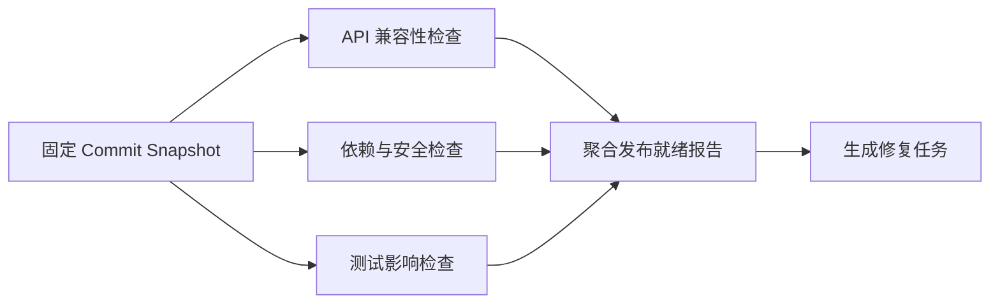

# Parallelization：独立任务、Fan-out/Fan-in 与结果聚合

Parallelization 是把可以独立推进的工作分发给多个受控分支并发执行，再通过明确的聚合规则合并结果。它可以降低关键路径延迟，也可以让多个独立视角检查同一对象。并行只改变可同时推进的工作，不消除数据依赖、资源上限、错误处理和一致性要求。

一个完整并行阶段包含：

```text
输入快照
  → 分解与独立性检查
  → Fan-out
  → 有上限的并发执行
  → 收集成功、失败、取消和超时
  → Fan-in
  → 校验与聚合
  → 完整、部分或失败终态
```

缺少 Fan-in 合同的多个并发调用只是一组异步请求，不是可维护的 Workflow。

## 前置知识与适用范围

前置阅读：

- [Prompt Chaining 与 Sequential Workflow](01-prompt-chaining-sequential.md)。
- [取消、超时、有限重试、限流与 Usage](../01-model-api/reliability-rate-limits-usage.md)。
- [AI 任务状态机](../04-ai-ux/01-ai-task-state-machine.md)。
- [上下文去重、过期与冲突](../03-context-engineering/05-dedup-staleness-conflicts.md)。

适合并行的工作：

- 每个分支只读取同一个不可变输入快照。
- 一个分支的输出不是另一个分支的输入。
- 分支可以独立重试。
- 分支副作用不存在，或有独立幂等键和冲突规则。
- 聚合器能判断哪些结果足以完成目标。
- 下游容量允许受控并发。

不适合直接并行：

- 后一步必须读取前一步产生的事实。
- 多个分支更新同一对象且没有并发控制。
- 任务顺序具有业务含义。
- 单次调用已经满足延迟与质量目标。
- 分支数量无法设置上限。
- 聚合规则只是“让模型随便合并”。

## 关键路径与理论收益

三个任务顺序执行：

```text
T_sequential = T_A + T_B + T_C + T_merge
```

三个独立任务并行执行：

```text
T_parallel ≈ max(T_A, T_B, T_C) + T_dispatch + T_merge
```

如果：

```text
T_A = 1.2s
T_B = 2.8s
T_C = 1.7s
T_dispatch = 0.1s
T_merge = 0.4s
```

则：

```text
T_sequential = 6.1s
T_parallel ≈ 3.3s
```

这个估算成立需要：

- 三个任务确实同时获得执行资源。
- 没有触发供应商限流。
- 聚合器等待全部结果。
- 网络、队列和连接池没有成为新瓶颈。

并发量增加后，p95 可能因排队、限流和重试上升。实际收益必须用端到端 trace 测量。

## 首先判断独立性

## 数据依赖

给每个任务写出读取集和写入集：

```text
Task A: read {commit_snapshot}; write {api_report}
Task B: read {commit_snapshot}; write {security_report}
Task C: read {api_report}; write {release_summary}
```

`A` 与 `B` 可以并行。`C` 依赖 `A`，不能与 `A` 同层执行。

数据依赖构成有向无环图：



并行单位是 DAG 中没有相互依赖的一层，而不是整个 Workflow。

## 控制依赖

即使数据独立，也可能有控制依赖：

- 必须先完成授权，再读取受限文件。
- 必须先确认用户意图，再产生多个高成本分支。
- 必须先验证输入 Schema，再创建任务。
- 安全 Gate 拒绝后，其他分支不应继续消耗预算。

控制 Gate 应位于 Fan-out 之前。不要让每个分支分别猜测权限状态。

## 写冲突

检查任意两个分支 `i` 和 `j`：

```text
write_i ∩ write_j = ∅
write_i ∩ read_j = ∅
write_j ∩ read_i = ∅
```

如果不为空，需要：

- 改成只生成候选 Artifact，由单一聚合器写入。
- 使用事务、版本号或 compare-and-swap。
- 给每个分支分配互不重叠的分区。
- 改回顺序执行。

“最后完成者覆盖前一个结果”不是一致性策略。

## 外部副作用

发送邮件、扣款、发布、删除和写数据库不能因为 Promise 并行就自动安全。每个副作用分支至少需要：

- 稳定 operation ID。
- 幂等键。
- 明确目标资源。
- 权限复核。
- 冲突与补偿策略。
- 可查询的最终状态。

无法安全重试的写操作不应放进可自动重试的通用并行池。

## 时间独立性

两个分支读取“当前库存”时可能在不同毫秒观察到不同状态。若聚合结果要求一致视图，应传入：

- 数据库 snapshot ID。
- 版本化对象 ID。
- 固定 `asOf` 时间。
- 不可变文件 hash。
- 固定检索索引版本。

“同时启动”不保证“读取同一事实版本”。

## 独立性检查表

| 问题 | 可以并行的证据 | 不能直接并行的信号 |
| --- | --- | --- |
| 输入 | 共同不可变快照或互不重叠分区 | 分支读取其他分支输出 |
| 输出 | 独立 Artifact ID | 写同一记录或文件 |
| 顺序 | 业务不关心完成先后 | 编号、审批或因果依赖 |
| 失败 | 可单独重试或忽略 | 任一失败使其他结果无意义 |
| 取消 | Worker 协作响应 | 调用一旦开始无法停止且副作用昂贵 |
| 预算 | 每分支有上限 | 分支可递归创建无限任务 |
| 聚合 | 有确定性 Schema 和门槛 | 依赖隐含上下文猜测 |

只要关键项无法证明独立，就先建立顺序或编排依赖。

## 两种 AI 并行模式

Anthropic 将并行化中的常见用法区分为 Sectioning 与 Voting。二者都会发起多个调用，但目标和聚合方式不同。

## Sectioning：按职责分区

Sectioning 把一个对象的不同独立方面交给专用分支：

```text
同一份代码变更
  ├─ API compatibility
  ├─ security
  ├─ test impact
  └─ documentation
```

每个分支：

- 关注不同问题。
- 使用不同 Prompt、Tool 或规则。
- 产生不同 Schema 字段。
- 聚合时保留各自结论。

Sectioning 的目标通常是降低延迟或让每个检查器聚焦。它不会通过“多数相同答案”决定正确性。

### Sectioning 的分区方式

可以按以下维度分：

- 文档章节。
- 数据分片。
- 审查维度。
- 地区或语言。
- 文件集合。
- 独立候选方案。

分区必须完整且尽量无重叠。若两个分支都负责“安全”，发现相同问题时需要去重规则；若没有分支负责迁移兼容性，最终报告会系统性漏项。

## Voting：同一任务多次尝试

Voting 对同一输入执行多个独立尝试，再依据标准化结果做选择：

```text
同一张运单
  ├─ Sample 1 → destination_code = SHA
  ├─ Sample 2 → destination_code = SHA
  ├─ Sample 3 → destination_code = SNA
  └─ Sample 4 → destination_code = SHA

归一化后：SHA 获得 3/4
```

每个分支：

- 解决同一个问题。
- 输出可比较的同一 Schema。
- 通过采样、模型、Prompt 或上下文产生差异。
- 聚合器寻找一致答案、排序或仲裁。

Self-consistency 是一种特定 Voting 思路：对同一推理任务采样多条不同路径，再选择最一致的最终答案。论文结果只证明其在所测试模型、数据集和设置中的收益，不能推导出“多跑几次必然更正确”。

## Sectioning 与 Voting 对照

| 维度 | Sectioning | Voting |
| --- | --- | --- |
| 分支任务 | 不同子任务 | 同一任务的多次尝试 |
| 输出 Schema | 可以不同 | 必须可比较 |
| 聚合 | 拼接、去重、规则合并 | 多数、加权、排序或仲裁 |
| 主要目标 | 速度、覆盖不同维度 | 提高可靠性或多样性 |
| 典型失败 | 分区漏项、重叠冲突 | 高相关错误形成伪共识 |
| 成本 | 与子任务数增长 | 与样本数近似线性增长 |

不要把四个完全相同且温度为零的调用称为“多样化 Voting”。它们可能高度相关，只重复相同错误。

## Fan-out：创建受控分支

Fan-out 输入定义：

```json
{
  "runId": "release-check-812",
  "snapshot": {
    "repository": "web-platform",
    "commit": "4f3a19b",
    "manifestHash": "sha256:9f..."
  },
  "tasks": [
    {
      "taskId": "api",
      "kind": "api_compatibility",
      "inputRef": "diff:4f3a19b"
    },
    {
      "taskId": "security",
      "kind": "dependency_security",
      "inputRef": "diff:4f3a19b"
    },
    {
      "taskId": "tests",
      "kind": "test_impact",
      "inputRef": "diff:4f3a19b"
    }
  ],
  "maxConcurrency": 2,
  "deadlineAt": "2026-07-18T14:00:15Z",
  "failurePolicy": "collect_all"
}
```

Fan-out 前验证：

- `tasks.length` 小于硬上限。
- `taskId` 唯一。
- 每个 `kind` 在 allowlist。
- 输入引用属于同一个 snapshot。
- 总 Token、成本和时间预算可接受。
- handler 只获得任务所需权限。

## 静态分支与数据驱动 Map

### 静态 Parallel

分支数量和职责在 Workflow 定义中固定：

```text
API check + security check + test check
```

适合：

- 分支少。
- 每个分支逻辑不同。
- 需要清晰的图形化控制流。

AWS Step Functions 的 `Parallel` state 使用独立 branch state machine。其默认错误语义是：未处理的任一分支失败会让整个 Parallel state 失败并停止其他分支；已经调用的 Lambda 函数不等于会被立即终止，Worker 仍需协作处理停止。

### 数据驱动 Map

对集合中每项执行同一处理逻辑：

```text
documents.map(processDocument)
```

适合：

- 分支数量来自数据。
- 每个 item 使用同一合同。
- 需要批处理、分片和并发上限。

Map 必须限制输入数量和并发。AWS Step Functions 的 Map 同时提供有限并发的 Inline mode 与高并发的 Distributed mode；具体配额属于该服务实现，不应复制成自建系统的默认值。Distributed Map 还支持可容忍失败数量或比例。

## 分支身份

每个分支需要稳定身份：

```json
{
  "runId": "release-check-812",
  "branchId": "security",
  "itemIndex": 1,
  "attempt": 2,
  "idempotencyKey": "release-check-812:security",
  "snapshotId": "commit:4f3a19b"
}
```

完成顺序不能作为身份。重试同一分支增加 `attempt`，不改变逻辑 `branchId`。

## 并发上限

## 为什么不能 `Promise.all(items.map(...))`

对 10,000 个 item 立即创建 10,000 个请求可能耗尽：

- HTTP 连接池。
- 文件描述符。
- 内存。
- 数据库连接。
- 供应商 RPM/TPM 配额。
- 下游 Worker。
- 项目成本预算。

Promise 的创建不等于系统拥有 10,000 个独立执行资源。请求会在不同层排队，并可能一起超时和重试。

## 固定并发

`maxConcurrency = 8` 表示同时最多八个活跃分支。它应受以下最小值约束：

```text
effectiveConcurrency = min(
  workflowLimit,
  tenantLimit,
  providerLimit,
  connectionPoolLimit,
  downstreamCapacity
)
```

如果每个分支还会调用三个并发 Tool，真实下游并发不是 8，而可能接近 24。限制需要覆盖嵌套扇出。

## 加权并发

任务成本差异大时，用权重：

```text
text classification: weight 1
long document review: weight 4
large image analysis: weight 6
```

容量为 12 的池可以同时运行：

- 12 个 weight 1；或
- 3 个 weight 4；或
- 1 个 weight 6 + 6 个 weight 1。

权重来自资源测量，不是内容难度的随意标签。

## 分租户公平

全局并发池可能被一个大租户占满。增加：

- 每租户并发上限。
- 每租户队列。
- 加权公平调度。
- 等待时间上限。
- 优先级老化，避免低优先级永远饥饿。

高优先级不能绕过权限和成本上限。

## 自适应并发

根据下游信号逐步调整：

- 限流率上升：降低并发。
- p95 与排队下降且余量充足：缓慢增加。
- 错误来自业务输入：不应降低并发。
- 错误来自供应商容量：降低并发或停止新分支。

自适应控制器需要上下界和稳定窗口，避免每次波动都剧烈改变并发。

## 预算分配

总预算包含：

```json
{
  "maxBranches": 12,
  "maxConcurrency": 4,
  "maxInputTokens": 60000,
  "maxOutputTokens": 18000,
  "maxCostUsd": 1.2,
  "deadlineMs": 15000,
  "reserveForMergeMs": 1500
}
```

### 预留聚合预算

不能把总 deadline 全部分配给分支：

```text
branchDeadline = overallDeadline - mergeReserve - responseReserve
```

否则最后一个分支在总截止时间才完成，聚合器没有时间验证和输出。

### Token 预算

Sectioning 时按职责分配：

```text
security: 35%
api compatibility: 25%
test impact: 25%
merge: 15%
```

Voting 时每个样本的输出应短而可比较。让五个样本都生成长篇解释会使成本线性增加，还增加聚合噪声。

### 成本停止

在启动新分支前原子预留预算：

```text
remainingCost >= estimatedBranchCost + mergeReserve
```

完成后结算实际 Usage。预留失败的分支不能启动；多个 Worker 不能同时读取旧余额后都超支。

## 取消

取消分为：

- 用户主动取消。
- 总 deadline 到期。
- Fail-fast 触发。
- 失败阈值超过。
- 预算耗尽。
- 上游 Workflow 终止。

取消流程：

1. 持久化 `cancel_requested` 和原因。
2. 停止创建新分支。
3. 向运行中 Worker 传播 cancellation signal。
4. Worker 在安全点停止。
5. 处理无法中止的外部调用。
6. 收集已完成结果。
7. 进入 `cancelled` 或定义好的部分终态。

取消 Promise 的等待不等于取消底层工作。HTTP client、模型 SDK、数据库查询和 Worker 必须真正支持 signal 或取消 API。

Node.js 的 `AbortSignal.timeout(delay)` 可以产生超时信号；`AbortSignal.any(signals)` 可以组合用户取消、Workflow 取消和 deadline，最先触发的信号成为取消原因。监听器应在触发或完成后移除。

## 部分失败策略

## Fail-fast

任一必要分支失败就停止：

```text
required schema validation fails
→ cancel remaining work
→ workflow failed
```

适用：

- 每个分支都是完整结果的必要组成。
- 继续执行没有价值。
- Worker 能协作取消。

`Promise.all` 的返回 Promise 会在一个输入拒绝后拒绝，但这不会自动停止其他已经启动的 Promise。

## Collect-all

等待全部分支 settle，保留每个结果：

```json
[
  {"branchId": "api", "status": "fulfilled"},
  {"branchId": "security", "status": "rejected", "errorCode": "TIMEOUT"},
  {"branchId": "tests", "status": "fulfilled"}
]
```

适用：

- 每个分支提供独立价值。
- 失败报告本身有用。
- 需要精确重试失败分支。

ECMAScript 的 `Promise.allSettled` 在所有输入 settle 后返回状态快照数组；结果位置对应输入顺序，而不是完成顺序。

## Quorum

达到最少成功数即可继续：

```text
successes >= 3 of 5
```

适用：

- Voting。
- 多个可替代数据源。
- 目标允许明确的最低证据门槛。

Quorum 不能只数成功调用。五个成功响应若三个无法解析成同一标准化答案，仍未形成答案 quorum。

## 容忍失败比例

批量 item 可定义：

```text
failedCount <= 10
failedPercentage <= 2%
```

当总数很小时，百分比可能误导；同时设绝对数量和比例通常更清晰。失败阈值决定批次状态，但每个失败 item 仍需记录和可重试。

## Best-effort

在 deadline 前收集已有结果：

- 搜索建议。
- 可选洞察。
- 非关键预览。

输出必须标记：

- 已完成数。
- 缺失数。
- 截止原因。
- 是否可继续。

不能把 Best-effort 结果伪装成完整审计。

## 可执行的有限并发池

下面的 JavaScript 示例实现：

- 固定并发上限。
- 组合外部取消与 deadline。
- `all_settled` 和 `fail_fast`。
- 按输入顺序保存结果。
- 失败数上限。
- Worker 协作取消。

```javascript
"use strict";

function abortError(signal) {
  const error = new Error(String(signal.reason ?? "aborted"));
  error.name = "AbortError";
  return error;
}

function delay(ms, signal) {
  return new Promise((resolve, reject) => {
    if (signal.aborted) {
      reject(abortError(signal));
      return;
    }

    const timer = setTimeout(() => {
      signal.removeEventListener("abort", onAbort);
      resolve();
    }, ms);

    function onAbort() {
      clearTimeout(timer);
      reject(abortError(signal));
    }

    signal.addEventListener("abort", onAbort, { once: true });
  });
}

async function mapConcurrent(items, worker, options = {}) {
  const {
    concurrency = 4,
    deadlineMs = 5000,
    failurePolicy = "all_settled",
    maxFailures = Number.POSITIVE_INFINITY,
    signal: externalSignal
  } = options;

  if (!Array.isArray(items)) {
    throw new TypeError("items must be an array");
  }
  if (!Number.isInteger(concurrency) || concurrency < 1) {
    throw new RangeError("concurrency must be a positive integer");
  }
  if (!Number.isFinite(deadlineMs) || deadlineMs <= 0) {
    throw new RangeError("deadlineMs must be positive");
  }
  if (!["all_settled", "fail_fast"].includes(failurePolicy)) {
    throw new TypeError("failurePolicy is invalid");
  }

  const controller = new AbortController();
  const signals = [
    controller.signal,
    AbortSignal.timeout(deadlineMs)
  ];
  if (externalSignal) {
    signals.push(externalSignal);
  }
  const combinedSignal = AbortSignal.any(signals);

  const results = new Array(items.length);
  let nextIndex = 0;
  let failureCount = 0;

  async function runSlot() {
    while (!combinedSignal.aborted) {
      const index = nextIndex;
      nextIndex += 1;

      if (index >= items.length) {
        return;
      }

      try {
        const value = await worker(items[index], {
          index,
          signal: combinedSignal
        });
        results[index] = {
          index,
          status: "fulfilled",
          value
        };
      } catch (error) {
        failureCount += 1;
        results[index] = {
          index,
          status: "rejected",
          reason: error instanceof Error ? error.message : String(error)
        };

        const failureLimitExceeded = failureCount > maxFailures;
        if (failurePolicy === "fail_fast" || failureLimitExceeded) {
          controller.abort(
            failureLimitExceeded
              ? "failure threshold exceeded"
              : "branch failed"
          );
          return;
        }
      }
    }
  }

  const slotCount = Math.min(concurrency, items.length);
  await Promise.allSettled(
    Array.from({ length: slotCount }, () => runSlot())
  );

  for (let index = 0; index < results.length; index += 1) {
    if (!results[index]) {
      results[index] = {
        index,
        status: "cancelled",
        reason: String(combinedSignal.reason ?? "not started")
      };
    }
  }

  return {
    status: combinedSignal.aborted ? "partial" : "completed",
    failureCount,
    results
  };
}

async function inspectItem(item, { signal }) {
  await delay(item.delayMs, signal);
  if (item.invalid) {
    throw new Error(`invalid item: ${item.id}`);
  }
  return {
    id: item.id,
    normalized: item.id.toUpperCase()
  };
}

async function main() {
  const input = [
    { id: "alpha", delayMs: 30 },
    { id: "beta", delayMs: 5, invalid: true },
    { id: "gamma", delayMs: 10 }
  ];

  const summary = await mapConcurrent(input, inspectItem, {
    concurrency: 2,
    deadlineMs: 1000,
    failurePolicy: "all_settled",
    maxFailures: 1
  });

  for (const result of summary.results) {
    const detail =
      result.status === "fulfilled"
        ? result.value.normalized
        : result.reason;
    console.log(`${result.index} ${result.status} ${detail}`);
  }
}

main().catch((error) => {
  console.error(error);
  process.exitCode = 1;
});
```

预期输出：

```text
0 fulfilled ALPHA
1 rejected invalid item: beta
2 fulfilled GAMMA
```

`beta` 最早结束，但结果仍在索引 1。`alpha` 与 `gamma` 的完成顺序不会改变聚合顺序。

### 生产补充

这个进程内实现不提供：

- 崩溃恢复。
- 跨进程租约。
- 持久队列。
- 分布式预算原子预留。
- 恰好一次副作用。

长任务应把 branch 状态和 attempt 持久化。Worker 使用租约或队列可见性超时，聚合器根据持久状态恢复。

## Fan-in：结果聚合

Fan-in 不只是 `array.join()`。它需要定义输入集合、等待条件、校验、冲突和最终状态。

## 聚合输入合同

```json
{
  "branchId": "security",
  "attempt": 1,
  "snapshotId": "commit:4f3a19b",
  "status": "completed",
  "schemaVersion": "security-findings-v3",
  "result": {
    "findings": [
      {
        "fingerprint": "sha256:...",
        "severity": "high",
        "file": "src/auth/session.ts",
        "line": 81,
        "ruleId": "session-cookie-flags"
      }
    ]
  }
}
```

聚合器拒绝：

- 不同 snapshot 的结果。
- 未知 branch。
- 旧 attempt 覆盖新成功 attempt。
- Schema 不匹配。
- 缺失必需分支。
- 未完成却携带成功 payload。

## 稳定顺序

并发完成顺序不稳定。输出顺序应依据：

- 原始 item index。
- 显式 `sectionOrder`。
- 业务排序键。
- 稳定 fingerprint。

不要依据数据库默认返回顺序或“最先完成”排序，除非完成速度本身就是产品语义。

## 去重

Sectioning 可能产生重叠 finding。去重优先使用稳定身份：

```text
fingerprint = hash(ruleId + canonicalResource + normalizedLocation)
```

只按自然语言描述相似度去重可能把两个不同位置的问题错误合并。保留：

- `reportedBy`。
- 每个原始 finding ID。
- 合并依据。
- 冲突字段。

## 冲突

两个分支对同一事实给出不同结论：

```json
{
  "status": "conflict",
  "field": "apiCompatibility",
  "candidates": [
    {
      "value": "breaking",
      "branchId": "api-static-check",
      "evidence": "removed response field user.role"
    },
    {
      "value": "compatible",
      "branchId": "api-model-review",
      "evidence": "field appears optional"
    }
  ]
}
```

处理顺序：

1. 检查是否读取同一 snapshot。
2. 使用确定性证据和领域规则。
3. 若仍冲突，进入专门仲裁或人工。
4. 不按“更晚完成”或“模型更大”自动覆盖。

## 完整性状态

聚合结果应显式区分：

```text
complete
partial_acceptable
partial_unacceptable
conflicted
cancelled
failed
```

`partial_acceptable` 必须来自 Workflow 合同。例如可选的文档建议超时不阻断预览；安全检查缺失则 `partial_unacceptable`。

## Voting 聚合

## 答案归一化

投票前先把等价答案变为相同表示：

```text
"sha" → "SHA"
"SHA " → "SHA"
"上海 / SHA" → 需要按字段 Schema 提取 "SHA"
```

归一化规则必须避免改变语义。金额、日期、单位和地区代码使用领域解析器；不能仅删除所有标点。

## 多数投票

```text
winnerCount > validVotes / 2
```

若输出为 `SHA, SHA, SNA, SHA`，`SHA` 是 3/4 绝对多数。

如果输出为 `SHA, SNA, CAN, SHA`，`SHA` 只有 2/4，不是绝对多数。系统可以：

- 增加一个受预算限制的样本。
- 使用独立验证器。
- 请求人工复核。
- 拒绝自动决定。

## 加权投票

不同检查器经过独立评估后可使用权重：

```text
score(answer) = Σ calibratedWeight_i × vote_i(answer)
```

权重来自按任务切片的历史质量。不能因为模型价格高就给更高权重，也不能用同一评估集不断调整后再宣称泛化质量。

## 相关错误

Voting 只有在错误不完全相关时才可能增加价值。相同模型、相同 Prompt、相同解码和相同缺失上下文很可能产生相同错误。

多样性可以来自：

- 不同采样路径。
- 不同模型家族。
- 不同证据视图。
- 不同提取方法。

但差异也可能降低单个分支质量。评估最终 Voting 系统，而不是假定多样性必然有益。

## Tie 与无效票

定义：

- Schema 错误是否计票。
- 拒答是否计入分母。
- 超时是否触发补充样本。
- 平票由谁仲裁。
- 最多增加多少样本。

无效输出不能投给“最接近”答案，除非有经过验证的归一化规则。

## 案例一：Monorepo 发布就绪审查

## 输入快照

目标：在合并前审查 commit `4f3a19b`。

固定材料：

```json
{
  "repository": "web-platform",
  "baseCommit": "8ca92ef",
  "headCommit": "4f3a19b",
  "changedFiles": [
    "packages/api/src/user-response.ts",
    "packages/auth/src/session.ts",
    "packages/web/src/profile.tsx",
    "docs/api/user.md"
  ],
  "lockfileHash": "sha256:1c..."
}
```

所有分支读取相同 commit，不读取随时间变化的工作区。

## 分区

### API 兼容性分支

输入：

- API schema diff。
- 对外类型。
- 迁移规则。

输出：

```json
{
  "branchId": "api",
  "status": "completed",
  "breakingChanges": [
    {
      "symbol": "UserResponse.role",
      "change": "removed",
      "evidence": "packages/api/src/user-response.ts:44"
    }
  ]
}
```

### 安全分支

输入：

- Auth diff。
- Dependency diff。
- 安全规则输出。

输出 finding，不决定是否发布。

### 测试影响分支

输入：

- 变更文件。
- Import graph。
- Test coverage map。

输出应运行的 test targets 和未覆盖路径。

### 文档分支

检查公开 API 文档是否和 schema 同步。它是可选分支，但结果缺失要标记，不得显示“文档已验证”。

## 并发策略

```json
{
  "maxConcurrency": 3,
  "requiredBranches": ["api", "security", "tests"],
  "optionalBranches": ["docs"],
  "branchTimeoutMs": {
    "api": 8000,
    "security": 12000,
    "tests": 10000,
    "docs": 6000
  },
  "mergeReserveMs": 2000
}
```

三个必需分支并行，文档分支等有槽位再启动。若安全分支因临时网络错误失败，可以在 deadline 内有限重试；Schema 错误不可用同一输入重试。

## 聚合

聚合器：

1. 验证全部结果的 `headCommit`。
2. 检查必需分支状态。
3. 按 fingerprint 去重 finding。
4. 按 severity、文件、行号稳定排序。
5. 将证据链接到 commit。
6. 应用发布规则。

发布规则是代码：

```text
high security finding → blocked
breaking API without migration → blocked
required branch missing → incomplete
only docs warning → review_required
no blocking finding → ready
```

模型不能把 `high` finding 改成可发布。

## 失败分支

安全检查超时，但 API 和测试完成：

```json
{
  "status": "partial_unacceptable",
  "releaseDecision": "incomplete",
  "completedBranches": ["api", "tests", "docs"],
  "missingRequiredBranches": ["security"],
  "retryable": true
}
```

不得因为三项中有三项成功就多数通过；分支职责不同，安全检查不可由其他分支投票替代。

## 验证

使用历史变更 fixture：

- 已知 breaking API。
- 已知依赖漏洞。
- 只改文档。
- 大型 rename。
- 生成文件噪声。
- 分支超时。
- 不同 commit 结果混入。

比较顺序与并行版本：

- finding 集合是否一致。
- p50/p95 总时长。
- 每分支超时率。
- 缺失必需检查率。
- 每次完整报告成本。
- 同一 snapshot 重放是否稳定。

## 案例二：扫描运单目的地代码 Voting

## 任务边界

输入是一张已通过文件验证的扫描运单，需要提取三个字母的目的地代码。系统只生成候选，不自动调度货物。

可信代码 Catalog：

```json
{
  "SHA": "Shanghai",
  "SZX": "Shenzhen",
  "CAN": "Guangzhou",
  "SIN": "Singapore"
}
```

## Fan-out

对同一裁剪区域运行五个受控样本：

```json
{
  "documentId": "waybill-991",
  "imageHash": "sha256:8a...",
  "field": "destination_code",
  "sampleCount": 5,
  "maxConcurrency": 3,
  "quorum": 3,
  "allowedValues": ["SHA", "SZX", "CAN", "SIN"]
}
```

每个结果：

```json
{
  "sampleId": 2,
  "value": "SNA",
  "evidenceBox": {
    "x": 812,
    "y": 441,
    "width": 103,
    "height": 48
  },
  "status": "parsed"
}
```

`SNA` 不在 Catalog，归为 invalid vote，不能自动纠正成 `SHA`。

## 聚合过程

原始结果：

```text
sample 1: SHA
sample 2: SNA
sample 3: SHA
sample 4: timeout
sample 5: SHA
```

处理：

1. 检查五个样本的 `imageHash` 相同。
2. `SNA` 不在 allowlist，标为 invalid。
3. timeout 不计有效票。
4. `SHA` 获得三票并达到预设 quorum。
5. 使用独立规则验证字段格式 `[A-Z]{3}`。
6. 输出候选并保留每个样本 provenance。

结果：

```json
{
  "status": "candidate_ready",
  "value": "SHA",
  "votes": 3,
  "requestedSamples": 5,
  "validVotes": 3,
  "invalidVotes": 1,
  "timeouts": 1,
  "requiresHumanConfirmation": true
}
```

## 失败分支

结果为：

```text
SHA, SZX, SHA, SZX, timeout
```

没有达到三票 quorum。即使 `SHA` 和 `SZX` 都是合法代码，也不能随机选择：

```json
{
  "status": "no_quorum",
  "candidates": [
    {"value": "SHA", "votes": 2},
    {"value": "SZX", "votes": 2}
  ],
  "action": "human_review"
}
```

如果预算允许增加样本，必须预先定义最大样本数，并避免一直采样直到得到想要的答案。

## Voting 评估

按扫描质量切片：

- 清晰打印。
- 低对比度。
- 旋转。
- 手写覆盖。
- 字符部分缺失。
- 非 Catalog 代码。

分别测量：

- 单样本字段准确率。
- 五样本 Voting 准确率。
- Quorum coverage。
- 错误共识率。
- 无 quorum 率。
- 平均样本数和成本。
- p95 完成时间。

如果 Voting 只提高简单清晰样本，却对低对比度样本形成一致错误，应改进图像预处理或引入独立识别器，而不是继续增加相同样本。

## 案例三：知识库批量链接检查

这个案例展示数据驱动 Map 和部分失败，而不是 LLM Voting。

输入：

```json
{
  "snapshotId": "docs:2026-07-18:42",
  "documents": [
    {"index": 0, "path": "guide/install.md"},
    {"index": 1, "path": "guide/config.md"},
    {"index": 2, "path": "guide/deploy.md"}
  ],
  "maxConcurrency": 5,
  "toleratedFailureCount": 1
}
```

每个 Worker：

1. 读取 snapshot 中的固定文件。
2. 解析普通 Markdown 链接。
3. 检查仓库内目标存在性。
4. 对外部 URL 使用受限网络客户端。
5. 返回逐链接状态，不修改文档。

输出顺序按原文档 index，而不是网络响应先后。

若一个外部站点超时：

- 该链接标记 `unverified_timeout`。
- 其他文档继续。
- 批次可以是 `partial_acceptable`。
- 不把 timeout 误报为链接永久失效。

若 snapshot 中本地链接不存在：

- 这是确定性 `broken_local_link`。
- 重试没有价值。
- 批次失败阈值按项目规则计算。

验证包括：

- 最大活跃请求没有超过 5。
- 相同 URL 可按策略去重检查。
- 不访问私网、loopback 和不允许协议。
- 取消后不再启动新 URL。
- 恢复只重试未完成或允许重试项。

## 状态与持久化

父 Run：

```text
pending
→ fanning_out
→ running
→ aggregating
→ complete | partial | failed | cancelled
```

分支：

```text
queued
→ leased
→ running
→ completed | failed | timed_out | cancelled
```

`leased` 保存：

- Worker ID。
- lease 到期时间。
- heartbeat。
- attempt。

Worker 崩溃后，租约到期可以重派。旧 Worker 晚到的结果必须通过 attempt 或 fencing token 拒绝，不能覆盖新结果。

## 观测指标

### 并发与队列

- `branches_queued`：等待数量。
- `branches_active`：实际活跃数量。
- `branch_queue_wait_ms`：排队时间。
- `configured_concurrency`：配置上限。
- `effective_concurrency`：受下游约束后的上限。
- `throttle_rate`：被下游限流比例。

### 延迟

- Fan-out 构建时间。
- 每类 branch p50/p95。
- 最大 branch 时间。
- Fan-in 时间。
- 总关键路径。

只看平均分支时长会隐藏 straggler。整个并行阶段通常受最慢必要分支影响。

### 结果

- 完整成功率。
- 部分成功率。
- 每类失败码。
- 取消后仍运行分支数。
- 失败阈值触发次数。
- 缺失必需分支次数。
- 冲突率与人工仲裁率。

### 资源

- 输入/输出 Token。
- 每分支成本。
- 每个完整聚合结果成本。
- 连接池使用。
- 队列深度。
- Worker CPU/内存。

Trace 至少包含：

```text
parent span: parallel stage
  child span: branch api attempt 1
  child span: branch security attempt 1
  child span: branch tests attempt 1
  child span: aggregate
```

每个 child span 关联 snapshot、branch、attempt 和模型/Tool 版本。

## Straggler 处理

最慢分支决定等待全部完成的延迟。先定位原因：

- 输入大小异常。
- 下游排队。
- 模型输出过长。
- Tool 超时。
- 重试。
- Worker 资源不足。

策略：

- 给每类分支独立 timeout。
- 限制输出长度。
- 对 item 按大小分桶。
- 可选分支超时后产出部分结果。
- 对无副作用、可幂等的必要分支做受控 hedging。

Hedged request 是同一任务在延迟异常时启动第二个副本，采用第一个有效结果并取消另一个。它增加容量压力和成本，只能在尾延迟收益经过评估时使用。不能对非幂等写操作 hedging。

## 一致性与确定性

## 快照一致

所有分支记录同一：

- 数据版本。
- Prompt/模型版本。
- Tool schema。
- Policy。
- 时间边界。

任一关键版本不同，聚合器将结果标为不可比较或重新运行。

## 聚合确定性

同一组规范化分支结果应产生相同聚合输出：

- 固定排序。
- 固定去重。
- 固定冲突优先级。
- 固定失败阈值。
- 固定数值舍入。

如果最后一步使用生成模型写自然语言摘要，底层判断仍由结构化聚合完成。摘要不能改变 `blocked`、`no_quorum` 或 finding severity。

## 重试一致性

只重试：

- timeout。
- 限流。
- 短暂网络错误。
- 明确可修复的格式错误。

不自动重试：

- 权限拒绝。
- 不支持的输入。
- 确定性校验失败。
- 预算耗尽。
- 已产生不可逆副作用但状态未知。

重试产生新 attempt，聚合器使用选定的接受规则，例如“最新成功 attempt”，同时保留旧记录。

## 测试策略

## 单元测试

- DAG 分层。
- 分支 ID 唯一。
- 并发从未超过上限。
- 结果保持输入顺序。
- 未知 Schema 被拒绝。
- 必需分支缺失时不完整。
- Majority、tie、invalid vote。
- 失败阈值边界。

## 集成测试

- 真实 Worker 并发。
- 外部 signal 取消。
- deadline。
- 队列租约到期。
- 重复消息。
- 聚合器重启。
- snapshot 不一致。
- provider 限流。

## 失败注入

注入时间线：

```text
t=0ms   启动 3 个分支
t=50ms  branch B 返回业务失败
t=70ms  触发 fail-fast
t=90ms  branch A 响应取消
t=200ms branch C 的外部调用晚到
```

验证：

- B 的错误被保存。
- A 状态为 cancelled。
- C 的晚到结果不覆盖终态。
- 不再创建新分支。
- 父 Run 只完成一次状态转换。

## 性能基线

比较至少三组：

1. 顺序执行。
2. 并发 2。
3. 并发 4。
4. 并发 8。

记录：

- p50/p95。
- 限流率。
- 重试率。
- 完整成功率。
- 成本。
- 最大内存。

选择满足 SLA 且稳定的最小并发，不选择压测中瞬时吞吐最高的值。

## 常见错误

### 把相关任务强行并行

症状：不同分支使用不一致事实，聚合器不断解决冲突。

修正：建立 DAG，把事实提取放在共同前置步骤。

### 并发无上限

症状：大量限流、连接耗尽、重试风暴。

修正：在调用前排队，按最紧下游容量限制并发。

### 只使用 `Promise.all`

症状：任一失败后丢失其他分支结果，底层工作仍继续。

修正：按 Workflow 语义选择 fail-fast 或 collect-all，并传播真实取消。

### 按完成顺序聚合

症状：相同输入的输出顺序每次变化。

修正：使用 item index 或稳定业务键。

### 把缺失分支当“没有问题”

症状：安全检查超时后报告显示 0 个安全问题。

修正：区分空结果、失败、超时和未运行。

### Voting 没有归一化

症状：`SHA`、`sha` 和 `SHA ` 被算成三种答案。

修正：在投票前用领域规则解析和校验。

### Voting 掩盖相关错误

症状：五个同质样本一致输出错误答案。

修正：测量错误共识率，引入独立证据或验证器，保留拒绝。

### 取消只停止等待

症状：用户取消后成本仍增加，写操作仍发生。

修正：信号传播到底层调用，并让晚到结果受 fencing 约束。

### 每个分支更新同一文档

症状：内容丢失或覆盖。

修正：分支输出不可变 patch/Artifact，由单一聚合器合并。

## 与其他 Workflow 的选择

| 模式 | 任务关系 | 控制流 | 核心问题 |
| --- | --- | --- | --- |
| Sequential | 前后依赖 | 固定顺序 | 中间合同与恢复 |
| Routing | 选择一个或少数路径 | 条件分支 | 分类与拒绝 |
| Parallelization | 同层独立任务 | Fan-out/Fan-in | 并发与聚合 |
| Orchestrator-Workers | 子任务由运行时规划 | 动态 | 计划、边界与停止 |
| Evaluator-Optimizer | 结果被反复评估改进 | 反馈循环 | 终止与过拟合 |

一个系统可以组合：

```text
Routing 选择 workflow
→ Sequential 前置解析
→ Parallel sectioning
→ Sequential deterministic merge
```

每增加一种模式都要有可测量收益和明确状态，不能用更多调用代替任务建模。

## 综合练习：并行变更风险检查器

构建一个只读检查器，对固定 Git commit 并行执行：

- API compatibility。
- dependency security。
- migration completeness。
- test impact。

要求：

1. 画出 DAG，指出能并行和不能并行的节点。
2. 为每个 branch 定义输入、输出、timeout 和风险等级。
3. 所有分支固定同一 commit hash。
4. 实现最大并发 2 的 Worker 池。
5. 支持用户取消、总 deadline 和 merge reserve。
6. API、安全和迁移是必需分支；测试建议可以配置为可选。
7. 输出按固定 section order，不按完成顺序。
8. Finding 按稳定 fingerprint 去重。
9. 模拟一个 timeout、一个重复结果和一个旧 snapshot 结果。
10. 比较顺序、并发 2 和并发 4 的 p50/p95 与错误率。

验收标准：

- 活跃分支从未超过配置上限。
- 取消后不启动新分支。
- 晚到旧 attempt 不能覆盖新结果。
- 必需分支失败时不会显示完整。
- 可选分支失败时明确显示缺失。
- 相同规范化输入产生稳定排序的聚合结果。
- 每个分支可独立重试。
- Trace 能从父 Run 定位到 branch/attempt。
- 总成本包含失败、重试和聚合调用。

## 来源

- [Anthropic：Building Effective AI Agents](https://www.anthropic.com/engineering/building-effective-agents)，访问日期：2026-07-18。
- [AWS Step Functions：Parallel workflow state](https://docs.aws.amazon.com/step-functions/latest/dg/state-parallel.html)，访问日期：2026-07-18。
- [AWS Step Functions：Using Map state in Distributed mode](https://docs.aws.amazon.com/step-functions/latest/dg/state-map-distributed.html)，访问日期：2026-07-18。
- [Node.js：Global objects — AbortController 与 AbortSignal](https://nodejs.org/dist/latest/docs/api/globals.html#class-abortcontroller)，访问日期：2026-07-18。
- [Wang 等：Self-Consistency Improves Chain of Thought Reasoning in Language Models](https://arxiv.org/abs/2203.11171)，访问日期：2026-07-18。
