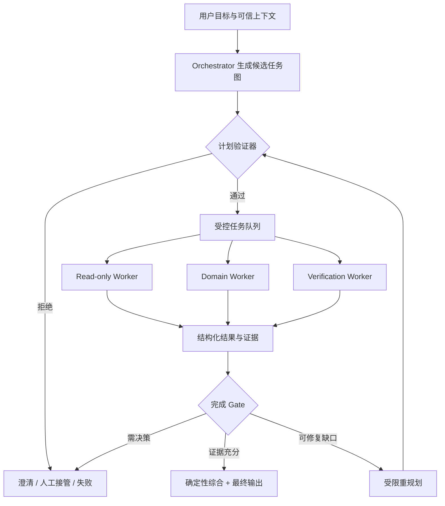
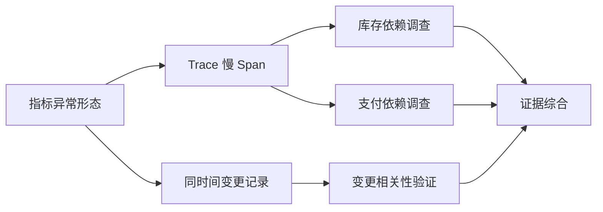
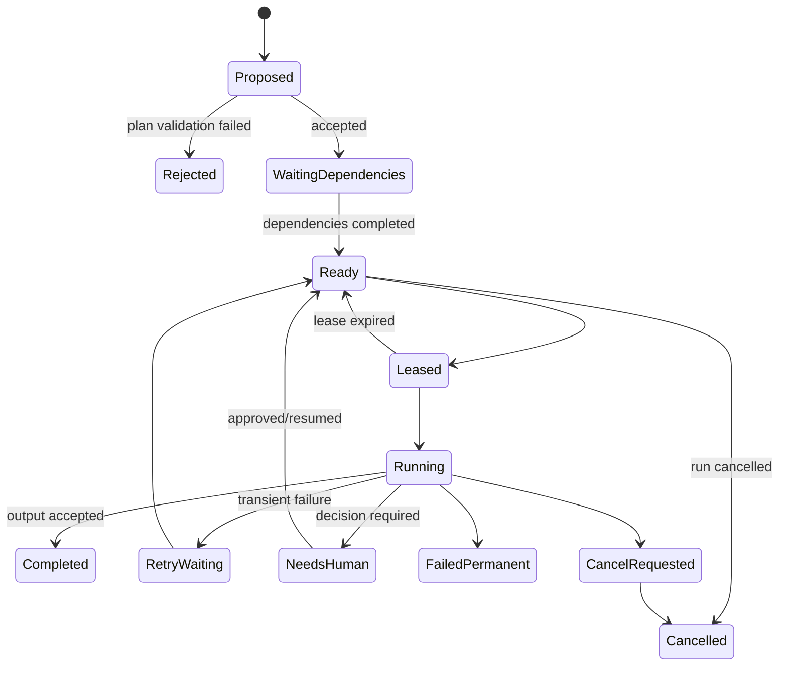

# Orchestrator–Workers：动态任务分解、调度与受控执行

Orchestrator–Workers 是由中央 Orchestrator 根据当前任务动态提出子任务，把通过验证的子任务分配给专用 Worker，再综合 Worker 结果的 Workflow 模式。它用于无法在开发阶段预先确定所有子任务的复杂工作。

核心数据流：



Orchestrator 可以提出计划，但不能自行扩大任务范围、权限、预算或递归深度。计划是模型输出的数据，必须经过服务端 Schema、图结构、能力、权限和预算验证后才能执行。

## 能力边界

前置阅读：

- [Routing：规则、分类器与模型混合路由](02-routing.md)。
- [Parallelization：独立任务、Fan-out/Fan-in 与结果聚合](03-parallelization.md)。
- [Tool 输入验证、超时、有限重试与幂等](../09-tool-design/03-validation-timeout-retry-idempotency.md)。
- [不确定性、人工确认与人工接管](../04-ai-ux/07-uncertainty-confirmation-human-handoff.md)。

适用条件：

- 子任务数量和类型取决于运行时发现。
- 任务能表示成有边界的目标和验收条件。
- Worker 输出可以结构化并引用证据。
- 中间结果会改变后续计划。
- 有足够价值覆盖额外延迟、Token 和运维复杂度。
- 可以设置硬停止条件。

不适用：

- 固定三步流程可以稳定解决。
- 所有分支在设计时已知，只需并行。
- 一个模型调用已达到质量目标。
- 结果无法验证，且错误代价很高。
- 系统只能提供过宽权限。
- “做完为止”是唯一终止条件。

## 与相邻模式的区别

| 模式 | 子任务由谁决定 | 图是否固定 | 运行时主要决策 |
| --- | --- | --- | --- |
| Sequential | 开发者 | 固定 | 执行下一步 |
| Routing | 开发者定义候选路径 | 固定候选 | 选择路径 |
| Parallelization | 开发者 | 固定分区或 Map 规则 | 调度独立任务 |
| Orchestrator–Workers | Orchestrator 提议，代码验证 | 运行时生成 | 分解、调度、受限重规划 |
| Autonomous Agent | 模型主导更多过程 | 高度动态 | 选择动作与工具直到停止 |

Orchestrator–Workers 仍可保持 Workflow 边界：

- Worker 类型固定。
- Tool catalog 固定。
- 权限由服务端下发。
- Plan Schema 固定。
- 深度、任务数和成本固定上限。
- 完成条件由代码和领域验证器判断。

动态分解不等于无限自主。

## 动态分解

## 从目标到可执行子任务

用户目标：

```text
调查 10:20 到 10:45 之间订单 API 延迟上升的原因，给出证据和下一步检查，不执行任何修复。
```

目标合同：

```json
{
  "objective": "定位订单 API 延迟异常的主要证据链",
  "scope": {
    "environment": "production",
    "service": "order-api",
    "start": "2026-07-18T10:20:00+08:00",
    "end": "2026-07-18T10:45:00+08:00"
  },
  "allowedEffects": "read_only",
  "acceptance": [
    "所有结论引用可定位的指标、Trace 或变更记录",
    "区分已证实原因、相关信号和未知项",
    "不执行扩容、回滚、配置修改或消息发送"
  ]
}
```

Orchestrator 先提出任务，而不是直接使用全部工具：

```json
{
  "planVersion": 1,
  "tasks": [
    {
      "taskId": "latency-shape",
      "workerKind": "metrics-reader",
      "objective": "确认延迟开始、峰值、恢复和受影响 endpoint",
      "dependsOn": [],
      "inputRefs": ["scope:incident-window"],
      "outputSchema": "metric-observation-v2"
    },
    {
      "taskId": "dependency-path",
      "workerKind": "trace-reader",
      "objective": "找出订单请求中贡献延迟的下游 span",
      "dependsOn": ["latency-shape"],
      "inputRefs": ["scope:incident-window"],
      "outputSchema": "trace-observation-v3"
    }
  ]
}
```

如果 Trace 结果发现 `inventory-api` 和 `payment-gateway` 两个异常候选，Orchestrator 可以在第二轮提出两个不同的只读调查任务。这个后续分解无法完全在开发阶段预知。

## 好子任务的条件

每个子任务应满足：

- 目标单一。
- 输入引用明确。
- 输出 Schema 明确。
- 完成条件可检查。
- Tool 和资源范围最小。
- 预计预算有限。
- 失败能分类。
- 不依赖隐含聊天历史。

过宽任务：

```text
全面调查系统，修好所有问题。
```

可执行任务：

```text
读取 incident-window 内 order-api 的 p50/p95/p99，
按 endpoint 返回异常起止时间、峰值和查询引用；
不读取请求正文，不执行写操作。
```

## 分解粒度

粒度过大：

- Worker Context 过长。
- 错误难定位。
- 不能按能力调度。
- 失败后重做成本高。

粒度过小：

- 调度和模型开销超过工作本身。
- 任务图膨胀。
- Orchestrator 需要频繁重规划。
- 证据被拆散，综合困难。

用以下信号调整：

- Worker 是否能在一个截止时间内完成。
- 输出是否能独立验证。
- 是否需要独立权限。
- 是否值得单独重试。
- 是否有明确依赖边界。

## 任务图

任务图是动态生成的 DAG。节点是 Task，边表示依赖，不表示自然语言中的“相关”。



Task 只在全部必需依赖达到允许状态后进入 `ready`。

## Task 合同

```json
{
  "taskId": "inventory-db-pool",
  "planVersion": 2,
  "parentTaskId": "dependency-path",
  "depth": 2,
  "workerKind": "metrics-reader",
  "objective": "检查 inventory-api 数据库连接池等待是否与慢 Span 同时发生",
  "dependsOn": ["dependency-path"],
  "inputRefs": [
    "artifact:trace-observation-91",
    "scope:incident-window"
  ],
  "allowedTools": ["metrics.query"],
  "resourceScopes": ["metrics:inventory-api"],
  "budget": {
    "maxToolCalls": 4,
    "maxInputTokens": 6000,
    "maxOutputTokens": 1500,
    "maxCostUsd": 0.08,
    "deadlineMs": 6000
  },
  "outputSchema": "metric-correlation-v2",
  "acceptance": [
    "返回连接池等待的时间序列引用",
    "计算与慢 Span 窗口的时间重叠",
    "没有数据时返回 no_data"
  ]
}
```

字段逐项作用：

| 字段 | 作用 | 约束 |
| --- | --- | --- |
| `taskId` | 逻辑任务身份 | Run 内唯一，重试不更换 |
| `planVersion` | 任务属于哪个计划 | 旧计划 Task 不得静默混入 |
| `parentTaskId` | 分解来源 | 用于深度与审计，不代替依赖 |
| `depth` | 递归层级 | 不得超过 Run 上限 |
| `workerKind` | 专用 Worker 类型 | 来自固定 allowlist |
| `objective` | 可验证目标 | 不能包含越权动作 |
| `dependsOn` | 必需前置节点 | 必须存在且不能成环 |
| `inputRefs` | 不可变 Artifact/Scope | 禁止任意本地路径或 URL |
| `allowedTools` | Task 可见 Tool | 必须是父权限子集 |
| `resourceScopes` | 可访问资源 | 必须是 Run scope 子集 |
| `budget` | 子任务资源上限 | 从父预算原子预留 |
| `outputSchema` | Worker 输出合同 | 必须注册且与 Worker 匹配 |
| `acceptance` | 完成检查 | 不能只写“质量要高” |

## Worker 合同

Worker 是按任务类型配置的受限执行单元，不一定是不同模型。一个 Worker 可以是：

- LLM + 只读 Tool。
- 确定性程序。
- 检索器。
- SQL 分析器。
- 人工队列适配器。
- 组合型小 Workflow。

Worker 输入：

```json
{
  "runId": "incident-812",
  "task": {
    "taskId": "inventory-db-pool",
    "objective": "检查数据库连接池等待",
    "allowedTools": ["metrics.query"],
    "resourceScopes": ["metrics:inventory-api"]
  },
  "artifacts": [
    {
      "artifactId": "trace-observation-91",
      "schemaVersion": "trace-observation-v3",
      "contentHash": "sha256:..."
    }
  ],
  "capabilityToken": "opaque-short-lived-reference",
  "traceContext": {
    "traceId": "..."
  }
}
```

Worker 输出：

```json
{
  "taskId": "inventory-db-pool",
  "attempt": 1,
  "status": "completed",
  "claims": [
    {
      "claimId": "claim-1",
      "statement": "10:29–10:37 连接获取等待与慢 Span 窗口重叠",
      "confidence": "supported",
      "evidenceIds": ["metric-query-882", "trace-query-421"]
    }
  ],
  "gaps": [
    {
      "code": "NO_POOL_SATURATION_METRIC",
      "detail": "该服务未上报连接池总容量"
    }
  ],
  "proposedTasks": []
}
```

`proposedTasks` 仍是建议。Worker 不能直接向队列写入任意新任务，除非架构明确授权，并且新任务继续经过同一验证器。

## Worker 隔离

不同 Worker 使用不同能力：

```text
metrics-reader:
  tools: metrics.query
  effects: read_only

trace-reader:
  tools: traces.search, traces.get
  effects: read_only

change-reader:
  tools: deploys.list, config.history
  effects: read_only

remediation-drafter:
  tools: none
  effects: none
```

Orchestrator 不应持有所有 Worker 的高权限凭证。调度器根据已验证 Task 签发短期、资源受限的 capability；Tool 服务在每次调用时重新检查。

## 计划生成与验证分离

Orchestrator 生成候选 Plan：

```json
{
  "planVersion": 3,
  "reasonCode": "TRACE_IDENTIFIED_TWO_SLOW_DEPENDENCIES",
  "supersedes": 2,
  "tasksToAdd": [
    {
      "taskId": "inventory-db-pool",
      "workerKind": "metrics-reader",
      "dependsOn": ["dependency-path"],
      "allowedTools": ["metrics.query"],
      "resourceScopes": ["metrics:inventory-api"]
    }
  ],
  "tasksToCancel": []
}
```

验证器只接受结构化字段，不依赖模型隐藏推理。它检查：

1. Schema。
2. Task ID。
3. DAG 无环。
4. 依赖存在。
5. 深度和任务数量。
6. Worker/Tool/Schema allowlist。
7. 资源 scope 子集。
8. 父子预算。
9. 副作用级别。
10. Plan 版本与并发更新。
11. 已完成 Task 不被非法改写。
12. 取消不会破坏不可撤销操作。

验证失败返回稳定错误：

```json
{
  "accepted": false,
  "errors": [
    {
      "code": "RESOURCE_SCOPE_EXPANSION",
      "taskId": "inventory-db-pool",
      "field": "resourceScopes",
      "value": "metrics:*"
    }
  ]
}
```

错误信息可以提供给 Orchestrator 做一次受限修复，但不能包含 Secret 或其他租户资源名称。

## 可执行的 Plan 验证器

下面的 JavaScript 示例验证：

- 任务总数。
- 唯一 ID。
- Worker、Tool、资源和输出 Schema allowlist。
- 父预算。
- 依赖存在。
- DAG 无环。
- 最大图深度。

```javascript
"use strict";

const POLICY = {
  maxTasks: 8,
  maxDepth: 3,
  maxTotalCostUsd: 0.5,
  workerKinds: {
    "metrics-reader": {
      tools: new Set(["metrics.query"]),
      outputSchemas: new Set([
        "metric-observation-v2",
        "metric-correlation-v2"
      ])
    },
    "trace-reader": {
      tools: new Set(["traces.search", "traces.get"]),
      outputSchemas: new Set(["trace-observation-v3"])
    }
  },
  runScopes: new Set([
    "metrics:order-api",
    "metrics:inventory-api",
    "traces:order-api"
  ])
};

function assertArray(value, field) {
  if (!Array.isArray(value)) {
    throw new TypeError(`${field} must be an array`);
  }
}

function validateTaskShape(task) {
  if (!task || typeof task !== "object") {
    throw new TypeError("task must be an object");
  }
  if (typeof task.taskId !== "string" || task.taskId.length === 0) {
    throw new TypeError("taskId is required");
  }
  assertArray(task.dependsOn, `${task.taskId}.dependsOn`);
  assertArray(task.allowedTools, `${task.taskId}.allowedTools`);
  assertArray(task.resourceScopes, `${task.taskId}.resourceScopes`);
  if (!Number.isFinite(task.budget?.maxCostUsd)) {
    throw new TypeError(`${task.taskId}.budget.maxCostUsd is required`);
  }
}

function validatePlan(plan, policy = POLICY) {
  if (!plan || !Number.isInteger(plan.planVersion)) {
    throw new TypeError("planVersion must be an integer");
  }
  assertArray(plan.tasks, "tasks");

  const errors = [];
  if (plan.tasks.length > policy.maxTasks) {
    errors.push({
      code: "TOO_MANY_TASKS",
      actual: plan.tasks.length,
      limit: policy.maxTasks
    });
  }

  const byId = new Map();
  let totalCost = 0;

  for (const task of plan.tasks) {
    validateTaskShape(task);

    if (byId.has(task.taskId)) {
      errors.push({
        code: "DUPLICATE_TASK_ID",
        taskId: task.taskId
      });
      continue;
    }
    byId.set(task.taskId, task);
    totalCost += task.budget.maxCostUsd;

    const workerPolicy = policy.workerKinds[task.workerKind];
    if (!workerPolicy) {
      errors.push({
        code: "WORKER_NOT_ALLOWED",
        taskId: task.taskId,
        workerKind: task.workerKind
      });
      continue;
    }

    for (const tool of task.allowedTools) {
      if (!workerPolicy.tools.has(tool)) {
        errors.push({
          code: "TOOL_NOT_ALLOWED",
          taskId: task.taskId,
          tool
        });
      }
    }

    for (const scope of task.resourceScopes) {
      if (!policy.runScopes.has(scope)) {
        errors.push({
          code: "RESOURCE_SCOPE_EXPANSION",
          taskId: task.taskId,
          scope
        });
      }
    }

    if (!workerPolicy.outputSchemas.has(task.outputSchema)) {
      errors.push({
        code: "OUTPUT_SCHEMA_NOT_ALLOWED",
        taskId: task.taskId,
        outputSchema: task.outputSchema
      });
    }
  }

  if (totalCost > policy.maxTotalCostUsd) {
    errors.push({
      code: "COST_BUDGET_EXCEEDED",
      actual: Number(totalCost.toFixed(4)),
      limit: policy.maxTotalCostUsd
    });
  }

  for (const task of plan.tasks) {
    for (const dependency of task.dependsOn) {
      if (!byId.has(dependency)) {
        errors.push({
          code: "UNKNOWN_DEPENDENCY",
          taskId: task.taskId,
          dependency
        });
      }
    }
  }

  const visiting = new Set();
  const visited = new Set();
  const depthMemo = new Map();

  function visit(taskId) {
    if (visiting.has(taskId)) {
      throw new Error(`cycle detected at ${taskId}`);
    }
    if (visited.has(taskId)) {
      return depthMemo.get(taskId);
    }

    visiting.add(taskId);
    const task = byId.get(taskId);
    let depth = 1;

    for (const dependency of task.dependsOn) {
      if (!byId.has(dependency)) {
        continue;
      }
      depth = Math.max(depth, visit(dependency) + 1);
    }

    visiting.delete(taskId);
    visited.add(taskId);
    depthMemo.set(taskId, depth);
    return depth;
  }

  for (const taskId of byId.keys()) {
    try {
      const depth = visit(taskId);
      if (depth > policy.maxDepth) {
        errors.push({
          code: "MAX_DEPTH_EXCEEDED",
          taskId,
          actual: depth,
          limit: policy.maxDepth
        });
      }
    } catch (error) {
      errors.push({
        code: "TASK_GRAPH_CYCLE",
        detail: error.message
      });
      break;
    }
  }

  return {
    accepted: errors.length === 0,
    totalCostUsd: Number(totalCost.toFixed(4)),
    errors
  };
}

const validPlan = {
  planVersion: 1,
  tasks: [
    {
      taskId: "latency-shape",
      workerKind: "metrics-reader",
      dependsOn: [],
      allowedTools: ["metrics.query"],
      resourceScopes: ["metrics:order-api"],
      outputSchema: "metric-observation-v2",
      budget: { maxCostUsd: 0.08 }
    },
    {
      taskId: "dependency-path",
      workerKind: "trace-reader",
      dependsOn: ["latency-shape"],
      allowedTools: ["traces.search", "traces.get"],
      resourceScopes: ["traces:order-api"],
      outputSchema: "trace-observation-v3",
      budget: { maxCostUsd: 0.12 }
    }
  ]
};

const privilegeExpansionPlan = {
  planVersion: 2,
  tasks: [
    {
      taskId: "all-metrics",
      workerKind: "metrics-reader",
      dependsOn: [],
      allowedTools: ["metrics.query"],
      resourceScopes: ["metrics:*"],
      outputSchema: "metric-observation-v2",
      budget: { maxCostUsd: 0.1 }
    }
  ]
};

const validResult = validatePlan(validPlan);
const rejectedResult = validatePlan(privilegeExpansionPlan);

console.log(`valid accepted: ${validResult.accepted}`);
console.log(`expanded accepted: ${rejectedResult.accepted}`);
console.log(`error: ${rejectedResult.errors[0].code}`);
```

预期输出：

```text
valid accepted: true
expanded accepted: false
error: RESOURCE_SCOPE_EXPANSION
```

实际系统还要验证 Token、Tool 次数、deadline、父 scope、用户权限、数据地区和 task 内容策略。这个示例只演示结构性 Gate。

## 权限下发

## 权限交集

Task 实际权限：

```text
effectivePermissions
  = userPermissions
  ∩ workflowPolicy
  ∩ workerProfile
  ∩ taskRequestedScope
```

任一层没有授予就拒绝。模型不能通过描述“为了完成任务需要”改变交集。

### 用户权限

来自服务端身份和资源授权。用户消息、网页、文档和 Worker 输出不是授权证据。

### Workflow Policy

例如 Incident Investigation 只允许：

- 指标读取。
- Trace 读取。
- 部署历史读取。
- 生成调查报告。

不允许：

- 回滚。
- 扩容。
- 修改告警。
- 发送外部通知。

### Worker Profile

`trace-reader` 不需要部署历史和消息 Tool。即使用户有权限，也不下发。

### Task Scope

只允许 `order-api` 和动态发现且经过验证的依赖服务，不允许 `*`。

## Capability 生命周期

Capability 应：

- 短期有效。
- 与 `runId/taskId/attempt` 绑定。
- 限定 Tool。
- 限定资源。
- 限定副作用。
- 可撤销。
- 不写入模型 Prompt 和普通日志。

Worker 完成、取消、租约失效或人工拒绝后撤销。

## 不可信内容隔离

Worker 读取日志、网页、文档或代码时可能遇到 Prompt Injection。规则：

- 外部内容标记为数据。
- Tool 权限由执行层限制。
- Worker 输出继续过 Schema 和证据验证。
- 读取 Worker 不拥有写入 Tool。
- Orchestrator 不把不可信内容中的命令当新目标。
- 动态发现的 URL、路径和资源先过 allowlist。

“Worker 建议调用管理员 Tool”不是授权。

## 预算树

Run 预算向下分配：

```text
Run total: $2.00
  Orchestrator reserve: $0.30
  Synthesis reserve: $0.25
  Current tasks: $1.00
  Contingency/replan: $0.45
```

创建 Task 时原子预留：

```text
available = parentLimit - committed - actualSpent - reserves
```

Task 完成后以实际 Usage 结算，未使用预留返回父预算。两个并发计划更新不能同时花同一余额。

## 预算维度

至少限制：

| 维度 | Run 上限 | Task 上限 |
| --- | --- | --- |
| 任务数 | 防止任务图膨胀 | 通常为 1 |
| 图深度 | 防止递归 | 当前 depth |
| Orchestrator 轮数 | 防止反复重规划 | 不适用 |
| Tool calls | 防止工具链爆炸 | Worker 局部上限 |
| 输入 Token | 限制上下文 | Task 预算 |
| 输出 Token | 限制长输出 | Schema 对应上限 |
| 成本 | 财务边界 | 预留与结算 |
| Wall time | 用户 SLA | deadline |
| 重试 | 防止重复失败 | 按错误类型 |

只限制 Token 不能阻止大量廉价 Tool 调用；只限制任务数不能阻止单个任务无限循环。

## Deadline 继承

Child deadline：

```text
childDeadline
  = min(
      taskRequestedDeadline,
      runDeadline - synthesisReserve,
      workerPolicyMaximum
    )
```

重规划不会重置 Run deadline。接近 deadline 时只允许收敛、澄清或人工接管，不再扩展调查范围。

## 循环与递归上限

动态系统必须限制：

- 最大 Task 数。
- 最大图深度。
- 每个 Task 的 `proposedTasks` 数。
- 最大 Plan version。
- 相同失败的最大重试。
- 相同目标指纹的最大出现次数。
- 最大 Orchestrator turns。
- 无新证据轮数。

## 目标指纹

规范化子任务：

```text
fingerprint = hash(
  workerKind
  + normalizedObjective
  + sortedInputRefs
  + sortedResourceScopes
)
```

同一指纹若已经：

- `completed`：复用受验证 Artifact。
- `running`：依赖现有 Task。
- `failed_permanent`：不能重复创建。
- `failed_transient`：按重试策略创建新 attempt。

自然语言稍作改写不应绕过循环检测。

## 无进展检测

每轮计算：

- 新增有效证据数。
- 已解决 gap 数。
- 新增未知项数。
- 重复任务数。
- 验收条件覆盖率。

连续两轮没有新增证据且没有解决 gap，应停止重规划：

```json
{
  "status": "needs_human",
  "reasonCode": "NO_PROGRESS",
  "completedTasks": 6,
  "unresolvedGaps": ["missing database saturation metric"]
}
```

## 调度

## Ready 条件

Task 进入 `ready` 需要：

- Plan 已接受。
- 所有 required dependency 完成。
- 输入 Artifact 通过验证。
- 权限仍有效。
- 预算预留成功。
- Run 未取消。
- deadline 有足够余量。

依赖状态不合格时：

- 必需依赖永久失败 → `blocked`。
- 可选依赖失败 → 按合同继续。
- 依赖等待人工 → 当前 Task `waiting_dependency`。

## Worker 匹配

调度器按：

- `workerKind`。
- 所需能力。
- 数据地区。
- 信任级别。
- 模型/Tool 可用性。
- 负载和并发。

匹配 Worker。模型名称不由 Orchestrator 自由提交。

## 优先级

合理优先级信号：

- 是否位于完成关键路径。
- 是否解除多个后续 Task。
- deadline。
- 人工等待后的恢复。
- 任务成本和资源余量。

高优先级不允许：

- 抢占安全检查。
- 绕过租户配额。
- 获得更大权限。
- 超过成本上限。

## 租约

分布式 Worker 领取 Task 后获得有期限 lease：

```json
{
  "taskId": "inventory-db-pool",
  "attempt": 2,
  "workerId": "metrics-worker-17",
  "leaseToken": "opaque",
  "fencingToken": 42,
  "leasedUntil": "2026-07-18T10:50:15Z"
}
```

Worker 周期性 heartbeat。lease 到期表示调度器可以重新分配，不证明旧 Worker 已停止。旧 Worker 晚到结果必须带 `fencingToken`，服务端拒绝低于当前 token 的写入。

Amazon SQS 的 visibility timeout 是一种具体队列机制：消息领取后暂时对其他消费者不可见，超时未删除会再次可见；标准队列仍可能重复投递，因此消费者必须处理重复。它不能单独提供 Task 结果的业务幂等和 fencing。

## 状态机

Task 状态：



`lease expired` 后旧 attempt 可能仍执行，因此状态转换必须比较 attempt/fencing token。

## 重规划

重规划只在受控事件发生：

- Worker 发现新的、在 scope 内的依赖。
- 必需证据缺失，但有允许的替代来源。
- Task 永久失败且存在替代策略。
- 结果冲突需要验证 Task。
- 用户补充范围。

不重规划：

- 权限拒绝。
- 成本耗尽。
- 用户取消。
- 目标明确超出产品能力。
- 同一永久失败没有新输入。

## Plan 版本

每次接受的变更增加版本：

```json
{
  "runId": "incident-812",
  "basePlanVersion": 2,
  "newPlanVersion": 3,
  "addedTaskIds": ["inventory-db-pool"],
  "cancelledTaskIds": [],
  "reasonCode": "NEW_DEPENDENCY_EVIDENCE",
  "evidenceIds": ["trace-observation-91"]
}
```

使用 compare-and-swap：

```text
UPDATE runs
SET plan_version = 3
WHERE run_id = 'incident-812'
  AND plan_version = 2
```

更新失败表示另一重规划已提交，应重新读取，不得盲目覆盖。

## 已完成任务与新计划

重规划不覆盖旧 Artifact：

- 仍适用：复用并记录引用。
- 输入 scope 改变：创建新 Task/attempt。
- 不再需要：标记 `superseded`，保留审计。
- 结果已产生副作用：不能假装撤销，进入补偿或人工。

## 部分失败

Task 失败分类：

| 类型 | 示例 | 处理 |
| --- | --- | --- |
| `transient` | 限流、网络断开 | 有限重试 |
| `invalid_input` | Artifact Schema 错 | 修复上游或失败 |
| `permission_denied` | 无权访问资源 | 不重试，人工/拒绝 |
| `unsupported` | Worker 无能力 | 受控替代或澄清 |
| `no_data` | 指标不存在 | 记录 gap，可能换证据 |
| `conflict` | 两证据不一致 | 验证 Task 或人工 |
| `budget_exhausted` | 父预算不足 | 收敛或停止 |
| `cancelled` | 用户/Run 取消 | 不新建任务 |

## 必需与可选 Task

计划注明：

```json
{
  "taskId": "deployment-history",
  "requirement": "optional",
  "onFailure": "continue_with_gap"
}
```

必需 Task 缺失使验收条件不能满足；可选 Task 缺失允许输出部分结果，但必须显示 gap。

## 替代任务

日志服务不可用时，可以用 Trace 和指标作为替代证据，但需要：

- 替代在 allowlist。
- 输出合同说明证据局限。
- 不把“没有日志”改写成“没有错误”。
- 不重复尝试同一不可用服务。

## 综合结果状态

```text
complete_supported
complete_with_gaps
needs_human
blocked_permission
budget_exhausted
cancelled
failed
```

`complete_with_gaps` 只在核心验收条件满足且 gap 不改变主要结论时使用。

## 人工接管

人工接管触发：

- 需要扩大 scope。
- 需要写操作。
- 高风险证据冲突。
- 连续无进展。
- 预算需要增加。
- 资源权限缺失。
- 最终结论会触发重大业务决策。

接管包：

```json
{
  "runId": "incident-812",
  "status": "needs_human",
  "reasonCode": "SCOPE_EXPANSION_REQUIRED",
  "objective": "调查 order-api 延迟",
  "completedTasks": [
    {
      "taskId": "latency-shape",
      "artifactId": "metric-observation-12"
    },
    {
      "taskId": "dependency-path",
      "artifactId": "trace-observation-91"
    }
  ],
  "request": {
    "type": "approve_scope",
    "proposedScopes": ["metrics:inventory-db"],
    "why": "慢 Span 指向当前 scope 外的数据库实例"
  },
  "remainingBudget": {
    "costUsd": 0.63,
    "deadlineMs": 420000
  }
}
```

界面展示：

- 已完成工作。
- 证据。
- 未解决问题。
- 请求的具体权限、范围或预算。
- 批准的实际影响。
- 拒绝后会发生什么。

人工批准后重新授权并生成新 capability。不能把模型生成的“已获批准”文本当批准事件。

## 案例一：云服务延迟只读调查

## 初始目标

线上 `order-api` 的 p95 从 220 ms 上升到 2.8 s。用户要求调查原因，不执行修复。

Run 约束：

```json
{
  "runId": "incident-812",
  "environment": "production",
  "serviceScope": ["order-api"],
  "timeWindow": {
    "start": "2026-07-18T10:20:00+08:00",
    "end": "2026-07-18T10:45:00+08:00"
  },
  "effects": "read_only",
  "maxTasks": 10,
  "maxDepth": 3,
  "maxPlanVersions": 4,
  "maxCostUsd": 1.5,
  "deadlineMs": 600000
}
```

## 第一轮计划

Orchestrator 提议：

1. 指标 Worker 确认异常形态。
2. Trace Worker 查找慢 Span。
3. Change Worker 查找同时段部署和配置变化。

任务 2 和 3 都依赖合法时间窗口，但不相互依赖，可同时调度。

第一轮结果：

```json
{
  "latency": {
    "affectedEndpoint": "POST /orders",
    "peakP95Ms": 2810,
    "start": "2026-07-18T10:28:00+08:00",
    "recovery": "2026-07-18T10:38:00+08:00"
  },
  "trace": {
    "dominantSpan": "inventory-api/reserve",
    "addedP95Ms": 2140,
    "evidenceId": "trace-query-421"
  },
  "changes": {
    "deployments": [],
    "configChanges": []
  }
}
```

## 第二轮动态分解

`inventory-api` 是运行时发现。验证器检查它是否位于服务依赖 Catalog，随后允许扩大到：

```text
metrics:inventory-api
traces:inventory-api
```

但不允许 `metrics:*`。

新任务：

- 连接池等待。
- 数据库查询延迟。
- inventory-api 实例 CPU/GC。

输出：

```json
{
  "claims": [
    {
      "statement": "inventory-api 的数据库连接获取等待在 10:29–10:37 升高",
      "confidence": "supported",
      "evidenceIds": ["metric-query-882", "trace-query-421"]
    }
  ],
  "gaps": [
    {
      "code": "DB_INSTANCE_OUT_OF_SCOPE",
      "detail": "无法读取数据库实例容量指标"
    }
  ]
}
```

## 人工接管

数据库实例不在当前 Run scope。系统暂停并请求明确批准，不自动扩大权限。

用户拒绝后，Workflow 仍能输出：

```json
{
  "status": "complete_with_gaps",
  "supportedCause": "inventory-api 数据库连接获取等待是订单延迟的直接贡献项",
  "notEstablished": "连接池等待升高的底层数据库原因",
  "recommendedChecks": [
    "由有权限的值班工程师检查数据库连接数与实例负载"
  ],
  "actionsExecuted": []
}
```

“直接贡献项”与“根因”分开。缺少数据库证据时不能声称数据库过载。

## 失败分支

Trace 服务短暂限流：

- 保留指标与变更 Worker 已完成结果。
- 按 `Retry-After` 和剩余 deadline 重试 Trace Task。
- 不重新执行已成功的指标 Task。
- 第二次仍失败则进入 `complete_with_gaps` 或 `needs_human`，由验收规则决定。

## 案例验收

- 所有读取限制在批准的服务和时间窗。
- 动态发现服务必须来自可信依赖 Catalog。
- 没有执行修复或通知。
- 每个结论至少一个可定位 Evidence ID。
- 任务图深度不超过 3。
- 无新证据时停止。
- 相同 Task 指纹不重复创建。
- 人工拒绝 scope 后不再请求该资源。

## 案例二：发布制品的开源许可证清单

## 目标

为一个包含多种包管理器的发布制品生成开源许可证清单。依赖树、工作区和嵌套组件只能在读取构建 manifest 后确定，因此子任务数量动态变化。

Run 输入：

```json
{
  "artifactId": "desktop-app-6.4.0",
  "artifactHash": "sha256:73...",
  "manifests": [
    "package-lock.json",
    "go.sum",
    "rust/Cargo.lock"
  ],
  "allowedSources": [
    "artifact-manifest",
    "approved-package-registry",
    "repository-license-files"
  ],
  "effects": "read_only"
}
```

## Worker 类型

### Manifest Worker

读取锁文件，产生规范化组件：

```json
{
  "purl": "pkg:npm/example@2.1.0",
  "name": "example",
  "version": "2.1.0",
  "sourceManifest": "package-lock.json",
  "direct": false
}
```

### License Evidence Worker

对未知组件读取：

- 包注册表许可证字段。
- 归档中的 LICENSE 文件。
- 固定版本仓库文件。

它不能浏览任意 URL，只能访问允许来源。

### Normalization Worker

把已识别表达映射到受支持 SPDX identifier。不能确定时返回原文和 `unresolved`，不猜测。

### Conflict Worker

只有在注册表元数据和许可证文件冲突时动态创建，输出证据对照，不自行作法律判断。

## 动态任务图

第一轮解析得到：

```text
npm components: 428
Go modules: 91
Rust crates: 64
deduplicated components: 557
missing license evidence: 23
conflicting evidence: 4
```

Orchestrator 不为全部 557 个组件都创建 LLM Task：

- 已有可验证 SPDX 字段的组件走确定性归一化。
- 23 个缺证据组件按来源和包生态分批。
- 4 个冲突组件各建独立 Conflict Task。

这个计划减少不必要模型调用，并控制任务图规模。

## Task 分批

一个 Task 最多包含 10 个组件，且必须同一 ecosystem 和相同来源策略：

```json
{
  "taskId": "npm-license-batch-3",
  "workerKind": "license-evidence-reader",
  "components": [
    "pkg:npm/a@1.2.0",
    "pkg:npm/b@3.4.1"
  ],
  "allowedTools": [
    "registry.readMetadata",
    "repository.readFileAtRevision"
  ],
  "maxComponents": 10,
  "outputSchema": "license-evidence-batch-v4"
}
```

Worker 没有 shell、网络通配符和仓库写权限。

## 冲突与人工接管

组件 `pkg:npm/example@2.1.0`：

```json
{
  "status": "conflict",
  "evidence": [
    {
      "source": "registry",
      "value": "MIT",
      "locator": "registry:example@2.1.0"
    },
    {
      "source": "license-file",
      "value": "Apache-2.0",
      "locator": "repo:example:v2.1.0/LICENSE"
    }
  ],
  "resolution": "human_review"
}
```

系统不能用多数投票解决许可证冲突。人工选择后记录决策、证据和适用版本；后续相同 artifact hash 可复用，版本变化则重新检查。

## 部分失败

批准的包注册表暂时不可用：

- 已解析组件清单保留。
- 只重试受影响 Evidence Task。
- 最终清单把相关组件标记 `unresolved_source_unavailable`。
- 不能把缺失证据写成 `NOASSERTION` 后假装已完成合规判断，除非组织规则明确这样定义。

最终状态：

```json
{
  "status": "needs_human",
  "components": 557,
  "resolved": 550,
  "unresolved": 3,
  "conflicts": 4,
  "artifactHash": "sha256:73...",
  "writeActions": 0
}
```

## 案例验收

- 组件来自固定构建 Artifact。
- 同组件 purl 去重，但保留来源 manifest。
- 动态 Task 不超过 Run 上限。
- 明确许可证使用确定性路径。
- 所有外部读取限制在 approved source。
- 冲突不由模型静默覆盖。
- 人工决定绑定组件精确版本和证据。
- 清单明确区分 resolved、unresolved 和 conflict。

## 综合与完成 Gate

Orchestrator 可以生成自然语言摘要，但完成由 Gate 决定：

```json
{
  "acceptance": {
    "requiredTasksCompleted": true,
    "allClaimsHaveEvidence": true,
    "unresolvedCriticalGaps": 0,
    "conflictsRequiringHuman": 0,
    "budgetWithinLimit": true,
    "effectsWithinPolicy": true
  }
}
```

完成 Gate 检查：

- 必需 Task。
- 证据引用。
- 冲突。
- scope。
- 副作用审计。
- 输出 Schema。
- 预算。
- 人工审批。

模型说“任务已完成”不是终态依据。

## 观测

## Trace 结构

OpenTelemetry 将 Trace 表示为 Span 组成的 DAG，并通过 SpanContext 在进程边界传播关联信息。Orchestrator–Workers 可映射为：

```text
run span
  plan.v1 span
    task latency-shape attempt 1
    task dependency-path attempt 1
  plan.v2 span
    task inventory-db-pool attempt 1
  synthesis span
```

Task 重新调度可使用 span link 关联旧 attempt；不要把整个 Task payload 放进 span attribute。

## Run 指标

- `run_success_rate`。
- `complete_with_gaps_rate`。
- `human_handoff_rate`。
- `median_plan_versions`。
- `tasks_per_run`。
- `graph_depth`。
- `no_progress_stop_rate`。
- `cost_per_accepted_run`。
- `wall_time_per_accepted_run`。

## Task 指标

- 按 `workerKind` 的成功率。
- Queue wait。
- Lease expiry。
- Retry。
- Duplicate delivery。
- Schema failure。
- Permission denial。
- Evidence acceptance。
- Tool calls 与 Token。

## 计划指标

- 候选计划接受率。
- 拒绝原因。
- 环和未知依赖。
- scope expansion。
- 超预算。
- 重复 fingerprint。
- 每轮新增有效证据。

计划被验证器频繁拒绝可能表示 Prompt、Catalog 或任务边界设计有问题，不应通过放宽安全规则解决。

## 审计日志

记录：

```json
{
  "event": "task_capability_issued",
  "runId": "incident-812",
  "taskId": "inventory-db-pool",
  "attempt": 1,
  "workerKind": "metrics-reader",
  "tools": ["metrics.query"],
  "resourceScopes": ["metrics:inventory-api"],
  "expiresAt": "2026-07-18T10:50:30Z",
  "policyVersion": "incident-readonly-v7"
}
```

不记录：

- Token 本身。
- Secret。
- 完整敏感日志。
- 隐藏推理。
- 不必要的用户数据。

## 评估

评估对象是模型 + Prompt + Tool + Harness + Budget 的完整系统。相同模型在不同任务上限、重试、上下文压缩和 Worker Tool 下表现不同。

## 任务集

每条评估任务包含：

- 初始目标。
- 允许 scope。
- 可用 Tool。
- 初始证据。
- 隐藏 fixture 状态。
- 可接受任务图性质。
- 必须发现的关键事实。
- 禁止动作。
- 预算。
- 最终验收。

覆盖：

- 一轮即可完成。
- 必须动态发现子任务。
- 发现新资源但无权访问。
- 证据冲突。
- Worker 暂时失败。
- Worker 永久失败。
- 无数据。
- 循环诱导。
- Prompt Injection。
- 人工拒绝。
- deadline 不足。

## 结果指标

### Task success

最终验收条件满足的 Run 比例。不能只看“是否输出报告”。

### Plan validity

候选计划通过结构、安全和预算 Gate 的比例。

### Decomposition recall

关键必需子任务中，被创建并完成的比例：

```text
required_task_recall
  = completed_required_tasks / reference_required_tasks
```

参考子任务允许多种等价分解，评分器应按能力和证据目标匹配，不强制唯一自然语言计划。

### Extraneous work

与目标无关或重复的 Task：

```text
extraneous_task_rate
  = unnecessary_tasks / all_created_tasks
```

### Evidence quality

- Claim 有证据比例。
- Evidence locator 可解析比例。
- Claim 与 Evidence 支持关系。
- 过期或跨 scope 证据比例。

### Safety

- 未授权 Tool 尝试。
- scope expansion 尝试。
- 写操作尝试。
- capability 过期后调用。
- 注入导致的越权。

### Efficiency

- Token。
- Tool calls。
- Plan turns。
- Wall time。
- 成本。
- 每成功 Run 成本。

OpenAI 关于 agentic evaluation 的建议强调报告 harness、工具、预算、尝试/重试、时间和成本，因为这些选择会改变观察到的能力。比较两个版本时要固定这些条件，或明确说明差异。

## 轨迹评分

只评最终答案会漏掉：

- 中途越权但最后失败。
- 重复调用浪费。
- 从错误证据得到偶然正确结论。
- 人工审批被伪造。

轨迹评分检查：

- Plan version。
- Task graph。
- Tool calls。
- 权限。
- 证据。
- 重试。
- 停止原因。

轨迹评分器本身也要验证，不能把模型 Judge 当唯一安全判据。

## 失败注入

### Queue 重复投递

同一 Task/attempt 到两个 Worker：

- 只允许当前 fencing token 提交。
- Tool 写入使用幂等键。
- 旧结果标记 stale。

### Worker 崩溃

- Heartbeat 停止。
- Lease 到期。
- Task 回到 ready。
- attempt 增加。
- 已保存的不可变 Artifact 不丢失。

### Orchestrator 崩溃

- Run、Plan、Task 和预算持久化。
- 恢复后读取当前版本。
- 不重新签发已完成 Task。

### 计划成环

`A dependsOn B`、`B dependsOn A`：

- 验证器拒绝。
- 不入队。
- 记录 `TASK_GRAPH_CYCLE`。

### 递归爆炸

每个 Worker 提议两个新 Task：

- `maxTasks` 和 `maxDepth` 阻止。
- 预算预留阻止。
- 重复 fingerprint 去重。
- 达上限进入明确终态。

### 权限撤销

Run 运行中用户权限变化：

- 新 Tool 调用重新授权。
- capability 撤销。
- 当前 Task 返回 permission denied。
- Workflow 进入接管或受控部分结果。

### 人工批准超时

- Run 保持可恢复状态。
- 不占用 Worker lease。
- capability 不应长期有效。
- 恢复时重新授权和检查 deadline。

## 调试顺序

Run 停滞：

1. 检查 Run 状态和 deadline。
2. 检查当前 Plan version。
3. 查找 `waiting_dependencies` Task。
4. 检查依赖状态是否允许继续。
5. 检查 `ready` Task 是否有合格 Worker。
6. 检查租约和 heartbeat。
7. 检查预算预留。
8. 检查 capability 签发。
9. 检查结果 Schema Gate。
10. 检查是否等待人工。

成本异常：

1. Task 数和图深度。
2. 重复 fingerprint。
3. 重试分布。
4. 每 Worker Token。
5. 无进展轮次。
6. 大输入是否重复复制。
7. 旧 Plan Task 是否仍执行。

错误结论：

1. Claim 的 Evidence ID。
2. Evidence 是否同一 snapshot/scope。
3. Worker 是否越过输出合同。
4. 综合器是否改变结构化结论。
5. 缺失必需 Task 是否被当成空结果。
6. 人工修改是否有审计。

## 发布策略

先运行只读、低风险任务：

1. 离线 fixture。
2. Shadow，只生成 Plan 不执行。
3. Shadow Worker，只读执行但不返回用户。
4. 内部用户。
5. 小流量。
6. 扩大任务集。

自动停止条件：

- scope expansion 尝试上升。
- 重复任务率超限。
- p95 图深度异常。
- 人工推翻率上升。
- 每成功 Run 成本超限。
- 高风险错误。
- capability 校验失败。

回滚固定：

- Orchestrator Prompt/模型。
- Worker Profile。
- Plan Schema。
- 验证 Policy。
- Tool Catalog。
- 预算。
- 调度策略。
- 综合器。

## 常见错误

### Orchestrator 直接执行 Tool

问题：规划与高权限执行耦合，难以限制 Worker。

修正：Orchestrator 只提出结构化 Task；执行层签发最小 capability。

### Task 只有一句自然语言

问题：缺少输入、Schema、权限和验收。

修正：使用完整 Task 合同。

### Worker 可以自由生成 Worker

问题：递归和权限难以控制。

修正：新 Task 只是 proposal，统一通过验证与预算。

### 重规划重置预算

问题：每轮都获得新额度，形成无限循环。

修正：Run 使用同一预算树，重规划只消费剩余预算。

### Lease 当成恰好一次

问题：旧 Worker 仍可能提交结果或产生副作用。

修正：幂等键、fencing token 和服务端状态检查。

### 缺失证据被写成否定结论

问题：“未查询到”被综合为“没有发生”。

修正：输出 `no_data/gap`，完成 Gate 检查证据充分性。

### 只评最终文本

问题：越权、浪费和偶然正确不可见。

修正：同时评任务图、Tool 轨迹、证据、预算和终态。

### 人工接管只有“是否继续”

问题：用户不知道批准范围。

修正：展示请求的资源、权限、预算、证据和拒绝后果。

## 综合练习：动态数据质量调查器

构建一个只读 Orchestrator–Workers Workflow，调查“某日报表记录数突然下降”的原因。

固定 Worker：

- `pipeline-metadata-reader`。
- `schema-diff-reader`。
- `partition-metrics-reader`。
- `lineage-reader`。
- `evidence-verifier`。

要求：

1. 初始 scope 只包含目标报表和异常日期。
2. Orchestrator 输出版本化 Task DAG。
3. Task 定义依赖、Worker、Tool、scope、预算和输出 Schema。
4. 验证环、未知依赖、Task 数、深度、权限和预算。
5. 动态发现上游表时先在可信 lineage 中验证。
6. 新上游 scope 需要策略允许或人工批准。
7. Worker 只能提出新 Task，不能直接入队。
8. 队列使用 lease、heartbeat、attempt 和 fencing token。
9. 重规划不重置总成本与 deadline。
10. 连续两轮无新证据后停止。
11. 注入重复投递、Worker 崩溃、权限撤销和 Schema 错误。
12. 最终结果区分 supported cause、correlated signal 和 gap。

验收标准：

- 计划验证器拒绝环和 scope 扩张。
- 活跃任务不超过调度上限。
- 相同 fingerprint 不重复执行。
- 旧 fencing token 不能提交。
- 必需证据缺失时不声称完成。
- 人工拒绝后不读取新 scope。
- 所有 Claim 有可解析 Evidence ID。
- Run 可在进程重启后恢复。
- Trace 能关联 Run、Plan、Task 和 attempt。
- 评估报告包含成功率、安全错误、任务数、深度、Token、Tool calls、成本和时间。

## 来源

- [Anthropic：Building Effective AI Agents](https://www.anthropic.com/engineering/building-effective-agents)，访问日期：2026-07-18。
- [Amazon SQS：Visibility timeout](https://docs.aws.amazon.com/AWSSimpleQueueService/latest/SQSDeveloperGuide/sqs-visibility-timeout.html)，访问日期：2026-07-18。
- [OWASP：AI Agent Security Cheat Sheet](https://cheatsheetseries.owasp.org/cheatsheets/AI_Agent_Security_Cheat_Sheet.html)，访问日期：2026-07-18。
- [OpenTelemetry Specification：Overview](https://opentelemetry.io/docs/specs/otel/overview/)，访问日期：2026-07-18。
- [OpenAI：A shared playbook for trustworthy third party evaluations](https://openai.com/index/trustworthy-third-party-evaluations-00-foundations/)，访问日期：2026-07-18。
