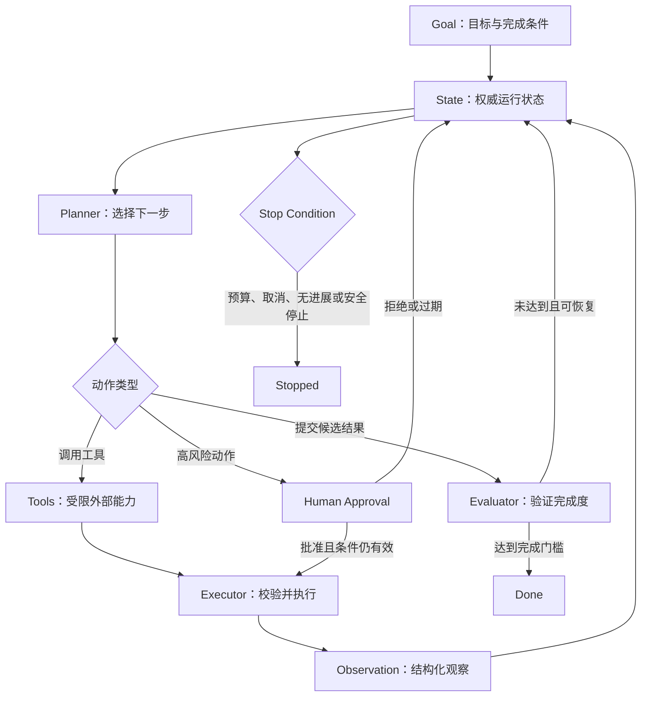

# Agent 的核心组件与运行闭环

AI Agent 是在约束范围内，根据当前状态选择下一步动作、调用工具观察结果，并持续推进目标的系统。模型只是决策组件；身份、权限、状态持久化、工具执行、停止控制和审计必须由确定性代码承担。

固定步骤已经足够时应使用 Workflow。只有任务无法在运行前枚举全部步骤，并且中间观察确实会改变后续行动时，才需要 Agent。

## Agent 与普通模型调用的区别

一次普通模型调用的控制流由应用预先确定：

```text
输入 → 模型 → 输出
```

Agent 在每一步根据状态选择动作：



循环不是“让模型一直思考”。每一步都必须产生可记录的动作、观察、状态变化或明确停止原因。

## 先定义任务边界

适合 Agent 的任务通常同时满足：

- 下一步依赖搜索、执行或环境返回的结果。
- 可用工具和数据范围能够明确限制。
- 成功可以通过测试、规则或人工检查判断。
- 错误动作可以被拦截、补偿或限制影响范围。
- 任务价值足以覆盖更高的延迟、费用和运维复杂度。

不适合直接使用自主 Agent 的任务包括：

- 固定字段抽取、格式转换和已知顺序审批。
- 没有完成标准的“尽量做好”。
- 无法撤销且缺少审批的资金、发布、删除或外部通信操作。
- 只能给出全局生产权限、不能限制资源范围的操作。
- 无法观测工具实际结果，只能相信模型自述的任务。

## Goal：可验证的目标

Goal 不是一段宽泛的自然语言愿望。它至少包含目标、完成条件、范围和禁止事项。

```json
{
  "taskId": "task_20260718_001",
  "objective": "定位 checkout-api 在 10:00 后错误率升高的原因并生成只读调查报告",
  "successCriteria": [
    "报告引用至少一条指标和一组相关日志",
    "区分已验证事实、推断与未知项",
    "给出可复现的查询条件"
  ],
  "scope": {
    "services": ["checkout-api"],
    "environment": "production",
    "timeRange": {
      "from": "2026-07-18T10:00:00+08:00",
      "to": "2026-07-18T11:00:00+08:00"
    }
  },
  "forbiddenActions": [
    "修改部署",
    "重启实例",
    "写入生产数据库",
    "向外部渠道发送消息"
  ]
}
```

### Goal 的四类约束

| 约束 | 作用 | 示例 |
| --- | --- | --- |
| 结果约束 | 定义必须交付什么 | 调查报告包含证据引用 |
| 资源约束 | 限制可读取或修改的对象 | 仅 `checkout-api` |
| 行为约束 | 禁止危险动作 | 不重启、不部署 |
| 质量约束 | 定义验收门槛 | 查询可复现、事实与推断分离 |

目标在执行期间发生变化时应创建新版本，并记录谁在何时改变了哪些条件。不能直接覆盖原始目标，否则后续无法解释某个动作当时为何被允许。

## State：权威运行状态

State 是整个 Agent 运行的事实来源。聊天消息可以是状态的一部分，但不能代替状态模型。

```ts
type TaskStatus =
  | "queued"
  | "running"
  | "waiting_for_approval"
  | "paused"
  | "completed"
  | "failed"
  | "cancelled";

type AgentState = {
  taskId: string;
  goalVersion: number;
  status: TaskStatus;
  step: number;
  facts: Array<{
    key: string;
    value: unknown;
    sourceObservationId: string;
  }>;
  openQuestions: string[];
  artifacts: Array<{
    artifactId: string;
    kind: "report" | "patch" | "query-result";
    version: number;
  }>;
  budgets: {
    maxSteps: number;
    remainingTokens: number;
    remainingCostMicros: number;
    deadline: string;
  };
  pendingApprovalId?: string;
  lastProgressFingerprint?: string;
};
```

### State 必须区分的内容

- Goal：用户授权的目标，不能由模型自行改写。
- Facts：有来源的已验证事实。
- Hypotheses：尚待验证的推断。
- Observations：工具调用返回的原始或规范化结果。
- Decisions：为何选择某个动作。
- Artifacts：报告、补丁、数据集等可版本化产物。
- Control state：步骤、预算、暂停、审批和停止原因。

工具返回的文本可能包含不可信指令。系统应把它保存为 Observation，而不是直接提升为 Goal 或系统指令。

### 状态更新的基本规则

每一步使用 compare-and-set 或等价版本检查：

```text
读取 state_version = 17
计算下一步
提交 action，要求 state_version 仍为 17
执行成功后写入 observation，state_version = 18
```

Worker 重试、重复消息或并发恢复都可能处理同一步。如果没有版本检查和幂等键，Agent 可能重复发送邮件、创建工单或覆盖新状态。

## Planner：只规划允许的下一步

Planner 根据 Goal、当前 State、工具目录和剩余预算，输出结构化候选动作。它不直接获得工具凭据，也不直接执行网络请求。

```json
{
  "action": "query_logs",
  "arguments": {
    "service": "checkout-api",
    "environment": "production",
    "from": "2026-07-18T10:00:00+08:00",
    "to": "2026-07-18T10:15:00+08:00",
    "filter": "level:error"
  },
  "reason": "先确认错误类型是否集中在单一依赖",
  "expectedObservation": "按错误码聚合的日志计数",
  "onFailure": "缩短时间窗口并重试一次"
}
```

Planner 输出必须通过 Schema 校验，再经过策略层检查：

- 工具名是否在本任务 allowlist。
- 参数是否在授权资源范围。
- 时间、数量和查询成本是否超过限制。
- 当前状态是否允许此动作。
- 动作是否要求审批。
- 同一意图是否已成功执行。

### 计划粒度

计划过粗会隐藏风险，例如“修复生产问题”可能包含读日志、改配置和重启。计划过细会产生大量无意义步骤和费用。一个可执行步骤应满足：

- 能由一个工具合同表达。
- 结果可独立观察。
- 权限和风险可以独立判断。
- 失败后能决定重试、替代或停止。

长任务可以保存高层计划，但下一步仍需根据最新状态重新验证。不能把初始计划当作绕过后续权限检查的长期通行证。

## Tools：能力合同

Tool 是受控能力，不是模型可随意拼接的代码片段。一个工具合同至少定义：

- 唯一且清晰的名称。
- 何时使用和何时不使用。
- 参数 Schema、枚举、长度和格式。
- 返回结果与错误分类。
- 权限范围和数据敏感级别。
- 是否只读、是否可撤销、是否要求审批。
- 超时、速率、幂等和审计规则。

```ts
type ToolDefinition = {
  name: "query_logs";
  risk: "read_only";
  input: {
    service: string;
    environment: "staging" | "production";
    from: string;
    to: string;
    filter: string;
  };
  limits: {
    maxRangeMinutes: 60;
    maxRows: 1000;
    timeoutMs: 10_000;
  };
};
```

工具描述是给模型的选择信息，真正的安全边界在执行层。即使 Prompt 写着“不得查询其他服务”，执行层仍必须拒绝越界参数。

### 工具返回值

工具不应只返回一段含糊文本：

```json
{
  "status": "ok",
  "observationId": "obs_44",
  "data": {
    "groups": [
      {"errorCode": "PAYMENT_TIMEOUT", "count": 482}
    ]
  },
  "source": {
    "system": "logs",
    "queryId": "log_query_928",
    "timeRange": ["2026-07-18T10:00:00+08:00", "2026-07-18T10:15:00+08:00"]
  },
  "truncated": false
}
```

结构化结果使 Planner 能区分空结果、截断、权限拒绝、暂时故障和业务失败。

## Executor：执行前后都要校验

Executor 是模型与真实环境之间的控制层。它负责：

1. 校验动作 Schema。
2. 读取最新任务、权限和预算。
3. 判断审批是否有效。
4. 生成或验证幂等键。
5. 使用最小权限凭据调用工具。
6. 限制超时、响应大小和网络目标。
7. 规范化结果并持久化审计记录。
8. 原子更新 State。

```ts
async function executeAction(
  state: AgentState,
  action: ProposedAction,
  policy: Policy
): Promise<Observation> {
  validateSchema(action);
  policy.assertToolAllowed(action.name);
  policy.assertArgumentsInScope(action.arguments);
  policy.assertBudgetAvailable(state.budgets);
  policy.assertApprovalIfRequired(action);

  const idempotencyKey = `${state.taskId}:${state.step}:${action.intentHash}`;
  return callToolWithLimits(action, { idempotencyKey, timeoutMs: 10_000 });
}
```

Executor 不接受模型提供的任意 URL、Shell 命令或文件路径，除非工具本身有明确的解析、规范化和 allowlist。文件范围需要在解析符号链接后的真实路径上检查；URL 需要在重定向后继续检查目标地址。

## Observation：记录环境实际发生了什么

模型说“已经完成”不是 Observation。Observation 来自工具、权威数据库、测试程序或审批系统。

有效 Observation 包含：

- 调用的工具和版本。
- 规范化参数或其安全摘要。
- 主体身份和权限范围。
- 开始、结束、超时和重试信息。
- 结果、错误类别、截断标记。
- 来源定位符和完整数据的受控引用。
- 对 State 产生的变化。

敏感响应不应完整复制到 Prompt、日志和追踪系统。可以保存访问受控的原始制品，并把最小必要摘要放进上下文。

## Evaluator：验证结果，不替代权限

Evaluator 判断候选结果是否满足 Goal 和成功条件。不同条件使用不同验证器：

| 条件 | 优先验证方式 |
| --- | --- |
| JSON、字段、格式 | Schema 或确定性代码 |
| 编译、测试、查询结果 | 实际工具执行 |
| 是否引用证据 | 引用存在性与来源映射检查 |
| 报告是否完整 | Rubric + 人工或 LLM Judge |
| 是否允许执行 | 授权服务与策略代码 |
| 是否产生业务结果 | 权威系统回读 |

Evaluator 的输出也要结构化：

```json
{
  "verdict": "needs_revision",
  "checks": [
    {"id": "has_metric_evidence", "passed": true},
    {"id": "has_log_evidence", "passed": true},
    {"id": "separates_hypotheses", "passed": false}
  ],
  "feedback": [
    "将“数据库连接池耗尽”从事实移到待验证推断，并附验证查询"
  ],
  "evaluatorVersion": "incident-report-rubric@3"
}
```

模型自评容易受到自身答案和措辞影响。高价值结果应组合规则、独立模型、实际执行和人工抽查，并用固定数据集校准 Judge。

## Memory：按用途和生命周期拆分

Memory 不应是“把所有历史都塞回上下文”。至少区分：

### 工作记忆

当前任务的短期状态、最近观察和下一步所需信息。任务结束后按保留策略归档或删除。

### 情节记忆

过去运行的动作轨迹、结果和失败。可用于回放和评估，不应未经筛选直接作为新任务指令。

### 语义记忆

经过来源验证的稳定事实、术语或组织知识。必须保存来源、版本、权限和过期策略。

### 程序记忆

工具说明、Workflow、策略和操作手册。它们属于版本化配置，不由单次 Agent 运行自行永久修改。

### 用户记忆

用户明确允许保存的偏好。用户应能查看、纠正和删除；敏感推断不能因为模型曾经生成过就成为永久事实。

Memory 写入需要独立策略：

- 谁可以写。
- 什么类型允许写。
- 来源和置信度要求。
- 何时过期。
- 读取时如何做权限过滤。
- 纠错和删除如何传播到派生索引。

## Stop Condition：结束是控制层决定

至少支持以下停止原因：

```ts
type StopReason =
  | "success"
  | "max_steps"
  | "token_budget_exhausted"
  | "cost_budget_exhausted"
  | "deadline_exceeded"
  | "cancelled_by_user"
  | "approval_rejected"
  | "no_progress"
  | "repeated_action"
  | "policy_violation"
  | "unrecoverable_error";
```

停止检查在每次模型调用前、工具调用前和状态写入后执行。只在 Prompt 中要求“不要超过十步”无法强制停止。

### 无进展检测

单纯比较文字是否相同不够。可以为每一步生成进展指纹：

```text
hash(
  已解决的成功条件 +
  新增权威事实 +
  新增或更新制品 +
  未解决问题集合 +
  最近动作意图
)
```

连续多个步骤指纹不变，或相同动作和参数反复失败，应停止并返回阻塞信息，而不是继续消耗预算。

### 成功停止

成功必须同时满足：

- Evaluator 的必需检查通过。
- 最终制品已持久化。
- 写操作已经从权威系统回读确认。
- 没有未完成的高风险动作。
- 任务状态以版本检查原子更新为 `completed`。

## Human Approval：批准具体动作

人工审批不是“这个 Agent 以后都可信”。审批对象应是带版本的具体意图：

```json
{
  "approvalId": "approval_701",
  "taskId": "task_20260718_001",
  "action": "deploy_release",
  "resource": "checkout-api@sha256:abc...",
  "environment": "production",
  "argumentsDigest": "sha256:91f...",
  "expectedEffect": "将 10% 流量切换到新版本",
  "rollbackPlan": "恢复 stable deployment revision 118",
  "expiresAt": "2026-07-18T12:30:00+08:00"
}
```

参数、目标制品、权限或环境改变后，旧批准失效。Executor 在执行瞬间重新检查：

- 审批人是否有权批准该动作。
- 审批是否过期、撤销或已使用。
- 动作摘要是否与批准内容完全一致。
- 当前状态是否仍满足执行前置条件。
- 资源版本是否发生变化。

### 审批界面需要展示

- Agent 准备做什么。
- 操作对象和环境。
- 关键参数的真实值。
- 预期影响和最坏影响范围。
- 证据、差异或预览。
- 是否可撤销以及回滚方式。
- “拒绝”“修改范围”“批准”三个清晰结果。

只显示模型的自然语言摘要可能隐藏真实参数。审批界面应从结构化动作生成，并允许展开原始差异。

## 组件之间的信任边界

| 组件 | 可以决定 | 不能单独决定 |
| --- | --- | --- |
| Goal | 授权目标与完成条件 | 具体执行结果 |
| Planner | 提议下一步 | 获得权限、真实执行 |
| Tool 描述 | 帮助模型选择能力 | 强制安全边界 |
| Executor | 校验并执行已授权动作 | 改写用户 Goal |
| Evaluator | 判断候选质量 | 授予权限 |
| Memory | 提供有来源的历史信息 | 覆盖最新权威数据 |
| Human Approval | 批准具体高风险动作 | 自动批准后续不同动作 |
| Stop Controller | 强制预算与终止 | 宣称业务结果已发生 |

## 实例：只读生产故障调查 Agent

### 工具集合

- `get_metric_series`：只读指定服务的指标。
- `query_logs`：只读、限定时间范围和最大行数。
- `get_deployment_history`：读取部署版本与时间。
- `save_report_draft`：写入隔离的报告空间。

不提供 `restart_service`、`deploy`、数据库写入或外部消息工具。无法调用的能力不要仅靠提示词隐藏，应从工具目录和凭据中移除。

### 执行轨迹

1. Goal 要求定位错误率上升原因并提供证据。
2. Planner 查询错误率、延迟和流量。
3. Observation 显示错误集中于 `PAYMENT_TIMEOUT`。
4. Planner 查询相同时间段的错误日志。
5. 日志显示下游调用超时，但未证明数据库连接池耗尽。
6. Planner 查询部署历史，确认时间窗口内无新部署。
7. Evaluator 发现报告把一个假设写成事实。
8. Planner 修改报告，把该项放入“待验证”并附下一条查询。
9. 规则检查引用定位符和时间范围。
10. 任务以 `completed` 停止，报告保留已知、推断和未知。

这个 Agent 可以生成调查结果，但不能自行修复生产环境。若后续要部署修复，应创建权限、审批和回滚完全不同的新任务。

## 实例：代码修改 Agent

代码 Agent 的 Goal 为“修复解析器在空输入上的崩溃，并保持公共 API 不变”。完成条件包括：

- 新增能够复现 Bug 的测试。
- 相关测试和静态检查通过。
- 变更仅在允许目录。
- 差异不包含生成文件、密钥或无关格式化。

推荐控制：

- Planner 只能提议读取、编辑隔离工作树和运行允许命令。
- Executor 将路径规范化并拒绝工作树外写入。
- Shell 工具使用命令 allowlist、超时和输出限制。
- Evaluator 运行真实测试，不接受“测试应该通过”。
- 发布、合并和远端推送需要单独授权。
- 连续两次相同测试错误且无代码或事实变化时触发 `no_progress`。

## 常见错误

### 把聊天记录当作状态

长对话会被截断、摘要或注入不可信内容。权威字段、版本、预算和审批必须存在数据库状态中。

### 让 Planner 直接执行工具

这会把模型选择和权限控制合并。任何参数幻觉都直接变成真实动作。

### 给 Agent 一个万能工具

`run_shell(command)`、`http_request(url, body)` 和全盘文件访问难以限制影响范围。优先提供面向领域、参数受限的工具。

### 用模型判断权限

模型可以解释策略，但授权结果必须由身份、资源和策略服务计算。

### 把工具返回文本当作指令

网页、Issue、文档和邮件都可能包含恶意指令。它们是数据，不得覆盖 Goal、系统策略或工具限制。

### 每一步都写长期 Memory

错误推断会被永久放大。长期写入要有来源、权限、过期和纠错流程。

### 审批后允许修改参数

用户批准的是 A，执行的却是 A'。审批必须绑定动作摘要、资源版本和有效期。

### 只看最终答案

Agent 可能得到看似正确的答案，却执行了越权查询、重复写入或高成本循环。评估必须覆盖轨迹和最终结果。

## 测试与评估

### 单组件测试

- Goal Parser：缺失范围、冲突约束和不可验证目标。
- Planner：工具缺失、参数越界、错误路由。
- Executor：Schema 错误、权限撤销、超时、重复消息。
- Memory：权限过滤、过期、删除传播和来源丢失。
- Stop Controller：步骤、Token、费用、总超时和无进展。
- Approval：过期、参数改变、重复使用和审批人越权。

### 端到端场景

- 正常完成。
- 工具返回空结果。
- 工具返回截断结果。
- 中途权限被撤销。
- Worker 在写入后、记录 Observation 前崩溃。
- 用户暂停、恢复和取消。
- 高风险动作被拒绝。
- 不可信工具结果试图改变任务。
- 相同动作进入重复循环。
- 任务部分完成但无法满足最后一项成功条件。

### 指标

| 指标 | 说明 |
| --- | --- |
| Task completion rate | 满足全部成功条件的任务占比 |
| Verified action rate | 有权威 Observation 的动作占比 |
| Tool selection accuracy | 工具与参数选择正确率 |
| Policy violation blocked | 被执行层成功阻止的越界动作 |
| Duplicate side-effect rate | 重复副作用比例，应接近零 |
| Human override rate | 人工拒绝或修改动作的比例 |
| Steps to completion | 完成任务的有效步骤数 |
| No-progress stop precision | 无进展停止是否确实阻止循环 |
| Recovery success rate | 暂停、崩溃或暂时失败后的恢复成功率 |

质量、延迟、Token、费用和风险指标需要同时观察。减少步骤如果提高了越权或错误完成率，不是有效优化。

## 实现检查清单

- [ ] Goal 有版本化目标、范围、完成条件和禁止事项。
- [ ] State 存在数据库或等价持久层，不只存在消息列表。
- [ ] Planner 只输出结构化候选动作。
- [ ] 每个 Tool 有 Schema、权限、风险、超时和错误合同。
- [ ] Executor 在执行时重新检查最新权限和状态。
- [ ] 写操作具备幂等键和权威回读。
- [ ] Observation 保存来源、版本和截断信息。
- [ ] Evaluator 使用与条件匹配的确定性、模型或人工方法。
- [ ] Memory 按用途、权限和生命周期拆分。
- [ ] Stop Condition 由代码强制。
- [ ] Approval 绑定具体参数、资源版本和有效期。
- [ ] 每一步可追踪，敏感数据经过最小化和脱敏。
- [ ] 测试覆盖重复投递、并发、崩溃恢复和权限撤销。
- [ ] Agent 能明确返回完成、失败、取消或阻塞，不伪装成功。

## 来源

- [Anthropic — Building Effective AI Agents](https://www.anthropic.com/engineering/building-effective-agents)（访问日期：2026-07-18）
- [Anthropic — Writing Effective Tools for AI Agents](https://www.anthropic.com/engineering/writing-tools-for-agents)（访问日期：2026-07-18）
- [Anthropic — Demystifying Evals for AI Agents](https://www.anthropic.com/engineering/demystifying-evals-for-ai-agents)（访问日期：2026-07-18）
- [NIST — Lessons Learned from the Consortium: Tool Use in Agent Systems](https://www.nist.gov/news-events/news/2025/08/lessons-learned-consortium-tool-use-agent-systems)（访问日期：2026-07-18）
